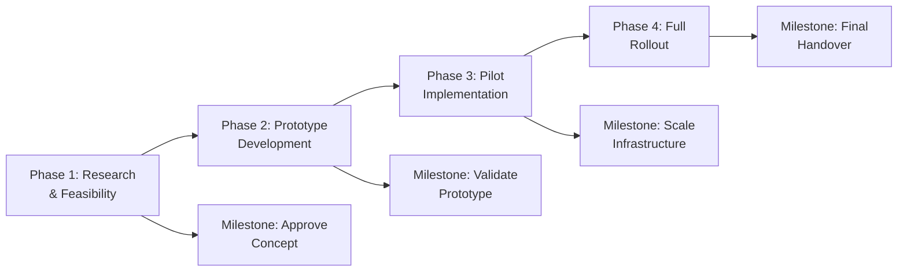

## 28.3 Strategic Alignment and Roadmapping

Aligning a project with an organization's overarching strategy is critical for ensuring that resources, scope, and outcomes all contribute to valuable business objectives. Roadmapping, meanwhile, serves as a powerful tool to visualize how various initiatives, milestones, and deliverables interconnect over time to realize strategic goals. This section explains how to create and maintain a project roadmap that stays current with constantly evolving enterprise priorities. From defining a vision to specifying dependencies, this guide helps Project Managers and organizational leaders systematically chart their course, navigate uncertainties, and deliver sustained strategic value.

  
### What Is Strategic Alignment?

Strategic alignment is the practice of ensuring that a project’s goals, deliverables, and activities consistently support the broader organizational mission, vision, and long-term strategy. This concept ties directly into the Business Environment Domain described in the PMP® Exam Content Outline, where Project Managers are expected to understand and influence projects so they remain relevant to the enterprise’s strategic imperatives. By systematically embedding strategy in project decisions, teams can ensure that their outputs have a measurable impact on the company’s bottom line, brand reputation, and competitive agility.

  
#### Key Benefits of Strategic Alignment

• Ensures that time, budget, and resources are invested where they create the highest value.  
• Reduces redundancies and overlaps across multiple projects or programs.  
• Improves stakeholder satisfaction by delivering outcomes that support strategic objectives.  
• Helps prioritize tasks and manage scope changes more effectively.  
• Enhances project success rates by focusing on meaningful, impactful goals.

  
### The Importance of a Roadmap

A project roadmap is a high-level, often visual plan that shows the timeline, key deliverables, and trajectory from the project’s inception to completion (and sometimes beyond). Unlike a detailed project schedule, which specifies day-to-day tasks, a roadmap focuses on major milestones, critical dependencies, and alignment to strategic priorities.

  
#### Differences Between a Roadmap and a Schedule

• Focus:  
  – Roadmap: Emphasizes high-level goals and milestones tied to strategic objectives.  
  – Schedule: Details specific tasks, timelines, dependencies, and resources.  

• Audience:  
  – Roadmap: Often used by executives, sponsors, and key decision-makers.  
  – Schedule: Primarily for the project team and close stakeholders.  

• Level of Detail:  
  – Roadmap: Minimal details regarding task-level durations or granular responsibilities.  
  – Schedule: Very detailed, including task owners, durations, dependencies, and resource allocations.  

• Adaptability:  
  – Roadmap: Updated periodically to reflect strategic shifts or major changes in direction.  
  – Schedule: Typically revised more frequently to manage day-to-day project control.

  
### Components of a Strategic Project Roadmap

A well-defined roadmap contains vital components that link the project’s purpose to the organization’s strategy:

• Strategic Objectives or Themes: High-level goals that the project is intended to achieve or support. For instance, a digital transformation theme could drive multiple projects to modernize technology platforms.  
• Major Deliverables: Tangible outcomes or artifacts that the project will produce, such as a prototype, product increment, or final solution.  
• Key Milestones: Decision points or checkpoints (e.g., project phase gates, major releases) to gauge progress and enable course correction.  
• Timeline: A broad timescale showing the progression of deliverables and milestones. This often aligns with fiscal quarters, sprints (in agile contexts), or designated project phases.  
• Dependencies: Highlights of critical linkages or constraints, such as regulatory approvals or dependencies on other internal initiatives.  
• Resource or Budget Indicators: High-level overview of resource allocation, particularly if the organization is managing multiple high-priority projects with limited resources.  
• Risk and Uncertainty Flags: Particularly where strategic goals are fluid, noting risk areas or uncertain assumptions can help leadership understand where flexibility is needed.  

  
### Steps to Create a Roadmap Aligned with Evolving Enterprise Goals

Below is a step-by-step approach to creating a strategic roadmap, adapting as organizational goals shift or expand:

#### Identify and Validate Strategic Priorities
1. Engage with executives and the PMO (Project Management Office) to confirm the latest strategic direction.  
2. Validate priorities by assessing market trends, competitive factors, and organizational capacity (see Section 28.1 for Enterprise Environmental Factors and Organizational Process Assets).  

#### Define the Project’s Strategic Value Proposition
1. Translate overarching strategic themes into definitive project-level value propositions (e.g., cost reduction, brand enhancement, new product lines).  
2. Leverage project selection methods (ROI, NPV, Payback Period) discussed in Section 28.2 to justify resource investments.

#### Outline Key Milestones and Deliverables
1. Identify significant markers for progress: major releases, final deliverables, cross-functional integration points.  
2. Align these milestones with broader enterprise timelines (e.g., fiscal quarters, strategic program timelines).

#### Explore Development Approaches 
1. Decide if the project is best served by predictive, agile, or hybrid methodologies (see Chapters 9 and 27).  
2. Incorporate relevant sprints, phases, or stage gates into the roadmap, noting iterative feedback loops if applying agile or hybrid.

#### Map Dependencies and Constraints
1. Identify inter-project or departmental dependencies, cross-functional resources, or approvals required.  
2. Work with relevant departments to confirm timelines and resource availability.  
3. Document these interdependencies in the roadmap, highlighting potential bottlenecks that could affect scheduling.

#### Incorporate Risk and Uncertainty
1. Use techniques from Chapter 14 (Uncertainty Performance Domain) to identify strategic risks.  
2. Engage leadership to clarify contingency or fallback options if strategic shifts drive changes to scope or objectives.

#### Review, Validate, and Communicate
1. Present the draft roadmap to key stakeholders and sponsors for feedback and alignment.  
2. Obtain formal approval or sign-off if required by the governance framework.  
3. Communicate the roadmap across teams, making sure each team understands how their work supports the organization’s strategic objectives.

#### Monitor and Adapt
1. Schedule periodic reviews—monthly, quarterly, or aligned with project phase gates—to assess whether the roadmap needs updating.  
2. Respond to changes in the market, technology, or internal strategy by adjusting scope, milestones, or deliverables as needed (see Chapter 15 for integration management best practices).

  
### Example of a Roadmap Visualization

Below is a simplified Mermaid diagram illustrating a strategic roadmap that highlights sequential phases, key milestones, and strategic objectives. Note how each milestone aligns to an overarching theme, ensuring the project supports enterprise-level goals:

In this example, each phase has a major milestone, often tied to a strategic review point or organizational objective. Stakeholders can quickly see where budget approvals, resource shifts, or pivot decisions are required.

  
### Real-World Case Study: Global Retailer Transition

Imagine a multinational retailer aiming to increase market share by adopting new digital channels. To align with the corporate strategy of “seamless omni-channel customer experience,” a digital transformation project is initiated. The roadmap might include:

• Phase 1: Customer Insight Research  
• Phase 2: Pilot Mobile App Launch in Key Markets  
• Phase 3: Integrate Store and Online Inventory Systems  
• Phase 4: Full Automation of Order Fulfillment  

At each stage, the retailer monitors updates in consumer behavior, new competitor apps, and supply chain disruptions. The roadmap is adapted quarterly, ensuring that newly acquired supply chain partners or emerging customer feedback can be integrated without jeopardizing overall strategic direction.

  
### Roadmapping Techniques and Tools

Various techniques can help construct and maintain a roadmap:

• **Product Roadmaps**: Common in software development, these focus on functionality and user-centric features.  
• **Vision Roadmaps**: Centers on big-picture strategy, showing how the project contributes to the enterprise vision over an extended timeline (one to three years).  
• **Rolling-Wave Roadmaps**: Allocates high-level detail to later phases and more granular detail to upcoming milestones, allowing for iterative planning.  
• **Kanban Boards**: Agile teams sometimes prefer visual boards that track features and releases over time, linking them to strategic objectives.

  
### Pitfalls and Challenges in Strategic Roadmapping

• **Overlooking External Factors**: Rapidly changing market or regulatory conditions can render a roadmap obsolete if not continually updated.  
• **Excessive Detail**: Overloading stakeholders with feature-level specifics can prevent them from seeing the big strategic picture.  
• **Resource Conflicts**: In multi-project environments, limited staff or budget could derail the roadmap if teams are not aligned.  
• **Lack of Executive Sponsorship**: Without buy-in from senior leadership, a roadmap may fail to reflect real strategic priorities and become idle documentation.  
• **Rigid Adherence**: Treating a roadmap as unchangeable can hinder adaptation to unexpected changes in strategy or market conditions.

  
### Best Practices for Maintaining Alignment through Roadmapping

• **Frequent Stakeholder Engagement**: Ensure that executives, sponsors, and subject matter experts revisit and refine the roadmap collaboratively.  
• **Integrate Lessons Learned**: Apply knowledge from previous projects or concurrent streams (see Chapter 11.3 on managing knowledge transfer) to refine timelines and objectives.  
• **Use Metrics to Validate Alignment**: Track strategic Key Performance Indicators (KPIs) such as revenue, market share, or customer satisfaction. Determine if the roadmap is contributing to these KPIs meaningfully.  
• **Align Roadmaps with Portfolio Management**: Cross-reference the roadmap with the organization’s broader portfolio (see Chapter 35 for Portfolio and Program Management Intersections).  
• **Communicate the Rationale**: Keeping teams informed about *why* certain milestones exist or must shift fosters transparency and encourages adaptability.

  
### Additional References

• Project Management Institute, “PMBOK® Guide – Seventh Edition” (particularly the Business Environment Domain).  
• Project Management Institute, “Pulse of the Profession®” reports for insights about strategic alignment.  
• “Strategic Project Management Made Simple” by Terry Schmidt.  
• “Roadmaps and Strategy: The Aligned Way to Business Success” (Article, Harvard Business Review).  
• “Strategy Maps: Converting Intangible Assets into Tangible Outcomes” by Robert S. Kaplan and David P. Norton.

  
## Test Your Knowledge: Strategic Roadmapping & Alignment



### Which best describes the difference between a project roadmap and a project schedule?

- [x] A roadmap provides a high-level strategic overview and major milestones, while a schedule details specific tasks and dependencies.
- [ ] A roadmap focuses primarily on short-term activities, whereas a schedule handles long-term planning.
- [ ] A roadmap is strictly for internal teams, while a schedule is for external stakeholders.
- [ ] A roadmap is updated daily, while a schedule is updated quarterly.

> **Explanation:** A project roadmap is a strategic, high-level document illustrating milestones, goals, and alignment with organizational strategy. A schedule is more granular, detailing specific tasks, timelines, resources, and dependencies.

### What is the primary purpose of ensuring strategic alignment in projects?

- [ ] To shorten the project timeline.
- [x] To ensure the project’s outcomes support the organization’s broader strategy and deliver meaningful business value.
- [ ] To reduce the number of stakeholders involved.
- [ ] To make risk management unnecessary.

> **Explanation:** Strategic alignment guarantees that project resources, deliverables, and objectives contribute to the organization’s overarching goals, resulting in meaningful value.

### Which of the following is a key component of a project roadmap?

- [x] Major milestones and deliverables.
- [ ] Detailed resource allocation by individual employee.
- [ ] Daily tasks and timesheets.
- [ ] Demographic data of the project team.

> **Explanation:** A roadmap typically highlights major milestones, deliverables, and tasks at a high level. Detailed daily tasks or timesheets belong in a project schedule rather than the roadmap.

### How should major strategic shifts in the company’s vision influence a project roadmap?

- [ ] They should not affect the project roadmap once it has been approved.
- [ ] They should prompt immediate cancellation of the current project.
- [x] They should lead to revisions of the roadmap’s scope, milestones, or timelines.
- [ ] They should only be considered at project completion.

> **Explanation:** Roadmaps are living documents. When the organization undergoes significant strategic changes, the roadmap must be updated to maintain alignment and relevance.

### What is the best way to incorporate risk considerations into the roadmap?

- [ ] Do not include them in the roadmap to avoid confusion for stakeholders.
- [ ] Include only the top five critical risks, ignoring others.
- [x] Highlight areas of high uncertainty or dependencies and include contingency actions.
- [ ] Delegate risk reporting to a separate department.

> **Explanation:** Including areas of high uncertainty and potential constraints in the roadmap ensures stakeholders are aware of possible challenges and can plan contingencies.

### Why is executive sponsorship important when creating a strategic roadmap?

- [ ] Executives prefer to dictate every task to the project team.
- [ ] Roadmaps are only used by top management.
- [ ] It is the only way to obtain budget approvals.
- [x] It ensures the roadmap reflects true strategic priorities and secures organizational support.

> **Explanation:** Without executive involvement, the roadmap may not accurately represent the organization’s strategic focus and may lack the support needed to implement changes.

### Which approach helps maintain a roadmap’s flexibility over time?

- [ ] Lock in final milestones and never change them.
- [x] Use rolling-wave planning to detail near-term milestones, leaving flexibility for longer-term ones.
- [ ] Remove milestones altogether.
- [ ] Update the roadmap only once at the beginning of the project.

> **Explanation:** Rolling-wave planning allows a project manager to plan the near term in detail while adapting future phases as more information becomes available or strategic priorities shift.

### What element is essential for keeping the roadmap a “living document”?

- [x] Regularly scheduled reviews and updates.
- [ ] A single presentation shared once with the C-suite.
- [ ] Limiting availability to a small circle of leaders.
- [ ] Excluding interdepartmental collaborations.

> **Explanation:** Periodic review sessions help validate whether the roadmap still aligns with organizational strategy, making it a dynamic and responsive tool.

### In a multi-project environment, how do you ensure resources are effectively allocated according to strategic priorities?

- [x] Align each project’s roadmap with overall portfolio management, prioritizing based on enterprise goals.
- [ ] Wait until one project finishes before starting another.
- [ ] Allocate resources randomly to different projects.
- [ ] Have each project compete independently for available staff.

> **Explanation:** Effective resource allocation in a multi-project setting requires mapping each project’s roadmap to the broader portfolio and aligning allocation decisions with the organization’s strategic directions.

### True or False: A project’s strategic alignment might evolve throughout its life cycle, requiring adjustments to the roadmap.

- [x] True
- [ ] False

> **Explanation:** Organizational strategies, market conditions, or stakeholder expectations can shift over time. A roadmap should be updated to reflect these changes, ensuring continuous strategic alignment.



---

## PMP Mastery: 1500+ Hard Mock Exams with Full Explanations 

Looking to crush the PMP exam with confidence? Dive deep into 6 rigorous mock exams totaling 1500+ advanced-level questions, each accompanied by clear, step-by-step explanations. Hone your test-taking strategies, master complex topics, and build the resilience you need on exam day. Perfect for serious PMs aiming beyond fundamentals.  

Enroll now:  
[PMP Mastery: 1500+ Hard Mock Exams with Exceptional Clarity & Full Explanations](https://www.udemy.com/course/pmp-2025/?referralCode=CF83A54BC86BE27F9AFE)

_Disclaimer: This course is not endorsed by or affiliated with the PMI examination authority. All content is provided purely for educational and preparatory purposes._
