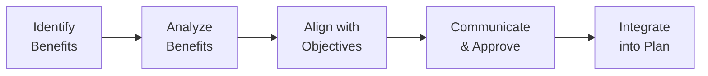

## 29.1 Identifying and Defining Benefits

Projects exist to deliver value—a simple statement, yet one that carries profound implications for project managers, stakeholders, and organizations. The heart of value realization lies in being able to pinpoint, articulate, plan for, and measure the benefits that a project creates. This section covers the foundational practices for identifying and defining both tangible and intangible benefits. By the end of this chapter, you will be equipped with strategies and frameworks to ensure that your projects not only deliver outputs but also realize—often in measurable ways—the business benefits that your organization expects.

### The Importance of Early Benefits Identification

Recognizing and clarifying benefits from the outset sets the stage for project success. When properly defined, benefits guide strategic decision-making, prioritize funding, and establish a benchmark for success. Early benefits identification also ensures alignment with organizational objectives and fosters stakeholder buy-in. This proactive approach prevents the project from veering off course or becoming too narrowly focused on deliverables without capturing the value that these deliverables bring.

### Linking Benefits to Strategic Objectives

A fundamental practice in project management is ensuring that each project outcome ties back to the broader strategy of the organization. This linkage offers numerous advantages:

- Confirms that project resources are invested in valuable initiatives.  
- Enhances project visibility and sponsorship.  
- Encourages collaboration across departments, leading to smoother change management.  

When benefits connect directly to an organization’s vision or strategic plan, they provide the rationale for the project’s existence. All subsequent decisions, from scope definition to risk management, become guided by how well they preserve or amplify these benefits.

### Understanding Tangible vs. Intangible Benefits

Benefits can be placed into two main categories: tangible and intangible. Traditional definitions classify tangible benefits as those that can be directly measured in financial or quantitative terms. Intangible benefits, on the other hand, are real but more challenging to quantify. Both types are essential for a holistic view of project value.

#### Tangible Benefits

Tangible benefits are easier to measure and generally appear in project planning documents such as cost-benefit analyses. Common examples include:

- Increased revenue generated from a new product or service.  
- Decreased operational costs attributable to process improvements.  
- Efficiency gains measured by reduced cycle times or improved throughput.  
- Reduction in error rates or defects.  

Because tangible benefits are grounded in measurable metrics, they are often expressed in monetary terms (e.g., cost savings of $1 Million per year).

#### Intangible Benefits

Intangible benefits, though not directly quantifiable as revenue or cost savings, can significantly influence an organization’s performance. These include:

- Enhanced customer satisfaction and brand reputation.  
- Improved employee morale and team cohesion.  
- Strengthened relationships with strategic partners.  
- Fostering an innovative culture or promoting knowledge sharing.  

Though intangible, these benefits can be decisive in a project’s success. For example, an innovative software platform that significantly enhances user satisfaction might increase revenue indirectly through repeat customers or positive word-of-mouth—impacts that are vital but trickier to measure at the outset.

### The Benefits Identification Process

Benefits identification generally follows a structured approach, blending stakeholder insights, strategic alignment, and feasibility considerations. The following Mermaid diagram depicts a simplified process overview:

- A["Identify  Benefits"]: Brainstorm potential benefits with the project team and key stakeholders, referencing organizational goals.  
- B["Analyze  Benefits"]: Classify each benefit (tangible or intangible). Assess feasibility, potential value, and possible trade-offs.  
- C["Align with  Objectives"]: Validate that each benefit supports key business or strategic objectives. Align them with measurable success factors.  
- D["Communicate  & Approve"]: Present the benefits analysis to decision-makers for endorsement. Collect feedback and refine.  
- E["Integrate  into Plan"]: Incorporate approved benefits into the project charter, benefits management plan, or other foundational documents.

### Stakeholder Involvement: The Key to Accurate Benefits Identification

Stakeholders are a project manager’s most valuable resource when defining benefits. Their perspectives add critical context to how project outcomes might create or influence specific organizational gains. Typical stakeholders in benefits identification include:

- End users: They can highlight user-level maxima or improvement opportunities.  
- Sponsors and executives: They articulate broader strategic objectives and success criteria at the organizational level.  
- Functional managers: They pinpoint operational efficiency gains or departmental priorities.  
- Regulatory bodies: They clarify compliance-related values or risk mitigation benefits.  

Engaging stakeholders early ensures a more comprehensive understanding of the project’s benefit landscape and reduces the risk of missing unarticulated or hidden benefits.

### Techniques for Identifying Benefits

Various project management frameworks and methodologies provide methods to help you uncover benefits, both tangible and intangible. Prominent techniques include:

• Brainstorming Workshops  
These sessions bring together cross-functional teams to generate a list of potential benefits. Structured brainstorming ensures that all ideas are documented, then filtered for relevance and feasibility.

• Benefit Dependency Mapping  
This involves creating a detailed map linking project objectives to the outcomes and enablers required to achieve those outcomes. Each outcome on the map highlights a potential benefit.

• Cost-Benefit Analysis (CBA)  
Although typically used to measure financial viability, CBA discussions often bring intangible benefits to the surface. While intangible benefits may not be easily monetized, the process of contrasting them to tangible ones can reveal critical value drivers.

• SWOT Analysis  
By examining Strengths, Weaknesses, Opportunities, and Threats in the organizational context, stakeholders can unearth potential improvements (benefits) or areas where intangible gains—like better knowledge management—offer competitive advantages.

### Defining Tangible Benefits

Once tangible benefits are identified, the next step is to translate them into measurable terms so that progress can be tracked. Consider the following aspects when defining tangible benefits:

• Measurement Matrix  
Define clear metric(s) for each tangible benefit. For instance, “reduction in processing errors by 20%,” or “a 10% increase in sales for the new product line within six months of launch.” Such specificity aids in monitoring and helps ensure accountability.

• Baseline Data  
Identify a credible reference point against which you measure progress. This baseline could be the current sales volume, defect rates, or process times. Accurately tracking benefits depends on consistent measurement before, during, and after the project.

• Timeline for Realization  
Not all benefits are realized immediately upon project completion. Some become evident only months or years after new processes are implemented. Estimate (and periodically validate) when stakeholders can expect to fully experience data-driven savings or revenue lifts.

• Allocating Responsibility  
Assign ownership to individuals or teams responsible for measuring benefits. Doing so makes sure that data collection, analysis, and reporting continue even after the project ends.

### Defining Intangible Benefits

Intangible benefits require a more nuanced approach, as they cannot be measured as straightforwardly as financial gains. Still, you can adopt multiple strategies to make these benefits more concrete:

• Proxies and Indicators  
Use indirect metrics to evaluate improvements in areas like customer satisfaction or brand perception. Surveys, feedback forms, Net Promoter Scores (NPS), or employee engagement metrics can act as proxies.  

• Qualitative Assessment  
Conduct interviews, focus groups, or observational research to gauge intangible benefits such as employee morale. While these techniques may not yield purely quantitative data, they provide qualitative richness that can guide strategic planning.

• Balanced Scorecards  
Integrate intangible benefits into a broader organizational scorecard that includes perspectives on finance, customers, internal processes, and growth/learning. By placing intangible benefits side by side with financial measures, you can track progress more holistically.

• Periodic Reevaluation  
Since intangible benefits can evolve over time—especially in areas like reputation or innovation capacity—adopt a cyclical process of review. Incorporate intangible benefits into iteration reviews and major project checkpoints for agile or hybrid methods.

### Aligning Benefits with Project Scope

Benefits realization management is closely tied to scope. When the scope is well-defined around delivering specific benefits, it prevents scope creep that does not contribute to tangible or intangible objectives. On the other hand, if potential benefits are identified but not integrated into the scope, the project may fail to deliver them. Frequent cross-checking between your scope baseline and the benefit register (or benefits management plan) adds rigor, ensuring that the link between deliverables and benefits remains intact.

### Case Study: Software Modernization Project

A mid-sized technology firm decided to modernize its core software platform to improve overall product stability and user features. Initially, the sponsor focused solely on cost-saving benefits from enhanced automation. However, stakeholder analysis revealed additional intangible benefits:

• Enhanced brand image due to modern, sleek user interfaces  
• Higher team morale through the adoption of latest technologies, driving employee skill development  
• Stronger partnership with beta testers who valued being involved in product innovation  

By identifying these benefits early, the project was able to expand its scope to cater to intangible needs like user interface improvements and structured training sessions for developers. This led to a more motivated workforce and a stronger market perception—both of which positively influenced the company’s bottom line.

### Managing Risks Associated with Benefits

Benefits introduce their own set of risks, especially when intangible benefits are in play. For instance, an organization might overestimate user satisfaction gains or fail to measure intangible benefits such as brand enhancement. Consider the following strategies:

• Validation Checks  
At key milestones, re-verify assumptions about projected benefits. If stakeholder feedback suggests mismatches, adjust either the scope or the benefit targets.

• Sensitivity Analysis  
For tangible benefits, adopt sensitivity or scenario analyses. Explore best-case, worst-case, and most likely scenarios to ensure the organization can handle variability in realized benefits.

• Contingency Plans  
If certain intangible benefits (like improved user satisfaction) do not materialize, have fallback strategies—perhaps improved technical support or additional training.

### Best Practices

• Engage Stakeholders from Diverse Functional Areas  
Different departments and teams see potential benefits from unique angles. Their input often reveals intangible benefits or less obvious financial advantages.

• Use a Benefits Register or Management Plan  
Document all benefits—tangible and intangible—in a formal plan. Include ownership details, measurement criteria, timelines, and reporting structures.

• Communicate Continually  
Keep all stakeholders informed about benefit realization progress. Regular updates build credibility and provide opportunities to refine or even pivot if the environment changes.

• Integrate with Organizational Systems  
Wherever possible, connect benefit measurement to existing organizational systems such as Balanced Scorecards, HR feedback mechanisms, or online data dashboards.

• Foster Transparency and Accountability  
Make details about benefit measurement visible to an extended set of stakeholders. Transparency fosters trust and mitigates potential disputes.  

### Common Pitfalls

• Overlooking Intangibles  
Discounting intangible benefits can lead to undervalued project outcomes that otherwise would solidify stakeholder support or contribute to long-term growth.

• Vague Measurements  
Failing to define clear performance indicators can render benefits meaningless. Even intangible benefits can be tracked through carefully selected proxies.

• Delayed Planning  
Waiting until the execution phase to define benefits can result in missed opportunities, resource allocation issues, and stakeholder disillusionment.

• Overpromising  
Setting unrealistic benefit expectations can erode trust with sponsors and undermine a project’s credibility. Strive for conservative, evidence-backed projections, with transparent discussions about assumptions.

### Conclusion

Identifying and defining benefits is integral to enduring project success. By clarifying tangible and intangible benefits early and tying them to strategic goals, projects become pivotal vehicles for organizational growth rather than isolated events. Incorporating stakeholder insights, aligning benefits with project scope, and applying systematic processes ensure that the value promised at the project’s outset is diligently measured and delivered. Ultimately, effective benefits realization fosters confidence in project outcomes and paves the way for long-term competitive advantage.

---

## Quiz on Identifying and Defining Benefits



### Which benefit type is easiest to measure in purely monetary terms?
- [x] Tangible benefits
- [ ] Intangible benefits
- [ ] Reputational benefits
- [ ] None of the above

> **Explanation:** Tangible benefits are typically quantifiable financially, such as cost reductions or revenue increases.

### Which stakeholder group best helps identify employee morale-related benefits?
- [ ] Executive sponsors
- [x] Human Resources and team members
- [ ] Customers
- [ ] Regulatory bodies

> **Explanation:** Human Resources and team members have the context needed to assess morale and internal organizational culture, making them ideal contributors to intangible benefits identification.

### What is a suitable proxy metric for measuring increased user satisfaction (an intangible benefit)?
- [ ] Gross revenue margins
- [ ] Cost savings from process automation
- [x] Customer Net Promoter Score (NPS)
- [ ] Earnings per share (EPS)

> **Explanation:** A Net Promoter Score gauges customer loyalty and satisfaction, often correlating strongly with intangible improvements in user experience.

### Why is it essential to align benefits with an organization’s strategic objectives?
- [ ] To simplify project documentation
- [ ] To justify project overrun costs
- [x] To ensure the project delivers the right value for the business
- [ ] To replace traditional project management methods

> **Explanation:** Strategic alignment ensures the project directly supports the broader business goals, delivering relevant and meaningful value.

### Which of the following best characterizes intangible benefits?
- [x] They are value-adding but not directly quantifiable in monetary terms.
- [ ] They always yield a measurable dollar figure.
- [x] They may influence morale, reputation, or strategic positioning.
- [ ] They are primarily cost-saving initiatives.

> **Explanation:** Intangible benefits affect areas like brand reputation, employee satisfaction, and customer perception. Their monetary value is often indirect, making them harder to quantify.

### What is one major risk in ignoring intangible benefits?
- [x] Underestimating the project’s total value and failing to engage all stakeholders
- [ ] Saving too much money to justify the project
- [ ] Accelerating project timelines unnecessarily
- [ ] Eliminating the need for a business case

> **Explanation:** Ignoring intangible benefits underestimates the project’s total potential impact and often misses critical stakeholder motivations or reasons for project support.

### Which technique helps uncover less obvious intangible benefits through scenario planning?
- [ ] Earned Value Management
- [x] SWOT Analysis
- [ ] Gantt Charts
- [x] Brainstorming Sessions

> **Explanation:** Both SWOT Analysis and brainstorming hone in on opportunities and strengths that may yield intangible benefits, such as reputational boosts or cultural improvements.

### When should benefits identification ideally take place?
- [ ] At the end of project execution
- [x] As early as possible, preferably during project initiation
- [ ] Only after the project charter is approved
- [ ] Right before the closing phase

> **Explanation:** Identifying benefits at the earliest stages ensures they can shape the entire project approach and remain a guiding reference throughout its life cycle.

### Which tool systematically links project deliverables to broader organizational outcomes and benefits?
- [x] Benefit Dependency Mapping
- [ ] Product Roadmap
- [ ] Increment Backlog
- [ ] Stakeholder Register

> **Explanation:** Benefit Dependency Mapping is specifically designed to create clear linkages between what the project delivers and how that output translates into organizational value.

### True or False: Benefit realization often continues after the project closure.
- [x] True
- [ ] False

> **Explanation:** Many benefits, especially those that are intangible or long-term, may only fully manifest well after the project’s official closing, necessitating ongoing tracking and analysis.



---

## PMP Mastery: 1500+ Hard Mock Exams with Full Explanations 

Looking to crush the PMP exam with confidence? Dive deep into 6 rigorous mock exams totaling 1500+ advanced-level questions, each accompanied by clear, step-by-step explanations. Hone your test-taking strategies, master complex topics, and build the resilience you need on exam day. Perfect for serious PMs aiming beyond fundamentals.

Enroll now:  
[PMP Mastery: 1500+ Hard Mock Exams with Exceptional Clarity & Full Explanations](https://www.udemy.com/course/pmp-2025/?referralCode=CF83A54BC86BE27F9AFE)

_Disclaimer: This course is not endorsed by or affiliated with the PMI examination authority. All content is provided purely for educational and preparatory purposes._
