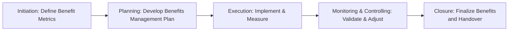

## 29.2 Tracking Benefits throughout the Project Life Cycle

Effectively tracking benefits throughout the project life cycle is essential to validate that the project is delivering the intended value and aligns with organizational strategy. This process involves continuously measuring, monitoring, and adjusting plans to ensure the benefits remain relevant and achievable. Building on the foundational concepts of benefits identification (see Section 29.1) and organizational alignment (see Chapter 28), this section dives into the practical steps for ensuring benefits become an integral facet of project management practice—from initiation through closure and beyond into operations.

A well-structured benefits tracking plan ensures that stakeholders remain aligned, supportive, and engaged throughout the life cycle. The ability to show consistent progress toward mutually agreed-upon organizational value can solidify trust in the project team, enable better decision-making, and support the long-term adoption of the project’s outcomes.

---

### The Importance of Ongoing Benefits Tracking

A project’s value does not stop at delivering a product or service. Rather, it culminates in measurable benefits, such as increased revenue, reduced costs, enhanced reputation, or improved stakeholder satisfaction. Benefits tracking, as part of Benefits Realization Management (BRM), enables project managers and sponsors to answer key questions such as:

- Are we on track to achieve the expected benefits?  
- Have our assumptions about anticipated benefits changed?  
- Are new risks or external factors threatening benefit achievement?  
- Do we have a clear way to measure intangible benefits (e.g., brand recognition, client satisfaction)?

In the context of the PMP® exam, the ongoing measurement and demonstration of benefits is heavily emphasized in both the Business Environment Domain and across the agile, hybrid, and traditional approaches (see Chapter 6). Benefits tracking fosters continuous improvement and ensures that lessons learned regarding benefits management are carried forward to future initiatives.

---

### Phases of Benefits Tracking

While each organization tailors its project life cycle differently, an effective benefits tracking process can be mapped to five overarching phases:

1. Initiation  
2. Planning  
3. Execution  
4. Monitoring and Controlling  
5. Closure and Transition to Operations  

Throughout these stages, the project team must remain vigilant in updating benefit metrics, refining measurement techniques, and communicating progress to stakeholders. Below is a high-level overview; each phase is then explored in detail.

#### 1. Initiation: Defining Benefits and Metrics

During the initiation phase, the team identifies high-level benefits and how they tie into strategic objectives (see Chapter 28: Aligning Projects with Organizational Strategy). This is the time to:

- Collaborate with sponsors and key stakeholders to articulate the expected benefits.  
- Define high-level metrics and success criteria (e.g., cost savings, brand exposure).  
- Document assumptions, potential constraints, and relevant organizational policies.

The Project Charter (discussed in Chapter 15) should reference these benefits, or they may be formalized within a Benefits Register. It’s crucial at this stage to establish clear ownership: who will be responsible for tracking each specific benefit?

#### 2. Planning: Developing the Benefits Management Plan

In parallel with project planning, the team refines benefit metrics and formalizes how and when to measure them. Typical items in a Benefits Management Plan include:

- Detailed Benefit Descriptions: Clear definitions, formulas, and relevant timeframes.  
- Measurement Methods: Techniques for quantitative and qualitative data collection.  
- Roles and Responsibilities: Stakeholder assignments for measuring and reporting.  
- Communication Strategy: How results will be shared and escalated.  
- Contingencies and Assumptions: Potential factors that could affect realization.  
- Risk Response Planning: Identifying new risks that may compromise benefits.

This foundation ensures that the project plan (Chapters 10 and 15) and broader governance structures accommodate the necessary measurement and reporting activities from the outset.

#### 3. Execution: Implementing and Measuring

Once the project is underway, the team collects performance data and compares actual values against the planned benefit metrics. Examples of tasks during execution include:

- Capture data relating to financial, operational, or customer-focused goals.  
- Perform root cause analysis if early measures indicate potential shortfalls.  
- Engage stakeholders to validate evolving assumptions about target benefits.  
- Recalibrate forecasts and budgets to reflect updated insights.

In agile settings (see Chapters 24–26), teams may measure benefits at the end of each iteration or release, presenting early indicators of whether expected value is on track. Hybrid approaches combine the predictability of a structured plan with the flexibility to accommodate changes and refine benefits measurement as needed.

#### 4. Monitoring and Controlling: Validating and Adjusting

Monitoring and controlling (see Chapters 11–14 for performance domain insights) allow for continuous oversight of the project’s progress toward benefit realization:

- Regularly report benefit status in project status meetings, special forums, or dashboards.  
- Compare current measures against baseline targets and thresholds.  
- Evaluate emerging risks to benefits (financial, regulatory, market shifts).  
- Determine if additional resources or changes in scope are required to maintain or improve benefit realization.  
- Redefine measurement metrics if project shifts have altered the nature or relevance of the original benefits.

This phase is iterative. If metrics are off-track, immediate stakeholder engagement is critical—adjusting strategies to either recover the benefits or revise them when fundamental changes occur.

#### 5. Closure: Finalizing Benefits and Transition to Operations

At project close (see Chapter 15: Integration Management), a final audit or assessment of benefits is performed. Depending on the duration or the nature of the benefits, organizations may choose to continue monitoring them after the formal project closure, transitioning responsibility to operational teams.

- Confirm that all planned benefits were either realized or have transitioned to an ongoing process for realization.  
- Conduct a final comparison of actual vs. planned benefits.  
- Document lessons learned in a Benefits Realization Report or within broader project closeout documentation.  
- Formally hand over monitoring responsibilities to designated owners in Operations or Program Management Offices (PMOs).

---

### Key Metrics and Measurement Techniques

Selecting the right metrics is paramount for successful benefits tracking. Metrics can be both quantitative (financial returns, time savings) and qualitative (stakeholder satisfaction, brand perception). Below is a simple reference table outlining typical metrics and relevant measurement approaches:

| Benefit Category      | Example Metrics                          | Measurement Approach                                                    |
|-----------------------|------------------------------------------|-------------------------------------------------------------------------|
| Financial             | Net Present Value (NPV), ROI, Cost Savings | • Financial statements, performance reports   • KaTeX Example: \\( \text{NPV} = \sum \frac{CF_t}{(1+r)^t} \\) |
| Operational Efficiency| Cycle Time Reduction, Defect Rate        | • Time-tracking systems   • Quality audits and control charts       |
| Customer Satisfaction | Net Promoter Score (NPS), Survey Ratings  | • Periodic surveys   • Customer feedback loops                      |
| Employee Engagement   | Retention Rate, Employee Satisfaction     | • HR records   • Pulse surveys, performance reviews                 |
| Market Share & Growth | Number of New Clients, Market Penetration | • Competitive analysis   • Sales and marketing reports              |

In alignment with Chapters 13 (Measurement Performance Domain) and 10 (Planning Performance Domain), project teams should identify leading and lagging indicators. Leading indicators, such as early user adoption rates, can help predict future success, whereas lagging indicators, like final revenue numbers, confirm outcomes after the fact.

---

### Communicating Benefits to Stakeholders

Ongoing stakeholder support depends on how project benefits are communicated and presented. Meaningful, timely, and transparent communication ensures stakeholders see how the project is contributing measurable value.

1. **Use Clear and Relevant Reports**  
   Tailor your communication approach to the audience. Executives may favor high-level dashboards and financial graphs, while operational managers may prefer detailed performance metrics. Tools may include:

   - Dashboard Reports (refer to Chapter 13 on creating effective dashboards)  
   - Earned Value Management graphs for cost and schedule performance  
   - Balanced Scorecards to integrate financial and non-financial measures  

2. **Highlight Early Wins**  
   Especially in agile or iterative environments, emphasize incremental improvements and partial benefits. Early value demonstration can help secure continued funding and stakeholder enthusiasm.

3. **Explain Variances and Action Plans**  
   If shortfalls occur, present a plan for corrective action rather than simply reporting the gap. Keep stakeholders aware of how external factors or internal constraints may be influencing results.

4. **Document the Communication Process**  
   Formalize schedules for benefit updates (e.g., monthly or quarterly) to prevent miscommunication and maintain a predictable flow of information.

---

### Real-World Case Study: Tracking Intangible Benefits

Consider a mid-sized technology company that initiates a project to improve its corporate reputation for sustainability. The project includes rolling out green infrastructure, energy-efficient data centers, and revised employee travel policies. 

- **Initiation**: Stakeholders identify the intangible benefit of “enhanced brand recognition for sustainability.”  
- **Planning**: A plan is developed to measure brand sentiment through social media analytics, periodic reputation surveys, and press coverage highlights.  
- **Execution**: Green policy changes are piloted in a single department, capturing initial data on staff awareness and external press mentions.  
- **Monitoring & Controlling**: The response from media and social platforms reflects a 15% increase in positive sustainability mentions, which is higher than the 10% target. Leadership invests additional resources to accelerate the rollout.  
- **Closure & Ongoing Operations**: After three months, the project closes, and responsibility for ongoing measurement is handed to the Corporate Social Responsibility (CSR) office, which continues to track brand sentiment to confirm long-term impact.  

This scenario demonstrates how intangible benefits (brand value) can be measured using creative data sources, metrics, and stakeholder feedback loops. Thoughtful planning around intangible metrics can galvanize organizational support and align efforts with strategic brand goals.

---

### Common Pitfalls and How to Overcome Them

1. **Vague or Unmeasurable Benefits**  
   - Overcome by collaborating with cross-functional teams to define clear, actionable metrics.  
   - Create proxy measures for intangible or hard-to-quantify benefits (e.g., brand perception surveys).  

2. **Lack of Ownership**  
   - Assign specific benefit owners and hold them accountable for progress updates.  
   - Ensure that these owners have the resources and authority needed to track benefits effectively.  

3. **Misaligned Metrics**  
   - Validate with organizational strategies (Chapter 28) to ensure measures accurately reflect overarching goals.  
   - Avoid fixating on metrics that do not resonate with stakeholder priorities.  

4. **Insufficient Communication**  
   - Use a multi-method communication plan tailored to different stakeholder groups.  
   - Incorporate stakeholder feedback loops to refine reporting formats and frequency.  

5. **Failing to Update the Benefits Management Plan**  
   - Keep the plan dynamic. If external market conditions shift, recast the plan to reflect new realities.  
   - Regularly review and rebaseline if the scope or organizational context changes significantly.

---

### Best Practices for Sustained Stakeholder Support

Achieving consistent benefits realization ties directly to maintaining stakeholder enthusiasm and confidence. Here are several proven strategies:

- **Involve Stakeholders Early and Often**  
  Engage them in defining success criteria and keep them informed at every key milestone.  
- **Visualize Progress**  
  Use data visualization techniques and real-time dashboards (e.g., cumulative flow diagrams in agile) to provide a clear snapshot of benefit trends.  
- **Tailor Reporting Cadences**  
  Align benefit reporting with corporate performance cycles, especially for efforts that carry strong financial or strategic implications.  
- **Monitor at the Portfolio or Program Level**  
  When projects are part of a larger program or portfolio (Chapter 35), coordinate benefits tracking with broader enterprise goals, using consistent methodologies.  
- **Celebrate and Communicate Milestones**  
  Formally acknowledge achievements or pivot quickly if results lag behind forecasts. Demonstrating proactive management fosters trust and continued support.

---

### Integrating Agile and Hybrid Approaches

Modern projects may blend predictive phases with agile iterations (Chapters 27 and 9). This hybrid context demands flexible benefit tracking:

- **Incremental Measurements**: Agile sprints allow frequent re-evaluation of benefit trajectories, enabling immediate course corrections.  
- **Adaptive Stakeholder Engagement**: In agile, stakeholders are typically involved more frequently, offering real-time feedback on feature usefulness.  
- **Tailored Governance**: Hybrid models can incorporate formal gate reviews for major releases while leveraging agile ceremonies for ongoing improvements.  

The focus on early and iterative value demonstration in agile can bolster stakeholder trust and ensure benefits are delivered progressively rather than at a single end-of-project milestone.

---

### Conclusion and Further Readings

Tracking benefits throughout the project life cycle is not just about collecting data; it is a holistic practice of ensuring alignment, adjusting strategies, and communicating effectively to realize real value. By defining clear metrics, using a robust Benefits Management Plan, continuously monitoring progress, and actively engaging stakeholders, project managers establish a transparent and controlled environment that fosters sustainable success. 

For more in-depth strategies, consider diving into the following resources:

- PMI’s Standard for Organizational Project Management (OPM)  
- The Agile Practice Guide (co-published by Agile Alliance and PMI)  
- Harvard Business Review articles on metrics and performance  
- Books on Balanced Scorecard Techniques (e.g., Robert S. Kaplan and David P. Norton)  

Keep honing your ability to track benefits, and you’ll not only excel on the PMP® exam but also drive meaningful impact in your day-to-day project leadership.

---

## Elevate Your Benefit Tracking Expertise: 10-Question Quiz



### What is the primary purpose of tracking benefits throughout the project life cycle?

- [ ] To fulfill a contractual requirement regardless of actual project value
- [ ] To measure resource utilization accurately
- [x] To confirm the project is delivering the intended value
- [ ] To identify team member productivity

> **Explanation:** Tracking benefits ensures the project is generating the promised value. It verifies that the project outcomes support strategic objectives and validates priorities for stakeholders.

### Which of the following would be considered a leading indicator for benefit realization?

- [ ] Actual revenue generated at project closure
- [x] Early user adoption rates
- [ ] Post-implementation support costs
- [ ] Final brand perception survey results

> **Explanation:** Leading indicators foreshadow potential future outcomes. Early user adoption rates can predict the likelihood that final adoption and objectives will be met or exceeded.

### When should organizations begin measuring project benefits?

- [ ] Only after the project deliverables have been fully deployed
- [ ] During the final closeout phase
- [x] As early as possible in the project life cycle
- [ ] Six months after transitioning the deliverables to operations

> **Explanation:** Measuring benefits early allows project managers and stakeholders to identify whether the project is on track, allowing timely interventions if necessary.

### How does an effective communication strategy aid in benefits tracking?

- [x] By regularly updating stakeholders about progress and variances
- [ ] By limiting stakeholder feedback to avoid confusion
- [ ] By requesting exclusive access to financial reports
- [ ] By skipping status updates until final results are available

> **Explanation:** Regular, transparent communication keeps stakeholders engaged and informed about progress toward benefits, enabling them to make better decisions.

### Which statement accurately describes the Agile approach to benefit tracking?

- [x] Benefits are continuously reviewed at the end of each iteration
- [ ] Benefits are evaluated only in a formal phase-gate review
- [x] Stakeholders offer feedback at frequent intervals
- [ ] Project benefits remain static once defined in the charter

> **Explanation:** Agile approaches emphasize iterative value delivery and regular stakeholder engagement, prompting more frequent and adaptive tracking of benefits.

### What is the key benefit of assigning ownership to specific benefits?

- [x] Clear accountability and responsibility for measurement
- [ ] Eliminates the need for a benefits management plan
- [ ] Reduces stakeholder involvement
- [ ] Replaces the need for ongoing communication

> **Explanation:** Assigning ownership builds accountability and ensures the right individuals are tasked with monitoring, reporting, and adjusting benefit metrics.

### In a hybrid project environment, how are benefits typically tracked?

- [ ] Strictly through a predictive approach since agile doesn’t measure benefits
- [x] By combining periodic gate reviews with iterative feedback loops
- [x] By using a single waterfall-based methodology
- [ ] By ignoring stakeholder input until the final deliverable

> **Explanation:** Hybrid approaches merge the structured reviews of predictive planning (gate reviews) with the frequent evaluations and stakeholder feedback inherent in agile methods.

### Which of the following is a common pitfall when tracking intangible benefits?

- [ ] Using both quantitative and qualitative measures
- [x] Failing to define proxy metrics or alternative indicators
- [ ] Communicating progress to the executive sponsor
- [ ] Integrating intangible benefits into Balanced Scorecards

> **Explanation:** Intangible benefits like reputation or brand value require carefully chosen proxy metrics. Without them, these benefits remain unclear or unverifiable.

### What is the purpose of a Benefits Realization Report during project closure?

- [x] To compare planned vs. actual benefits and record lessons learned
- [ ] To replace the Project Charter during closeout
- [ ] To sanction additional project work
- [ ] To keep all benefits confidential

> **Explanation:** Comparing actual outcomes against the original benefits plan provides insights for future projects and ensures transparency with stakeholders regarding final results.

### True or False: If the project fails to deliver benefits exactly as outlined in the original plan, it is always considered unsuccessful.

- [x] True
- [ ] False

> **Explanation:** While minor changes to benefit targets can be acceptable, significant deviation from planned benefits often indicates project shortfall. However, there are cases where refined scopes or external factors alter benefit definitions. Regular oversight mitigates the likelihood of complete failure.



---

## PMP Mastery: 1500+ Hard Mock Exams with Full Explanations

Looking to crush the PMP exam with confidence? Dive deep into 6 rigorous mock exams totaling 1500+ advanced-level questions, each accompanied by clear, step-by-step explanations. Hone your test-taking strategies, master complex topics, and build the resilience you need on exam day. Perfect for serious PMs aiming beyond fundamentals.

Enroll now:  
[PMP Mastery: 1500+ Hard Mock Exams with Exceptional Clarity & Full Explanations](https://www.udemy.com/course/pmp-2025/?referralCode=CF83A54BC86BE27F9AFE)

_Disclaimer: This course is not endorsed by or affiliated with the PMI examination authority. All content is provided purely for educational and preparatory purposes._


