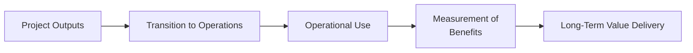
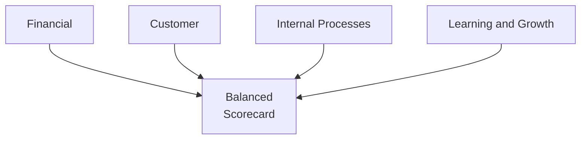

## 29.3 Transition to Operations and Measuring Long-Term Value

Transitioning a project to the operational environment is a critical phase that ensures the benefits outlined in the project’s business case are fully realized and sustained over time. While project management focuses on delivering outputs—such as systems, products, or services—long-term value is only achieved when these outputs seamlessly integrate into the organization’s day-to-day activities and generate ongoing benefits. This section covers practical strategies, best practices, and tools to guarantee a smooth handover, measure post-project performance, and maintain momentum toward strategic objectives.

Organizations that succeed in bridging the gap between project completion and operations create a foundation for continuous improvement and business agility. With the right transition plan, teams and stakeholders can harness all the value from the project deliverables, ensuring that the organization meets or exceeds its stated goals. Let’s explore how to manage this critical lifecycle stage effectively.

---

### Understanding the Significance of Transition to Operations
Transition to operations—or “handover”—involves transferring responsibility for project outputs from the project team to those who will use and maintain them over the long term. The process ensures accountability for ongoing performance is assigned effectively and that all supporting documentation, training, and resources are in place.

Failure to plan this handover diligently can lead to confusion, dropped tasks, or stakeholder frustration. Even when a project meets its time, cost, and scope objectives, inadequate planning at this stage can erode or negate the value delivered. Therefore, a well-defined handover plan is just as important to the overall success as the standard project management phases.

Key objectives of transition to operations include:
- Ensuring operational teams and end users understand new processes, systems, or product functionalities.  
- Validating that necessary training, documentation, and knowledge transfer sessions have been completed.  
- Establishing support mechanisms, maintenance plans, and response strategies for any technical or process issues.  
- Formally closing out the project while retaining lessons learned for future ventures.  

In the PMBOK® Guide (Seventh Edition) context, this phase aligns with the Delivery Performance Domain (see Chapter 12) and continues into the Measurement and Uncertainty Domains (Chapters 13 and 14). Once the project’s deliverables move to operations, performance measurements shift from project KPIs—like schedule and budget—to operational metrics oriented toward long-term value.

---

### Linking Transition to Benefits Realization
Transition to operations is inseparable from benefits realization. Projects are initiated to deliver benefits that align with organizational strategy (see Chapter 28: Aligning Projects with Organizational Strategy). Those benefits often do not fully manifest until the project deliverables are operational for some time.

Below is a simplified illustration showing how project outputs progress toward benefits realization:

- A["Project Outputs"]: The tangible products, services, or processes delivered by the project team.  
- B["Transition to Operations"]: The stage where operational ownership is established.  
- C["Operational Use"]: End users adopt the deliverables, and the organization validates the new state.  
- D["Measurement of   Benefits"]: Monitoring and evaluating results against expected outcomes and KPIs.  
- E["Long-Term Value Delivery"]: Sustained value creation for business and stakeholders.

Once the organization formally adopts and integrates these outputs, the real-world impact on business objectives can be measured. If the project promised, for example, a 10% increase in customer satisfaction, the operational teams are responsible for tracking that metric over time and reporting progress. This feedback loop is central to benefits realization: if outcomes deviate from expectations, corrective actions, process improvements, or further enhancements may be needed.

---

### Handover Preparation: Key Considerations
A methodical preparation phase can prevent confusion and ensure success. Below are common considerations when planning the transition:

#### Operational Readiness
Operational readiness checks involve confirming that the receiving department (or external organization) has the necessary resources and capacity to handle new processes or systems.

- Technology Infrastructure: Ensure hardware, software, and network configurations are ready.  
- Personnel Capacity: Verify that the necessary staffing, training, and skill sets are in place.  
- Policy Alignment: Confirm that organizational policies, standards, or compliance requirements support ongoing operations.

#### Training and Knowledge Transfer
Knowledge transfer is often underestimated or condensed into rushed sessions near project completion. Instead, adopt a structured approach:

1. Conduct cross-functional workshops or “brown-bag lunches” that familiarize operational teams with the deliverables early in the development or implementation process.  
2. Use job aids, documentation, or digital resources (e.g., wiki pages, online knowledge hubs) to facilitate sustained knowledge sharing.  
3. Encourage ongoing Q&A sessions, even after formal project closure.

#### Documented Procedures and Formal Acceptance
Critical to a smooth transition is ensuring that the end users, operational managers, or sponsors formally agree that the deliverables meet requirements. This can be accomplished through:

- User Acceptance Testing (UAT) sign-off.  
- A formal transition checklist ensuring that all critical items (e.g., training material, updated Standard Operating Procedures) are in place.  
- Verification that performance levels reached according to success criteria defined in the Project Management Plan.

During project closure, produce a “transition document” that plainly describes any open items, issues, or recommendations. This document helps operational teams understand next steps and any outstanding risks that must be monitored. (See Chapter 11 for more details on executing and controlling project work effectively.)

---

### Measuring Long-Term Value
Measuring long-term value is the essence of benefits realization management. It extends well beyond conception or project execution into ongoing business reporting. The entire premise of measuring value is anchored on well-defined metrics (see Chapter 13: Measurement Performance Domain). Below are strategies to ensure that each benefit is tracked objectively.

#### Defining Key Performance Indicators (KPIs)
Before the project is handed over, the project manager and sponsor should confirm a set of KPIs that will indicate success over time. These KPIs typically align with the organization’s strategic objectives, such as:
- Increased revenue or market share.  
- Reduced operational costs.  
- Higher customer satisfaction, loyalty, or Net Promoter Score (NPS).  
- Improved production efficiency or service quality.  

When forming KPIs, ensure they are SMART: Specific, Measurable, Achievable, Relevant, and Time-bound. Advanced teams sometimes use additional frameworks (e.g., KPI trees or OKRs—Objectives and Key Results) to refine and monitor outcomes.

#### Quantifying Benefits with Financial Metrics
Financial metrics often provide a straightforward way to quantify success. At times, the formula for Return on Investment (ROI) is used:

$$
\text{ROI} = \frac{\text{Net Benefits}}{\text{Total Project Cost}} \times 100\%
$$

• Net Benefits represent the gains (revenue, cost savings) minus ongoing operating costs for the deliverable.  
• Total Project Cost includes the sum of capital expenses, operational expenses during the project, and transitional costs.  

Positive ROI over time shows the project investment is yielding value. Other relevant indicators include payback period, internal rate of return (IRR), and net present value (NPV).

#### Balanced Scorecard Approach
Some organizations use a balanced scorecard to drill into four perspectives:

1. A["Financial"]: Traditional profit and cost metrics.  
2. B["Customer"]: Satisfaction, retention, loyalty metrics.  
3. C["Internal Processes"]: Efficiency, error rates, throughput.  
4. D["Learning and Growth"]: Employee engagement, skill development, innovation capacity.

Through these dimensions, benefits tracking becomes holistic, connecting the project’s outcomes to multiple layers of organizational health.

#### Post-Implementation Reviews
A Post-Implementation Review (PIR) serves as a formal checkpoint after a designated period—typically 3 to 6 months post-handover. In agile environments, these checks can occur iteratively. During this review:
- Evaluate performance against success criteria.  
- Identify new risks, issues, or emerging enhancements.  
- Document lessons for future initiatives.  

Changes in the environment, user behavior, and organizational priorities may require adjustments. If the benefits are falling short, leadership can refine the solutions, train staff more effectively, or invest in complementary projects to boost value.

---

### Ensuring Sustainable Benefits Realization
An effective transition to operations clarifies accountability. Once the project is formally closed, the responsibility for continuing day-to-day management and realizing the benefits typically falls to business lines or specialized operations teams. Below are approaches to maintain momentum:

- Assign Benefit Owners: Each major benefit should have a named owner responsible for tracking and reporting. This person ensures continuity, even as the project manager transitions off the initiative.  
- Continual Improvement and Kaizen: Ongoing refinements, small process improvements, or additional features can help optimize performance, especially in agile or hybrid environments (see Chapter 24).  
- Create Feedback Loops: Regular performance updates to senior management and stakeholders keep the initiative on track. If a project was intended to save 5% in operational costs, monthly or quarterly reporting to the relevant oversight committee is necessary.  

Through conscientious stewardship, the organization can leverage the deliverable’s full potential well beyond initial release.

---

### Common Pitfalls and Challenges
Despite the best intentions, transitions can encounter hurdles. Here are a few common issues and how to address them:

- Lack of Clear Ownership: Once the project wraps up, if there is no designated operational owner, benefits tracking may fall through the cracks.  
- Insufficient Training: Users and support staff unfamiliar with new tools or processes can lead to underutilized solutions or increased complexity.  
- Resistance to Change: Stakeholders may revert to old processes, hurting the new solution’s adoption and diminishing anticipated benefits. Effective change management and communication, as discussed in Chapter 30, are crucial.  
- Poor Documentation: When handover documentation is incomplete, operational teams spend much time recreating knowledge or guesswork, thus delaying or reducing benefits realization.  

Avoiding these pitfalls begins months before the official transition period. Embed readiness tasks and thorough communication into the project plan from the outset.

---

### Integrating Transition into Project Planning
Seamless operations handover often feels like an afterthought for project managers focused on scope, schedule, and budget. However, integrating transition tasks early can save significant effort later. Include “transition to operations” as a milestone in the project schedule, with well-defined deliverables:
- Updated Standard Operating Procedures or training manuals.  
- Knowledge transfer sessions for help desk, customer support, or IT staff.  
- A formal sign-off from operational stakeholders after validating performance.  

By integrating these elements in the Work Breakdown Structure (WBS) and resource planning, organizations can ensure that appropriate funds, timelines, and responsibilities are established from the start.

---

### Real-World Example: Software Implementation Case Study
Consider a mid-sized telecommunications firm deploying a new Customer Relationship Management (CRM) system to replace an outdated solution. The project manager diligently executed the deliverables: customizing the CRM, migrating data, and training teams.

However, the initial go-live was rocky due to limited end-user engagement. Recognizing potential harm, the PM extended training sessions and included a formal mentorship program. Once the system stabilized, the sponsor arranged a 90-day post-launch review. Data showed that while data entry speed improved, full adoption lagged—only about 60% of staff consistently used the new system. Armed with these metrics, leadership rolled out additional improvements such as auto-fill features and simpler user interfaces.

Six months later, the CRM usage climbed to 95%, leading to a 15% increase in customer retention. Lessons learned included the importance of prioritizing user adoption well in advance and scheduling multiple post-implementation reviews to fine-tune the system and sustain benefits.

---

### Tools and Techniques to Support Transition
Here are practical resources that can streamline your handover and long-term value measurement:

1. RACI Charts: Assign clear roles for individuals Responsible, Accountable, Consulted, and Informed during and after the transition.  
2. Collaborative Knowledge Libraries: Tools like Confluence or SharePoint help maintain centralized documentation that is easy to update.  
3. Standard Operating Procedures (SOPs): Detailed SOPs reduce confusion and training overhead for newly onboarded team members.  
4. Service Level Agreements (SLAs): SLAs define performance expectations—particularly relevant if a service provider or vendor is responsible for sustaining operations.  
5. Post-Mortem or Retrospective Meetings: Borrow agile methodologies to keep the process iterative. Even after formal closure, quick retrospectives can inform improvements in the days or weeks following the handover.

---

### Best Practices for Maintaining Long-Term Value
- Engage Operations Early: Invite operational stakeholders to earlier phases of planning and design, reducing knowledge gaps.  
- Define Clear Handover Criteria: Ensure the entire team understands go/no-go points, operational acceptance criteria, and sign-off processes.  
- Align to Strategy: Revisit how your project’s outcomes and metrics tie to broader strategic goals, so stakeholders remain motivated to sustain improvements.  
- Continual Monitoring: Incorporate automated reporting or dashboards to keep an eye on performance under real operating conditions.  
- Offer Ongoing Training: Provide refresher courses and advanced sessions for power users as needed.  
- Document and Celebrate Success: Publish improvements in organizational newsletters or internal communications. Recognizing achievements can build momentum for future projects.  

---

### References for Further Study
• PMI’s “Benefits Realization Management Framework” — Detailed guidelines on bridging project outputs to strategic benefits.  
• Harvard Business Review on “Post-Project Reviews” — Insights into how to structure lessons learned sessions.  
• Kotter’s “Leading Change” (John P. Kotter) — Approaches for handling cultural, structural, or leadership challenges during transitions.  
• [PMIstandards+](https://standardsplus.pmi.org/) — Ongoing resources and practice guides for advanced project management considerations.

---

## Test Your Knowledge: Transition and Benefits Realization Quiz



### Which of the following best describes the goal of transitioning a project to operations?
- [ ] Completing all project tasks ahead of schedule.
- [x] Ensuring that deliverables integrate seamlessly into business processes and continue to yield benefits.
- [ ] Stopping all work the day the project hits its launch date.
- [ ] Eliminating any possibility of future changes or updates.

> **Explanation:** Transitioning a project to operations is about sustaining long-term benefits and integrating new outputs into day-to-day business activities.

### What is one primary risk of poor documentation during the handover phase?
- [ ] End users excessively rely on the project manager after closure.
- [ ] It leads to more comprehensive knowledge bases.
- [x] Operational teams struggle to support or troubleshoot new systems effectively.
- [ ] It promotes additional unplanned scope changes.

> **Explanation:** Insufficient or disorganized documentation can cause major confusion and inefficiencies, making it difficult for operational teams to properly maintain or utilize the deliverables.

### Which metric is commonly used to measure the financial benefit of a project after transition?
- [ ] Balanced Scorecard
- [ ] Net Promoter Score (NPS)
- [x] Return on Investment (ROI)
- [ ] Stakeholder Satisfaction Index (SSI)

> **Explanation:** ROI is widely used to gauge the financial performance of a project deliverable over time, helping quantify net benefits versus the cost.

### How can an organization encourage continuous improvement after a project is transmitted to operations?
- [x] Implement ongoing reviews and continuous feedback loops to identify enhancements.
- [ ] Assign no clear benefit owners and hope benefits lateralize to everyone.
- [ ] Avoid measuring success until a new project sponsor demands it.
- [ ] Freeze processes permanently to avoid confusion.

> **Explanation:** Continuous improvement relies on iterative evaluations, stakeholder feedback, and the willingness to adjust processes or systems as environments and technologies evolve.

### What is the primary purpose of a Post-Implementation Review (PIR)?
- [x] Evaluate actual performance versus expected outcomes and plan possible improvements.
- [ ] Extend the project indefinitely to fix discovered issues.
- [ ] Focus only on user training activities.
- [ ] Add scope to capture new features or expansions.

> **Explanation:** A PIR is designed to compare project results against intended benefits and to glean lessons that can be applied to future projects or operational improvements.

### Which statement about user training in a handover is accurate?
- [x] Training should be planned well in advance, with multiple sessions, to ensure adoption and mitigate knowledge gaps.
- [ ] Training should be entirely self-guided once the system is live.
- [ ] Executives alone need in-depth training, as they approve final budgets.
- [ ] Training is optional when it comes to intangible deliverables.

> **Explanation:** Comprehensive, well-timed training aligns operational teams with new processes or systems, boosting usage and achieving the intended benefits.

### What role does a “Benefit Owner” play post-handover?
- [x] Continues tracking the intended benefits and reports on success metrics.
- [ ] Audits only the project budget.
- [x] Advocates for expansions or enhancements needed to sustain or improve benefits.
- [ ] Manages day-to-day personnel administration.

> **Explanation:** A Benefit Owner’s responsibility includes ensuring the deliverables are optimally used, measuring results, and championing potential improvements that preserve or enhance value.

### Which of the following is a valid approach to ensure operational readiness?
- [x] Provide timely training, confirm infrastructure alignment, and check resource availability well before project closure.
- [ ] Only provide documentation post-launch.
- [ ] Skip user acceptance testing in favor of quick deployment.
- [ ] Keep operational personnel informed only as a courtesy during final days.

> **Explanation:** Operational readiness involves preparing and confirming that the environment, staff, and infrastructure are aligned for the new solution or process.

### Which technique would you recommend to facilitate a robust knowledge transfer?
- [x] Holding stake-in demos, workshops, and Q&A sessions that involve relevant operational staff throughout the project.
- [ ] Delaying all knowledge transfer sessions until after the product is in production for six months.
- [ ] Providing a one-time “read-only” document of all code or process steps.
- [ ] Eliminating user training to reduce project costs.

> **Explanation:** Interactive sessions—like facilitated workshops and real-time demos—empower end users to understand and adopt the new deliverables effectively.

### A benefit measured post-project shows lower than expected results. Which statement is true?
- [x] The organization should analyze root causes, consider enhancements, or provide additional training to close performance gaps.
- [ ] The project team must remain fully engaged until the results improve.
- [ ] Lower measures indicate benefits measurement is extraneous.
- [ ] No action is needed if the project is officially closed.

> **Explanation:** When a benefit underperforms, the organization needs to investigate the underlying factors and take corrective or enhancements measures, ensuring that organizational goals are eventually realized.



---

## PMP Mastery: 1500+ Hard Mock Exams with Full Explanations 

Looking to crush the PMP exam with confidence? Dive deep into 6 rigorous mock exams totaling 1500+ advanced-level questions, each accompanied by clear, step-by-step explanations. Hone your test-taking strategies, master complex topics, and build the resilience you need on exam day. Perfect for serious PMs aiming beyond fundamentals.

Enroll now:  
[PMP Mastery: 1500+ Hard Mock Exams with Exceptional Clarity & Full Explanations](https://www.udemy.com/course/pmp-2025/?referralCode=CF83A54BC86BE27F9AFE)

_Disclaimer: This course is not endorsed by or affiliated with the PMI examination authority. All content is provided purely for educational and preparatory purposes._
