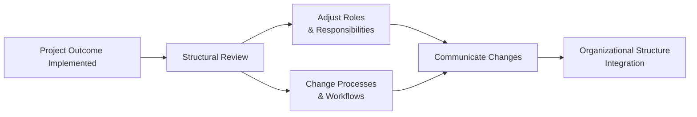

## 30.1 Impact of Project Outcomes on Organizational Structures

Project outcomes—whether they are new products, transformed processes, emerging technologies, or service improvements—all have the capacity to reshape how an organization functions. When project teams introduce changes that disrupt established workflows, they must anticipate broader repercussions across hierarchical frameworks, decision-making processes, and day-to-day operations. As a project manager, understanding the interplay between project outcomes and organizational structures is vital for both delivering successful project results and ensuring the organization adapts effectively to these results.

This section explores the many ways project deliverables can influence reporting lines, shift accountability, or reorganize collaborations. It also provides practical strategies for recognizing, anticipating, and mitigating negative impacts while amplifying benefits. By thoroughly assessing how proposed changes may reshape your organization, you can minimize resistance and ensure smoother transitions post-implementation.

---

### Understanding Organizational Structures and Their Sensitivity to Change

Organizational structures generally define how teams and departments are organized, how authority and responsibilities are distributed, and how information flows. Common structures include:

• Functional (traditional area-based specialization, e.g., finance, marketing, operations)  
• Matrix (dual reporting lines, often to a functional manager and a project or product manager)  
• Projectized (teams organized primarily around specific projects, where project managers hold greater authority)  
• Hybrid (combining features of the above, often to adapt to strategic needs)

Each of these structures has different degrees of flexibility and susceptibility to being impacted by project outcomes. For instance, matrix organizations often evolve based on new project demands because they rely on cross-functional collaboration. Meanwhile, functional organizations might require comprehensive buy-in at senior levels to adjust reporting lines or incorporate new systems. Understanding where your organization lies on this spectrum helps clarify how quickly and effectively changes can be accommodated.

---

### Types of Project Outcomes and Their Structural Impact

Project outcomes can range from minor process tweaks to radical overhauls of how work is done. Below are four main categories of outcomes that commonly reshape organizational structures:

#### 1. Process Changes  
Projects that refine or standardize processes, for example a new risk management protocol or a more efficient supply chain workflow, can force departments to adapt. They may reveal redundant roles, demand training in new skills, or oblige separate teams to coordinate more closely. Over time, these changes may unify or redistribute existing roles and responsibilities.

#### 2. Technological Upgrades and Innovation  
Whether implementing a new enterprise resource planning (ERP) system or deploying tools that leverage artificial intelligence, technology projects often demand specialized roles and a restructuring of workflows. Individuals may need reassignment to newly formed departments for system administration, data analysis, or user support. In matrix or functional structures, there can be clashes over resource allocation if new skill sets must be distributed across multiple projects.

#### 3. Organizational Capability Expansion  
Some projects aim squarely at expanding what the organization can do, such as adding product lines or entering new markets. Launching a new product group or spin-off business unit can lead to additional management layers, new functional areas (e.g., new compliance requirements), or realignment of global teams. Sudden expansions often expose weaknesses in existing hierarchical setups, prompting reevaluation of roles and responsibilities.

#### 4. Cultural and Behavioral Shifts  
Beyond tangible deliverables, many projects seek intangible changes, like instilling greater teamwork, agility, or innovation mindsets. To embed a culture of continuous improvement (see Chapter 20.3 on continuous improvement strategies), HR and leadership teams might alter performance metrics, reward systems, or resource allocation procedures. These changes, though subtle, can deeply influence departmental boundaries, decision-making autonomy, or leadership styles, ultimately affecting the entire organizational structure.

---

### Mechanisms by Which Project Outcomes Influence Structures

When projects introduce new processes, technologies, or outputs, they often trigger a cascade of organizational adjustments. The most commonly observed mechanisms include:

• Shifts in Reporting Lines: A newly created role or function may not fit neatly into existing departments, prompting realignment under a different business unit.  
• Reallocation of Authority and Decision Rights: Where projects create new cross-functional teams, decision-making can become more collaborative or consolidated.  
• Expanded or Contracted Headcount: Process automation or new technology might lower the need for certain tasks, leading to resource redeployment or reductions in workforce. Conversely, new initiatives may require additional staff or specialized expertise.  
• Enhanced Collaboration and Cross-Functional Links: Projects that seek synergy across multiple business units can create stronger ties, shared goals, or new centers of excellence that transcend existing functional silos.  
• Emergence of Hybrid Roles: Some changes necessitate new roles that combine elements of project leadership, business analysis, or technical expertise.  

Visibility into these pathways ensures you can better anticipate the structural shifts that often accompany large-scale projects.

---

### Visualizing the Structural Transformation

Below is a simplified Mermaid flowchart showing how a project outcome can initiate structural reviews, leading to changes in roles, responsibilities, and workflows:

• Project Outcome Implemented: The project results in a new product, process, or technology.  
• Structural Review: Organizational leadership reviews the feasibility and impact on existing organizational charts and hierarchies.  
• Adjust Roles & Responsibilities: Departments, teams, and individuals see shifts in accountability or reporting.  
• Change Processes & Workflows: Existing workflows are remapped to accommodate new operational practices.  
• Communicate Changes: Ensuring stakeholders are informed, trained, and supported through the transition.  
• Organizational Structure Integration: The outcome becomes embedded, helping the organization adapt and stabilize.

---

### Best Practices for Managing Structural Influences

#### Holistic Stakeholder Analysis

Engage a wide range of stakeholders (see Chapter 7: Stakeholder Performance Domain) from various departments early. In a functional organization, line managers must understand how proposed changes will alter their team’s day-to-day. In a projectized setting, the project manager can collaborate more closely with executives to finalize new reporting lines. Proactive communication can significantly reduce resistance and uncertainty among team members.

#### Cross-Departmental Collaboration

When new project outcomes transcend departmental boundaries, cross-collaboration is crucial. Form multi-disciplinary steering committees or working groups during planning phases to capture insights from every impacted area—e.g., IT, finance, and operations. Doing so can avert silo-focused decisions and help align multiple stakeholders on future organizational structures.

#### Tailoring Project Methods to Organizational Needs

As noted in Chapter 9 (Development Approach and Life Cycle Performance Domain), the choice of predictive, agile, or hybrid approach can significantly affect how well an organization can adapt. Agile methods, for example, often thrive in flatter hierarchies where cross-functional teams self-organize. Conversely, more traditional predictive environments may handle changes best through well-defined gates and approvals.

#### Clear Role Definitions and Training

If employees fear for their jobs or are unclear on responsibilities, resistance to change escalates. Develop comprehensive role-transition plans, including job descriptions for redefined positions. In technology-focused projects, arrange training and mentorship to help staff build required skills. If the culture is shifting to embrace self-organization (see Chapter 8.3), clarify new expectations and leadership competencies.

#### Incremental Integration

Not all structural changes need to happen at once. Some organizations opt for a phased approach, especially if project outcomes are extensive. Start with pilot units, evaluate lessons learned, and then scale. This incremental strategy can help detect early challenges and correct course before widespread adoption.

#### Emphasis on Communication and Feedback

Throughout and after the project, maintain open channels for feedback (see Chapter 16: Stakeholder and Communications Management). Town halls, roundtable sessions, or anonymous surveys can surface issues related to expanded workloads, unclear new roles, or unmet training needs. Rapidly addressing these concerns can sustain engagement, trust, and productivity levels.

---

### Potential Pitfalls and Risks

While beneficial in the long term, structural changes carry risks:

• Resistance and Low Morale: Rapid or poorly explained changes can provoke anxiety, negatively affecting team performance and retention.  
• Role Confusion and Duplication: Without due diligence, some roles might overlap, fostering accountability gaps or turf wars.  
• Unclear Governance: Leadership must establish clear governance structures for project-driven changes. Failing to do so can create conflict over decision rights and budget approvals.  
• Lack of Support from Top Management: Executive sponsorship is critical. Insufficient approval or engagement from senior leaders often leads to stalled or incomplete transitions.

Minimizing these pitfalls requires robust change management principles (see the rest of Chapter 30) and thoughtful stakeholder engagement strategies.

---

### Real-World Example: Implementing a CRM System

Consider a mid-sized B2B firm that decides to implement a new customer relationship management (CRM) system. Historically, customer data was scattered across multiple spreadsheets owned by different departments. Sales, marketing, and customer support each used siloed information.

• Project Outcome: A technologically unified CRM with standardized dashboards.  
• Structural Impact:  
  - The newly formed CRM department reports directly to the Chief Operations Officer (COO).  
  - Several roles are repurposed into CRM analysts, who train end-users, monitor quality of customer data, and suggest process improvements.  
  - Reporting lines change for certain support agents who must now collaborate with CRM analysts daily.  
  - Leadership revises performance metrics to include CRM usage and data accuracy.  
• Benefits Realization: Once the structure is realigned, the organization sees faster funnel conversions, better customer satisfaction, and more effective cross-selling.  

In this scenario, the catalyzing factor—technological overhaul—led to expansions of authority for a newly minted department and realigned how multiple teams share and act on data.

---

### Strategies for Sustaining Structural Change

Implementing structural adjustments is only half the battle; sustaining them is crucial. Consider:

• Ongoing Leadership Support: Regular involvement of senior management, featuring updates at board meetings or executive committee sessions, ensures that structural changes are maintained.  
• Continuous Improvement Culture: Encourage project teams to treat structural changes not as a one-time event but as a foundation for iterative refinements in lines of accountability or cross-functional coordination (see “Kaizen” in Chapter 20.3).  
• Performance Metrics: Align individual and collective KPIs with the newly established structures. For example, if you are aiming to reduce departmental silos, incorporate cross-functional collaboration as a metric.  
• Knowledge Transfer: Successful structural shifts require knowledge pipelines. When people leave or rotate roles, continuity is preserved via documented processes, training modules, and mentorship programs.

---

### Linking Structural Outcomes to Organizational Strategy

Project outcomes can help an organization pivot to new strategic directions. Whether you are steering an agile transformation in a software company or modernizing a logistics department, always connect the dots between project deliverables and organizational goals (see Chapter 28: Aligning Projects with Organizational Strategy). Demonstrating how new structures directly contribute to broader strategic imperatives builds the bridge between day-to-day operational changes and the bigger picture.

---

### Further Resources and Recommended Readings

• PMI’s “Organizational Change Management” section in the Agile Practice Guide for insights on cultural adaptability.  
• John P. Kotter’s “Leading Change” for an eight-step process to shepherd structural and cultural changes.  
• Prosci’s Change Management Methodology, focusing on stakeholder readiness and reinforcement.  
• Chapter 8 of this book for guidance on fostering high-performing teams that adapt and thrive in newly adopted structures and roles.  

---

## Test Your Knowledge on Organizational Structure and Change



### Which of the following project outcomes typically has the most direct organizational structural impact?

- [ ] A slight modification to a team’s daily operational checklist.
- [x] The implementation of a new enterprise resource planning (ERP) system.
- [ ] A temporary marketing campaign for a regional product launch.
- [ ] The introduction of a new vendor with minimal contract scope.

> **Explanation:** Large-scale technology implementations like a new ERP system often require realigning departments, defining new roles, and training staff, thus having a direct and significant impact on organizational structures.

### Which mechanism can alter team compositions and responsibilities after a major project deliverable?

- [x] Shifts in reporting lines
- [ ] Maintaining legacy systems indefinitely
- [ ] Using only external contractors
- [ ] Reducing cross-functional communication

> **Explanation:** Shifts in reporting lines reassign staff, create or merge positions, and adjust collaborating departments. This strongly influences how teams function day to day.

### A common pitfall when integrating large-scale project outcomes into existing structures is:

- [x] Overlooking the need to define clear governance measures.
- [ ] Allocating sufficient time for training and adoption.
- [ ] Setting realistic performance goals.
- [ ] Creating multi-disciplinary steering committees.

> **Explanation:** Without clarified governance—who decides what, who holds budget authority, and how escalations occur—structural changes can stall, leading to uncertainty and conflict among stakeholders.

### What is a key reason for adopting a phased or incremental approach to structural transformation?

- [x] It allows early detection of issues before they affect the entire organization.
- [ ] It reduces time to research organizational readiness.
- [ ] It sets unrealistic expectations among stakeholders.
- [ ] It prevents the organization from committing to any change.

> **Explanation:** An incremental strategy enables pilot implementations on a smaller scale, so the organization can learn from challenges and successes, refining its change approach before widespread rollout.

### Which stakeholder group is most critical for championing structural changes organization-wide?

- [x] Executive Sponsors
- [ ] End-Users
- [x] Project Managers
- [ ] Procurement Officers

> **Explanation:** Both executive sponsors and project managers hold intense influence over structural transitions. Executives provide top-level support and funding, while project managers lead the practical, day-to-day execution of implementing new structures.

### To sustain new structures post-implementation, a project manager should:

- [x] Reinforce changes through ongoing leadership support and continuous improvement.
- [ ] Move on immediately after handover to the next project.
- [ ] Revert to the old structure to ensure stability.
- [ ] Limit training to the initial rollout period.

> **Explanation:** Effective structural change requires ongoing leadership backing and a culture of continuous improvement to embed the new practices and roles into daily routines.

### What is a major driver of resistance in organizational restructuring following project delivery?

- [x] Anxiety over job security and unclear roles
- [ ] Comprehensive leadership engagement
- [x] Transparent communication
- [ ] Gradual introduction of changes

> **Explanation:** Employees often fear that new structures threaten their positions or leave them uncertain about responsibilities. Transparent communication and defined role transitions can mitigate these concerns.

### Which potential adjustment best illustrates “emergence of hybrid roles” when implementing project outcomes?

- [x] Combining technical analysis and project coordination in a single position
- [ ] Outsourcing non-technical tasks to a third party
- [ ] Maintaining two separate roles for each specialized area
- [ ] Prohibiting cross-functional collaboration

> **Explanation:** Hybrid roles integrate multiple skill sets—like technical expertise with project management—facilitating collaborative and flexible operations in restructured organizations.

### How do measurable KPIs facilitate successful structural change after projects conclude?

- [x] They align individual activities with new organizational goals.
- [ ] They eliminate the need for feedback loops.
- [ ] They prevent stakeholders from adapting to new roles.
- [ ] They guarantee cost savings regardless of strategy.

> **Explanation:** When performance metrics are linked to structural and strategic objectives, individuals understand how their tasks contribute to overarching goals, reinforcing the changes.

### Structural changes introduced by a project are effectively embedded when:

- [x] They become part of standard operations and are continuously improved.
- [ ] They remain optional for all departments.
- [ ] They decrease collaboration and communication.
- [ ] They stay limited to the pilot department’s adoption.

> **Explanation:** True embedding means everyone in the organization acknowledges, utilizes, and enhances the structural changes, integrating them as standard practice rather than a special initiative.



---

## PMP Mastery: 1500+ Hard Mock Exams with Full Explanations 

Looking to crush the PMP exam with confidence? Dive deep into 6 rigorous mock exams totaling 1500+ advanced-level questions, each accompanied by clear, step-by-step explanations. Hone your test-taking strategies, master complex topics, and build the resilience you need on exam day. Perfect for serious PMs aiming beyond fundamentals.  

Enroll now:  
[PMP Mastery: 1500+ Hard Mock Exams with Exceptional Clarity & Full Explanations](https://www.udemy.com/course/pmp-2025/?referralCode=CF83A54BC86BE27F9AFE)

_Disclaimer: This course is not endorsed by or affiliated with the PMI examination authority. All content is provided purely for educational and preparatory purposes._
