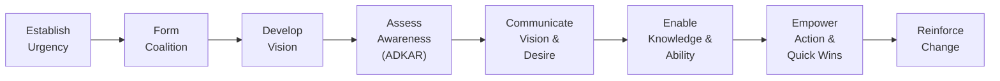

## 30.2 Techniques to Lead and Manage Change Engagement

Effectively leading and managing change engagement is critical in modern project environments where stakeholder buy-in, emotional readiness, and organizational acceptance are fundamental to achieving enduring results. This section expands on the fundamentals of organizational change management by focusing on specific techniques that drive consensus, address emotional and cultural barriers, and build pathways toward sustainable transformation. By understanding these techniques, project managers can guide individuals and groups through each stage of change and foster a supportive environment that nurtures both short-term successes and long-term commitment.

### Understanding the Human Side of Change

Change is more than an operational shift; it is an emotional and psychological journey for every stakeholder. Even proven processes and advanced methodologies can falter if stakeholder emotions and uncertainties are not considered. Key aspects include:

• Emotional Response and Readiness: The impact of fear, uncertainty, and excitement on adoption.  
• Organizational Culture: The influence of norms, shared values, and interpersonal dynamics on change acceptance.  
• Learning and Adaptation: Ensuring adequate support and training for those transitioning to new practices or roles.  

When project teams overlook the human dimension of change, initiatives risk stagnation, low morale, and conflict. Conversely, acknowledging and proactively managing stakeholder emotions can significantly increase engagement, productivity, and positive outcomes.

### Aligning Change with Organizational Strategy

A foundational step in engaging stakeholders is ensuring that the change initiative aligns with overarching organizational strategies and objectives. Referencing [Chapter 28: Aligning Projects with Organizational Strategy](../../28-aligning-projects-with-organizational-strategy/), project managers should:

• Clearly connect the change effort to broader strategic goals and outcomes (e.g., improving market share, customer satisfaction, or operational excellence).  
• Use organizational performance metrics (like ROI, NPV, or payback periods) to illustrate tangible benefits.  
• Demonstrate how the change positively impacts the strategic milestones and benefits spelled out in [Chapter 29: Benefits Realization Management](../../29-benefits-realization-management/).  

By showcasing a direct link between the proposed changes and the organization’s strategy, project managers build a compelling rationale that resonates with senior leadership and frontline stakeholders alike. This transparency strengthens the sense of purpose and invites active participation.

### Key Frameworks for Leading Change Engagement

Multiple models and frameworks offer structured guidance for navigating the complexities of change. While each has unique concepts, they share fundamental principles of communication, persistence, and leadership. Two commonly cited models include:

1. Kotter’s 8-Step Process for Leading Change  
2. Prosci’s ADKAR Methodology  

These frameworks can be tailored to fit any project or organizational context. For instance, at the outset, project managers can establish urgency (Kotter) or assess individual awareness (ADKAR) to create a receptive environment. From there, consistent communication, removal of barriers, and ongoing reinforcement help ensure stakeholders are fully on board.

Below is a high-level depiction of a combined approach, illustrating the flow of phases in guiding organizational change:

**Diagram Explanation:**  
• Establish Urgency: Highlight the strategic importance of the change.  
• Form Coalition: Gather influential stakeholders and champions.  
• Develop Vision: Craft a clear statement of the desired future state.  
• Assess Awareness (ADKAR): Gauge stakeholder readiness and support.  
• Communicate Vision & Desire: Use multiple channels to spread the message.  
• Enable Knowledge & Ability: Provide training, coaching, and resources.  
• Empower Action & Quick Wins: Break down barriers and celebrate short-term successes.  
• Reinforce Change: Sustain momentum through feedback loops, recognition, and continued alignment.  

### Building Consensus

Consensus-building is integral to encouraging diverse stakeholders to align behind a common goal. Since stakeholders may hold differing viewpoints and concerns, project managers should employ techniques tailored to each scenario:

• Collaborative Workshops: Interactive forums where stakeholders openly discuss benefits, challenges, and potential gaps of the proposed change. Techniques such as the nominal group technique or round-robin brainstorming help ensure all voices are heard.  
• Pilot Programs or Proofs of Concept: Demonstrating feasibility with a small-scale, low-risk pilot can quell doubts and show tangible benefits. Success stories from pilot teams provide powerful testimony that fosters broader acceptance.  
• Joint Decision-Making Tools: Decision matrices, affinity diagrams, or multi-criteria analysis allow groups to weigh pros and cons systematically. These data-driven approaches help reduce emotional bias and facilitate objective discussions.  
• Stakeholder Mapping and Prioritization: As explored in [Chapter 7: Stakeholder Performance Domain](../../07-stakeholder-performance-domain/), identifying the most influential stakeholders is crucial. Engaging power brokers early can expedite agreement across the broader community.

During consensus-building, it is vital to acknowledge doubts and objections upfront. When stakeholders sense their concerns are addressed, they are more likely to support collective decisions.

### Managing Stakeholder Emotions

Emotional undercurrents heavily influence how individuals perceive and react to disruption. Common emotions include fear of loss (status, resources, comfort), anger or frustration over perceived inconveniences, and even excitement for new possibilities. Techniques to manage these emotions effectively include:

• Active Listening: In one-on-one or small-group sessions, allow stakeholders to vent anxiety or opposition. Summarize their perspectives to show you understand them. This validates feelings and can de-escalate tension.  
• Empathy Mapping: A tool that identifies what different stakeholder groups see, hear, think, and feel. By mapping these emotional drivers, project managers can tailor communication tactics to address real concerns.  
• Psychological Safety: Encouraging an environment where questions and mistakes are tolerated fosters transparent dialogue, vital for transformation efforts. This concept aligns closely with building High-Performing Team Cultures from [Chapter 8: Team Performance Domain](../../08-team-performance-domain/).  
• Emotional Intelligence (EQ) in Leadership: Self-awareness, self-regulation, motivation, empathy, and social skills enable project leaders to navigate delicate emotional landscapes and inspire others throughout the change journey.

### Fostering Acceptance and Ownership

True change acceptance goes beyond superficial compliance; it requires genuine ownership. When stakeholders see how the new processes or structures benefit them and the organization, they are more inclined to adopt the change. Key considerations:

• Involve Stakeholders in Implementation: Encourage individuals to identify solutions, create deliverables, or lead sub-initiatives. Having a sense of ownership boosts engagement and accountability.  
• Provide Ongoing Support and Training: Resistance often arises from a lack of clear guidance or perceived inability to perform new tasks. Offer targeted training sessions, mentorship, and resource repositories.  
• Celebrate Quick Wins: Acknowledge small milestones and achievements early on. Positive reinforcement builds momentum and confidence, particularly in longer or more complex transformations.  
• Align Performance Metrics: Tie performance reports to change-related goals or behaviors. Recognize employees who embody the new culture and workflows.  

By promoting a sense of shared purpose and recognizing contributions, the project team lays the groundwork for sustained acceptance.

### Communication and Feedback Loops

Continuous communication is the linchpin of successful change engagement. A robust communication strategy—detailed further in [Chapter 16: Stakeholder and Communications Management](../../16-stakeholder-and-communications-management/)—entails more than just frequent updates; it integrates multiple channels, customizes the message for different audiences, and fosters two-way dialogue. Consider:

• Tiered Messaging Approach: Executive summaries for senior leaders, operational briefs for middle management, and “what’s in it for me?” bulletins for frontline staff.  
• Multiple Communication Channels: Town halls, email newsletters, social media, intranet updates, collaborative forums, and informal coffee chats.  
• Regular Checkpoints: Retrospectives, lessons learned sessions, and the use of digital dashboards or metrics to gather feedback and track progress.  
• Open Forum Q&A: Provide safe spaces—virtual or physical—where employees can raise queries without fear of reprimand or judgment.  

Feedback loops are equally critical. By systematically capturing and acting upon input, project teams can adjust their approaches, refine messaging, or resolve emerging issues in near real time.

### Overcoming Resistance and Conflict

Resistance is a natural human response to unfamiliar territory and perceived threats. The objective is not to eliminate all resistance but to harness it constructively, ensuring that legitimate concerns inform the transformation. Common resistance management tactics include:

• Curiosity and Dialogue: Engage opponents by framing discussions around curiosity: “Help me understand your perspective” fosters mutual respect and can reveal overlooked risks.  
• Reframing the Narrative: Show how the change aligns with personal aspirations or job enhancement opportunities. When employees see personal benefits—career development, skill expansion—they become allies.  
• Transparent Decision-Making: Where possible, provide visibility into how decisions are made and why certain paths are chosen. This reduces rumors and misinformation.  
• Conflict Resolution Techniques: Mediation, negotiation, or third-party facilitation can help de-escalate tensions. As covered in [Chapter 8: Team Performance Domain](../../08-team-performance-domain/), trained facilitators can guide polarized groups to workable compromises.

### Sustaining Momentum and Reinforcement

Change engagement is not a one-off event but an ongoing process requiring reinforcement, recognition, and periodic recalibration. Consider the following strategies to maintain momentum:

• Performance Reviews and Incentives: Link partial bonuses or recognition programs to milestones in the change initiative.  
• Refresh Communication Initiatives: After initial enthusiasm tapers, reinvigorate interest through success stories, visual dashboards, or “change champions” sharing personal transformations.  
• Continuous Improvement Mindset: Encourage an agile mindset, revisiting processes regularly to incorporate feedback and refine approaches. This mentality overlaps with risk and uncertainty management frameworks in [Chapter 22: Risk and Uncertainty Management](../../22-risk-and-uncertainty-management-revisited/).  
• Executive Engagement: Visible support from top-level leaders sends a powerful signal that solidifies project legitimacy and fosters sustained buy-in.

### Practical Example: Merger Integration

Imagine a mid-size technology company acquiring a smaller start-up for innovation capabilities. Employees at both organizations must adapt to new reporting lines, unify product roadmaps, and align processes. By deploying a structured change engagement plan:

1. Leadership forms a cross-functional coalition of senior managers and rising talents from both entities.  
2. Communication campaigns emphasize shared business benefits—new markets, cutting-edge products—while addressing job-security fears.  
3. Targeted training nourishes employees’ sense of efficacy and highlights career growth in the integrated enterprise.  
4. Town hall meetings solicit feedback on the assimilation process, celebrating early wins like combined product demos or pilot collaborations.  
5. A feedback-and-revision cycle addresses cultural disparities and refines integration steps to build broader acceptance and synergy.

### Best Practices and Pitfalls

**Best Practices**  
• Involve influencers and champions early.  
• Provide consistent and tailored communication.  
• Celebrate milestones frequently to maintain momentum.  
• Foster psychological safety and open dialogue.  
• Employ data-backed decision-making tools to minimize bias.

**Common Pitfalls**  
• Underestimating the emotional impact of change.  
• Relying on one-way communication, such as email blasts.  
• Disregarding feedback or failing to address concerns.  
• Neglecting to link changes to broader strategic aims.  
• Treating change engagement as a short-term initiative rather than an ongoing practice.

### References for Further Exploration

• Kotter, J. P. (1996). “Leading Change.” Harvard Business School Press.  
• Hiatt, J. M. (2006). “ADKAR: A Model for Change in Business, Government, and Our Community.” Prosci Learning Center Publications.  
• Lewin, K. (1951). “Field Theory in Social Science.”  
• PMI (2021). “PMBOK® Guide – Seventh Edition” and “PMIstandards+”.  
• Bridges, W. (2009). “Managing Transitions: Making the Most of Change.” Da Capo Press.  

---

## Test Your Mastery: Change Engagement Strategies Quiz



### Which of the following is a crucial initial step in winning stakeholder support for organizational change?

- [x] Establishing a clear link between the change and the organization’s strategic goals
- [ ] Sending a generic company-wide email about the changes
- [ ] Providing immediate financial incentives
- [ ] Waiting to address stakeholder concerns until after the change is implemented

> **Explanation:** Change initiatives that are explicitly tied to broader organizational objectives gain stronger stakeholder buy-in because individuals can see how their efforts contribute to wider strategic success.

### What is the main focus of ADKAR within organizational change?

- [x] Guiding individual awareness, desire, knowledge, ability, and reinforcement
- [ ] Measuring project performance against earned value baselines
- [ ] Developing a new product roadmap for the enterprise
- [ ] Encouraging budget cuts for operational efficiency

> **Explanation:** ADKAR emphasizes five key stages—Awareness, Desire, Knowledge, Ability, Reinforcement—that help individuals transition through change effectively.

### Which communication method can best ensure that all voices are equally heard when building consensus?

- [x] Round-robin or nominal group technique workshops
- [ ] Directive memos from executive leadership
- [ ] One-on-one closed-door meetings exclusively with managers
- [ ] Passive email notifications

> **Explanation:** Round-robin and nominal group technique workshops encourage equal participation, preventing dominant speakers from overshadowing quieter participants.

### How can project managers handle stakeholders who resist change due to fear of job security?

- [x] Openly address the concerns and provide clarity on role transitions
- [ ] Threaten them with disciplinary action if they do not comply
- [ ] Ignore the stance and rely on natural attrition
- [ ] Dismiss the concerns as invalid and maintain silence

> **Explanation:** Proactively offering reassurance, clarifying job roles, and designing smooth role transitions can alleviate anxieties and encourage active engagement.

### Which practice can sustain momentum in a long-term change initiative?

- [x] Regular celebration of milestones and small wins
- [ ] Announcing the change only once at the start
- [x] Periodic check-ins with real-time feedback loops
- [ ] Limiting communication to upper management

> **Explanation:** Recognizing progress at frequent intervals and maintaining open feedback loops prevents fatigue and helps build ongoing support for the initiative.

### When a project manager uses empathy mapping, they aim to:

- [x] Understand what stakeholders see, hear, think, and feel
- [ ] Determine the most cost-effective approach for vendor selection
- [ ] Perform quantitative risk analysis on schedule delays
- [ ] Assess network diagrams for scheduling conflicts

> **Explanation:** Empathy mapping is a human-centered design approach that illuminates stakeholder perspectives and emotional drivers, forming a basis for customized engagement strategies.

### Which technique aligns best with effectively resolving stakeholder conflicts during major change?

- [x] Mediation and negotiation facilitated by a neutral party
- [ ] Avoiding direct contact with conflict-prone individuals
- [x] Encouraging curiosity-driven dialogue
- [ ] Postponing conflict resolution until the final project phase

> **Explanation:** Mediation, negotiation, and curiosity-driven dialogue help stakeholders voice their perspectives, leading to mutually acceptable resolutions and sustained consensus.

### What is a common pitfall that undermines organizational change initiatives?

- [x] Failing to address feedback proactively
- [ ] Using pilot programs to validate the approach
- [ ] Identifying influential champions
- [ ] Offering training opportunities

> **Explanation:** When teams do not act on or respond to stakeholder feedback, it fosters frustration, fuels resistance, and greatly reduces the likelihood of successful change adoption.

### How can psychological safety assist in managing stakeholder emotions during change?

- [x] It encourages honest dialogue, enabling concerns to surface early
- [ ] It allows project managers to avoid unpopular decisions
- [ ] It keeps stakeholders from asking questions
- [ ] It eliminates the need for training sessions

> **Explanation:** When stakeholders feel safe raising questions or mistakes, potential emotional inhibitors to change can be uncovered easily, and corrective action taken promptly.

### “Quick wins” in a change context are:

- [x] Early, tangible successes that build confidence and momentum 
- [ ] Long-term strategic objectives achieved at the final project phase
- [ ] Formal risk assessments performed mid-project
- [ ] Isolated tasks with no impact on stakeholder morale

> **Explanation:** Quick wins are small, immediate victories that provide proof of concept and encourage broader endorsement of the change, contributing to sustained engagement.



---

## PMP Mastery: 1500+ Hard Mock Exams with Full Explanations 

Looking to crush the PMP exam with confidence? Dive deep into 6 rigorous mock exams totaling 1500+ advanced-level questions, each accompanied by clear, step-by-step explanations. Hone your test-taking strategies, master complex topics, and build the resilience you need on exam day. Perfect for serious PMs aiming beyond fundamentals.  

Enroll now:  
[PMP Mastery: 1500+ Hard Mock Exams with Exceptional Clarity & Full Explanations](https://www.udemy.com/course/pmp-2025/?referralCode=CF83A54BC86BE27F9AFE)

_Disclaimer: This course is not endorsed by or affiliated with the PMI examination authority. All content is provided purely for educational and preparatory purposes._
