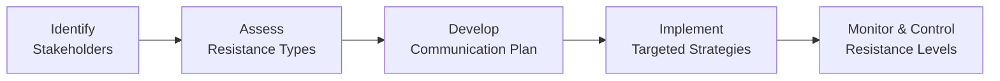

## 30.3 Stakeholder Resistance, Communication, and Adoption

Stakeholder buy-in and support are vital for any project’s success. No matter how effective a project plan might be or how innovative the solution appears, resistance from key stakeholders can derail progress, derail implementation, and threaten the project’s overall viability. This section explores the origins of stakeholder resistance, strategies for effective communication, and proven methods to foster adoption. By understanding these practical insights, project managers can cultivate stakeholder engagement, navigate potential conflicts, and ultimately deliver higher value to the organization.

Effective stakeholder management involves more than simply sending out status updates: it requires intentional, targeted messaging, ongoing education or training, and mechanisms for receiving and integrating feedback. This chapter highlights skills and practical frameworks you can use to handle hesitation or pushback, ensuring a smoother path toward realization of project benefits.

---

## Understanding Stakeholder Resistance

Stakeholder resistance manifests in different forms—ranging from subtle hesitations to outright refusals to collaborate. Before deploying any communication or adoption plan, it is essential to understand why stakeholders resist in the first place.

• Fear of Change: One of the most common drivers of resistance is apprehension about how the project or new initiative will change established routines, processes, or roles.  
• Perceived Loss of Power: When stakeholders feel that their authority, autonomy, or status might be threatened, they may build defensive barriers to preserve their influence.  
• Unclear Benefits: If a project’s advantages are not clearly articulated—or if stakeholders do not see personal or organizational value—they are less likely to engage.  
• Lack of Trust: Historical grievances with previous projects or skepticism about leadership integrity can cause mistrust. If trust is low, stakeholders may question the project’s motives.  
• Cultural and Organizational Factors: Deep-seated cultural norms within an organization often shape how readily individuals welcome change, particularly in hierarchical or siloed cultures.  

Knowing these underlying causes helps project teams tailor their communication strategies and more empathetically approach those who might initially be reluctant to support a project.

---

## Common Types of Stakeholder Resistance

Resistance can be categorized in varied ways, but recognizing the patterns commonly observed helps in formulating response strategies.

Passive Resistance  
Stakeholders who show passive resistance may not openly contest the project but avoid contributing to discussions, miss meetings, or fail to provide necessary information. They may appear indifferent or “too busy,” erecting invisible barriers that hamper progress.

Active Resistance  
Active resistance is more direct and can manifest in negative lobbying, open criticism in meetings, or direct attempts to block project resources or support. These stakeholders may openly question project value or impede decision-making processes.

Systemic Resistance  
Systemic resistance arises from organizational constraints, processes, or cultural norms. Large, rigid organizations often have bureaucratic systems that slow decision-making. These systemic barriers can trigger friction or bottlenecks, despite individual stakeholders’ best intentions.

By detecting signs of each type of resistance, project managers can adapt the strategies outlined in this chapter to convert adversarial or indifferent stakeholders into active participants.

---

## The Role of Communication in Overcoming Resistance

Effective communication sits at the heart of mitigating stakeholder resistance. Communication is not just about transmitting information; it is a two-way exchange intended to build trust, manage expectations, and foster alignment with the project’s goals. This involves proactive listening, empathy, and the ability to adapt your messaging to the unique needs of each stakeholder or stakeholder group.

### Key Communication Principles

Clarity  
Communicate with simplicity, ensuring that any jargon or technical details are explained if the audience is not intimately familiar with them. Complex or ambiguous language can fuel confusion or mistrust.

Consistency  
Maintain consistent messages throughout the project. Contradictory updates cause frustration, while stable narratives cultivate an environment of reliability and psychological safety.

Timeliness  
Provide updates promptly so that rumors or misinformation cannot fill the knowledge gap. Delays in communication can compound skepticism.

Tailoring the Message  
Different stakeholder groups care about different aspects. For example, executive leadership may care about Return on Investment (ROI) or strategic fit, whereas frontline employees may worry about job impacts and day-to-day tasks. Custom-fit communications keep each group’s priorities in focus.

Feedback Loops  
Create open channels where stakeholders can share concerns, ask for clarifications, and suggest improvements. A vibrant feedback loop not only uncovers hidden issues but also fosters a sense of ownership among stakeholders.

---

## Tools and Techniques for Tailored Communications

An effective stakeholder communication plan often includes multiple tools and techniques to penetrate barriers and encourage genuine dialogue.

• Stakeholder Engagement Matrix: Plot stakeholders based on their interest and influence. This helps in determining which stakeholders require in-depth engagement plans.  
• Persona Mapping: Create stakeholder personas representing groups with shared attitudes and needs. This helps craft targeted messages that speak directly to each group’s concerns.  
• Key Message Architecture: Develop a concise message framework that outlines the core project value propositions for each stakeholder type.  
• Communication Channels: Use various platforms—emails, in-person meetings, instant messaging channels, or interactive town halls—depending on audience preferences and organizational culture.  
• Frequent Touchpoints: Short, frequent updates are often more effective than lengthy, infrequent reports.  

Despite meticulous planning, a communication plan is never static. Ongoing stakeholder feedback should steer continuous refinements in both content and channel usage.

---

## Influencing Stakeholder Adoption: A Process Focus

Gaining stakeholder adoption is an ongoing process. By focusing on iterative steps, project managers can foster sustainable buy-in over the entire project lifecycle.

Explanation of Diagram Steps:

• Identify Stakeholders: Use stakeholder registers and organizational charts to understand who is impacted and has the power to influence.  
• Assess Resistance Types: Evaluate the nature, scale, and likely drivers of their resistance.  
• Develop Communication Plan: Formulate outreach plans, mediums, and frequency based on each stakeholder’s preferences and project significance.  
• Implement Targeted Strategies: Engage in meaningful dialogue, training sessions, or workshops that address each stakeholder’s concerns.  
• Monitor & Control Resistance Levels: Continuously gauge engagement, track shifting sentiments, and respond by adapting your communication plans.

---

## Best Practices to Minimize and Overcome Resistance

Early Clarity of Project Vision  
Design a compelling project vision that resonates with stakeholders. They need to understand why the change is happening, how it benefits them (or the organization), and what the future state looks like. Vision statements contextualize day-to-day efforts, encouraging unity.

Engage Key Influencers  
Identify influential stakeholders or thought leaders with a positive outlook on the project. Their endorsement boosts credibility and helps “normalize” the change to more resistant pockets of the organization.

Leverage Emotional Intelligence  
Empathy, self-awareness, and interpersonal skills stand out as powerful levers for reducing tension and building relationships. Being attuned to the emotional climate allows you to anticipate and address anxieties, fostering stronger bonds with hesitant stakeholders.

Acknowledge Concerns Publicly  
Publicly acknowledging legitimate worries signals respect and transparency. This can be as simple as dedicating part of a project meeting to address recurring concerns, or scheduling dedicated feedback sessions.

Demonstrate Quick Wins  
Show tangible achievements early on. When stakeholders see real, positive outcomes—even if modest—skepticism recedes. Early success builds momentum for larger, more complex changes.

---

## Case Study: Launching a New ERP System

Consider a mid-sized manufacturing organization migrating to a new enterprise resource planning (ERP) system. Stakeholders across supply chain, accounting, warehouse management, and production teams will be directly impacted. Resistance is nearly guaranteed if the project does not thoughtfully address concerns and continuously communicate.

• Initial Feedback Sessions: Before finalizing the project plan, the project manager organizes listening sessions. During these sessions, employees voice concerns about the training burden and fear that the new system will simply create more workload.  
• Communication Plan: Tailored updates are sent to each functional area, emphasizing the direct benefits relevant to them. For example, the warehouse team receives examples of streamlined shipping processes and better inventory accuracy.  
• Training Workshops: Hands-on sessions allow employees to practice the new system, providing a safe space to make mistakes and ask difficult questions.  
• Pilot and Quick Wins: The system is first rolled out in a smaller department to gain early successes. Testimonials from these early adopters are shared widely, reassuring other departments that the system works.  
• Ongoing Feedback Loop: A dedicated support channel exists for reporting issues, with prompt resolutions to sustain trust and highlight the project team’s responsiveness.

Ultimately, by using communication strategies tailored to each stakeholder group, training resources to build confidence, and demonstrating incremental successes, the ERP system rolls out with minimal disruptions and robust adoption.

---

## Handling Hesitations and Pushback

While much of stakeholder management focuses on preventing resistance, project managers must still be prepared to handle it when it arises—whether in the form of pointed questions in a steering committee or a potential boycott from a department.

Reframing Negative into Constructive Feedback  
When encountering criticism, reframe it as a “suggestion for improvement.” A stakeholder who complains about certain features might genuinely be highlighting a flaw. A shift in language from “complaint” to “feedback” can help turn an adversarial stance into a co-creative approach.

Negotiating and Finding Common Ground  
Sometimes, conflicts arise from competing priorities or scarce resources. Project managers need negotiation skills to strike compromises that protect critical requirements and still address stakeholder concerns.

Inviting Skeptics into Smaller Working Groups  
Resistant stakeholders often become project champions once they feel that their voices shape the future solution. Including skeptics in pilot groups or advisory committees fosters a sense of ownership and changes their role from critic to co-creator.

Escalation Paths  
For high-impact stakeholders who remain resistant despite repeated engagement, define an escalation path that involves senior leadership or governance boards. This step is typically reserved for serious roadblocks and should be used judiciously.

---

## Training and Ongoing Support for Sustainable Adoption

Even the best communication strategies are insufficient if stakeholders lack the skills, tools, or resources to operate within the new processes. Investments in training programs, job aids, and ongoing coaching are essential for ensuring that adoption does not fade once the novelty of the new project diminishes.

Structured Training Sessions  
Conduct role-based training rather than generic modules. Relevance is key—a finance manager needs more in-depth training on budgeting functionalities, for instance, while a product team lead may require deeper insights on product lifecycle management.

User Guides and Role-Based Checklists  
Concise, easy-to-follow reference materials can reinforce the practical skills needed to operate new tools or follow new processes. Updates to these documents should be quick and accessible to reflect iterative improvements or adjustments.

Post-Implementation Support Desk  
High resistance often stems from fear of “not knowing what to do” after the system officially goes live. A dedicated support channel—whether via online chat, email, or phone—offers stakeholders a safety net when they encounter problems.

Coaching and Mentorship Programs  
Pair more experienced or enthusiastic adopters with colleagues who are still struggling. Peer-to-peer learning helps break down reluctance, using a support system built on empathy and shared professional experience.

---

## Gauging and Improving Adoption Levels

Ensuring stakeholder adoption is a dynamic process. Monitoring and assessing adoption levels enable project managers to course-correct along the way.

Adoption Metrics  
• Usage logs of a new software solution (e.g., login frequency, feature usage)  
• Customer satisfaction surveys or stakeholder feedback forms  
• Rate of “How-To” queries or help-desk calls  
• On-time completion of tasks tied to the new process  

Intervention Techniques  
• Additional training or refresher sessions for teams falling below certain usage thresholds  
• Targeted coaching for departments with particularly high error rates or repeated complaints  
• Celebrations of departmental “best adopters” to reinforce positive behaviors  

When a project manager sees low or declining adoption in any group, they can investigate to unearth the drivers, respond promptly with corrective measures, and gradually shift the adoption curve upward.

---

## Leveraging Organizational Change Frameworks

While PMBOK® offers guidelines for stakeholder management, several well-known change management frameworks complement these approaches by focusing more heavily on the human side of change:

• Prosci ADKAR Model: Emphasizes five building blocks of successful change—Awareness, Desire, Knowledge, Ability, and Reinforcement.  
• Kotter’s 8-Step Process: Encourages establishing urgency, building coalitions, and anchoring changes in corporate culture.  
• Lewin’s Change Model (Unfreeze–Change–Refreeze): Structures the shift from current to desired states in a three-step sequence, focusing on mindset and cultural transformation.  

Adopting or customizing these frameworks helps unify the organizational elements, ensuring that beyond simple project tasks, the human aspects are well-managed.

---

## Overcoming Cultural and Geographical Barriers

In large or multinational organizations, stakeholder groups may be dispersed across different locations or cultures. Strategies that work in one region may backfire in another due to differences in language, business norms, or cultural values.

Localized Communication Plans  
Use local languages and culturally appropriate examples in training materials, especially if offices are geographically dispersed. Encouraging local teams to adapt materials can improve clarity and acceptance.

Time Zone Flexibility  
When conducting virtual meetings or training, rotate session times to accommodate different regional schedules. Resentment quickly builds if one region is consistently asked to attend calls outside normal business hours.

Cultural Sensitivity  
Be aware of hierarchy, deference, or collectivism in certain cultures. Communication methods that rely heavily on open dissent or confrontation could undermine trust. Consider working through respected community leaders or liaisons.

Political and Regulatory Context  
In some countries, data privacy regulations or labor laws can add complexity to proposed changes. Be sure to factor in any local compliance requirements that stakeholders may be legally obligated to uphold. Collaboration with legal or compliance teams fosters clarity.

---

## Strategies to Sustain Long-Term Adoption

Even when stakeholder adoption seems successful at project completion, sustaining that success requires vigilant effort:

Continuous Improvements  
Collect feedback well beyond the official project close-out. Stakeholders’ usage patterns and performance data can reveal additional enhancements that maintain momentum.

Periodic Refreshers  
Schedule refresher workshops or monthly “Ask Me Anything” (AMA) sessions to ensure knowledge retention. People forget new procedures if they are not reinforced at key intervals.

Reward and Recognition  
Publicly acknowledging individuals or teams who serve as exemplary adopters helps maintain a positive social norm. Recognition can be as simple as a digital badge or as formal as an internal award ceremony.

Integrate Adoption Metrics into Performance  
In some organizations, ensuring that employees properly utilize new tools or processes becomes a formal performance objective. That creates both accountability and an incentive for alignment with project outcomes.

---

## Potential Pitfalls and How to Avoid Them

• Overwhelming Stakeholders with Excessive Information: Provide only the necessary, relevant information. Too many details can discourage individuals from engaging with the material.  
• Neglecting Influential Detractors: Identify negative “opinion leaders” early on. Leaving them unaddressed can fuel pockets of resistance that quietly undermine adoption efforts.  
• Underestimating the Time Required for Adoption: Changing entrenched habits takes time, especially in large organizations. Realistic schedules with phased rollouts help manage expectations.  
• Inconsistent Sponsorship: If sponsors or executives send mixed signals about the project’s priority, stakeholders may hesitate to fully commit.

By proactively recognizing and steering clear of these pitfalls, project managers can preserve stakeholder trust and pave the way for successful, enduring adoption.

---

## References for Further Exploration

• Project Management Institute (PMI). A Guide to the Project Management Body of Knowledge (PMBOK® Guide) – Seventh Edition.  
• PMIstandards+: Online resource offering extended practice guidance on stakeholder engagement, risk optimization, and agile practices.  
• Kotter, John P. Leading Change. Harvard Business School Press.  
• Prosci. “ADKAR: A Model for Change Management.” Prosci Learning Center.  
• PMI. Agile Practice Guide.  
• Schein, Edgar H. Organizational Culture and Leadership.

These references provide deeper insights into frameworks, leadership strategies, and real-life case studies to refine your expertise in diminishing stakeholder resistance and boosting adoption.

---

## Mastering Stakeholder Resistance, Communication, and Adoption Quiz



### Which of the following is a common driver of stakeholder resistance?
- [x] Fear of change
- [ ] Overreliance on data analytics
- [ ] Limited project resources
- [ ] Irrelevant reporting dashboards

> **Explanation:** One of the most common reasons stakeholders resist a project is fear of change—whether that involves uncertainty about new processes or perceived threats to status and influence.

### What is passive resistance?
- [x] When a stakeholder quietly avoids engagement or support
- [ ] When a stakeholder explicitly opposes the project goals in meetings
- [ ] When the organizational system obstructs progress
- [ ] When the project manager refuses stakeholder involvement

> **Explanation:** Passive resistance is often subtle and includes behaviors like missing meetings, withholding information, or presenting a facade of support without actual follow-through.

### Which communication principle focuses on delivering the same core message throughout the project lifecycle?
- [ ] Timeliness
- [ ] Feedback loops
- [x] Consistency
- [ ] Clarity

> **Explanation:** Consistency means maintaining a stable, uncontradicted message that helps limit confusion and solidify trust among stakeholders.

### What is the primary benefit of including skeptics in smaller project workgroups?
- [x] Encourages them to become co-creators and reduces their resistance
- [ ] Ensures they continue to escalate concerns to senior leadership
- [ ] Frees up the project manager to focus on other tasks
- [ ] Prevents them from sharing knowledge with the rest of the organization

> **Explanation:** By involving skeptical stakeholders in the decision-making and problem-solving process, you elevate their sense of ownership and drastically reduce their inclination to resist.

### Which of the following illustrates a quick win to reduce stakeholder resistance?
- [x] Implementing a limited pilot in a small department and sharing positive outcomes
- [ ] Delaying the rollout until organization-wide training is completed
- [x] Releasing corporate-wide reports only at the project completion phase
- [ ] Emphasizing only the long-term goals without short-term accomplishments

> **Explanation:** Achieving small victories early on provides tangible evidence of the project’s value and can convert skeptics into supporters.

### Which technique is most useful for discovering a stakeholder’s true concerns?
- [x] Organized feedback loop, such as open Q&A sessions
- [ ] Broadcasting more email updates to every team
- [ ] Mandating 100% compliance in a top-down announcement
- [ ] Implementing immediate punitive measures for non-adopters

> **Explanation:** Creating open channels for feedback enables stakeholders to voice their concerns directly and increases the project manager’s understanding of the underlying issues.

### What is an advantage of role-based training sessions?
- [x] They ensure the content is directly relevant to individual participants’ day-to-day tasks
- [ ] They limit interaction among different functional teams
- [ ] They primarily address highly technical aspects for executives only
- [ ] They speed up project closure by skipping advanced topics

> **Explanation:** Tailoring training to each role’s specific duties increases relevance, reduces confusion, and fosters a sense of immediate applicability, thus enhancing adoption.

### How can a lack of trust contribute to stakeholder resistance?
- [x] Stakeholders may doubt the project’s motives and choose not to cooperate
- [ ] Stakeholders will volunteer for additional responsibilities
- [ ] Stakeholders automatically sponsor the project’s objectives
- [ ] Stakeholders prefer to learn advanced communication skills

> **Explanation:** If trust is low, stakeholders question the intention behind any project or change and are more inclined to resist or remain detached.

### Which scenario best demonstrates systemic resistance?
- [x] Slow project approvals due to bureaucratic decision-making structures
- [ ] A stakeholder verbally opposing the new scheduling system
- [ ] A team lead ignoring meeting invitations
- [ ] A sponsor praising the project during kickoff

> **Explanation:** Systemic resistance arises from organizational processes, structures, or norms that hamper swift decision-making or collaboration, rather than personal or departmental objections.

### True or False: Recognizing early signs of passive resistance can help the project manager address stakeholder concerns before they escalate.
- [x] True
- [ ] False

> **Explanation:** Spotting indicators of passive resistance early allows the project manager to proactively engage resistant stakeholders, preventing more serious conflict down the line.



---

## PMP Mastery: 1500+ Hard Mock Exams with Full Explanations 

Looking to crush the PMP exam with confidence? Dive deep into 6 rigorous mock exams totaling 1500+ advanced-level questions, each accompanied by clear, step-by-step explanations. Hone your test-taking strategies, master complex topics, and build the resilience you need on exam day. Perfect for serious PMs aiming beyond fundamentals.  

Enroll now:  
[PMP Mastery: 1500+ Hard Mock Exams with Exceptional Clarity & Full Explanations](https://www.udemy.com/course/pmp-2025/?referralCode=CF83A54BC86BE27F9AFE)

_Disclaimer: This course is not endorsed by or affiliated with the PMI examination authority. All content is provided purely for educational and preparatory purposes._
