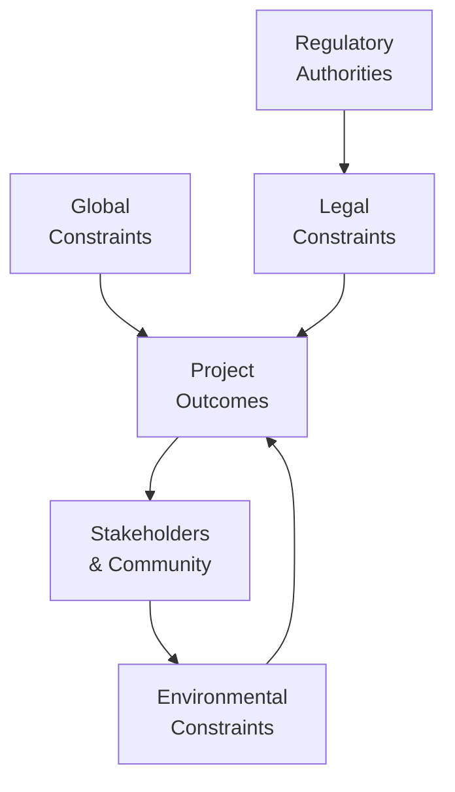

## 31.1 Global, Legal, and Environmental Constraints

In a world where markets, societies, and environmental expectations intersect more rapidly than ever before, project managers must navigate an array of global regulations, legal requirements, and sustainability mandates to ensure ethical and successful outcomes. Effective compliance demands knowledge of country-specific laws, international standards, industry regulations, cultural considerations, and ecological impacts. Failing to address these multifaceted constraints can derail even the most promising projects. In this section, we explore how these constraints shape project scope, timelines, costs, and stakeholder expectations, offering actionable insights and strategies to manage them with confidence.

### Understanding the Scope of Global, Legal, and Environmental Constraints

Global constraints refer to requirements and pressures exerted by international agreements, cross-border trade regulations, and market entry requirements. Legal constraints encompass statutory, regulatory, and contractual obligations set by governmental bodies, industry associations, or internal policies. Environmental constraints emerge from sustainability regulations, public or stakeholder pressure, and corporate social responsibility commitments. Project managers—especially those who operate in multiple jurisdictions—should proactively account for these factors to mitigate risks, reduce liabilities, and enhance project outcomes.

Key drivers include:
• Rapid globalization and international trade.  
• Governmental regulations, such as health and safety norms or data privacy laws like GDPR.  
• Industry standards that often evolve faster than legislation.  
• Shifting stakeholder expectations around sustainability, spurred by global movements for ecological responsibility (e.g., the Paris Agreement).  

### The Impact on Project Boundaries

Legal, global, and environmental constraints elevate a project’s complexity by influencing all major areas, from procurement (Chapter 23) to risk management (Chapter 22). Because constraints typically define the non-negotiable criteria for project acceptance, they have a direct bearing on total project cost, timeline, resource allocation, and deliverable quality. Project managers must ensure these constraints are captured in both the Project Charter and the Project Management Plan (Chapter 15) to avoid scope creep, cost overruns, and compliance issues.

#### Compliance and Strategic Alignment

In Chapter 28, we reviewed how projects must align with overarching organizational strategies. Regulatory requirements are equally critical to consider at a strategic level. Non-compliance can lead to reputational damage, hefty fines, or even termination of a project. By integrating these constraints from the outset, organizations foster robust risk management strategies (Chapter 14 and Chapter 22) and ensure alignment with environmental, social, and governance (ESG) goals or the triple bottom line (people, planet, and profit).

### Key Global Mandates and Examples

Understanding major global mandates and agreements provides project teams with the backdrop for compliance:

• United Nations (UN) Sustainable Development Goals (SDGs): A collection of 17 goals aimed at eradicating poverty, protecting the planet, and ensuring prosperity. Organizations that support the SDGs often integrate them into corporate project portfolios.  
• Paris Agreement (2015): Focuses on reducing greenhouse gas emissions and keeping the global temperature increase well below 2°C. Projects with significant carbon footprints (e.g., heavy manufacturing) must consider these targets.  
• World Trade Organization (WTO) Agreements: Impact trade policies and tariffs, which can affect material procurement and cross-border resource movement.  
• Basel Convention: Regulates the transboundary movements of hazardous wastes and resources.  

### Legal Constraints: Common Statutes and Regulatory Bodies

Legal constraints vary by industry and region. Some concerns have become near-universal for project managers, including:

• Data Privacy and Security: Regulations like the EU’s General Data Protection Regulation (GDPR) significantly shape IT infrastructure projects, restricting data transfer and enforcing specific data protection measures.  
• Anti-Bribery and Corruption Laws: The U.S. Foreign Corrupt Practices Act (FCPA) and the UK Bribery Act impose strict guidelines on how organizations conduct business abroad, especially in procurement, contract negotiations, and stakeholder engagement (Chapter 7).  
• Worker Health and Safety: Guidelines such as OSHA (in the U.S.), the European Framework Directive on Safety and Health at Work, and ILO conventions. Non-compliance can gravely impact project risk profiles and the welfare of human resources (Chapter 21).  
• Environmental Protection Laws: On both local and global scales, laws dictate emissions, resource usage, and pollution controls. Examples include the U.S. Clean Air Act, the EU’s REACH regulation, or local protective statutes for endangered species.  

### Environmental Constraints: Sustainability and Beyond

Environmental constraints go hand in hand with legal obligations, but they are also driven by corporate sustainability goals, stakeholder demands, and ethical imperatives. These constraints can manifest in restricted resource usage, mandates for recycling or reusing materials, carbon footprint targets, or specialized disposal processes for hazardous waste. Organizations must consider these factors throughout the project life cycle—particularly during scope definition (Chapter 17) and risk planning (Chapter 22).

#### Beyond Compliance: Corporate Social Responsibility (CSR)

For many organizations, compliance alone is insufficient. Modern stakeholders and shareholders expect proactive stewardship. CSR initiatives demand voluntary adherence to environmental and social standards that surpass minimal legal requirements. This evolving context calls for project managers to:
• Integrate ethical decision-making into daily practices.  
• Encourage transparency with sustainability reporting.  
• Foster a culture of ecological and social responsibility within project teams.  

### Case Study: Renewable Energy Expansion

Consider a multinational energy company embarking on a wind farm installation. The project crosses international borders with different environmental permit processes. Various constraints apply:

• Local wildlife protection laws that require in-depth ecological impact studies.  
• International carbon offset norms that must be integrated into the cost-benefit analysis.  
• Stringent labor laws to protect workers during the turbine installation procedures.  
• Need for stakeholder engagement strategies to address concerns from local communities and indigenous groups (Chapters 7 & 16).  

Failing to secure timely permits or to address local community concerns could cause lengthy project delays or cancellation. By planning thoroughly, the project manager can ensure compliance and streamline timelines, positioning the project for long-term success.

### Strategies for Compliance and Risk Mitigation

1. Early and Ongoing Regulatory Assessment  
   • Conduct a thorough initial regulatory assessment at project initiation.  
   • Revisit these regulations at every major phase review or iteration to keep pace with any new legislation.  

2. Stakeholder Engagement and Communication  
   • Identify and engage regulators, legal advisors, and environmental authorities early.  
   • Maintain transparent communication channels with all stakeholders (Chapter 16).  

3. Dedicated Compliance Team or Role  
   • Appoint a dedicated compliance manager or team to monitor ongoing legal developments, track environmental metrics, and coordinate with relevant authorities.  
   • Integrate the compliance function into the risk register, ensuring that legal and environmental risks receive regular attention.  

4. Tailored Project Management Methodologies  
   • For projects dealing with extensive reception/inspection processes, a predictive life cycle (Chapter 9) may offer better risk management.  
   • For technology or innovation-driven projects in fast-evolving legal environments, hybrid or agile approaches facilitate quicker adaptation.  

5. Use of Specialist Tools and Templates  
   • Legal compliance trackers (e.g., Gantt charts layered with milestone compliance checks).  
   • Environmental audits integrated into project milestones (Chapter 41).  
   • Contract clauses that explicitly define responsibilities for regulatory updates (Chapter 23).  

6. Continual Learning and Training  
   • Encourage professional development to stay updated with relevant laws, especially those subject to frequent changes, such as data privacy and trade laws.  
   • Collaborate with internal and external subject matter experts for specialized insights, particularly for environmental regulations that vary by region.  

### Common Pitfalls and How to Avoid Them

• Underestimating Cultural Nuances: In global projects, legal constraints may have cultural underpinnings. For instance, certain labor practices allowed in one location may be strictly scrutinized in another.  
• Ignoring Local Permitting Processes: Smaller local authorities may require additional permits or impose unique guidelines. Neglecting these can stall progress.  
• Overlooking Political Volatility: Shifts in political leadership often trigger changes in policies and laws. Incorporating buffer time and alternative strategies is crucial.  
• Failing to Engage Legal Counsel Early: To reduce rework, it is best to consult specialists before finalizing key project decisions or contractual obligations.  
• Relying on Outdated Documentation: Legal frameworks and environmental standards can evolve quickly. Relying on last year’s compliance checklist can be insufficient.  

### Tools and Frameworks

Below is a simplified conceptual diagram representing some core pillars and their relationships in managing global, legal, and environmental constraints:

• Global Constraints typically encompass cross-border regulations, international trade agreements, and cultural considerations.  
• Legal Constraints focus on statutory, contractual, and professional obligations that form the baseline for compliance.  
• Environmental Constraints address sustainability goals, carbon reduction targets, and natural resource conservation.  
• Project Outcomes are heavily influenced by how effectively these three pillars are integrated and managed.  
• Regulatory Authorities set and enforce compliance criteria; they connect closely with legal requirements.  
• Stakeholders & Community influence and are affected by environmental outcomes, driving sustainability expectations.  

### Recommended Practices for Sustainable and Compliant Projects

• Establish Clear Project Governance: Ensure a governance structure in which compliance objectives are clearly defined, measured, and reported to the project sponsor or steering committee (Chapter 4).  
• Integrate Environmental Impact Assessments: Conduct a thorough environmental impact assessment (EIA) as part of the feasibility study. This ensures that environmental hazards, biodiversity impacts, and carbon footprints are identified early.  
• Adopt Integrated Change Control Processes: Include compliance and environmental experts on the Change Control Board (Chapter 15). Even small project changes can alter compliance obligations.  
• Document Lessons Learned: Each region and project environment may present unique legal requirements. Capture these experiences for future reference (Chapter 11).  
• Leverage International Standards: Frameworks like ISO 14001 (environmental management systems) or ISO 9001 (quality management) can structure your compliance and environmental accountability.  

### Real-World Example: Pharmaceutical Manufacturing

A pharmaceutical manufacturing project in multiple countries must adhere to the following constraints:

• Good Manufacturing Practices (GMP): Mandated by the World Health Organization (WHO) and local health authorities.  
• Intellectual Property (IP) Laws: Vary widely; exports to certain regions may be constrained by patent laws.  
• Temperature-Controlled Supply Chain: Environmental constraints on shipping to protect product efficacy.  
• Waste Disposal Regulations: Strict guidelines to handle chemical or biological waste.  

These constraints intersect with schedule management (Chapter 18) to ensure that each production phase meets legal inspections and testing milestones. The project manager must also maintain robust communication channels among internal stakeholders, third-party contractors, and legal advisors to consolidate compliance efforts.

### Collaboration with Legal Experts and Regulators

When complexities escalate, direct communication with regulators and legal experts can fast-track decision-making. Early involvement of legal and regulatory experts helps the project team validate assumptions, refine risk responses, and ensure no critical steps are overlooked. This collaboration is particularly salient in emergent legal contexts such as data privacy or evolving environmental standards.

### Cost-Benefit Analysis of Compliance

Project managers may perceive compliance as a cost driver. However, non-compliance can be far more expensive due to fines, enforced project shutdowns, or reputational harm. A cost-benefit analysis (CBA) should be integrated into the early project phases:

| Cost Factor                   | Benefits of Compliance               | Potential Risks of Non-Compliance       |
|------------------------------|--------------------------------------|-----------------------------------------|
| Additional Legal Expertise   | Minimizes legal challenges           | High legal fees from litigation         |
| Environmental Impact Studies | Strengthens stakeholder trust        | Project delays due to protests          |
| Specialized Equipment        | Potential for eco-friendly branding  | Fines for violating laws                |
| Extended Timeline            | Increased transparency and stability | Forced cessation by regulatory bodies   |

### Emerging Trends and Future Outlook

1. Rapid Regulatory Changes: As technology evolves, policymakers are updating laws frequently, especially in cybersecurity and AI.  
2. Carbon Counting Tools: Growing focus on greenhouse gas tracking metrics, integrated into Earned Value Management (Chapter 13).  
3. Globalization of Data: Projects must comply with a web of privacy laws (e.g., CCPA, GDPR, PIPEDA), requiring advanced data governance solutions.  
4. ESG Investing: Investors increasingly weigh environmental and social performance, making compliance not only mandatory but also a competitive advantage.  

### Conclusion

Global, legal, and environmental constraints shape every stage of a project’s lifecycle, demanding careful planning, ongoing vigilance, and robust governance. Effective compliance management not only safeguards against legal ramifications but also positions organizations as ethical and sustainable leaders—an advantage in competitive markets. By incorporating these constraints directly into the project plan, risk registers, and stakeholder engagement processes, project managers can ensure alignment with broader corporate strategies while nurturing long-term viability and success.

---

## Test Your Knowledge: Global Regulations, Legal Risks, and Sustainability



### Which of the following best describes a global constraint in project management?

- [ ] A limitation imposed solely by the project organization's internal policies.
- [x] A regulation, agreement, or condition that applies across multiple nations or regions.
- [ ] An internal performance metric established by project leadership.
- [ ] A cost-related constraint tied to resource availability.

> **Explanation:** Global constraints typically span more than one country's legal or regulatory framework, affecting how a project plans and executes across borders.

### When managing data privacy in a multinational project, which regulation is most commonly referenced for handling personal data in the European Union?

- [ ] OSHA
- [x] GDPR
- [ ] ISO 27001
- [ ] FCPA

> **Explanation:** GDPR (General Data Protection Regulation) is a key EU privacy law that imposes stringent data handling and protection requirements on organizations operating in or targeting the EU.

### One reason to integrate environmental considerations into the project scope early is:

- [ ] Reducing scope to save money later.
- [x] Identifying potential costly environmental issues and mitigating them from the start.
- [ ] Avoiding communication with stakeholders to minimize conflicts.
- [ ] Increasing project complexity without reason.

> **Explanation:** Proactively considering environmental regulations, sustainability goals, and eco-friendly measures at the initial stages helps prevent costly retrofits, rework, or legal complications down the line.

### Which of the following scenarios can cause major project delays due to environmental constraints?

- [x] Delayed ecological studies preventing site clearance.
- [ ] Accelerated procurement of standard office supplies.
- [ ] Use of a widely accepted project management methodology.
- [ ] Insufficient training for software developers.

> **Explanation:** If a project requires environmental permits or ecological impact analyses, any delay in completing those studies or obtaining approval can significantly stall project progress.

### What is the primary focus of Corporate Social Responsibility (CSR) in projects?

- [x] Going beyond minimum legal requirements to positively impact society and the environment.
- [ ] Reducing project costs by negotiating with suppliers.
- [x] Encouraging minimal stakeholder engagement to streamline processes.
- [ ] Delaying regulatory compliance until project closure.

> **Explanation:** CSR extends beyond mere compliance; it involves voluntarily upholding ethical, social, and environmental standards that benefit society, environment, and stakeholders over the long run.

### Which global agreement aims to keep the rise in global temperature below 2°C and requires participating countries to reduce greenhouse emissions?

- [x] The Paris Agreement
- [ ] WTO Agreement
- [ ] Kyoto Protocol
- [ ] Basel Convention

> **Explanation:** The Paris Agreement (2015) binds participating nations to climate action with the specific goal to keep global temperature rise well below 2°C relative to pre-industrial levels.

### The best approach when dealing with multiple regulatory authorities with overlapping jurisdictions is to:

- [x] Engage each relevant authority early and maintain clear, transparent communication channels.
- [ ] Assign a single, low-level team member to handle all regulatory communication without escalation.
- [x] Ignore potential conflicts among authorities to avoid complicating scope.
- [ ] Rely on third-party audits exclusively to ensure compliance.

> **Explanation:** Proactively engaging all regulatory authorities and maintaining transparency ensures that no conflicting requirements or last-minute surprises derail the project.

### Which type of contract clause is especially important in dynamic legal environments?

- [x] A clause for addressing changes in regulations or new obligations.
- [ ] A clause removing the vendor’s responsibility for technical defects.
- [ ] A confidentiality clause applicable only to the project sponsor.
- [ ] A time zone clause that prioritizes meeting schedules.

> **Explanation:** In fast-changing regulatory environments, it is crucial to have a provision to handle newly introduced laws or changes in existing laws, allowing for adjustments in scope, cost, or schedule as needed.

### Why should project managers document lessons learned on regulatory compliance?

- [x] Because each region’s regulatory environment may present unique challenges that inform future projects.
- [ ] Because it is mandatory by the PMI Code of Ethics.
- [ ] Because it is the only requirement for project closure.
- [ ] Because it replaces environmental impact assessments.

> **Explanation:** Collecting lessons learned helps teams adapt strategies and processes for unique regional or environmental regulations, improving overall organizational knowledge.

### A project manager’s cost-benefit analysis should weigh which of the following factors regarding compliance?

- [x] The potential risks of non-compliance fines versus the cost of meeting regulatory needs.
- [ ] Only the project’s marketing expenses for sustainability pledges.
- [ ] The cost of reassigning project team members without timeline impacts.
- [ ] The intangible benefits of breach-of-contract liability.

> **Explanation:** Including both direct and indirect costs associated with compliance and non-compliance is crucial. The long-term benefits of avoiding fines or reputational damage often outweigh the immediate costs of adhering to regulations.



---

## PMP Mastery: 1500+ Hard Mock Exams with Full Explanations 

Looking to crush the PMP exam with confidence? Dive deep into 6 rigorous mock exams totaling 1500+ advanced-level questions, each accompanied by clear, step-by-step explanations. Hone your test-taking strategies, master complex topics, and build the resilience you need on exam day. Perfect for serious PMs aiming beyond fundamentals.  

Enroll now:  
[PMP Mastery: 1500+ Hard Mock Exams with Exceptional Clarity & Full Explanations](https://www.udemy.com/course/pmp-2025/?referralCode=CF83A54BC86BE27F9AFE)

_Disclaimer: This course is not endorsed by or affiliated with the PMI examination authority. All content is provided purely for educational and preparatory purposes._

---
