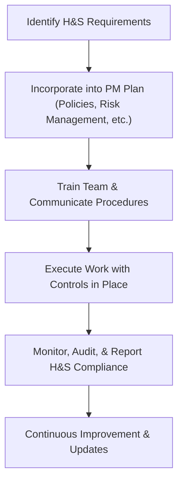

## 31.2 Health and Safety, Data Privacy, and Ethical Standards

Ensuring the safety and wellbeing of people, safeguarding sensitive information, and upholding the highest ethical standards are critical dimensions of modern project management. In many ways, health and safety, data privacy, and ethical standards constitute the moral backbone of any project. No matter the industry—construction, healthcare, information technology, or finance—project leaders must integrate these considerations at every stage of the project life cycle. These topics are no longer “nice-to-have”—they are fundamental compliance issues with far-reaching legal, financial, and reputational consequences, and the PMP® exam now places more emphasis on a project manager’s understanding of such considerations.

This section explores the importance of health and safety legislation, data privacy regulations, and ethical frameworks. You will learn how these areas intersect with project management tasks such as initiation, stakeholder engagement, risk assessment, and change management. We will also investigate how these factors shape the day-to-day realities of managing resources, procuring materials, and ensuring alignment with stakeholder and organizational expectations.

---

### Why Compliance Matters for Project Managers

Within the larger context of Advanced Compliance and Regulatory Considerations, understanding frameworks like ISO standards (e.g., ISO 45001 for occupational health and safety) and privacy regulations such as the General Data Protection Regulation (GDPR) can spell the difference between a smoothly executed project and one riddled with legal obstacles or stakeholder dissatisfaction. Compliance impacts your project’s triple constraints (scope, schedule, cost) by potentially adding requirements and constraints that must be considered from inception to closure. Furthermore, ethical standards in project management—like those embodied in the Project Management Institute’s own Code of Ethics and Professional Conduct—support trust and transparency, two essential qualities for stakeholder satisfaction and sustainable project outcomes.

---

### Health and Safety Considerations

Health and safety should be woven into the very fabric of your project plan. Rather than treating it as a separate compliance add-on, an effective project manager recognizes that health and safety embody a key aspect of risk management, resource planning, and overall project governance.

#### Core Areas of Health and Safety in Projects

• Workplace Safety: Whether you are overseeing a manufacturing project on a factory floor or working in an office environment, implementing protocols like hazard identification, safety training, and clear emergency procedures is crucial. In construction projects, special regulations, such as OSHA in the United States or similar frameworks internationally, guide everything from the use of personal protective equipment (PPE) to scaffolding and crane operations.

• Environmental Hazards: In some industries, managing hazardous materials (e.g., chemicals, nuclear waste) or working in high-risk environments (e.g., offshore drilling) demands specialized risk assessments. Environmental hazards can also encompass air quality, noise pollution, and proper disposal of waste.

• Mental Health and Wellbeing: Increasingly, health and safety also includes psychological safety and the mental wellbeing of the team. Projects with intense time pressures can create stress for team members. Recognizing warning signs of burnout and offering support are critical to sustaining team morale and performance.

• Contractor and Supplier Safety: If your project involves outsourced or subcontracted services, you must ensure that these external parties also adhere to the same health and safety requirements. Contracts and procurement documents should include conditions that specify safety standards for vendor performance.

#### Key Standards and Regulations

Many jurisdictions have specific legal requirements related to health and safety that must be carefully evaluated at the start of a project. Some commonly referenced standards or regulations include:

• ISO 45001 (Occupational Health & Safety Management System)  
• OSHA (Occupational Safety and Health Administration) guidelines in the U.S.  
• Health and Safety at Work Acts in various countries  
• Industry-specific regulations (e.g., mining, aviation)

Each of these may impose documentation requirements, audits, or certifications. As a project manager, you should collaborate with your organization’s compliance officer or health and safety specialist to tailor these frameworks to your project’s needs. 

#### Integrating Health and Safety into Project Plans

Below is a simplified diagram illustrating how health and safety processes can integrate into a project’s overall management structure:

1. Identify H&S Requirements: Collaborate with health and safety experts to understand relevant laws and standards.  
2. Incorporate into PM Plan: Embed these requirements into your project management plan, especially risk, resource, and procurement arrangements.  
3. Train Team & Communicate Procedures: Educate team members about safety protocols. Provide clear documentation and supportive leadership to enforce the guidelines.  
4. Execute Work with Controls in Place: Mobilize safety measures, personal protective equipment, signage, and other controls to mitigate risks.  
5. Monitor, Audit, & Report: Regularly track safety incidents or near-misses, and run audits to verify compliance.  
6. Continuous Improvement & Updates: Treat health and safety as an ongoing process, not a one-time event. Evaluate lessons learned to enhance future projects.

---

### Data Privacy

As companies and organizations become more dependent on data, protecting sensitive information plays a pivotal role in project success. Mishandled data can lead to hefty fines, reputational damage, and possible legal action. Data privacy considerations apply across industries—from healthcare to finance, e-commerce to government programs. Understanding relevant protections and responsibilities is a fundamental aspect of modern project leadership.

#### Common Data Protection Frameworks

• GDPR (General Data Protection Regulation): Enforced in the European Union, GDPR has international implications because it applies to any entity that processes personal data of EU residents.  
• CCPA (California Consumer Privacy Act) and CPRA (California Privacy Rights Act): U.S. state-level acts that define protections for consumers’ personal data.  
• HIPAA (Health Insurance Portability and Accountability Act): A U.S. act that protects sensitive patient health information.  
• PCI DSS (Payment Card Industry Data Security Standard): A private security standard that ensures credit card and payment-related data is handled securely.  

#### Key Aspects of Data Privacy in Projects

• Data Classification and Inventory: Identify what data your project will collect, process, or store. Develop classification (e.g., confidential, restricted, public) and define handling procedures accordingly.  

• Consent and Rights of Individuals: Some regulations, like GDPR, heavily emphasize obtaining proper consent for data collection and honoring “right to be forgotten” requests. Build procedures to manage these obligations.  

• Retention Policies: Define how long data will be stored and how it should be disposed of when the retention period ends. Align with legal and organizational requirements.  

• Data Security Measures: Use encryption, secure access controls, intrusion detection systems, and regular vulnerability assessments to ensure the confidentiality, integrity, and availability of data.  

• Vendor Management: Similar to health and safety, ensure any third-party partners have robust data protection measures. Thin supply chains often become a critical vulnerability in data breaches.  

#### Data Privacy in an Agile Environment

In Agile or hybrid frameworks, iterative development cycles mean your team might gather and handle user data more frequently for continuous feedback. Ensure that privacy impact assessments are part of each sprint’s review or at least included in iteration planning. Agile teams often work in cross-functional ways with shared repositories, making data security controls (including role-based access) even more crucial.

---

### Ethical Standards

While health and safety and data privacy address concrete regulatory and legal requirements, ethics in project management can be more abstract but no less relevant. Ethical standards guide decision-making and set the tone for corporate culture. They influence everything—from procurement practices and conflict of interest disclosures, to how stakeholders are treated, to the fairness and accuracy of performance reports.

#### PMI Code of Ethics and Professional Conduct

Project Management Institute’s (PMI) Code of Ethics and Professional Conduct revolves around four core values:

• Responsibility: Be accountable for your actions.  
• Respect: Treat people with dignity.  
• Fairness: Maintain impartiality and avoid favoritism.  
• Honesty: Be truthful in all communications and transactions.  

Adhering to these values builds trust and credibility. For a project manager, an ethical lapse—like falsifying schedule data or inflating costs for personal gain—can demolish stakeholder confidence. It can also incur disciplinary actions under local regulations or professional associations.

#### Typical Ethical Dilemmas

• Conflict of Interest: Occurs when personal interests may interfere with professional duties, such as awarding a contract to a family member without a fair selection process.  
• Bribery and Corruption: Accepting or providing undue gifts or payments to influence stakeholder decisions or expedite processes.  
• Biased Reporting: Manipulating data to show artificially favorable results or omitting vital information from status updates.  
• Plagiarism or IP Violations: Using someone else’s work, concepts, or materials without proper attribution or violating IP rights.  

---

### Integrating Compliance into Project Deliverables and Processes

An effective way to ensure your project consistently meets health, safety, privacy, and ethical requirements is by weaving them into your project processes rather than managing them as standalone checklists. Each performance domain—Stakeholder, Team, Development Approach, Planning, Project Work, Delivery, Measurement, and Uncertainty (as discussed in Chapters 7 through 14)—provides an opportunity to embed compliance considerations.

Below is a high-level view of how these compliance areas map to the performance domains:

```mermaid
flowchart LR
    A["Stakeholder Domain"] -->|"Identify Ethical & Legal<br/>Responsibilities to Stakeholders"| B["Team Domain"] 
    B -->|"Implement Health & Safety<br/>Culture and Data Privacy Practices"| C["Development Approach Domain"]
    C -->|"Tailor Approaches to<br/>Compliance Requirements"| D["Planning Domain"]
    D -->|"Incorporate H&S, Data<br/>Privacy, Ethical Standards in Plans"| E["Project Work Domain"]
    E -->|"Enforce Compliance During<br/>Execution & Quality Checks"| F["Delivery Domain"]
    F -->|"Deliver Compliant<br/>Outputs & Documentation"| G["Measurement Domain"]
    G -->|"Monitor Performance &<br/>Compliance Metrics"| H["Uncertainty Domain"]
    H -->|"Assess Regulatory Risks &<br/>Implement Mitigation Measures"| A
```

1. Stakeholder Domain: You may need to engage regulatory bodies or compliance officers as stakeholders.  
2. Team Domain: Train and motivate the team in safe and ethical behavior.  
3. Development Approach Domain: Choose a predictive, agile, or hybrid method that supports real-time compliance monitoring.  
4. Planning Domain: Include safety checklists, data security steps, and ethical guidelines in resource planning and communications.  
5. Project Work Domain: Execute tasks following documented policies and proven best practices; maintain logs of compliance activities.  
6. Delivery Domain: Ensure the final deliverable meets all health, privacy, and ethical requirements.  
7. Measurement Domain: Track metrics such as incident frequency rate (IFR), number of data breaches, or ethical lapses reported.  
8. Uncertainty Domain: Manage compliance-specific risks, including changes in legislation or newly discovered hazards.

---

### Practical Examples and Real-World Scenarios

• Construction Project with Subcontractors: A project manager must confirm that all subcontractors hold their own health and safety certifications, maintain secure data systems for handling project details, and follow the same code of ethics regarding bribery or labor practices. Incorporating these requirements into the procurement process upfront avoids costly rework and legal disputes later.

• Software Development in Healthcare: Processing patient information requires HIPAA compliance in the United States or an equivalent framework elsewhere. The project plan specifies encryption protocols, role-based access, and routine security testing. Ethical considerations may arise if asked to release patient data to third parties without explicit consent.

• Global E-Commerce Initiative: If your project involves collecting customer information from multiple countries, you must be GDPR-compliant, as well as mindful of local data protection laws. This scenario also tests your ethical decision-making when using customer preferences or location data for targeted advertising.

• Conflicts of Interest in Public Sector Projects: A project manager overseeing a government-funded project might receive lobbying or political influence from external parties. Balancing fairness and transparency while respecting local regulations is vital.

---

### Best Practices, Common Pitfalls, and Strategies

**Best Practices**  
• Conduct Early Assessments: Start your health and safety, data privacy, and ethical reviews during project initiation. This allows findings to shape the entire project strategy.  
• Appoint a Compliance Champion: Identify an individual or small team to handle compliance activities, ensuring clarity and accountability throughout the project.  
• Ongoing Training: Offer frequent, updated training. Regulations evolve, and so should your team’s knowledge.  
• Document Everything: Detailed logs of hazards addressed, data handling protocols, and ethical decision-making processes help defend your project in the event of an audit or dispute.  

**Common Pitfalls**  
• Overlooking Small Vendors or Subconsultants: These companies may not have robust compliance practices, inadvertently putting your project at risk.  
• Underestimating Resource Requirements: Health and safety, data privacy, and ethical oversight can require dedicated tools, staffing, and budget.  
• Ignoring Cultural Nuances: Ethical standards and privacy expectations can vary globally. Assumptions about uniform compliance can be detrimental.  
• Reactive Approach: Waiting until a violation occurs invites higher costs and more reputational damage than a proactive stance.  

**Strategies to Overcome Challenges**  
• Integrate with Risk Management: Since risk management processes are already well-defined in project management, adding compliance risks to your risk register ensures visibility and action planning.  
• Leverage Expert Guidance: Work with legal advisors, data protection officers, or specialized consultants. They provide insights on local regulations and industry-specific mandates.  
• Use Tools and Automation: Implement project management software that tracks compliance tasks and sends alerts or reminders, helping to maintain oversight.  
• Foster an Ethical Culture: Set the tone with clear communication about expectations and model integrity in all project communications.

---

### Further Exploration and References

• “Project Management Institute Code of Ethics and Professional Conduct” (PMI):  
  https://www.pmi.org/about/ethics/code  
• ISO 45001: Guidance on establishing an Occupational Health & Safety (OH&S) management system.  
• European Commission GDPR Portal:  
  https://ec.europa.eu/info/law/law-topic/data-protection_en  
• OSHA (Occupational Safety and Health Administration):  
  https://www.osha.gov/  
• HIPAA Guidelines:  
  https://www.hhs.gov/hipaa/for-professionals/index.html  
• PMI’s “Responsible Project Management” articles for further case studies and discussions.  

Consult these resources for more comprehensive coverage of health, safety, data privacy, and ethical practices, especially as they pertain to multi-jurisdictional or complex global projects.

---

## Test Your Knowledge: Health, Safety, and Ethics in Project Management



### Which of the following best describes why thorough health and safety measures are integrated into project management processes?

- [ ] To meet legal requirements only.  
- [x] To protect people, the environment, and project outcomes while minimizing legal and financial risks.  
- [ ] To create additional bureaucratic layers in the project.  
- [ ] To outsource core project responsibilities to safety consultants.  

> **Explanation:** Health and safety measures address more than just minimal legal compliance. They safeguard team members, stakeholders, and the project’s success while reducing liabilities.

### What is the primary purpose of data privacy laws such as GDPR?

- [x] To protect individuals’ personal data and give them more control over how it is used.  
- [ ] To promote the free sale of personal data for marketing.  
- [ ] To encourage companies to store as much personal data as possible.  
- [ ] To limit the scope of risk management in projects.  

> **Explanation:** GDPR focuses on empowering individuals to control their personal data and obliges organizations to handle data responsibly.

### Which of the following values is NOT part of the PMI Code of Ethics and Professional Conduct?

- [ ] Fairness  
- [ ] Respect  
- [x] Profitability  
- [ ] Responsibility  

> **Explanation:** Profitability is a management or business goal but not a core ethical value defined by PMI’s Code of Ethics and Professional Conduct.

### A construction project includes multiple subcontractors. Which practice most effectively ensures consistent adherence to safety protocols?

- [x] Include clear safety requirements in contracts and monitor adherence through regular audits.  
- [ ] Allow each subcontractor to define their own safety standards.  
- [ ] Maintain a single training session only for full-time staff.  
- [ ] Only check compliance after accidents occur.  

> **Explanation:** Specifying comprehensive requirements in contracts and conducting regular safety audits ensures a consistent, proactive approach rather than a reactive one.

### What is one ramp-up activity in an Agile project that helps address data privacy?

- [x] Conducting privacy impact assessments during regular iterations.  
- [ ] Delegating all privacy decisions to an external consultant.  
- [x] Using only manual processes to store data in iteratively designed spreadsheets.  
- [ ]Implementing zero security features until the final sprint.  

> **Explanation:** Privacy impact assessments in each sprint or iteration enable incremental reviews of data handling and security controls, aligning with Agile’s iterative nature.

### Which of the following describes a risk of ignoring ethical guidelines in a project?

- [x] Stakeholder trust and commitment to the project might decrease significantly.  
- [ ] Reduced downtime in project execution.  
- [ ] Faster decision-making and simplified communication.  
- [ ] Lower exposure to regulatory scrutiny.  

> **Explanation:** Ethical breaches can erode trust, which is key to stakeholder support, and potentially increase scrutiny and reputational risk.

### How can project managers best approach incorporating global data privacy regulations into an international project?

- [x] Partner with legal experts familiar with each jurisdiction’s regulations.  
- [ ] Assume all countries have identical regulations.  
- [x] Ignore local laws if the project headquarters is in a permissive state.  
- [ ] Wait until after project execution to address possible compliance issues.  

> **Explanation:** Data privacy laws vary widely. Consulting legal experts ensures country-specific compliance is accurately implemented.

### Why is it critical to embed health and safety considerations into the project risk register?

- [x] It helps identify, prioritize, and manage hazards as part of overall project risk management.  
- [ ] Health and safety should never be included in risk management.  
- [ ] It inflates the risk register for cosmetic reasons.  
- [ ] It guarantees no accidents will occur.  

> **Explanation:** Including health and safety issues in the risk register encourages consistent monitoring and more effective mitigation measures, though it does not guarantee zero incidents.

### What is a practical method of enforcing ethical standards among project team members?

- [x] Establishing and communicating a clear code of conduct, and applying it consistently.  
- [ ] Relying on an ad-hoc approach and word-of-mouth guidelines.  
- [ ] Issuing vague, optional guidelines for top-level staff only.  
- [ ] Ignoring outside stakeholder complaints.  

> **Explanation:** A well-defined code of conduct, backed by leadership enforcement and consistent accountability, is essential for upholding ethical behavior.

### Is it advisable for project managers to treat data privacy concerns as an afterthought if the project has limited budget?

- [x] False  
- [ ] True  

> **Explanation:** Data privacy must be considered a core aspect of overall project scope, especially as regulatory fines and reputational damage can far exceed the initial investment in compliance.



---

## PMP Mastery: 1500+ Hard Mock Exams with Full Explanations 

Looking to crush the PMP exam with confidence? Dive deep into 6 rigorous mock exams totaling 1500+ advanced-level questions, each accompanied by clear, step-by-step explanations. Hone your test-taking strategies, master complex topics, and build the resilience you need on exam day. Perfect for serious PMs aiming beyond fundamentals.

Enroll now:  
[PMP Mastery: 1500+ Hard Mock Exams with Exceptional Clarity & Full Explanations](https://www.udemy.com/course/pmp-2025/?referralCode=CF83A54BC86BE27F9AFE)

_Disclaimer: This course is not endorsed by or affiliated with the PMI examination authority. All content is provided purely for educational and preparatory purposes._
