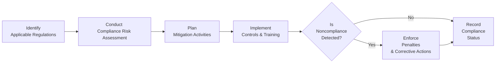

## 31.3 Repercussions of Noncompliance and Mitigation Strategies

Noncompliance refers to failing to meet legal, regulatory, contractual, or organizational requirements. For project managers, noncompliance can have profound and multifaceted impacts–from immediate fines and sanctions, to long-term reputational damage that erodes stakeholder trust. Incorporating stringent compliance protocols into a project’s life cycle helps prevent unnecessary risk and aligns deliverables with ethical and regulatory standards. This section delves into the repercussions of noncompliance, both tangible and intangible, and explores strategies that project teams can implement to mitigate these risks. We will also discuss real-world scenarios, best practices, and recommended techniques to ensure your project stays on track and compliant.

## The Consequences of Noncompliance: An Overview
Noncompliance is not a trivial matter; the costs and consequences can be extensive, undermining both project success and organizational stability. Some of the most common repercussions include:

• Legal Penalties: Government agencies may impose fines or sanctions for violating regulations. In some cases, criminal charges may be pursued, depending on the severity and intent of the violation.  
• Financial Losses: Aside from fines, organizations might be forced to pay damages, invest in remediation, or face project delays leading to opportunity costs.  
• Reputational Damage: Trust, both from customers and the broader market, can plummet following publicized incidents of noncompliance.  
• Operational Disruptions: Unplanned interventions, investigations, and remedial actions can stall or halt project progress, creating ripple effects throughout the project portfolio.  
• Loss of Competitive Advantage: Competitors who comply and demonstrate higher integrity may gain favor with stakeholders, including investors and clients.  

When compliance is not managed proactively, these negative outcomes can cascade, resulting in significant damage to an organization’s bottom line, strategic position, and brand image.

## Common Areas of Noncompliance
Noncompliance can arise from multiple angles across various industries. While each sector has unique requirements, some typical areas of concern for project managers include:

• Data Privacy and Security (e.g., GDPR in the EU, HIPAA in healthcare settings)  
• Environmental Regulations (e.g., emissions standards, waste management laws)  
• Labor and Employment Laws (e.g., fair labor standards, worker safety requirements)  
• Financial and Accounting Compliance (e.g., Sarbanes-Oxley for public companies, IFRS/GAAP standards)  
• Industry-Specific Guidelines (e.g., FDA regulations for pharmaceuticals, aviation safety requirements)  

Though project managers are not always subject-matter experts in these compliance domains, they must be conversant enough to identify risks, engage specialists, and integrate compliance measures into the project plan.

## Legal and Financial Penalties
Failing to meet statutory and regulatory obligations exposes the organization to potentially severe legal and financial consequences. Consider the following scenarios:

• Intellectual Property Violations: A software development project using unlicensed code could result in copyright infringement suits and financial penalties.  
• Breach of Contract: Noncompliance with contract terms—such as product specifications, service level agreements, or agreed-upon timelines—opens the organization to litigation and damage claims.  
• Government Sanctions: Regulatory bodies often have the power to levy recurring fines (e.g., daily penalties) until compliance is achieved. Such fines can quickly accumulate, draining the project’s budget and harming liquidity.  

In extreme cases, persistent or deliberate noncompliance can lead to revocation of licenses, operational shutdowns, and criminal charges against corporate officers or project leaders.

## Reputational Harm
Reputation often takes years to build and can be destroyed by a single noncompliance event. Negative publicity, lawsuits, and regulatory scrutiny erode stakeholder confidence, affecting shareholders, customers, and even employees. Reputational damage can:

• Discourage potential clients from doing business with the organization.  
• Reduce market share as consumers switch to competitors with stronger compliance records.  
• Deter talented professionals from joining the company due to a tarnished brand image.  
• Increase project costs over time, as the organization invests in reputation management, crisis communication, and policy overhauls.  

An organization’s ethical standing often plays a pivotal role in customer perception and loyalty. Project managers must work closely with governance teams to demonstrate that compliance is integral, not merely a box-checking exercise.

## Operational and Strategic Implications
When an organization is cited for noncompliance, ripple effects can disrupt project execution and broader strategic initiatives. Ongoing investigations, rework, or forced changes to deliverables can derail timelines, slash budgets, and undermine the project’s initial objectives. Strategic repercussions may include:

• Forced Redirection of Resources: Teams may need to divert attention from growth initiatives to remediation tasks, impeding innovation.  
• Increased Oversight: Regulators and financial backers may institute heightened scrutiny, reducing flexibility in project execution and requiring frequent audits.  
• Tarnished Relationships with Stakeholders: Key stakeholders may be reluctant to continue collaboration if they perceive the organization as risky or unethical.  

In some cases, noncompliance events can create a culture of fear or blame within the organization, stalling the free flow of information and inhibiting creativity. These intangible costs can be just as damaging as direct financial losses.

## Key Steps to Avert Noncompliance
Effective noncompliance mitigation begins with an integrated approach to identifying, assessing, and controlling risks. Project managers must be prepared to embed compliance measures at every stage of project life cycle. Consider these essential steps:

### Step 1: Identify Compliance Obligations
Early in project planning, map out the legal, regulatory, and organizational requirements relevant to the project. Engage with legal teams, business analysts, and compliance officers to build a comprehensive registry of potential obligations.  
• Under the Planning Performance Domain (Chapter 10 of this book), factor compliance considerations into scope, schedule, and budget baselines.  
• Include compliance requirements in stakeholder registers (see Chapter 16) and communication strategies.

### Step 2: Assess Compliance Risks
Once relevant obligations are identified, assess the likelihood and impact of failing to meet each requirement. Employ qualitative and quantitative methods similar to those used in risk management (see Chapter 14 for advanced techniques).  
• Use risk scoring models to prioritize compliance risks.  
• Combine compliance risk analysis with broader project risk management.  
• Consider worst-case scenarios where noncompliance triggers severe legal action or brand degradation.

### Step 3: Integrate Mitigation Actions
Transformation of compliance risks into actionable risk response strategies ensures the project remains on track. Possible strategies include:  
• Training Programs: Conducting workshops for team members on regulatory requirements and new tools or processes.  
• Auditing and Monitoring: Establish predefined checkpoints to verify adherence to compliance criteria.  
• Structuring Vendor Agreements: Outline compliance clauses and responsibilities when engaging third-party vendors (see Chapter 23).  
• Documented Policies: Implement a Code of Conduct, Standard Operating Procedures (SOPs), and workflow checks that embed compliance into daily tasks.

### Step 4: Establish a Culture of Compliance
A robust compliance culture extends beyond formal checklists and audits. Project managers can foster a culture of compliance by:  
• Encouraging open communication and whistleblowing procedures.  
• Recognizing individuals or teams who demonstrate compliance best practices.  
• Working with leadership to promote ethical standards and stewardship (see Chapter 5.1 for deeper insights into stewardship).  
• Incorporating compliance discussions in status meetings, so it remains top-of-mind rather than an afterthought.

### Step 5: Monitor and Adapt
Compliance is a dynamic process; regulations can change, and project scopes may evolve. Continuous monitoring is essential:  
• Leverage metrics and Key Performance Indicators (KPIs) that track compliance performance (see Chapter 13 on Measurement Performance Domain).  
• Conduct periodic audits, formal reviews, or peer assessments to gauge compliance.  
• Build adaptive response plans to address potential changes in regulation or project scope.  
• Escalate any deviations swiftly, and implement corrective actions to minimize repercussions.

Below is a sample flow diagram illustrating how compliance considerations intersect with risk management:

In this diagram:  
• The process starts with identifying applicable regulations (A), which feeds into a compliance risk assessment (B).  
• From there, mitigation planning (C) leads to on-the-ground implementation (D).  
• Monitoring is continuous (E). If violations exist, the project enforces corrective actions (F), finally documenting outcomes in the compliance status report (G).

## Real-World Examples and Case Studies
1. Pharmaceutical Industry FDA Audits:  
   A drug manufacturer launched a new project without properly validating its documentation for FDA compliance. This led to confiscated products, hefty fines, and a two-year reduction in patent exclusivity—costing the organization hundreds of millions in potential revenue.

2. Financial Services Data Breach:  
   A regional bank failed to encrypt customer records, violating regional data protection laws. The resulting breach not only led to severance of partnerships and heavy regulatory fines but also an exodus of clients to more secure competitors.

3. Construction Industry Safety Noncompliance:  
   A construction firm neglected local safety regulations, resulting in occupational hazards. Beyond fines and project shutdown orders, they suffered reputational fallout as a risky firm, losing future contracts.

These scenarios underscore the importance of mapping compliance to broader project and portfolio goals. Each failure to follow regulations triggered financial, legal, and reputational costs far exceeding initial estimates for implementing robust compliance measures.

## Mitigation Strategies and Best Practices

### Establish Clear Accountability
Define roles and responsibilities for compliance within the project team. This includes naming subject-matter experts, compliance officers, or designating a compliance champion who continuously reviews processes and documentation.

### Continuous Training and Awareness
Regulations can be intricate and ever-changing. Regular training sessions, simulations, or scenario-based discussions help team members stay informed. These training programs should be pragmatic, offering real-world examples relevant to the project’s context.

### Automation and Tools
Many organizations leverage technology for compliance tracking, from specialized software suites that monitor contract obligations to AI-driven solutions that detect suspicious patterns or anomalies in processes. Automating repetitive tasks reduces the risk of human error and provides real-time compliance insights.

### Contingency Planning
Proactive contingency planning that includes compliance-related events can safeguard against worst-case scenarios. For example, if local regulations might change mid-project, building flexible budgets and alternative tactical plans ensures agility.

### Communication and Transparency
Transparency with stakeholders—both internal and external—fosters trust. Communicate the project’s compliance stance regularly, especially concerning changes to regulations or new compliance initiatives. Document decisions, exhibit due diligence, and maintain open channels for feedback.

## Integration with Broader Project Management Domains
Compliance is deeply interwoven with other knowledge areas and performance domains:

• Stakeholder Engagement (Chapter 7): Stakeholders like regulatory authorities, governance boards, or investors need to be continuously informed about compliance status.  
• Resource Management (Chapter 21): Additional resources may be required—such as specialized consultants or legal experts—to address regulatory complexities.  
• Risk Management (Chapter 22): Many compliance violations manifest as risks with high severity. Integrating compliance risk analysis ensures a holistic view of threats.  
• Quality Management (Chapter 20): Many regulatory requirements revolve around product or service quality standards. Harmonizing these standards with the project’s quality planning optimizes organizational efficiencies.

## Summary
Noncompliance can lead to sweeping legal, financial, and reputational consequences that demand significant time and resources to rectify. A proactive stance that integrates compliance considerations across the project life cycle is vital to safeguarding both the project’s success and the organization’s broader objectives. From initial identification of regulatory demands to continuous monitoring, training, and adapting, the cost of compliance is invariably dwarfed by the cost of noncompliance.

Develop an organizational culture where compliance is not just about avoiding penalties, but also about reinforcing trust, credibility, and long-term sustainability. By embedding compliance strategies into every phase of project planning, execution, and close-out, project managers create an environment conducive to transparency, ethical standards, and stakeholder confidence.

---

## Quiz: Master Your Knowledge of Compliance Consequences and Mitigations



### Which of the following describes a primary repercussion of noncompliance in project management?
- [ ] Faster project delivery
- [x] Legal and financial penalties
- [ ] Guaranteed stakeholder satisfaction
- [ ] Zero impact on project governance

> **Explanation:** Failure to adhere to regulatory or contractual obligations can lead to material financial and legal consequences, impacting the project's scope, schedule, and budget.

### Which of the following illustrates a form of reputational damage after a compliance breach?
- [ ] Recruitment of top-level talent increases
- [ ] Product delivery times are reduced
- [x] Clients and potential partners become hesitant to engage
- [ ] Project costs per unit decrease

> **Explanation:** Negative publicity following a compliance breach can erode stakeholder trust and deter new clients or partners from associating with the organization.

### What is a recommended first step in mitigating compliance risks?
- [x] Identifying all relevant legal and regulatory obligations
- [ ] Implementing immediate penalties for the entire team
- [ ] Hiring only junior team members for compliance tasks
- [ ] Focusing solely on financial risks

> **Explanation:** Identifying applicable laws, regulations, and organizational requirements is foundational. Once these obligations are clear, the project team can categorize and rank associated compliance risks.

### Which of the following best describes a culture of compliance?
- [x] A workplace environment where ethical conduct and adherence to regulations are consistently encouraged
- [ ] A system that solely relies on external audits every five years
- [ ] A practice of covering up minor violations approved within the team
- [ ] Focusing exclusively on financial metrics as an indicator of project success

> **Explanation:** A culture of compliance permeates daily activities and fosters transparency, accountability, and continuous improvement toward ethical and regulatory standards.

### A key characteristic of noncompliance repercussions is:
- [x] They can be both tangible (fines) and intangible (reputation)
- [ ] They only arise in large multinational corporations
- [x] They include partial or complete project shutdown
- [ ] They have no impact on strategy or shareholder value

> **Explanation:** Noncompliance consequences can manifest in both tangible forms (e.g., fines, sanctions) and intangible forms (e.g., diminished reputation), and in severe cases, can result in partial or complete stoppage of project work.

### Which of the following tasks helps maintain compliance during project execution?
- [x] Conducting periodic audits to ensure adherence
- [ ] Ignoring new regulations to maintain schedule
- [ ] Stopping all communication with regulatory bodies
- [ ] Delegating compliance responsibilities to external competitors

> **Explanation:** Ongoing audits and reviews are an essential practice to confirm compliance throughout the life cycle, helping to detect deviations before they escalate.

### In the event of a minor compliance breach due to an unintentional oversight, a project manager’s best immediate course of action may include:
- [x] Reporting the incident to the relevant authorities, if required, and devising corrective action
- [ ] Attempting to hide the breach from the project sponsor
- [x] Conducting a root-cause analysis to prevent future occurrences
- [ ] Completely halting the project and cancelling all deliverables

> **Explanation:** Transparency and early correction are vital. Investigating the root cause and addressing the issue promptly can minimize further damage or future breaches.

### One common reason organizations fail to remain compliant is:
- [x] Lack of continuous updates and training on shifting regulatory frameworks
- [ ] Over-investment in compliance initiatives
- [ ] Being located in highly regulated regions
- [ ] Having a robust culture of proactive compliance

> **Explanation:** Regulations evolve, and failure to update policies or train staff promptly often leads to unintended violations.

### What should project managers do if a stakeholder requests an action that conflicts with regulatory requirements?
- [x] Refuse the request and explain the regulations involved
- [ ] Proceed immediately to please the stakeholder
- [ ] Hide the action from auditing processes
- [ ] Delegate the request to another department without follow-up

> **Explanation:** Upholding regulatory standards is paramount. The project manager must refuse noncompliant requests and explain why to maintain integrity and ensure the project remains legally sound.

### Noncompliance with local labor laws:
- [x] True
- [ ] False

> **Explanation:** True. Failure to comply with labor laws can result in legal action, fines, negative publicity, and a damaged relationship with the workforce and governing bodies.



---

## PMP Mastery: 1500+ Hard Mock Exams with Full Explanations

Looking to crush the PMP exam with confidence? Dive deep into 6 rigorous mock exams totaling 1500+ advanced-level questions, each accompanied by clear, step-by-step explanations. Hone your test-taking strategies, master complex topics, and build the resilience you need on exam day. Perfect for serious PMs aiming beyond fundamentals.

Enroll now:  
[PMP Mastery: 1500+ Hard Mock Exams with Exceptional Clarity & Full Explanations](https://www.udemy.com/course/pmp-2025/?referralCode=CF83A54BC86BE27F9AFE)

_Disclaimer: This course is not endorsed by or affiliated with the PMI examination authority. All content is provided purely for educational and preparatory purposes._
