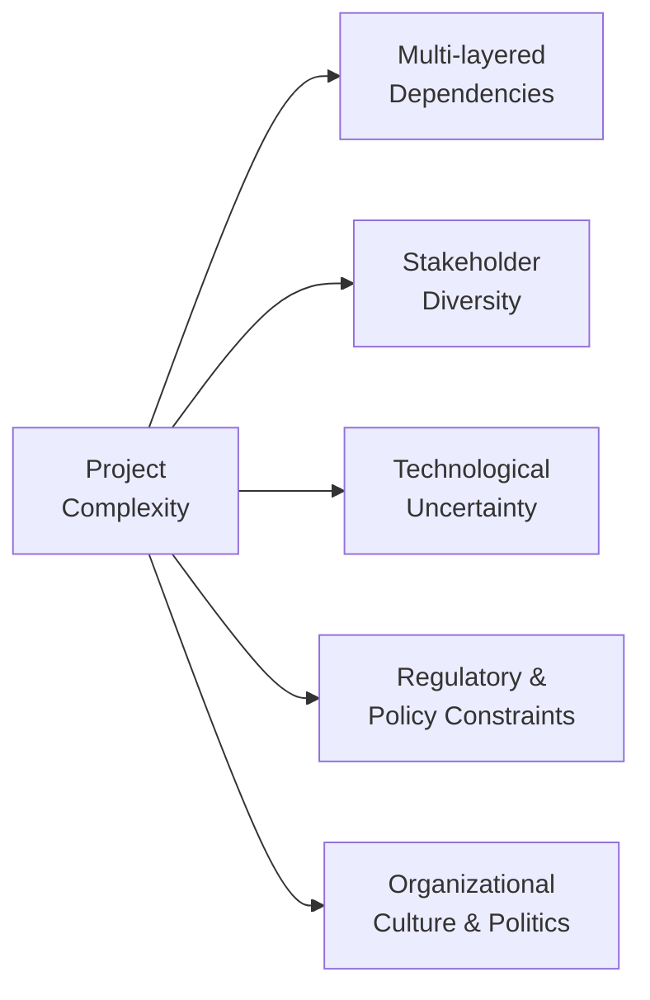

## 32.1 Sources of Project Complexity

Complexity in projects arises from a combination of interconnected factors, including multi-layered dependencies, stakeholder diversity, technology uncertainties, and the dynamic contexts in which initiatives operate. The Project Management Institute (PMI) defines complexity not only as a measure of the number of project elements but also their levels of interrelationship, their pace of change, and the unpredictability of emergent situations. Understanding the sources of project complexity empowers project managers to craft strategies that embrace adaptation, resilience, and continuous learning.

This section explores the origins and nature of project complexity, examining how multiple dimensions—structural, organizational, technical, and environmental—converge to create intricate environments. By recognizing common complexity drivers, project managers can tailor their approaches—whether agile, hybrid, or predictive—to optimize outcomes and decision-making.

### The Nature of Project Complexity

Managing projects requires orchestrating a variety of tasks, resources, and people over a finite period. When these elements interact in unforeseen ways or when subtle changes have disproportionately large impacts, we are dealing with complex, rather than simply complicated, environments. In a complex environment:

- Changes in one part can produce cascading effects in others.  
- Cause-and-effect relationships can be hard to predict or detect.  
- Emergent behaviors often override initial plans.  
- Continuous feedback loops can amplify or dampen changes.  

Understanding project complexity therefore requires a shift from merely breaking the project into smaller parts (linear thinking) to recognizing the relationships and feedback loops between those parts (systems thinking). Early detection of complexity drivers aids significantly in selecting the right project life cycle approach and management techniques (see Chapter 9 on Development Approach and Life Cycle Performance Domain).

### Multi-Layered Dependencies

One of the central pillars of complexity is the intricate web of dependencies that exist within and across organizational boundaries. Traditional scheduling and planning tools imply a largely sequential view of dependencies, but real-world projects often have intricate concurrency, reciprocal task relationships, and ongoing feedback loops.

#### Causes of Multi-Layered Dependencies

1. Concurrent or Overlapping Workstreams  
   - Several teams might be working in parallel, whether in iterative sprints (agile) or phased activities (predictive). Discrepancies in timing or deliverable outputs generate significant coordination overhead.

2. Resource Sharing Across Projects  
   - Modern organizations often share specialized human or technical resources across multiple initiatives. This interdependency can result in schedule risks and constraints if resource allocation is suboptimal.

3. Evolving System Interfaces  
   - Complex architectures with microservices, APIs, or modular software can create dependencies around integration points. Delays in one module can prevent teams from fully testing or validating another.

4. External Vendor Commitments  
   - Third-party deliverables, licensing, or specialized expertise can form critical path components. Any delay on the vendor side ripples through multiple project layers.

#### Example: Large-Scale Infrastructure Project

Consider a public infrastructure project, such as building a rapid transport system within a densely populated city. The project might require simultaneous work across engineering, design, legal, and environmental compliance teams. Land acquisition depends on legal clearance, architectural design depends on environmental approvals, and civil construction depends on financing. Each layer of dependency intersects, forming a network of interactions that can become deeply complex. 

Managing these layers involves establishing robust integration management (see Chapter 15) and advanced scheduling methods (see Chapter 18), such as the Critical Chain or the Program Evaluation and Review Technique (PERT), along with risk management strategies (see Chapter 22) that account for concurrency.

### Stakeholder Diversity

Diverse stakeholders bring varied perspectives, expectations, and requirements. Stakeholder complexity arises from not just the number of stakeholders but also the divergence of their interests, power, influence, and expectations—sometimes leading to conflicts or rapidly changing mandates.

#### The Dimensions of Stakeholder Diversity

1. Varied Organizational Cultures  
   - Projects often span multiple divisions, departments, or partner organizations with distinct cultures. Each group may value different success criteria—e.g., cost optimization, speed to market, or cutting-edge innovation.

2. Differing Levels of Influence and Authority  
   - Some stakeholders can directly dictate project scope or funding (e.g., executive sponsors), while others, such as end-users or community members, may have less formal authority but a high degree of indirect influence through public opinion or regulatory processes.

3. Geographic and Cultural Dispersion  
   - Virtual teams with international members contend with time zone challenges, language barriers, and cultural norms. Miscommunications can multiply complexities of alignment, acceptance, and collaboration (see Chapter 8: Team Performance Domain).

4. Shifting Priorities Over Time  
   - Projects that run for many months or years find that stakeholders’ priorities may evolve. A key influencer may change roles, or new regulations can alter business objectives and constraints.

#### Example: Global Product Launch

Imagine a multinational software company planning a global product launch. Local marketing teams in each region strive to tailor brand messaging to cultural norms, while the central corporate team desires a standardized approach to reduce costs. Regional sales heads prioritize quick adaptation, whereas the executive sponsor emphasizes brand consistency. Disparate stakeholder needs can lead to complexity that extends beyond typical scope considerations. Here, advanced stakeholder engagement (Chapter 7) and strategic communications management (Chapter 16) become essential.

### Technology Uncertainties

Rapid advancements in technology significantly amplify project complexity, especially when innovative or emerging technologies are embraced. Even in well-established domains, the pace of change can turn stable assumptions into outdated constraints unexpectedly.

#### Key Drivers of Technological Complexity

1. Emerging Tools and Frameworks  
   - For instance, introducing Artificial Intelligence (AI) or Machine Learning (ML) can require specialized skills, new data processes, or ethical and compliance considerations not encountered in traditional projects.

2. Integrations with Legacy Systems  
   - Many modern projects require connectivity to decades-old legacy systems that may lack comprehensive documentation or standard interfaces. The unpredictability in retrofitting new solutions onto legacy foundations can cause repeated rework or unplanned discovery.

3. Rapid Obsolescence and Upgrades  
   - Software libraries, hardware versions, and cloud platform APIs can change quickly. What was a stable environment six months ago may be deprecated or replaced entirely, forcing adjustments mid-project.

4. Complexity in Testing and Validation  
   - Advanced solutions require more sophisticated testing approaches—e.g., continuous integration/continuous delivery (CI/CD) pipelines, automated test frameworks, or specialized prototypes. Unidentified defects can cascade into major rework and extended timelines.

#### Example: AI-Driven Customer Support System

Consider a project integrating AI chatbots for automated customer support. While the proof-of-concept might look promising, scaling the chatbot to tens of thousands of concurrent users requires specialized knowledge in data science, neural network optimization, and cybersecurity. Challenges escalate when connecting to legacy customer relationship management (CRM) databases. This environment of scarce expertise, rapidly changing models, and complex data pipelines exemplifies technology-driven complexity.

### Additional Drivers of Complexity

Although multi-layered dependencies, stakeholder diversity, and technology uncertainties are among the most salient forces that fuel complexity, projects can experience other drivers:

- Regulatory and Policy Constraints: New regulations or environmental standards can retroactively alter requirements. Political shifts may impact funding.  
- Organizational Culture and Politics: Internal power struggles or misaligned incentives between departments can hamper collaboration.  
- Geographic Dispersion: Managing distributed teams across various time zones and cultural contexts adds difficulty in coordination, communication, and team cohesion (see Chapter 8).  
- Emergent Behaviors in Complex Adaptive Systems: Projects can evolve as living systems. Shifting feedback loops, unexpected interactions, or intangible factors—like employee morale—can shape outcomes in ways that defy predictions.

Below is a simplified diagram illustrating these sources of complexity:

In this diagram, “Project Complexity” emerges from a variety of converging factors (B, C, D, E, and F). As each factor interacts with others—often in unpredictable ways—the overall complexity of the system expands.

### Strategies for Addressing Complex Project Environments

Rather than attempting to eliminate complexity (which is rarely feasible), effective project managers aim to *navigate* and *harness* it. Key strategies include:

- **Embrace Iterative and Agile Methods**  
  Where uncertainty is high, shorter iteration cycles, frequent review points, and flexible planning can help. Early feedback loops can detect emergent risks or changing stakeholder needs before they become critical issues (see Part V: Agile & Hybrid Delivery Approaches).

- **Robust Stakeholder Engagement**  
  Continuous communication, co-creation of vision, and transparent decision-making build trust and reduce misunderstanding. Engage high-influence stakeholders early to secure alignment. Use stakeholder registers and advanced engagement techniques (see Chapter 7 and Chapter 16).

- **Systems Thinking and Regular “Big Picture” Reviews**  
  Periodic reviews of the entire system—beyond just schedule or budget—help identify unexpected dependencies. Systems thinking fosters recognition of emergent patterns, gravitational centers of influence, and hidden interconnections (see Chapter 32.3 on Systems Thinking Techniques).

- **Adaptive Risk Management**  
  In a complex environment, new risks can emerge quickly. Maintain rolling risk reviews and scenario analysis to keep your responses fresh. Emphasize opportunity management, not just threat mitigation (see Chapter 14: Uncertainty Performance Domain).

- **Managing Technical Debt and Prototyping**  
  For technology-driven complexity, run pilot phases to test assumptions. Creating proofs of concept or minimum viable products reveals hidden constraints or integration issues. Proactively maintain code quality and documentation to minimize long-term risks.

- **Strong Knowledge Management**  
  Capture lessons learned continuously and make them accessible to all. Complex projects rely on effective knowledge sharing to coordinate specialized teams and mitigate repeated mistakes (see Chapter 11.3 on Managing Communication, Knowledge Transfer, and Lessons Learned).

### Common Pitfalls in Complex Projects

1. **Overlooking Emergent Complexity**  
   - Project managers may assume that well-defined tasks and Gantt charts account for every variable. In reality, changes in one area can cascade through a complex system.

2. **Focusing Solely on Technical Dimensions**  
   - While new technology deserves scrutiny, ignoring stakeholder conflicts or organizational politics can derail even the most advanced project plans.

3. **Underestimating the Learning Curve**  
   - When adopting novel frameworks, AI-driven solutions, or next-generation tools, the initial productivity slump may exceed expectations, leading to insufficient resource or schedule buffers.

4. **Resisting Change in Project Approach**  
   - Clinging to rigid predictive methods when complexity clearly indicates a more flexible approach can stifle adaptation. Tailoring the methodology (see Chapter 5.6) is crucial for success.

5. **Failure to Scale Transparent Communication**  
   - In complex, fast-moving environments, important updates can be easily missed or misrepresented if not systematically communicated. This leads to misalignment and duplication of efforts.

### Real-World Application: Transforming Organizational Processes

An international financial services company initiated a project to modernize its loan processing system, targeting quicker approvals and better risk assessment. Early in the project:

- **Multi-Layered Dependencies:** The new loan processing software needed to integrate with an older mainframe system, two outsourced credit scoring services, and a newly planned front-end digital portal. The existing platform required daily synchronization with external systems.

- **Stakeholder Diversity:** Loan officers, IT infrastructure teams, external consultants, legal counselors, software vendors, and the end-user community had widely varying expectations. For instance, compliance officers wanted enhanced audit trails, while marketing teams prioritized user-friendly digital experiences.

- **Technology Uncertainty:** The chosen AI-based credit scoring engine was under rapid development, and new regulatory guidelines for AI-based decision-making were introduced mid-project.

To navigate complexity, the company adopted a hybrid approach:  
- Short iterative sprints to develop and test new features in a sandbox environment, allowing frequent stakeholder feedback.  
- Traditional milestone-based reviews for major funding gates and regulatory submissions.  
- Continuous risk reassessments, specifically around the AI compliance rules that were evolving.  

Despite significant challenges, embracing a holistic complexity view helped the project succeed in reducing loan cycle times by 30% and improving overall customer satisfaction.

### Best Practices for Complex Projects

- **Early Complexity Assessment:** Conduct an in-depth complexity assessment at project initiation, identifying potential sources of complexity ranging from stakeholder alignment to technology constraints.  
- **Continuous Stakeholder Mapping:** Stakeholder interests and influences shift over time. Keep your stakeholder register fresh, and segment stakeholders for tailored engagement strategies.  
- **Scenario Planning:** Develop multiple potential future scenarios if dependencies are uncertain. This approach ensures contingency plans and agile pivoting.  
- **Integrated Tooling and Dashboards:** Use real-time dashboards (see Chapter 13.3) for tracking dependencies, project status, and emerging risks. Visual tools help cross-functional teams maintain a unified perspective.  
- **Promote Collaborative Culture:** Foster an environment where teams are encouraged to raise potential issues, share knowledge, and learn from mistakes. A psychologically safe backdrop often mitigates complexity-induced failures (see Chapter 33 on Advanced Leadership and Team Development).  

### Recommended Readings and References

- PMI. (2014). “Navigating Complexity: A Practice Guide.” Project Management Institute.  
- Snowden, D. and Boone, M. (2007). “A Leader’s Framework for Decision Making.” Harvard Business Review.  
- PMI. (2021). “PMBOK® Guide – Seventh Edition.” Project Management Institute.  
- PMI. (2021). “Agile Practice Guide.” Project Management Institute.  

These resources delve deeper into complexity models, adaptive frameworks, and decision-making tools.

---

## Test Your Understanding: Sources of Project Complexity Quiz



### In a complex project environment, why is cause-and-effect often difficult to predict?

- [x] Because interrelated components can produce unexpected emergent behaviors.
- [ ] Because executive sponsors usually keep parts of the project hidden.
- [ ] Because planning is rarely done carefully in complex projects.
- [ ] Because there is no method to identify dependencies in project management.

> **Explanation:** In complex systems, multiple interacting factors can create feedback loops and emergent behaviors that are not easily predicted through linear cause-and-effect analysis.

### What is a key driver behind multi-layered dependencies in organizations?

- [x] Shared resources allocated to multiple concurrent projects.
- [ ] Stakeholders who universally agree on project outcomes.
- [ ] Simplistic technology frameworks.
- [ ] Extremely short project timelines with rigid scope.

> **Explanation:** Resource sharing and parallel project workstreams commonly create overlapping tasks and dependencies that must be coordinated effectively.

### How can stakeholder diversity amplify project complexity?

- [x] Stakeholders have differing levels of influence, expertise, and expectations.
- [ ] Every stakeholder always concurs on project deliverables.
- [ ] Stakeholders only appear at project launch and exit immediately.
- [ ] Stakeholder diversity always simplifies project planning.

> **Explanation:** When stakeholders have varied priorities, power, and cultural backgrounds, aligning their interests and expectations becomes significantly more challenging, increasing complexity.

### Which of the following types of complexity arises when novel tools or AI solutions are introduced?

- [ ] Cultural complexity.
- [x] Technological complexity.
- [ ] Stakeholder complexity.
- [ ] Contractual complexity.

> **Explanation:** Emerging or rapidly changing technology creates uncertainty about performance, integration challenges, and skill requirements, all contributing to project complexity.

### Why might agile or hybrid approaches be well-suited for complex projects?

- [x] They allow for shorter feedback loops and flexible adjustments.
- [ ] They eliminate all potential risks outright.
- [x] They help teams adapt rapidly to emergent changes.
- [ ] They completely prevent rework in unpredictable environments.

> **Explanation:** Iterative approaches encourage collaboration and continuous refinement, enabling faster pivots when unexpected complexities arise.

### Which practice below best addresses complexity caused by stakeholder misalignment?

- [x] Continuous engagement and transparent decision-making.
- [ ] Complete outsourcing of the project to a third party.
- [ ] Relying solely on hierarchical reporting structures.
- [ ] Avoiding communication until the project is nearly complete.

> **Explanation:** Diverse and potentially conflicting stakeholder interests demand ongoing dialogue, open forums for feedback, and active involvement to achieve alignment.

### Which statement about complexity is correct?

- [x] Complexity cannot be entirely eliminated, but it can be navigated.
- [ ] Complexity is merely a myth and can be ignored if the plan is strong enough.
- [x] Complexity often emerges from unforeseen interactions between project elements.
- [ ] Once identified, complexity remains static throughout the project lifecycle.

> **Explanation:** Complexity is an inherent characteristic of certain projects and environments. It emerges from interdependencies that evolve over time and cannot be fully controlled, only addressed adaptively.

### A project’s technology environment rapidly changes, and the next software version may break existing functionalities. What best mitigates this issue?

- [x] Continuous testing and automated CI/CD pipelines.
- [ ] Deeply burying risk in the documentation without addressing it.
- [ ] Delegating all decisions to a single sponsor.
- [ ] Limiting trial runs to once near the project’s end.

> **Explanation:** Frequent testing, automation, and continuous integration practices help projects detect compatibility issues early and adapt to fast-changing technologies.

### Which case demonstrates a multi-layered dependency scenario?

- [x] A new product launch reliant on an external vendor’s updated API and a legacy mainframe.
- [ ] A project that involves just one sponsor and no other resources.
- [ ] A strictly sequential waterfall approach with no overlapping tasks.
- [ ] A project with no technology involved at all.

> **Explanation:** Depending on both a new API and a legacy system simultaneously can generate overlapping or reciprocal dependencies that raise project complexity.

### Complex projects often require multiple management methods. Which statement is true?

- [x] Tailoring and blending agile, iterative, and predictive practices can help handle various forms of complexity.
- [ ] Only a purely predictive lifecycle can manage multi-dimensional complexity.
- [ ] Hybrid approaches are limited to technology projects.
- [ ] Agile methods eliminate all interdependencies automatically.

> **Explanation:** Each project demands a tailored approach based on complexity drivers, organizational culture, and stakeholder needs. Blending different methods allows flexibility and adaptability.



---

## PMP Mastery: 1500+ Hard Mock Exams with Full Explanations 

Looking to crush the PMP exam with confidence? Dive deep into 6 rigorous mock exams totaling 1500+ advanced-level questions, each accompanied by clear, step-by-step explanations. Hone your test-taking strategies, master complex topics, and build the resilience you need on exam day. Perfect for serious PMs aiming beyond fundamentals.

Enroll now:  
[PMP Mastery: 1500+ Hard Mock Exams with Exceptional Clarity & Full Explanations](https://www.udemy.com/course/pmp-2025/?referralCode=CF83A54BC86BE27F9AFE)

_Disclaimer: This course is not endorsed by or affiliated with the PMI examination authority. All content is provided purely for educational and preparatory purposes._
