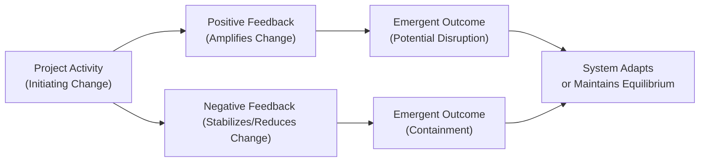
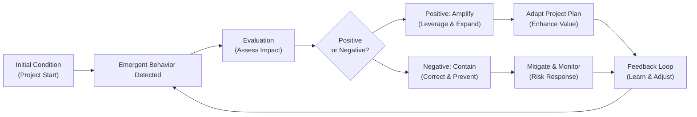

## 32.2 Emergent Behaviors and Feedback Loops

In complex projects, the interplay of multiple variables, stakeholders, and ever-changing conditions can produce unexpected outcomes—often referred to as emergent behaviors. These outcomes arise from the dynamic interactions of teams, technologies, and environments rather than from any single, planned component of the project. While traditional project techniques focus on planning and control, complex adaptive systems operate through ongoing learning, collaboration, and adaptation. This leads us to explore the concepts of emergent behaviors—how they form, flourish, and either jeopardize or bolster project success—and feedback loops, which either reinforce or stabilize these emergent phenomena.

This section delves deeply into the nature of emergent behaviors and outlines strategies to detect, manage, and leverage them. We will connect these ideas to project management principles, risk management, and iterative development approaches such as Agile and hybrid models. Additionally, we will examine how to harness feedback loops as powerful tools for guiding project outcomes. By the end of this exploration, you will know how to:

• Recognize emergent behaviors in complex projects.  
• Interpret the influence of positive and negative feedback loops.  
• Employ monitoring and adaptive techniques to contain possible disruptions.  
• Turn emergent behaviors into opportunities for achieving greater project value.  

---

### Understanding Emergent Behaviors

Emergent behaviors in a project are outcomes that are not explicitly designed or anticipated. They arise from the collective interactions of project elements—people, processes, technologies, governance models—and can manifest in both beneficial and disruptive ways.

• In a large software development project, countless lines of code might interact unexpectedly, producing unpredicted bugs or performance optimizations.  
• In a construction project, local regulation changes, stakeholder demands, or environmental factors might converge to create unplanned cost-saving opportunities or safety issues.  

While emergent behaviors are often seen as byproducts of “chaos,” they can also lead to positive breakthroughs and growth if properly identified and managed.

#### Key Characteristics of Emergent Behaviors

1. **Nonlinearity:** Small changes can lead to significant impacts, and big efforts sometimes yield minimal results.  
2. **Interdependency:** Behaviors unfold from interconnected elements such as distributed teams, technology stacks, and evolving stakeholder objectives.  
3. **Adaptability:** Systems strive for equilibrium. Teams, resources, and stakeholder interactions adjust to changing conditions.  
4. **Unpredictability:** Emergent behaviors often appear suddenly, defying predictions based on linear planning techniques.  

---

### Foundational Theories and Real-World Examples

Emergent behavior theory is grounded in systems thinking—an approach to understanding the whole by analyzing the linkages and interactions between the parts. Let’s explore a few foundational theories and real-world scenarios:

• **Chaos Theory:** Initially developed in mathematics and physics, chaos theory highlights how minor variations in initial conditions can drastically affect future outcomes, famously described as the “butterfly effect.” In a project management context, a seemingly small stakeholder request can balloon into large-scale scope changes.  

• **Complex Adaptive Systems:** Borrowing from biology and social systems, complex adaptive systems view organizations and projects as entities that learn and transform. Each participant (team members, technologies, vendors) is both influencing and being influenced by the environment. A newly integrated software tool might trigger faster collaboration in one department while inadvertently creating bottlenecks in another.  

• **Agile and Lean Frameworks:** These frameworks incorporate regular inspection and adaptation cycles to respond quickly to emergent issues. Daily stand-ups and sprint retrospectives offer frequent feedback loops where new behaviors or bottlenecks can be surfaced and addressed promptly.  

#### Brief Example: Global Product Launch

Imagine you’re managing a global product launch involving multiple teams across different time zones. Initial planning assessed risk factors such as supply chain disruptions, currency fluctuations, and competitive pressures. However, in the execution phase, you notice that local teams in southern regions are forming spontaneous alliances to bundle marketing campaigns with other complementary products. This synergy, though entirely emergent and unplanned, is driving higher sales in those regions. If left unnoticed, you miss the opportunity for broader synergy across other markets; if nurtured, it becomes a powerful differentiator.

---

### Feedback Loops: Positive and Negative

Central to understanding emergent behaviors is the concept of feedback loops. Feedback loops dictate how interactions within a system either amplify or dampen certain outcomes.

#### Positive Feedback Loops

A positive feedback loop magnifies the direction of change. While the term “positive” might suggest that the outcome is necessarily beneficial, in system dynamics, “positive feedback” simply denotes reinforcement—whether it leads to a beneficial or detrimental impact.

Example: A bug in a software project might be masked by a quick, informal fix. As more developers adopt the same workaround, the complexity grows, potentially leading to catastrophic system failure later (a negative outcome). Conversely, in a constructive scenario, if teams consistently share knowledge on best coding practices, code quality can improve exponentially, leading to faster deployment cycles and greater stakeholder satisfaction.

#### Negative Feedback Loops

A negative feedback loop stabilizes or counters the change in a system, keeping it within an optimal range.

Example: In a resource management scenario, when tasks get delayed, project managers can deploy additional resources or adjust priorities, ensuring that the delay does not cascade. This stabilizing effect corrects deviations and keeps performance parameters in check. Another example is a thermostat that kicks on the air conditioning when a certain temperature is reached, thereby cooling a heated environment.

---

### Tools and Techniques for Monitoring Emergent Behaviors and Feedback Loops

Given the interplay between emergent behaviors and feedback loops, project managers must employ robust monitoring and adaptive techniques. Below are some commonly used methods:

1. **Frequent Reporting and Dashboards**  
   • Earned Value Management (EVM) dashboards provide quantitative insights into cost and schedule performance. Abrupt deviations may hint at emergent systemic issues.  
   • Frequent status updates in Agile (daily stand-ups, sprint reviews) let teams address unexpected challenges in near real-time.  

2. **Root Cause Analysis (RCA)**  
   • Techniques such as the “5 Whys” or Ishikawa Diagrams can uncover hidden linkages triggering emergent behaviors.  
   • RCA is especially beneficial to identify underlying patterns rather than surface-level symptoms.

3. **Scenario Planning and Simulation**  
   • Create “what-if” scenarios to see how changes in one variable can ripple across the project.  
   • Monte Carlo simulations or agent-based modeling can highlight how minor fluctuations lead to emergent patterns.

4. **Adaptive Governance**  
   • Reinforce collaborative decision-making, autonomy, and empowerment in teams—enabling them to quickly pivot in response to new patterns.  
   • In high-uncertainty environments, adopt rolling wave planning to remain flexible.

5. **Real-Time Feedback Systems**  
   • Employ advanced analytics and real-time data capture. In software projects, continuous integration/continuous delivery (CI/CD) pipelines can quickly reveal emergent bugs or performance issues.  
   • IoT sensors in large construction projects provide instantaneous updates for safety and progress insights.

---

### Diagrams: Capturing Feedback Loops

Below is a simple Mermaid diagram illustrating how positive and negative feedback loops might unfold in a typical project scenario:

Explanation of the Nodes:  
• A: The initial project activity that triggers a change (e.g., a new requirement).  
• B: Positive feedback loop that amplifies this change.  
• C: Negative feedback loop that counters the change.  
• D & E: Different forms of emergent outcomes—one disruptive and the other more contained.  
• F: The final system response, which can be adaptation, steady state, or failure.

---

### Emergent Behaviors in Agile and Hybrid Methodologies

Agile and hybrid delivery models inherently embrace the concept of emergent behaviors through iterative, incremental cycles. The entire Scrum cycle—planning, executing, inspecting, and adapting—allows for continuous feedback loops that spot both beneficial and detrimental emergent patterns early.  

• **Agile Ceremonies:** Retrospectives are prime opportunities to discuss emergent behaviors noted during a sprint and identify next steps for either capitalizing or mitigating them.  
• **Hybrid Projects:** In hybrid models that combine predictive and adaptive elements, emergent behaviors might be contained by predictive planning in some phases while being embraced as opportunities in iterative parts of the project.  

In multi-year implementations, emergent behaviors may surface as enterprise-level transformations—changing processes, technologies, and even organizational culture. Early detection helps pivot strategy before negative patterns become entrenched.

---

### Best Practices and Common Pitfalls

**Best Practices**  
• **Encourage Openness and Transparency:** Emergent patterns are easier to detect when team members feel safe expressing observations and concerns.  
• **Facilitate Cross-Functional Collaboration:** Opportunities for beneficial emergence often lie at the boundaries of diverse skill sets and perspectives.  
• **Short Feedback Cycles:** Use daily or weekly stand-ups, iterative planning, or rolling wave planning to capture emergent signals in real-time.  
• **Adaptive Leadership:** Leaders should guide, not dictate. Offering autonomy fosters creativity and the potential for constructive emergent behavior.

**Pitfalls**  
• **Rigid Governance:** Overly strict processes can stifle beneficial emergent behaviors while failing to prevent negative ones.  
• **Data Myopia:** Relying on incomplete or outdated data can cause misinterpretation of emergent signals, leading to ineffective decisions.  
• **Ignoring Soft Signals:** Informal communication, hallway chats, or casual feedback often reveal the first signs of emergent issues. Dismissing these can compound problems.  
• **Overreacting to Minor Fluctuations:** Not all variance is emergent or system-threatening. An oversimplified interpretation of signals can create self-fulfilling prophecies of panic.

---

### Practical Examples and Case Studies

#### Case Study 1: Software Release Gone Awry

A large e-commerce company introduced a major software release to handle an expected surge in holiday traffic. They meticulously planned for load testing, server redundancy, and code reviews. However, an unexpected “flash sale” event (unexpected in timing and magnitude) caused a spike in usage patterns. The system architecture included an unoptimized caching mechanism that inadvertently multiplied server requests instead of reducing them—an emergent behavior rooted in an internal code dependency.

• **Positive Feedback Loop**: As server traffic piled on, each new request triggered further requests from microservices needing to verify user data.  
• **Emergent Outcome**: The partial meltdown forced an immediate “hotfix” that had not been fully tested.  
• **Negative Feedback Interventions**: After crisis control, the engineering team implemented a kill-switch for the microservices calls under heavy traffic, stabilizing the system in real-time.

This example underlines how carefully prepared systems can still spawn complex, unexpected interactions—underscoring the importance of real-time feedback and adaptive governance.

#### Case Study 2: Infrastructure Project Optimization

A transportation department embarked on constructing a new highway. Halfway through, local communities and environmental groups mobilized to protect natural habitats. Initially viewed as an obstacle, this movement rallied stakeholders (communities and government agencies) to collaborate on a new design featuring eco-friendly overpasses and tunnels that protected wildlife corridors. Although it added upfront costs, the redesign gained immense public support and attracted new funding avenues.

• **Positive Feedback Loop**: Community involvement grew stronger, drawing national media attention, which in turn attracted more funding and sponsorship.  
• **Emergent Outcome**: The project pivoted from a controversial infrastructure build to a national model for environmentally sustainable transportation.  
• **Negative Feedback Loop**: Without careful collaboration, conflicting demands could have raised tensions and delayed schedules indefinitely. By engaging in open dialogue, the project team kept the emergent pattern constructive and beneficial.

---

### Strategies for Containing Disruptions and Leveraging Opportunities

1. **Iterative Adaptation**  
   • Continuously refine scope, budget, and timelines based on real-time learnings.  
   • Employ a rolling wave planning approach instead of rigid upfront schedules.

2. **Monitoring via Short Feedback Loops**  
   • Conduct frequent check-ins with teams and stakeholders.  
   • Gather and evaluate data regularly, fostering constant communication channels.

3. **Dual-Mode Planning**  
   • Combine predictive planning for stable areas with adaptive approaches for emerging areas.  
   • Maintain parallel risk registers for known (predicted) and emerging (unexpected) risks.

4. **Empower Localized Decision-Making**  
   • Simplify escalation paths. Teams closest to the issue can respond faster to emergent conditions than centralized or top-heavy governance.  
   • Cross-train teams to handle shifting project priorities without extended handovers.

5. **Learning Reviews and Retrospectives**  
   • Encourage reflection sessions specifically dedicated to emergent behaviors.  
   • Document lessons learned in shared knowledge repositories.

---

### Additional Mermaid Diagram: Flow of Emergence and Response

In this feedback loop:  
• The project starts in a known state (A).  
• An emergent behavior arises (B).  
• The team evaluates (C) whether this emergent behavior is beneficial (E) or detrimental (F).  
• They adapt the plan or mitigate issues (G, H).  
• Finally, they feed the lessons back into the detection mechanism (I), creating continuous improvement.

---

### Encouraging Continuous Learning and Adaptation

Managing emergence is not a one-time endeavor but an ongoing mindset. To cultivate a culture that nurtures beneficial emergent behaviors and swiftly addresses harmful ones:

• **Promote Cross-Functional Forums:** Provide platforms where technical, business, and operational stakeholders can exchange insights and escalate potential issues.  
• **Reward Rapid Detection and Response:** Recognize individuals and teams that take initiative to surface emergent trends early.  
• **Adopt an Experimental Mindset:** Treat certain areas of the project as “innovation sandboxes” where teams can trial new methods and technologies with minimal risk.  
• **Utilize Systems Thinking Tools:** Encourage open-ended dialogues, concept mapping, and simulation exercises to reveal hidden interdependencies.

---

### References for Further Exploration

• **Complex Adaptive Systems: An Introduction to Computational Models of Social Life** by John H. Miller and Scott E. Page  
• **Thinking in Systems: A Primer** by Donella Meadows  
• **The Fifth Discipline: The Art & Practice of The Learning Organization** by Peter M. Senge  
• **PMI’s 12 Project Management Principles** (Chapter 5 of this book)  
• **Agile Practice Guide** by PMI for an in-depth look at iterative and incremental feedback cycles  

---

## Test Your Knowledge: Emergent Behaviors and Adaptive Strategies



### How do emergent behaviors primarily arise in project environments?

- [x] From the interaction of multiple, interconnected components.  
- [ ] From flaws in traditional project planning worksheets.  
- [ ] From singular root causes that are always predictable.  
- [ ] From external risks that have no internal influence.  

> **Explanation:** Emergent behaviors stem from the dynamic interaction of multiple stakeholders, processes, and technologies, making them difficult to predict by examining individual elements in isolation.

### Which of the following best describes a positive feedback loop?

- [x] A reinforcing cycle that magnifies existing trends, whether beneficial or harmful.  
- [ ] A collaboration mechanism used exclusively in Agile stand-ups.  
- [x] A cycle that can bring about either improved performance or amplified disruptions.  
- [ ] A process for reducing variance and returning systems to equilibrium.  

> **Explanation:** “Positive” in system dynamics refers to the tendency to reinforce or amplify a change—such loops can yield both desirable and undesirable results.

### In project management contexts, a negative feedback loop is likely to:

- [x] Stabilize the system by countering changes.  
- [ ] Accelerate emergent behaviors.  
- [ ] Eliminate the need for iterative planning.  
- [ ] Guarantee project completion within initial budget.  

> **Explanation:** Negative feedback loops counteract deviations, helping keep the system (or project) in a stable state rather than letting unchecked changes escalate.

### Which tool is most helpful for identifying the initial causes of emergent behaviors?

- [x] Root Cause Analysis (e.g., Ishikawa Diagram or 5 Whys).  
- [ ] Basic time-tracking software.  
- [ ] Only risk registers.  
- [ ] Simple Gantt charts without extension.  

> **Explanation:** Root cause analysis methods like Ishikawa Diagrams and the 5 Whys are used to uncover the underlying factors that contribute to emergent behaviors.

### Which of the following practices helps project teams adapt quickly to emergent changes?

- [x] Short feedback cycles like daily stand-ups.  
- [ ] Large, infrequent stakeholder reviews every quarter.  
- [x] Empowering teams with autonomy.  
- [ ] Postponing any course corrections until project closure.  

> **Explanation:** Rapid feedback mechanisms and team empowerment enable nimble responses, whereas infrequent reviews and delayed adjustments do not.

### In Agile methodologies, retrospectives are especially valuable for:

- [x] Identifying beneficial and harmful emergent behaviors that arose during an iteration.  
- [ ] Automatically modeling all future risks.  
- [ ] Eliminating the need for task boards.  
- [ ] Reducing all team communication to email.  

> **Explanation:** Retrospectives allow teams to reflect on the past sprint, identifying where emergent behaviors occurred and planning how to leverage or mitigate them moving forward.

### What is the main difference between positive and negative feedback loops?

- [x] Positive loops reinforce changes, while negative loops act to correct or counter them.  
- [ ] Positive loops are inherently “good,” and negative loops are inherently “bad.”  
- [x] Positive loops magnify deviations, whereas negative loops minimize deviations.  
- [ ] There is no practical difference in project environments.  

> **Explanation:** In system dynamics, a positive loop amplifies the direction of change, while a negative loop seeks to neutralize or reverse it.

### How can stakeholder collaboration help manage emergent behaviors?

- [x] It increases transparency, enabling early detection of hidden patterns.  
- [ ] It creates hierarchical reporting lines that stifle creativity.  
- [ ] It guarantees no emergent behaviors will develop.  
- [ ] It replaces all project documentation with oral discussions.  

> **Explanation:** Effective collaboration fosters open dialogue and transparency, making it easier to spot and address emergent behaviors.

### Why is flexible or adaptive governance critical for controlling emergent behaviors?

- [x] It allows for swift changes to plans and resource allocation as unforeseen patterns arise.  
- [ ] It eliminates the need to interact with complex stakeholders.  
- [ ] It makes top-down control absolute and streamlined.  
- [ ] It keeps all feedback loops at a finalized status.  

> **Explanation:** Adaptive governance provides the structural flexibility needed to respond effectively to surprises, ensuring small issues do not grow into major disruptions.

### Emergent behaviors in a project system are best viewed as:

- [x] Potential risks or opportunities that require continuous monitoring and adaptation.  
- [ ] Guaranteed failures due to poor planning.  
- [ ] Simple anomalies that even minimal oversight can handle.  
- [ ] Inherent contradictions in a system that can never be addressed.  

> **Explanation:** Emergent behaviors can reveal both risks and opportunities, emphasizing the importance of iteration, monitoring, and adaptive strategies.



---

## PMP Mastery: 1500+ Hard Mock Exams with Full Explanations 

Looking to crush the PMP exam with confidence? Dive deep into 6 rigorous mock exams totaling 1500+ advanced-level questions, each accompanied by clear, step-by-step explanations. Hone your test-taking strategies, master complex topics, and build the resilience you need on exam day. Perfect for serious PMs aiming beyond fundamentals.

Enroll now:  
[PMP Mastery: 1500+ Hard Mock Exams with Exceptional Clarity & Full Explanations](https://www.udemy.com/course/pmp-2025/?referralCode=CF83A54BC86BE27F9AFE)

_Disclaimer: This course is not endorsed by or affiliated with the PMI examination authority. All content is provided purely for educational and preparatory purposes._
