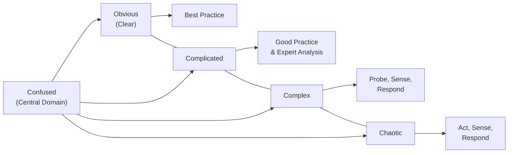

## 32.3 Techniques for Complexity Management

Complex, rapidly changing environments pose unique challenges for project managers. Whether you are developing cutting-edge software, executing strategic initiatives, or overseeing global supply chains, complexity often arises from the interplay of numerous interconnected factors: emerging technologies, varying regulations, shifting stakeholder demands, and more. These conditions can make traditional, linear planning approaches insufficient on their own. Instead, they require techniques that acknowledge emergent behaviors and adapt quickly to unanticipated change.

This section focuses on proven frameworks and practices for navigating complexity, with emphasis on the Cynefin framework, systems diagrams, and other related techniques. By applying these approaches, project managers can more effectively sense the nature of the environment, learn from feedback, and respond with agility.

### Understanding Complexity in Modern Projects

Projects are often incorrectly labeled as “complicated” when real complexity is at play. While a complicated project might have many parts but is ultimately solvable through expert analysis and detailed planning (e.g., designing a custom engine), a genuinely complex project features emergent properties and unpredictable outcomes (e.g., orchestrating a large-scale digital transformation involving cultural shifts across a multinational organization).

Key characteristics of complexity:  
• Nonlinear feedback loops: Small changes can cause disproportionately large impacts.  
• Emergent behaviors: New patterns or dynamics can unexpectedly arise.  
• Adaptive nature: Components (individuals, teams, technologies) change and co-evolve continually.  
• Self-organization: Teams or systems can reorganize on their own without central control.  

Project managers facing complexity cannot rely solely on traditional predictive planning. While structured methods remain valuable, they must be supplemented with a way to sense, probe, and respond to emergent conditions.

### The Cynefin Framework

Developed by Dave Snowden, the Cynefin framework is a decision-making framework that helps leaders categorize the context or domain they are dealing with so they can choose an appropriate strategy for action. Cynefin’s Welsh name roughly translates to “habitat,” reflecting how environments shape decision-making and meaning.

Cynefin identifies five domains:

1. Obvious (or Clear): The relationship between cause and effect is simple and easily understood. The recommended approach is to sense, categorize, and respond with best practices.  

2. Complicated: Multiple correct answers may exist, although cause-and-effect are still discoverable through analysis or expert consultation. The recommended approach is to sense, analyze, and respond by applying good (not merely best) practices.  

3. Complex: Here, cause-and-effect relationships are only clear in hindsight. Experimentation and adaptation are essential. The recommended approach is to probe, sense, and respond.   

4. Chaotic: No relationships between cause and effect are clear. Immediate action is required to establish some sense of order before moving to a more stable domain. The recommended approach is to act, sense, and respond.  

5. Confused: This is the central domain, representing a state of not knowing which domain you are in.  

#### Applying Cynefin in Project Environments

In project management, different workstreams or tasks can exist in different domains simultaneously. For instance:

• A stable, well-understood procurement process (Obvious domain) might run in parallel with an emerging market exploration initiative (Complex domain).  
• Complex tasks might demand iterative experimentation—like pilot solutions or prototypes—before scaling.  
• Chaotic situations might occur in crisis response, mandating rapid action to contain damage (e.g., a massive data breach).

A crucial step is diagnosing each project element’s domain accurately. When a problem is incorrectly perceived as complicated (merely needing an expert to solve) but is actually complex, you may waste time on prolonged analysis instead of learning by doing and iterating.

Below is a simplified Mermaid diagram that shows the Cynefin framework domains and recommended actions:

By diagnosing the domain correctly, you can select the appropriate management style and adapt as the situation or domain transitions.

### Using System Diagrams

Systems diagrams are a powerful tool for visually representing relationships, feedback loops, and flows of information or resources. They illuminate how elements in a system influence each other over time, often revealing counterintuitive feedback loops that traditional project plans overlook.

#### Types of System Diagrams

• Causal Loop Diagrams (CLDs): Show the feedback loops (reinforcing or balancing) among variables in a system.  
• Stock and Flow Diagrams: Depict accumulations (stocks) and rates of change (flows), clarifying dynamic behaviors like growth, delays, and capacity constraints.

For example, a reinforcing feedback loop may occur if early success in a pilot software release boosts stakeholder confidence, leading to increased adoption, which further drives success. Conversely, a balancing loop occurs when higher adoption leads to resource strain, limiting the ability to deliver effectively.

Below is a simple Mermaid diagram of a causal loop:

In this reinforcing loop, an increase in adoption rate leads to higher feature usage, which boosts stakeholder satisfaction and further encourages adoption. Managing complexity often depends on identifying and balancing such feedback loops—especially where multiple loops interact in unpredictable ways.

#### Practical Tips for Using System Diagrams

• Involve Stakeholders: Gather input from a wide range of perspectives to ensure you capture the full system.  
• Keep Iterating: Update your diagrams regularly as you gain new insights.  
• Look for Delays: Many system behaviors hinge on time delays, where the effect of an action is not immediately seen.  

By modeling project elements as a system of interdependent parts, you can better anticipate emergent patterns and refine your project approach.

### Additional Complexity Management Techniques

While Cynefin and system diagrams are valuable, complex environments typically demand a broader toolkit. Many of the following techniques align with Lean, Agile, and Hybrid methodologies discussed throughout this book.

#### 1. Sense and Respond

• Conduct multiple small-scale experiments or pilot initiatives.  
• Gather real-time data from prototypes, daily stand-ups, or iterative check-ins.  
• Amend your approach as you learn, pivoting when evidence suggests a better course of action.

This “safe-to-fail” experimentation is central to dealing with complexity, where analysis alone may not uncover hidden constraints or stakeholder dynamics.

#### 2. Incremental Delivery

Deploy smaller batches of deliverables or features quickly. As you gather feedback, adapt subsequent releases. This iterative flow mitigates the risk of large-scale failures and builds resilience into your project plan. Agile frameworks—like Scrum, Kanban, or hybrid variants—are especially suited for incremental delivery.

#### 3. Swarming and Cross-Functional Teams

In complex settings, specialized silos can hinder communication and make it difficult to address emergent issues rapidly. Swarming involves temporarily consolidating cross-functional support around urgent or challenging tasks, enabling faster resolution. This approach is particularly useful when unpredictability triggers unanticipated problems that no single expert can resolve alone.

#### 4. Buffering and Slack

Complex environments are prone to frequent changes. Maintaining buffer times in schedules, cost contingencies in budgets, and resource slack helps absorb unforeseen demands. This is different from typical “lean” approaches aimed at efficiency; in complex domains, too much rigidity can compound complexity rather than reduce it.

#### 5. Double-Loop Learning

Adapted from Chris Argyris’s work, double-loop learning questions underlying assumptions and mental models rather than merely adjusting actions. For instance, if repeated scope changes are causing project delays, double-loop learning might reveal inconsistent alignment on project vision among executive sponsors rather than just a need to improve change control forms.

#### 6. Dynamic Steering Committees

Instead of static governance structures that meet monthly or quarterly, dynamic steering committees hold more frequent (e.g., biweekly) sessions. They focus on interpreting real-time data, addressing emergent risks, and recomposing project priorities. This aligns well with the evolving nature of complex environments.

### Real-World Application and Case Studies

Complexity management techniques can apply across industries and project types:

• Healthcare System Overhaul: A large hospital network attempting to integrate telemedicine, patient record digitization, and remote diagnostics can become overwhelmed with emergent challenges—IT integration failures, legal constraints, and cultural resistance. By using the Cynefin framework, the hospital leadership categorizes each aspect of the integration. Chaotic aspects (e.g., urgent security vulnerabilities) receive immediate triage. Complex aspects, such as adopting telemedicine across different patient demographics, are probed through small-scale pilot programs.

• Software Product Launch: In a new SaaS platform involving advanced analytics and AI, emergent performance constraints can render predictive project planning less useful. Adopting system diagrams clarifies reinforcing loops (increasing data volume bolsters AI model accuracy, which drives user satisfaction) and balancing loops (data volume can cause performance bottlenecks if server capacity isn’t scaled). Sense-and-respond cycles handle continuous user feedback, ensuring agility.

• Public Infrastructure Deployment: A government implementing city-wide environmental sensors to track air quality may discover complexities such as community backlash, integration with existing transport data, and real-time analytics requiring new computing approaches. By forming a dynamic steering committee and ensuring cross-functional involvement—IT, legal, public relations, environmental experts—the project can adapt to community needs and the evolving technical landscape.

### Best Practices, Pitfalls, and Challenges

Complexity management demands ongoing vigilance and intentional organizational culture. Below are some considerations:

**Best Practices**  
• Foster open communication and knowledge sharing across teams.  
• Encourage safe-to-fail experiments before committing large investments.  
• Maintain flexibility in contracts and governance structures.  
• Use real-time dashboards, collaboration tools, and frequent check-ins to support rapid adaptation.

**Common Pitfalls**  
• Overreliance on a single predictive methodology, ignoring emergent trends.  
• Failing to recognize complexity, erroneously treating it as a complicated domain.  
• Neglecting stakeholder feedback, leading to a severe mismatch between project outputs and real-world needs.  
• Marginalizing cross-functional collaboration in favor of siloed, hierarchical decision-making.

**Overcoming Challenges**  
• Educate and align stakeholders on the differences between complicated and complex project elements.  
• Leverage both agile and traditional tools in a hybrid approach that allows for robust planning where needed, and free-form adaptation elsewhere.  
• Keep learning loops short. Rapid iteration and feedback cycles reveal emergent issues faster, preventing them from escalating.

### References for Further Exploration

• Snowden, D. & Boone, M. (2007). “A Leader’s Framework for Decision Making.” Harvard Business Review.  
• PMBOK® Guide – Seventh Edition. Project Management Institute.  
• PMI.org for additional standards and practice guides on complexity and Agile practices.  
• Glouberman, S., & Zimmerman, B. (2002). Complicated and Complex Systems: What Would Successful Reform of Medicare Look Like? Commission on the Future of Health Care in Canada.  
• Argyris, C. (1977). “Double Loop Learning in Organizations.” Harvard Business Review.

By remaining mindful of these evidence-based frameworks and practices, project managers can avoid simplistic reactions and adopt a nuanced approach to handle the dynamic, ephemeral nature of modern projects.

---

## Test Your Knowledge: Complex Project Environments Quiz



### Which of the following best describes “self-organization” in complex projects?

- [x] Teams and processes adapt spontaneously without centralized control.
- [ ] Single, isolated subject-matter experts take full control.
- [ ] A sponsor dictates every step through a detailed blueprint.
- [ ] Stakeholders remain passive and await top-down directives.

> **Explanation:** In complex projects, self-organization occurs when teams or processes configure themselves naturally, responding to changes without relying on central directives.

### In the Cynefin framework, which domain requires immediate action before analysis?

- [ ] Complicated
- [ ] Complex
- [x] Chaotic
- [ ] Obvious (Clear)

> **Explanation:** The Chaotic domain is one where the relationships between cause and effect are unclear and unstable. The recommended approach is to act quickly to contain the crisis, then sense and respond.

### A reinforcing feedback loop means:

- [x] An increase in one variable leads to an increase in another, which in turn amplifies the first.
- [ ] One variable decreases while another increases, balancing system behavior.
- [ ] It is always beneficial and should never be mitigated.
- [ ] It can only occur in traditional environments and not in agile projects.

> **Explanation:** Reinforcing loops amplify behavior, pushing the system toward exponential growth or decline. They require active oversight to ensure they produce positive rather than harmful results.

### Using system diagrams can help project managers:

- [x] Visualize interdependencies and feedback loops.
- [ ] Eliminate the need for expert knowledge entirely.
- [ ] Guarantee the project finishes ahead of schedule.
- [ ] Avoid all conflicts by assigning blame accurately.

> **Explanation:** System diagrams focus on relationships and feedback loops, providing a holistic map of how changes in one part of a system might influence others.

### What is the primary goal of “sense-and-respond” strategies?

- [x] Continuously gather data and adapt behaviors quickly.
- [x] Encourage experimentation with small, safe-to-fail tests.
- [ ] Minimize all forms of user feedback to streamline workflows.
- [ ] Standardize routine tasks that never change.

> **Explanation:** “Sense-and-respond” emphasizes real-time data gathering and iterative adaptation, allowing projects to evolve as new information emerges.

### One advantage of incremental delivery in complex environments is:

- [x] Frequent feedback allows for actionable course corrections.
- [ ] Budgets always drop by at least 50%.
- [ ] It eliminates the need for risk analysis.
- [ ] Regulatory requirements no longer apply.

> **Explanation:** Incremental delivery lets teams present partial functionality quickly, receive feedback, and iterate. This approach mitigates risks by identifying and resolving potential issues early.

### Double-loop learning involves:

- [x] Questioning underlying assumptions rather than just tweaking actions.
- [ ] Merely reinforcing current processes without investigating root causes.
- [x] Reexamining an organization’s mental models to drive fundamental change.
- [ ] Tracking the critical path in a linear schedule for improved efficiency.

> **Explanation:** Double-loop learning goes beyond adjusting tactics (single-loop) by challenging and altering the fundamental beliefs or assumptions that guide decision-making.

### Which statement best describes a dynamic steering committee?

- [x] They hold more frequent, agile-focused sessions for real-time decision-making.
- [ ] They only convene at the end of the project to assess lessons learned.
- [ ] They create rigid, unchanging guidelines that must not be revisited.
- [ ] They prioritize cost alone, ignoring scope or stakeholder needs.

> **Explanation:** In complex environments, project governance must adapt quickly. Dynamic steering committees meet more regularly, leveraging real-time data to pivot as needed.

### A major pitfall in complexity management is:

- [x] Treating a complex issue as if it were merely complicated and relying solely on expert analysis.
- [ ] Performing risk identification with diverse stakeholders.
- [ ] Implementing iterative feedback mechanisms.
- [ ] Using safe-to-fail micro-experiments.

> **Explanation:** Over-reliance on expert analysis for a truly complex problem is dangerous. Complexity requires iterative experimentation, not just static planning.

### In project complexity contexts, a “safe-to-fail” experiment is:

- [x] An intentionally small-scale test that limits potential negative impacts.
- [ ] A rigid, large-scale deployment that guarantees zero risk.
- [ ] Fully validated with no possibility of failure.
- [ ] A test done in secret without stakeholder knowledge.

> **Explanation:** “Safe-to-fail” experiments are designed for learning in complex environments, limiting potential damage while providing actionable insights.



---

## PMP Mastery: 1500+ Hard Mock Exams with Full Explanations 

Looking to crush the PMP exam with confidence? Dive deep into 6 rigorous mock exams totaling 1500+ advanced-level questions, each accompanied by clear, step-by-step explanations. Hone your test-taking strategies, master complex topics, and build the resilience you need on exam day. Perfect for serious PMs aiming beyond fundamentals.

Enroll now:  
[PMP Mastery: 1500+ Hard Mock Exams with Exceptional Clarity & Full Explanations](https://www.udemy.com/course/pmp-2025/?referralCode=CF83A54BC86BE27F9AFE)

_Disclaimer: This course is not endorsed by or affiliated with the PMI examination authority. All content is provided purely for educational and preparatory purposes._
