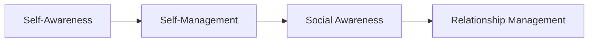
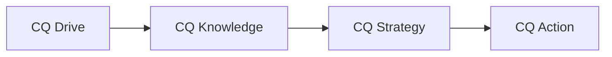

## 33.1 Emotional Intelligence and Cultural Intelligence

Leaders and team members alike need more than just technical knowledge to drive successful projects. Today’s increasingly global and cross-functional work environments demand highly effective communication, collaboration, and adaptability. Emotional Intelligence (EI) and Cultural Intelligence (CQ) are two complementary skill sets that enable project managers, sponsors, and team members to navigate complex interpersonal dynamics while respecting individual and cultural differences. By integrating EI and CQ into everyday project activities, professionals can spur collaboration, manage conflict successfully, and foster inclusive, high-performing teams.

In this section, we explore what EI and CQ are, how they intersect, and why they are indispensable for project leaders. We examine relevant frameworks, best practices, and common pitfalls, then illustrate these concepts with real-world scenarios and practical tips. By the end, you will understand how to harness emotional and cultural awareness as powerful catalysts for building trust, motivating teams, and delivering exceptional project results.

### Defining Emotional Intelligence (EI)

Emotional Intelligence, often associated with Daniel Goleman’s work, is the ability to understand and manage one’s own emotions and those of others. It involves recognizing emotional triggers, empathizing with varied perspectives, and responding in ways that facilitate constructive communication. EI is typically broken down into four core domains:

- Self-Awareness  
- Self-Management  
- Social Awareness  
- Relationship Management

#### Self-Awareness
Self-awareness is the foundational domain of EI. It involves understanding your emotions, strengths, weaknesses, and stress triggers. Project managers with strong self-awareness are more likely to regulate their responses under pressure, maintain clarity in decision-making, and adapt quickly to new challenges.

#### Self-Management
Self-management builds upon self-awareness to regulate emotions effectively. This includes managing negative emotions like frustration, anger, or fear, and channeling them productively. In project environments, self-management manifests as composure during conflict and consistent alignment with organizational and project values.

#### Social Awareness
Social awareness involves recognizing the emotional states of others on the team and among stakeholders. It includes empathy—genuinely understanding another person’s feelings—and situational awareness of interpersonal dynamics. By reading cues such as body language, tone of voice, or subtle cultural signs, project managers can tailor communication for positive outcomes.

#### Relationship Management
The practical application of EI culminates in relationship management, where a project manager uses self-awareness and social awareness to build rapport, manage conflict, and inspire team members. This includes influencing without authority, recognizing contributions, and guiding people through challenges related to scope, risks, or change management.

Below is a simple conceptual diagram illustrating the four EI domains and their flow:

In real-world project settings, these domains often overlap. A project manager who is self-aware and empathetic can quickly diffuse a tense situation by acknowledging stakeholders’ concerns (Social Awareness) while maintaining composure and facilitating constructive dialogue (Relationship Management). The thorough mastery of EI underpins many leadership topics discussed in earlier chapters (e.g., Chapter 8: Team Performance Domain and Chapter 5: PMI’s 12 Principles), allowing project managers to apply leadership behaviors that increase trust, collaboration, and performance.

### Defining Cultural Intelligence (CQ)

As global projects become the norm, Cultural Intelligence (CQ) has emerged as a critical ability for navigating diverse teams effectively. Culture is not limited to national or linguistic differences; it includes organizational, generational, and functional subcultures—any context where norms, values, and communication styles differ.

CQ includes four key components:

- CQ Drive (Motivation)  
- CQ Knowledge (Understanding)  
- CQ Strategy (Planning)  
- CQ Action (Adaptability)

#### CQ Drive (Motivation)
CQ Drive refers to an individual’s curiosity and motivation to work with people from different backgrounds. Without the genuine desire to engage across cultural differences, any understanding or strategy may remain superficial.

#### CQ Knowledge (Understanding)
CQ Knowledge consists of understanding cultural norms, practices, expectations, and values. This can include recognizing variations in power distance, communication styles (high-context vs. low-context), or attitudes toward hierarchy and individualism. Familiarity with these nuances helps project managers preempt cultural friction in distributed or multi-vendor project scenarios.

#### CQ Strategy (Planning)
CQ Strategy is the planning process for cultural interactions. It involves reflecting on past experiences, generating various approaches, and anticipating potential cross-cultural miscommunications. Teams that systematically plan for cultural differences (for example, in communication protocols or meeting etiquette) tend to exhibit higher collaboration and fewer conflicts.

#### CQ Action (Adaptability)
CQ Action is the ultimate test of cultural intelligence: the ability to adapt behavior in real time. This may involve code-switching between formal and informal styles, adjusting communication speed, or showing awareness of local customs. When project managers can flexibly adapt, trust and rapport increase.

Below is a simplified diagram showing the four interlinked components of cultural intelligence:

### The Interplay Between EI and CQ

Both EI and CQ are vital for effective leadership in complex environments. The overlap is apparent:
- Empathy (a core aspect of EI) complements CQ Knowledge and Strategy by encouraging genuine interest in cultural differences.  
- Self-awareness aligns with CQ Drive, ensuring that leaders manage personal biases and remain open to learning.  
- Relationship management supports CQ Action, enabling leaders to modify their communication approach based on cultural norms while still authentically connecting with team members.

For instance, consider a multinational project team working on a software upgrade. If the project manager exhibits high EI but minimal CQ, they might recognize when a team member seems disengaged (EI: Social Awareness) but fail to adapt feedback techniques to that member’s cultural context (CQ Gap). Conversely, a manager with a strong CQ framework might design inclusive meeting structures but struggle to communicate constructive feedback with empathy if they lack emotional awareness. Balancing both EI and CQ is key to unlocking synergy that fosters psychological safety, inclusion, and innovation.

### Practical Applications in Project Environments

#### 1. Project Kickoff and Team Formation
During the project kickoff (see Chapter 15: Integration Management for aligning project charters and plans), a professional adept in EI and CQ would:
- Use self-awareness to convey enthusiasm and authenticity.  
- Use relationship management skills to ensure stakeholders are heard and respected.  
- Incorporate CQ by acknowledging cultural holidays or time zones, planning meeting schedules accordingly, and establishing a shared language for collaboration.  

This approach sets a tone of mutual respect and open communication from the outset.

#### 2. Conflict Resolution
Conflicts can escalate when team members do not pick up on emotional cues. A project manager with strong EI notices mounting frustration and uses self-management to respond calmly instead of reacting defensively. Meanwhile, CQ knowledge might reveal that a disagreement stems from cultural differences in communication (e.g., more direct vs. indirect styles). By combining empathetic listening with a culturally informed approach, conflicts can be diffused more quickly and productively.

#### 3. Stakeholder Engagement
Chapters 7 (Stakeholder Performance Domain) and 16 (Stakeholder and Communications Management) highlight the importance of consistent stakeholder engagement. EI enables project managers to read between the lines in stakeholder feedback and respond in a way that addresses both stated and unstated concerns (Social Awareness). CQ ensures that the engagement approach—such as how formal reviews are conducted—respects cultural norms for decision-making and authority (CQ Strategy and Action).

#### 4. Change Management and Transition
In large initiatives (see Chapter 30: Organizational Change Management), employees often feel anxious about changes to processes or technology. An EI-oriented leader recognizes the emotional toll of change, providing clear communication and psychological support. A CQ-savvy leader tailors change communications and training sessions to diverse cultural learning styles, ensuring inclusivity and acceptance. Combining both ensures that transitions are smoother and participants remain committed to the desired outcomes.

#### 5. Virtual and Distributed Teams
As discussed in Chapter 8.4 (Virtual Teams and Cross-Cultural Collaboration), remote working environments magnify challenges in reading emotional cues. Emotional intelligence helps project managers adapt communication styles in text or video calls, acknowledging misunderstandings promptly. Cultural intelligence helps them navigate time zone differences, local holidays, and communication norms for remote or hybrid teams spread across multiple continents.

### Case Study: Global Expansion Project

Imagine a retail corporation running a global expansion project. A cross-departmental, multinational team is responsible for rolling out new inventory management software. Challenges quickly arise:
- The marketing lead from Region A speaks candidly but is perceived as abrasive by colleagues in Region B, who communicate more indirectly.  
- A senior manager from Region C is intensely hierarchical, believing final decisions should be top-down, while a new project leader from Region D advocates consensus-driven decisions.

Project leadership steps in with a structured approach:
1. Team members complete a brief orientation on cross-cultural differences (CQ Knowledge).  
2. The project manager uses EI to remain calm when tensions build in meetings, responding with active listening and empathy (Relationship Management).  
3. Team charters incorporate best practices for inclusive communication, clarifying whether final decisions are top-down or based on consensus (CQ Strategy and Action).  
4. The manager schedules regular check-ins to gauge emotional undercurrents, using both spoken feedback and reflective listening to gather insights (Social Awareness).  

Over time, conflicts subside, and the team cooperates more effectively. Productivity increases, with fewer misunderstandings slowing down progress. Members from different regions develop mutual respect, seeing the benefit of combining direct and indirect communication styles. This outcome not only aids project success but improves overall organizational culture.

### Best Practices for Developing EI and CQ

1. Practice Reflective Learning  
   - Journal about emotional triggers and cultural interactions that felt awkward. Reflection solidifies lessons learned.

2. Seek Training and Mentorship  
   - Attend workshops on emotional intelligence and cross-cultural negotiation. Mentorship from seasoned global project managers can accelerate skill development.

3. Embrace Feedback Loops  
   - Welcome feedback—not only from superiors but also from peers and subordinates—to identify blind spots in behavior.

4. Study Cultural Frameworks  
   - Familiarize yourself with models like Hofstede’s Cultural Dimensions or the Lewis Model to anticipate cultural tendencies. Remember that these frameworks are guidelines, not rigid rules.

5. Incorporate Empathy Exercises  
   - In team-building sessions, use empathy mapping or role-playing to practice stepping into other people’s perspectives.

6. Use Structured Communications  
   - For global teams, standardize meeting agendas and protocols that respect local norms, encourage inclusive participation, and set clear guidelines about timelines and follow-up responsibilities.

7. Model and Reward EI & CQ  
   - Recognize team members who demonstrate empathy, respect for cultural needs, inclusive decision-making, and adaptability.

### Common Pitfalls and Challenges

- **Overgeneralizing Cultural Norms:** Cultural frameworks are helpful, but individuals still have unique personalities that may deviate from the “expected” norms of their culture. Avoid stereotypes.
- **Ignoring Sub-Cultures Within the Same Region:** Departments within the same organization can have distinct “micro-cultures.” One cannot assume universal alignment just because everyone shares a headquarters.
- **Neglecting Self-Awareness:** Focusing only on “fixing” the team’s emotional or cultural alignment can overlook the project leader’s own biases and emotional shortcomings.
- **Inconsistent Follow-Through:** Sporadic attempts at EI and CQ (e.g., single training sessions) lack sustained impact unless integrated into regular leadership behaviors and daily project practices.

### Integrating EI and CQ with Other Project Management Concepts

Emotional and cultural intelligence tie deeply into virtually every aspect of project management. From risk assessment (Chapter 22 & 14) and stakeholder engagement (Chapters 7 & 16) to agile team facilitation (Chapters 24–27), these competencies support transparent communication, proactivity, and adaptability. They also serve as cornerstones for advanced leadership topics in Chapter 33, where emotional regulation and cultural awareness become crucial for guiding teams through complex adaptive systems (Chapter 32) and emerging technological landscapes (Chapter 34).

In agile contexts, EI and CQ facilitate self-organizing teams by ensuring open, respectful dialogues. Team members feel safe to express concerns without fear of judgment, and the project manager fosters an environment where cultural differences become a source of innovation rather than conflict. In traditionally structured programs, leaders with these skills can effectively navigate hierarchical dynamics and foster buy-in from multiple functional areas.  

### Tools and Techniques

- **Cultural Assessments:** Tools such as the Cultural Values Profile or Global Leadership and Organizational Behavior Effectiveness (GLOBE) study can provide baseline insights into team cultural profiles.  
- **360-Degree EI Feedback:** Instruments like the Emotional and Social Competency Inventory (ESCI) offer feedback from multiple sources on EI competencies.  
- **Empathy Interviews:** A structured format where project managers practice listening to team members or stakeholders without interjecting solutions or justifications.  
- **Cultural Mentors or Embedding:** On large, global projects, having local cultural liaisons or “ambassadors” embedded in the team can preempt misunderstandings.

### Summary and Key Takeaways

1. **Foundation for Modern Leadership:** Strong EI fosters trust and collaboration within teams, while high CQ ensures you can extend that trust and collaboration across cultures, time zones, and diverse professional backgrounds.  
2. **Real-World Impact:** Effective EI and CQ minimize conflicts, increase stakeholder satisfaction, and boost overall morale and productivity.  
3. **Continuous Development:** Both EI and CQ require ongoing practice, reflection, and openness to feedback. Sustained learning efforts pay off in long-term career success and stronger project outcomes.  
4. **Strategic Asset:** As part of the broader project management arsenal—alongside knowledge of scheduling, budgeting, risk, and scope—EI and CQ serve as strategic differentiators that can elevate average projects into exceptional ones.

### References for Further Exploration
- Goleman, D. (1995). “Emotional Intelligence.”  
- Crowne, K. A. (2009). “The relationships among social intelligence, emotional intelligence, cultural intelligence, and cultural exposure.”  
- Hofstede, G. (2001). “Culture’s Consequences: Comparing Values, Behaviors, Institutions, and Organizations Across Nations.”  
- PMI. (2021). “A Guide to the Project Management Body of Knowledge (PMBOK® Guide) – Seventh Edition.”  
- PMI. (2017). “Agile Practice Guide.”  
- Livermore, D. (2015). “Leading with Cultural Intelligence: The Real Secret to Success.”

--------------------------------------------------------------------------------

## Test Your Understanding: Emotional and Cultural Intelligence in Project Management



### Which domain of Emotional Intelligence (EI) focuses on understanding your own emotions, strengths, and weaknesses?

- [x] Self-Awareness
- [ ] Social Awareness
- [ ] Self-Management
- [ ] Relationship Management

> **Explanation:** Self-awareness is about recognizing one’s own emotional makeup, including strengths and areas of improvement. It is the foundation for the other EI domains.

### In Cultural Intelligence (CQ), which component describes the motivation and curiosity to engage with diverse cultures?

- [ ] CQ Action
- [ ] CQ Strategy
- [ ] CQ Knowledge
- [x] CQ Drive

> **Explanation:** CQ Drive involves a person’s genuine interest and eagerness to understand and collaborate across cultural boundaries. 

### A project manager notices two team members are frequently disagreeing due to different communication styles (direct vs. indirect). Which combination of skills should the project manager prioritize to resolve this conflict effectively?

- [ ] Technical proficiency and authoritative leadership
- [x] Emotional Intelligence and Cultural Intelligence
- [ ] Risk management expertise and workflow structuring
- [ ] Agile methodologies and schedule compression

> **Explanation:** While many skills are important, the ability to read emotional cues (EI) and adapt communication styles to cultural differences (CQ) is essential for conflict resolution in such scenarios.

### Which EI domain involves reading and understanding the feelings of colleagues and stakeholders?

- [ ] Self-Awareness
- [x] Social Awareness
- [ ] Self-Management
- [ ] Relationship Management

> **Explanation:** Social Awareness focuses on perceiving and comprehending the emotions of others, a key factor in building rapport and trust.

### In Cultural Intelligence terms, which component emphasizes the ability to adapt behavior to align with different cultural norms?

- [ ] CQ Drive
- [ ] CQ Knowledge
- [x] CQ Action
- [ ] CQ Strategy

> **Explanation:** CQ Action is about practical adaptability—shifting communication or behavior in real-time to effectively serve the cultural context.

### A global IT project experiences repeated delays because a key stakeholder in a different region does not respond to emails promptly. The project manager learns it is culturally preferred to discuss decisions face-to-face. What first step should the project manager consider?

- [ ] Require the stakeholder respond within 24 hours
- [x] Adapt communication channels to respect cultural preferences
- [ ] Escalate the issue to the project sponsor immediately
- [ ] Remove the stakeholder from decision-making

> **Explanation:** Understanding cultural communication preferences exemplifies both CQ Knowledge and CQ Action. Adjusting to more synchronous or face-to-face communication fosters collaboration.

### An emotionally intelligent project leader wants to bring about more empathy in daily standup meetings. Which approach aligns best with EI principles?

- [x] Encourage team members to share a personal highlight or challenge before discussing tasks
- [ ] Shorten the meeting to focus only on task updates
- [x] Provide active listening training to encourage empathetic behaviors
- [ ] Avoid emotional topics and maintain a purely task-focused approach

> **Explanation:** Emotional intelligence involves empathy and open communication. Encouraging short personal shares fosters understanding, and active listening training strengthens relationship management. 

### When forming a multicultural project team, what activity best demonstrates the combination of EI and CQ at project inception?

- [ ] Conduct only a traditional risk assessment and assume uniform team norms
- [x] Host a kickoff workshop that acknowledges cultural holidays, shares communication norms, and provides a safe space for concerns
- [ ] Assign roles based solely on past performance without regard to cultural considerations
- [ ] Focus exclusively on budget and schedule planning, handle cultural issues later

> **Explanation:** A well-designed kickoff workshop that respects cultural differences and fosters open communication leverages both emotional awareness and cultural adaptability.

### How does high cultural intelligence (CQ) enhance stakeholder management?

- [x] It allows project managers to anticipate and adapt to diverse stakeholder expectations
- [ ] It minimizes the need for risk management plans
- [ ] It ensures stakeholders have identical cultural values
- [ ] It eliminates the possibility of project delays

> **Explanation:** CQ helps project managers understand and respect varying expectations among stakeholders from different backgrounds, improving communication and buy-in. 

### Emotional Intelligence is most closely associated with:

- [x] True
- [ ] False

> **Explanation:** EI includes self-awareness, empathy, self-regulation, and relationship-building abilities within individuals and teams.



--------------------------------------------------------------------------------

## PMP Mastery: 1500+ Hard Mock Exams with Full Explanations 

Looking to crush the PMP exam with confidence? Dive deep into 6 rigorous mock exams totaling 1500+ advanced-level questions, each accompanied by clear, step-by-step explanations. Hone your test-taking strategies, master complex topics, and build the resilience you need on exam day. Perfect for serious PMs aiming beyond fundamentals.

Enroll now:  
[PMP Mastery: 1500+ Hard Mock Exams with Exceptional Clarity & Full Explanations](https://www.udemy.com/course/pmp-2025/?referralCode=CF83A54BC86BE27F9AFE)

_Disclaimer: This course is not endorsed by or affiliated with the PMI examination authority. All content is provided purely for educational and preparatory purposes._
