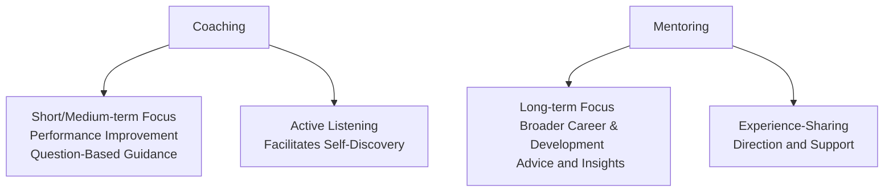
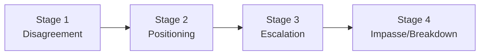

## 33.2 Coaching, Mentoring, Conflict De-escalation

In the realm of advanced leadership and team development, project managers wear many hats that go beyond creating schedules and budgets. Among these roles, coaching, mentoring, and effectively de-escalating conflicts are invaluable for shaping professional growth, handling tension, and fostering team harmony. A project manager who masters these skills becomes the catalyst that propels individuals and teams to excel, even in the most challenging environments. Whether you are a veteran leader or an aspiring professional, understanding these elements will help you navigate the complexities of modern project teams while ensuring outcomes that align with stakeholder expectations.

This section explores the essential practices and frameworks that underpin successful coaching, mentoring, and conflict de-escalation. We will examine why these activities are vital to a project’s success, how to perform them effectively, and the common pitfalls to avoid. By integrating these practices into your leadership repertoire, you will not only elevate team morale and performance, but also significantly reduce costly disruptions.

### The Leader as Coach and Mentor

A leader often toggles between two development-focused roles: the coach and the mentor. While these roles share a common objective—enabling growth, learning, and development—they do so through distinct modes of guidance. Project managers should be aware of these differences to tailor their approach effectively to the individual’s needs and the project’s context.

#### Coaching vs. Mentoring

• Coaching emphasizes performance improvement in the short or medium term.  
• Mentoring focuses on broader career and personal development, typically over a longer horizon.

When adopting a coaching stance, you work closely with team members to set clear, measurable performance goals. You ask incisive questions to help them self-discover pathways for improvement. In contrast, the mentor role is more about sharing knowledge, experiences, and life lessons. While coaches evoke solutions from the coachee, mentors may offer direct advice based on their expertise.

Below is a visual comparison to help clarify these distinctions:

Coaches enable team members to unlock their own potential. Mentors leverage their experience to guide mentees through professional pathways. Both roles can coexist, and being aware of which mode you are applying ensures clarity, effectiveness, and alignment with the individual’s development needs.

#### Benefits of Coaching and Mentoring in Project Management

• Increases capability and motivation: Individuals feel valued, gain new skills, and become more engaged, reducing attrition and improving team stability.  
• Improves communication: Frequent feedback and dialogue lead to clarity in roles, responsibilities, and expectations.  
• Enhances decision-making: By encouraging critical thinking through coaching, team members better anticipate challenges and propose proactive solutions.  
• Develops future leaders: Mentoring shapes the next generation of capable leads, perpetuating a culture of knowledge transfer and continuous improvement.

These benefits connect directly to both the People Domain and the Process Domain in the PMP® Exam Content Outline, reinforcing that effective leadership and team development strategies ultimately optimize project performance.

### Essential Coaching Techniques

A key element of coaching is guiding team members through self-reflection and problem-solving. By asking open-ended questions, offering constructive feedback, and fostering a supportive environment, coaches can unlock hidden talents. Below are a few recognized coaching frameworks and techniques you can integrate immediately:

• GROW Model (Goal, Reality, Options, Will): A structured approach that starts by clarifying the coachee’s goals, examining current reality, brainstorming possible approaches, and concluding with a commitment to specific actions.  
• Active Listening: Provide undivided attention, reflect back what you hear, and validate the speaker’s emotions.  
• Feedforward (versus Feedback): Instead of merely critiquing past performance, suggest positive behaviors to adopt in future scenarios.  

By applying these techniques, project managers help individuals strengthen problem-solving skills, accountability, and adaptability. This is especially relevant in agile or hybrid environments where roles are fluid, and teams need to rapidly respond to evolving project needs.

### Mentoring: Building Long-Term Capability

Mentoring complements coaching by focusing on broader career trajectories and personal growth. You may act as a sounding board, offer networking introductions, or provide guidance on career paths within (and beyond) the organization. Mentoring sessions often involve sharing personal stories, lessons learned, and reviewing current professional challenges in the context of long-term aspirations.

Common elements of successful mentoring relationships:

• Mutual Agreement: Both mentor and mentee should establish clear objectives and agree on a structure and timeline.  
• Clear Boundaries and Roles: Distinguish between mentorship sessions and official performance appraisals.  
• Trust and Confidentiality: Encourage openness by fostering an environment of respect and discretion.  

When done right, mentorship cultivates a supportive culture of development. This contributes to high levels of employee satisfaction and can address potential talent gaps before they become project risks.

### Conflict De-escalation in Project Environments

Conflict in projects can stem from resource constraints, competing stakeholder interests, cultural differences, or unclear roles and responsibilities. In agile settings, conflict might arise over prioritization in the product backlog or allocation of sprint tasks. In traditional predictive settings, issues may involve scope changes or performance disagreements. Regardless of the environment, the aim of conflict resolution is to transform disagreements into constructive dialogue.

#### Recognizing Early Signs of Conflict

Addressing conflict early often prevents deeper rifts later. Be alert to warning signals such as:  
• Persistent tension or silence during meetings  
• Lowered team morale or absenteeism  
• Edge comments, sarcasm, or open hostility  

Project managers should highlight these early indicators in stand-ups or check-ins, encouraging open and honest communication. Quick action can prevent conflict from escalating, keeping the project on track.

#### The Conflict Escalation Path

Conflict typically moves through several stages:

1. Disagreement: Individuals simply hold divergent views.  
2. Positioning: Each party becomes more entrenched in their viewpoint.  
3. Escalation: Emotions run high, prompting friction and adversarial behavior.  
4. Impasse/Breakdown: Relationships sour and the dispute threatens project integrity.

The earlier you spot the progression, the simpler it is to implement conflict de-escalation techniques. Once at impasse, professional relationships or project outcomes may be irreparably harmed.

### Conflict De-escalation Frameworks and Techniques

#### Thomas-Kilmann Conflict Mode Instrument (TKI)

While not a formal part of the PMBOK® Guide, many project managers find the Thomas-Kilmann instrument helpful in diagnosing conflict styles: Competing, Accommodating, Avoiding, Collaborating, and Compromising. Recognizing the conflict modes used by team members allows you to tailor your de-escalation approach.

• Competing: May require private discussions to ensure fairness.  
• Avoiding: Must be gently encouraged to voice concerns.  
• Collaborating: Incentivize them to co-create solutions.  
• Compromising: Usually open to negotiated settlements.  
• Accommodating: Encourage more assertiveness when their viewpoint is crucial.

#### Key Steps to De-Escalate Conflict

1. **Active Listening & Inquiry**: Gain a thorough understanding of each party’s perspective.  
2. **Establish Common Ground**: Identify and highlight shared goals or values.  
3. **Encourage Joint Problem-Solving**: The focus should be on finding the best solution, not winning an argument.  
4. **Address Emotions**: Acknowledge feelings and frustrations. Failure to do so can prolong or intensify conflicts.  
5. **Facilitate Constructive Dialogue**: Guide the conversation, ensuring civility and mutual respect.  
6. **Agree on Follow-Up Actions**: Ensure accountability by clarifying roles, responsibilities, and expected behavior changes.

### Conflict De-escalation in Virtual/Hybrid Teams

With the increase in remote and hybrid work setups, subtle conflicts can go unnoticed until they become severe. Watch for abrupt changes in tone during communication, frequent delays in responses, or team members who withdraw from virtual collaboration channels. Encourage short but frequent one-on-ones with distributed team members to check in not just on tasks, but also overall morale, career aspects, and intangible stressors.

### Integrating Coaching, Mentoring, and Conflict Resolution

While coaching and mentoring primarily focus on development, conflict de-escalation emphasizes harmony. By interweaving the three:

• A project manager might coach a team member struggling to communicate effectively, addressing interpersonal friction before it grows into major conflict.  
• A more senior resource could mentor a junior colleague by sharing experiences on how to navigate challenging stakeholder relationships.  
• Conflict resolution sessions can conclude with follow-up coaching, ensuring lessons learned are internalized and future incidents are mitigated.

In correlation with the PMBOK® Guide and the PMP® Exam Content Outline, these integrated leadership approaches fall within the “People” domain, particularly in tasks focused on managing conflict, supporting team performance, and enhancing individual growth.

### Real-World Case Study: Coaching, Mentoring, and Conflict De-escalation in Action

A mid-sized software development project faced significant deadline pressures due to a competitive product launch. Tensions rose between the lead developer and the quality assurance (QA) manager about testing scope. The lead developer felt QA was excessively gatekeeping progress; QA felt the developer was ignoring critical testing concerns to meet deadlines.

Recognizing the signs of conflict, the project manager held a confidential coaching session with both individuals separately. In these sessions, the coach approach was used to guide each person to articulate their frustration, reflect on their role in the conflict, and propose potential solutions.

A subsequent mentoring session was arranged with a senior architect who had previously resolved a similar tension. By sharing real-world experiences of code quality trade-offs under time constraints, the mentor provided broader perspective and assured them these challenges were typical but surmountable.

Finally, a moderated conflict resolution meeting brought both parties together to co-create an action plan. Each party agreed on structured acceptance criteria and a short feedback loop. As a result, new respect and trust formed between them, leading to a smoother handover of deliverables, improved product quality, and an on-time launch.

### Best Practices and Common Pitfalls

• **Best Practices**  
  - Build psychological safety: Encourage open communication by creating an environment of mutual respect.  
  - Tailor your approach: Practice situational leadership. Sometimes an individual needs direct coaching, other times broad mentoring, or conflict resolution.  
  - Maintain confidentiality: Trust is the backbone of all three activities—coaching, mentoring, and conflict de-escalation.  
  - Document lessons learned: Share knowledge across teams, especially where conflict resolution or mentorship experiences can benefit others.

• **Common Pitfalls**  
  - Mixing roles: Attempting to coach while simultaneously disciplining can send mixed signals.  
  - Forcing advice: In coaching, resist the urge to jump straight to solutions; let individuals own their discovery process.  
  - Avoiding conflict: Overly cautious managers who shy away from addressing tension can inadvertently fuel further unrest.
  - Neglecting follow-up: Without follow-up, any resolution or coaching plan may fail to stick, causing issues to resurface.

### Recommendations and Further Reading

• “Coaching for Performance” by Sir John Whitmore stands as a foundational text for coaching fundamentals.  
• “The Mentor’s Guide” by Lois J. Zachary offers insights into constructing meaningful mentor-mentee relationships.  
• “Crucial Conversations” by Patterson, Grenny, McMillan, and Switzler provides strategies for navigating high-stakes interpersonal conflicts.  
• PMI’s “Leadership in Project Management” webinars shed light on case studies where conflict resolution and mentorship significantly improved project outcomes.

Integrating these strategies will strengthen your role as a leader, aligning with the PMI principles of collaboration, stakeholder engagement, and creating psychologically safe and inclusive environments (see Chapter 5 in this text). Through coaching, mentoring, and de-escalating conflict, you champion a new level of professionalism and trust among the project team, ultimately driving better results and forging a path for continuous learning and development.

## Strengthen Your Leadership Skills: Coaching, Mentoring, & Conflict De-escalation Quiz



### Coaching focuses on:
- [ ] Providing authoritative direction over a long period
- [x] Short-to-medium-term performance improvement
- [ ] Sharing personal experiences and career advice
- [ ] Neglecting feedback in favor of self-discovery

> **Explanation:** Coaching is generally oriented toward immediate performance improvements and short- to medium-term goals, in contrast to a mentor's longer-term guidance and career insights.

### Which statement best describes a mentor’s role?
- [ ] Directing daily tasks and assigning responsibilities
- [ ] Overseeing compliance with project technical standards
- [ ] Conducting formal performance evaluations
- [x] Sharing experiences and guiding broader professional development

> **Explanation:** Mentors provide insights drawn from their experiences to guide mentees in long-term career and personal growth, rather than day-to-day oversight or formal evaluations.

### In the Thomas-Kilmann conflict model, accommodating means:
- [x] Prioritizing others' needs over one’s own
- [ ] Avoiding communication altogether
- [x] Collaborating to find a win-win solution
- [ ] Aiming to defeat the opposing party’s argument

> **Explanation:** Accommodating involves prioritizing the relationship and the other person’s needs or concerns, often at the expense of one’s own position. Meanwhile, collaborating seeks a balanced solution beneficial to both parties.

### Conflict is best de-escalated by:
- [x] Engaging in active listening and acknowledging emotions
- [ ]Ignoring the issue and hoping it resolves itself
- [ ] Immediately imposing a top-down resolution
- [ ] Pushing blame on a single stakeholder

> **Explanation:** Active listening, acknowledging emotions, and fostering open dialogues create space for de-escalating conflicts, transforming them into more constructive discussions.

### A project manager would likely coach a team member when:
- [x] The individual needs immediate skill development or performance improvement
- [ ] The person seeks career advice for the next decade
- [x] A large, unresolved cross-department conflict needs corporate escalation
- [ ] The mentor is unavailable to meet

> **Explanation:** Coaching is suitable for targeted performance improvements in the short to medium term, focusing on resolving skill gaps, clarifying tasks, or improving a specific aspect of performance.

### Common pitfalls in coaching include:
- [x] Mixing disciplinary action and coaching feedback
- [ ] Maintaining consistent and active listening
- [ ] Asking open-ended questions
- [ ] Providing constructive insights

> **Explanation:** Mixing disciplinary measures with coaching feedback can lead to confusion and undermine trust. Effective coaching requires clarity of purpose and a supportive environment free from punitive undertones.

### A primary takeaway from mentoring sessions should be:
- [x] Broader career insight and personal development paths
- [ ] Micromanagement techniques
- [x] Immediate conflict resolution strategies
- [ ] Sporadic one-off advice without a follow-up plan

> **Explanation:** Mentoring focuses on long-term personal and professional growth. A structured, ongoing dialogue helps mentees develop purpose and direction beyond immediate tasks.

### In resolving conflicts in virtual teams, a project manager should:
- [x] Hold frequent check-ins to detect subtle signs of tension
- [ ] Relegate all communications to email to have a written record
- [ ] Rely solely on self-resolution among team members
- [ ] Assume remote workers do not experience interpersonal conflicts

> **Explanation:** Virtual or hybrid team conflicts can be less visible, so frequent, intentional check-ins are essential to catch issues before they escalate. Fostering dialogue is key, rather than neglecting the possibility of remote friction.

### Which factor should be emphasized at the end of a conflict resolution session?
- [x] Clear next steps and accountability for actions
- [ ] The superiority of one party's viewpoint
- [ ] Re-opening old disagreements to ensure fairness
- [ ] Immediate team restructuring

> **Explanation:** Ensuring clarity around next steps—who owns them, the deadlines, and how to measure success—helps maintain the resolution’s effectiveness and prevents issues from resurfacing.

### A true statement regarding both coaching and mentoring is:
- [x] Both aim to enhance professional growth
- [ ] Both focus solely on conflict resolution
- [ ] Both deliver short-term performance solutions
- [ ] Neither requires trust or confidentiality

> **Explanation:** Coaching and mentoring share the overarching goal of professional and personal development, though the time frames and methods differ. Both rely heavily on trust and confidentiality to be effective.



## PMP Mastery: 1500+ Hard Mock Exams with Full Explanations 

Looking to crush the PMP exam with confidence? Dive deep into 6 rigorous mock exams totaling 1500+ advanced-level questions, each accompanied by clear, step-by-step explanations. Hone your test-taking strategies, master complex topics, and build the resilience you need on exam day. Perfect for serious PMs aiming beyond fundamentals.

Enroll now:  
[PMP Mastery: 1500+ Hard Mock Exams with Exceptional Clarity & Full Explanations](https://www.udemy.com/course/pmp-2025/?referralCode=CF83A54BC86BE27F9AFE)

_Disclaimer: This course is not endorsed by or affiliated with the PMI examination authority. All content is provided purely for educational and preparatory purposes._
