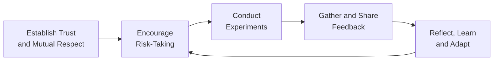

## 33.3 Fostering Innovation and Psychological Safety

Innovation seldom flourishes in environments constrained by fear, discouragement, or rigidity. Today’s project leaders are called upon to create climates where team members feel comfortable raising unconventional ideas, challenging assumptions, and learning from failures rather than hiding them. This section explores how to cultivate psychological safety—an atmosphere of trust, respect, and openness—within project teams to unleash new levels of creativity and productivity.

Effective innovation requires not just novel ideas, but the systematic ability to test them, glean insights from each iteration, and integrate knowledge back into the project. Psychological safety serves as the bedrock of this cycle, ensuring that regardless of risk or setback, team members remain motivated and united toward shared objectives.  

## Introduction

In advanced leadership (see Chapter 33.1 “Emotional Intelligence and Cultural Intelligence” and Chapter 33.2 “Coaching, Mentoring, Conflict De-escalation”), fostering innovation and psychological safety is more than a buzz phrase; it is a strategic imperative. Leaders must orchestrate environments where:

• Team members feel respected and acknowledged.  
• Constructive feedback is valued.  
• Mistakes are treated as opportunities for learning.  
• Risk-taking is encouraged within a structured framework.  

When these conditions are in place, a team can progress beyond standardized, safe solutions and become a source of transformative ideas that benefit the entire organization and its stakeholders.

## Understanding Psychological Safety

Psychological safety refers to a shared belief that the team is safe for interpersonal risk-taking. This concept, popularized by Harvard Business School professor Amy Edmondson, captures the importance of trust, acceptance of diverse viewpoints, and tolerance for mistakes as stepping stones to learning.

A psychologically safe environment allows members to:  
• Voice dissenting opinions, even to senior stakeholders, without fear of retribution.  
• Offer fresh perspectives or critique existing processes.  
• Experiment with novel approaches and confidently share lessons learned if they fail.  
• Probe complexities and uncertainties that might otherwise be glossed over.  

By promoting respect and empathy in daily interactions, team leaders help individuals transcend self-preservation concerns. This fosters deeper inquiry and spurs creative problem-solving.

## Key Drivers of Innovation in a Team Setting

Teams that exhibit elevated innovation often share common virtues, each reinforced by psychological safety:

• Curiosity – Encouraged questioning and exploration.  
• Experimentation – Trial-and-error cycles supported by quick feedback loops.  
• Collaboration – Constructive debate and interdisciplinary ideation.  
• Continuous Learning – Systematic reflection on missteps and newly gained knowledge.  

When team members trust they will not be ridiculed for “offbeat” approaches, the project benefits from a wide array of solution pathways. These varied perspectives can significantly increase the chances of discovering an optimal path forward.  

## Building a Culture of Trust and Respect

Psychological safety emerges from trust and respect. Although intangible, trust can be cultivated with deliberate leadership behavior:

• Demonstrate Active Listening – Give full attention to each speaker. Reflect their statements to ensure understanding, and validate their ideas.  
• Consistent Behavior – Maintain reliability in responses. If a leader praises open communication in principle but punishes dissent in practice, trust quickly erodes.  
• Transparent Decision-Making – Explain the rationale behind significant project decisions (see Chapter 8.1, “Building a High-Performing Team Culture,” for additional insights).  

Once established, trust and respect cannot be taken for granted. Leaders must nurture them continuously, especially in high-pressure environments where deadlines or urgent tasks might tempt a return to top-down, fear-based management.

## Encouraging Experimental Mindsets (“Safe to Fail”)

Innovation demands calculated risks. “Safe to fail” experiments allow teams to test ideas at limited cost and with controlled impact. This approach resonates strongly with agile methodologies (see Chapter 24, “Agile Foundations and the Agile Practice Guide,” and Chapter 25, “Agile Frameworks and Methodologies”):

1. Define the Experiment – Clarify objectives, constraints, and success criteria.  
2. Conduct Rapid Testing – Use sprints, prototypes, or pilot initiatives to explore feasibility with minimal resources.  
3. Gather Feedback – Involve stakeholders and experts to evaluate outcomes quickly and transparently.  
4. Reflect and Adapt – Encourage detailed retrospectives (see Chapter 26.2, “Daily Standups, Iteration/Sprint Planning, Reviews, Retrospectives”) to capture learnings and integrate them into revised conclusions.  

By embedding these steps into the project cycle, teams pivot from a fear of failure to an eagerness for discovery. If an experiment does not yield the hoped-for result, it still provides valuable insights that can shape the next stage of the project or inform future initiatives.

## Open Communication Strategies

Effective leaders ensure free-flowing dialogue across hierarchical and functional boundaries. Strategies may include:

• Dedicated Brainstorming Sessions – Use techniques like mind mapping, design thinking, or “Crazy Eight” sprints (eight quick sketches in eight minutes).  
• Anonymous Idea Channels – Sometimes, anonymity can spark more candid contributions. Online suggestion boxes or anonymous surveys remove inhibitions born of hierarchical fears.  
• Collaborative Tools – Platforms like Miro, Trello, or Microsoft Teams can serve as collaborative spaces for asynchronous ideation.  
• Weekly Check-Ins – Short, focused sessions for sharing progress, blockers, and improvement suggestions.  

The emphasis on transparency and openness ensures that innovative thinking is not restricted to a select few but becomes everyone’s responsibility.

## Using Feedback Loops and Structured Reflection

Sustaining innovation requires ongoing feedback loops. Through structured reflection, teams can convert lessons learned into actionable insights. Consider employing:

• Iteration Reviews – At the end of each development cycle, evaluate what worked, what failed, and why.  
• Retrospective Formats – The “Start, Stop, Continue” approach, or the “Sailboat Retrospective,” to pinpoint team dynamics.  
• Knowledge-Sharing Sessions – Regular brown-bag lunches where team members share new technologies, project experiences, or best practices.  

Teams that treat feedback as a gift rather than criticism remain resilient under uncertainty. This aligns with risk management approaches discussed in Chapters 14 (“Uncertainty Performance Domain”) and 22 (“Risk and Uncertainty Management (Revisited)”).

## Leadership Practices That Foster Innovation

### Model Vulnerability

By admitting their own limitations or mistakes, leaders establish that it is acceptable to be imperfect. This display of humility is tremendously powerful in cultures marked by hierarchical distance.

### Reward Creative Thinking

Publicly acknowledge individuals who propose breakthroughs or alternative approaches, even if these do not immediately lead to project gains. Intrinsic rewards, such as recognition and professional growth opportunities, often spur further innovation.

### Provide Psychological “Air Cover”

Act as a buffer between the team and external negativity. If upper management criticizes explorative work, ensure your team feels supported. Shield them, especially if they acted responsibly and within agreed-upon risk boundaries.

### Enable Cross-Functional Collaboration

Bring together diverse skill sets—development, operations, quality assurance, marketing, etc.—to encourage cross-pollination of ideas. This approach correlates with the multi-disciplinary teams described in Chapter 8.4, “Virtual Teams and Cross-Cultural Collaboration.”

## Mermaid Diagram: Innovation Flow in a Psychologically Safe Team

Below is a simple diagram illustrating how psychological safety underpins the iterative cycle of innovation within a project team.

**Diagram Explanation**:  
• “Establish Trust and Mutual Respect”: The foundation for all interactions.  
• “Encourage Risk-Taking”: With trust in place, team members feel confident venturing new ideas.  
• “Conduct Experiments”: Practical testing of new concepts in controlled conditions.  
• “Gather and Share Feedback”: Fosters transparency and quick course corrections.  
• “Reflect, Learn and Adapt”: Solidifies new insights, fueling the next risk-taking cycle.

## Overcoming Barriers and Pitfalls

Despite best intentions, several obstacles can hinder innovation and psychological safety:

• Power Distance – Large hierarchical gaps may deter open discussion. Mitigate by flattening authority lines in meetings and actively soliciting input.  
• Fear of Judgment – Team members from certain organizational cultures or backgrounds may hesitate to share divergent opinions. Prioritize inclusive facilitation and empathic leadership.  
• Excessive Criticism – Overly harsh feedback can quash experimentation. Ensure a balanced approach: “Yes, and …” or “Here’s what worked well, and here’s what might improve.”  
• Undue Focus on Short-Term Results – Intensely KPI-driven environments might stifle risk. Demonstrate how innovation aligns with long-term strategic value, supporting an environment open to creative efforts (see Chapter 28, “Aligning Projects with Organizational Strategy,” on bridging project results with corporate vision).  
• Underinvestment in Team Development – If training, coaching, and continuous learning are neglected, the team’s innovation capacity diminishes.  

Addressing these pitfalls often involves consistent reinforcement. Leaders must enact supportive policies and maintain vigilance to detect signs of dysfunction early.

## Practical Example: Scenario in a Tech Startup

A software development startup frequently faced project delays due to last-minute fixes. The project manager introduced weekly “Innovation Huddles,” encouraging developers, testers, and designers to propose at least one “out of the box” idea for quality improvements. Management explicitly stated that no idea would be dismissed without discussion.

1. Ideas were collected in a shared repository, visible to everyone.  
2. Team city-based builds integrated small pilot experiments every third sprint.  
3. A weekly 30-minute retro was dedicated to discussing lessons from experimental builds.  

Result: Several attempts failed, but the startup discovered an effective approach to continuous integration that halved the number of last-minute fixes. Importantly, team morale soared as members realized the organization valued their creativity.

## Real-World Case: Healthcare Provider

A large hospital sought to streamline patient intake processes across multiple wards. Historically, staff were reluctant to speak up about inefficiencies or patient dissatisfaction, fearing blame. Under new project leadership, the hospital started monthly “Tell Us Everything” sessions where frontline workers could anonymously highlight pain points.

• Leadership introduced explicit guidelines that no presented idea or complaint would face punitive consequences.  
• A small cross-functional committee triaged and tracked each suggestion.  
• When a nurse’s suggestion resolved an issue, she was invited to lead a pilot program across wards.  

Over the next year, patient intake times dropped by 20%, and staff attrition rate improved notably. The project team attributed these results primarily to the heightened psychological safety, which unlocked grassroots process improvements.

## Measuring Success and Sustaining Momentum

Assessing the impact of initiatives around psychological safety and innovation involves both qualitative and quantitative measures:

• Qualitative – Anonymized team surveys measuring perceived openness, trust, and willingness to take interpersonal risks.  
• Quantitative – Number of new ideas submitted, percentage of experiments conducted, and rate of improvements implemented.  
• Impact on Product/Project Metrics – Decreased cycle times, fewer defects, or enhanced stakeholder satisfaction.  

Continuously publicize “innovation wins,” share data on pilot successes, and keep dialogues active. Over time, these practices become part of the organization’s cultural DNA, enabling sustained innovation.

## Table: Sample Metrics for Psychological Safety

| Metric                             | Description                                                | Data Gathering Method      |
|------------------------------------|------------------------------------------------------------|----------------------------|
| Team Trust Score                   | Measures perceived respect and support among team members | Anonymous online surveys   |
| Idea Volumes                        | Tracks counts of new proposals made per iteration         | Project management tools   |
| Experimentation Rate              | Percentage of sprints/features that include pilot tests    | Sprint retrospectives      |
| Feedback Utilization              | How many feedback suggestions are actively implemented     | Lessons learned database   |
| Employee Retention / Morale Index | Relates innovation practices to reduced turnover           | HR surveys, exit interviews|

## Practical Techniques and Tools

• Brainwriting: Like brainstorming, but individuals first note ideas in writing to avoid groupthink or intimidation.  
• Liberating Structures: A set of 33 facilitation techniques encouraging broader, inclusive conversations.  
• Idea Kanban: Visualize the status of new suggestions. This can align with agile boards, from “Proposed” to “In Experiment” to “Implemented.”  
• Peer Coaching Circles: Small peer groups offering mutual coaching sessions. It helps build trust and fosters an environment of supportive learning.

## Conclusion

Cultivating psychological safety does not guarantee that every risky idea will succeed, but it encourages a climate where genuine innovation becomes a norm. By nurturing openness, respectful feedback, structured experimentation, and collective ownership, project managers not only spur creativity but also reinforce robust collaboration and professional growth. High-performing organizations that prioritize psychological safety thrive amidst uncertainty, continuously adapting to evolving project and market demands.

Fostering these practices aligns with many of the PMP® Exam domains—in particular, the People Domain (Chapter 6.1) and the Agile/Hybrid environment focus (Chapter 6.4). As you prepare for the PMP® exam, remember that psychological safety fosters flexible, collaborative teams capable of delivering impactful results. And in practical, real-world projects, these same principles translate directly into higher success rates, more engaged stakeholders, and robust organizational performance.

## References for Further Exploration

• Edmondson, Amy. “The Fearless Organization: Creating Psychological Safety in the Workplace for Learning, Innovation, and Growth.” Wiley, 2018.  
• Pink, Daniel H. “Drive: The Surprising Truth About What Motivates Us.” Riverhead Books, 2009.  
• Schein, Edgar H., and Peter A. Schein. “Organizational Culture and Leadership.” Wiley, 5th Edition, 2016.  
• PMI. "PMIstandards+™." An online tool for PMI members offering resources on emergent practices.  
• Chapters 8 and 33 of this book, focusing on team performance, collaborative leadership, and advanced leadership development.

--------------------------------------------------------------------------------

## Test Your Knowledge: Fostering Innovation & Psychological Safety



### Which of the following is the best description of psychological safety within a team environment?
- [ ] Allowing team members to work in isolation and report findings only to leadership
- [x] The shared belief that members can take interpersonal risks without negative consequences
- [ ] A culture that encourages only top-management and stakeholders to propose ideas
- [ ] Imposing strict rules to minimize any form of risk-taking
> **Explanation:** Psychological safety centers on collaboration, open communication, and the shared absence of fear when expressing opinions or making mistakes.

### What is the primary advantage of encouraging “safe to fail” experiments?
- [ ] It guarantees that all experiments will succeed without any budget overruns
- [x] It promotes learning from failures at a manageable scale
- [ ] It allows leadership to assign blame more easily
- [ ] It restricts team members to a single approach
> **Explanation:** Safe-to-fail experiments offer quick and controlled insights. Even if initial trials fail, learning is gained with minimal risk, enabling continuous improvement.

### Which of the following leadership behaviors can help establish psychological safety?
- [x] Modeling vulnerability by admitting personal mistakes
- [ ] Withholding feedback and avoiding difficult discussions
- [ ] Publicly criticizing ideas that seem unorthodox
- [ ] Focusing solely on performance metrics to evaluate team members
> **Explanation:** Leaders who own up to their own fallibility help create a trustworthy environment. Team members see it is acceptable to be imperfect and continue learning.

### In an environment of psychological safety, how are mistakes typically viewed?
- [ ] As critical failures leading to disciplinary action
- [ ] As inconsequential events that are simply ignored
- [ ] As opportunities to shame individuals and prevent future risks
- [x] As learning opportunities that can guide iterative improvements
> **Explanation:** A psychologically safe setting treats mistakes as stepping stones to learning, ensuring the lessons gained can inform future project phases.

### Which technique is most suitable for teams that want to avoid “groupthink” during idea generation?
- [x] Brainwriting sessions before group discussions
- [ ] Prolonged plenary debates without structure
- [x] Pairing individuals for quick peer collaboration
- [ ] Formal presentations from a single department
> **Explanation:** Brainwriting and small-group collaboration allow individuals to form ideas independently, reducing the social pressure and bias often found in large group brainstorms.

### Why is cross-functional collaboration beneficial for fostering innovation?
- [x] Diverse perspectives can spark unique, creative solutions
- [ ] It keeps team members confined to their departmental roles
- [ ] It ensures only one function has input on the project
- [ ] It eliminates the need for specialized expertise
> **Explanation:** Collaborative efforts among diverse competencies enable holistic understanding, spurring the discovery of unconventional, high-impact solutions.

### How can leaders encourage open communication within a culturally diverse global project team?
- [x] By using inclusive facilitation methods and providing equal opportunities to speak
- [ ] By limiting communication channels to only the project manager
- [x] By showing empathy and being mindful of cultural nuances
- [ ] By discouraging divergent viewpoints to maintain harmony
> **Explanation:** Leaders strengthen psychological safety by actively inviting everyone to share, practicing cultural sensitivity, and respecting diverse viewpoints and communication styles.

### What is one key reason to use anonymous idea channels?
- [x] Reduces fear of judgment, enabling more candid feedback
- [ ] Disguises all project requirements
- [ ] Eliminates the need for brainstorming sessions
- [ ] Ensures only team leaders can provide feedback
> **Explanation:** When submissions are anonymous, individuals no longer worry about personal repercussions or reputational risks, resulting in more honest dialogue.

### Which metric best helps measure the effectiveness of a psychologically safe environment?
- [x] Team Trust Score
- [ ] Number of disciplinary notices issued
- [ ] Mandatory overtime hours spent on tasks
- [ ] Frequency of budget cuts
> **Explanation:** Team Trust Score—often collected confidentially—indicates whether team members perceive enough openness to raise concerns and share innovative ideas.

### In a psychologically safe climate, is it generally recommended to celebrate both successes and failures?
- [x] True
- [ ] False
> **Explanation:** Celebrating both achievements and learning from failures motivates the team to take risks, feed curiosity, and refine processes, ultimately driving ongoing innovation.



--------------------------------------------------------------------------------

## PMP Mastery: 1500+ Hard Mock Exams with Full Explanations 

Looking to crush the PMP exam with confidence? Dive deep into 6 rigorous mock exams totaling 1500+ advanced-level questions, each accompanied by clear, step-by-step explanations. Hone your test-taking strategies, master complex topics, and build the resilience you need on exam day. Perfect for serious PMs aiming beyond fundamentals.

Enroll now:  
[PMP Mastery: 1500+ Hard Mock Exams with Exceptional Clarity & Full Explanations](https://www.udemy.com/course/pmp-2025/?referralCode=CF83A54BC86BE27F9AFE)

_Disclaimer: This course is not endorsed by or affiliated with the PMI examination authority. All content is provided purely for educational and preparatory purposes._
