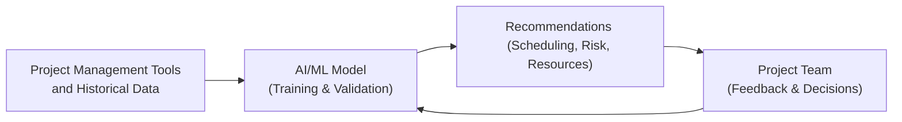
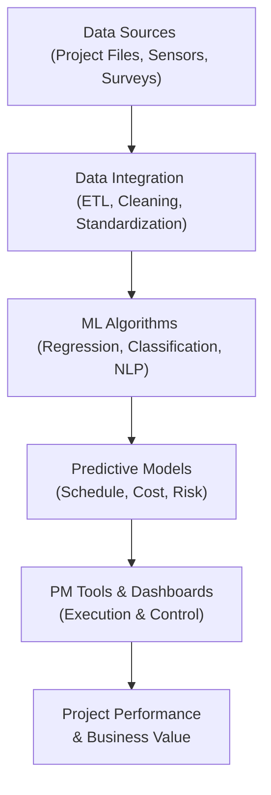

## 34.1 AI and Machine Learning

Artificial Intelligence (AI) and Machine Learning (ML) are transforming traditional project management by automating data-intensive processes, enabling predictive insights, and informing more strategic decision-making. In the context of project management, AI and ML are not just buzzwords or experimental concepts; they represent powerful tools that can fundamentally improve effectiveness across critical aspects like scheduling, risk assessment, resource allocation, and stakeholder engagement. They also help project teams transform massive amounts of data into actionable intelligence, providing leaders with timely guidance on where to focus their efforts to ensure project success. 

In this section, we will explore how AI and ML algorithms operate, describe typical use cases in project management, and provide best practices for implementing these technologies within the framework of the Project Management Body of Knowledge (PMBOK® Guide Seventh Edition). We will also present practical examples, highlight common pitfalls, and offer strategies to overcome the obstacles that commonly arise when introducing AI-driven solutions to project environments.

### Understanding AI and Machine Learning

AI refers to the broader concept of machines or software mimicking cognitive functions such as learning, pattern recognition, and problem-solving. Machine Learning (ML), a subset of AI, focuses on enabling systems to learn and improve outcomes from data without being explicitly programmed for each scenario.

• AI involves tasks that resemble or replicate human intelligence.  
• ML refines its predictive or analytical capabilities incrementally, drawing insights from historical patterns in data.  

In a typical project setting, AI/ML models can analyze project historical data, recognize potential risk signals early, forecast resource bottlenecks, or recommend scheduling adjustments. By leveraging these features, organizations can dynamically respond to shifts in project conditions with a higher level of confidence.

### Relationship to Other Project Management Domains

AI and ML support many areas covered in this guide:  
• In the Planning Performance Domain (Chapter 10), AI can optimize project schedules and budgets.  
• Within the Stakeholder Performance Domain (Chapter 7), advanced analytics can help predict stakeholder sentiment, prioritize engagement strategies, and unveil hidden influencers.  
• In the Measurement Performance Domain (Chapter 13), AI-driven dashboards offer real-time project performance metrics and advanced forecasting.  
• In Risk and Uncertainty Analysis (Chapters 14 and 22), ML algorithms can identify risk patterns in large data sets, enabling more proactive risk response planning.

### Key Use Cases and Benefits

AI and ML excel in activities that traditionally consume significant amounts of time, resources, or human processing capacity. Common benefits include:

• Automation of Routine Tasks. Natural language processing (NLP) can handle meeting minutes, produce status reports, or automatically assign tasks in project management software. This automation not only saves time but also reduces human error.

• Predictive Scheduling. By analyzing historical data from earlier projects, AI can recommend realistic timelines and resource allocations, improving schedule adherence. 

• Dynamic Risk Assessment. Complex risk environments benefit from ML models that learn from actual project performance data (e.g., cost overruns and schedule delays) to identify emerging risks early.

• Enhanced Decision Support. Powering project managers with data-driven recommendations supports both short-term tactical maneuvers and long-term strategic adjustments, aligning with enterprise-level objectives.

• Resource Optimization. AI can help assign the best resources to tasks based on skill sets, availability, or cost parameters, leading to improved team utilization and job satisfaction.

### How AI and Machine Learning Work in Project Contexts

From a technical perspective, AI/ML solutions typically involve the following steps:

1. Data Collection and Preparation  
   Clean, consistent, high-quality data is at the core of any successful AI initiative. In project management, data might include:  
   • Historical project performance metrics (cost, schedule, etc.)  
   • Risk databases  
   • Stakeholder feedback forms  
   • Work breakdown structures (WBS)  
   • Resource usage logs  

2. Model Building and Training  
   During ML model training, the system detects patterns (e.g., certain tasks consistently run over schedule under specific conditions). Different algorithms (linear regression, decision trees, neural networks, etc.) might be tested to determine which model offers the best predictive accuracy.

3. Deployment and Integration  
   Once trained, the model is integrated into the project management workflow or software. For instance, the model might produce risk alerts or scheduling recommendations directly within a project management platform.  

4. Continuous Monitoring and Improvement  
   ML models require consistent feedback and continuous improvement, especially as project conditions evolve. Real-time data streams might further refine the model so it remains up-to-date and relevant.

### Practical Examples and Case Studies

Below are some illustrative scenarios where organizations have successfully employed AI and ML in their project management processes:

• Automated Schedule Optimization  
  A construction company integrated an ML-based platform to compare ongoing project schedules with data from hundreds of previous construction projects. The system alerted project managers if a specific phase (like foundation work) was trending behind schedule given local environmental conditions. This allowed early corrective actions such as adding more personnel or adjusting shift schedules.

• Predictive Risk Management  
  In software development, an agile team used AI-based sentiment analysis on daily stand-up transcripts and issue-tracking software to detect project stress signals. By recognizing patterns in negative language or repeated blockers, the tool flagged potential team morale issues that could escalate into broader performance risks.

• Resource and Cost Efficiency  
  A multinational firm utilized ML to analyze resource allocation across multiple concurrent projects. The system highlighted redundancies in QA testing tasks performed by separate teams. Consolidating and balancing these tasks meant more efficient resource usage and cost savings.

### AI/ML in Agile, Hybrid, and Predictive Environments

Teams adopting agile or hybrid models can integrate AI more seamlessly into iterative processes, where insights from sprints or iterations can be used to refine the ML models quickly. Predictive (waterfall) projects, while less flexible, can still realize substantial gains from AI-driven scheduling, cost forecasting, and risk analytics. Over time, consistent feedback loops between project data and the AI/ML model help ensure alignment with either agile or plan-driven frameworks.

### Best Practices

• Begin with Data Quality and Governance  
  Lay a solid data foundation by standardizing how you collect, store, and manage project information. Without proper governance, AI/ML models will produce inaccurate recommendations.

• Start Small and Scale  
  Target a specific problem area—like schedule optimization—build a proof of concept, and iterate. Once value is demonstrated, gradually expand AI/ML capabilities to other areas.

• Tailor AI/ML Models  
  Just as you tailor project methods to organizational context (Chapter 5.6), tailor your AI/ML solution to unique project and organizational dynamics (scope, complexity, tools, culture).

• Combine Human Expertise with AI Insights  
  AI is most effective when viewed as an augmented decision-making resource. Human judgment remains essential for final decisions, particularly in uncertain or ambiguous scenarios.  

• Monitor and Update Models  
  Continuously retrain models as new data is generated. Projects, teams, and markets evolve rapidly, so the underlying assumptions need to be rechecked for accuracy and relevance.

### Implementation Challenges

Despite the clear benefits, AI/ML implementation in project management comes with challenges:

• Data Scarcity or Poor Quality  
  Gaps in data availability, inconsistent record-keeping, or missing data fields can undermine AI-driven insights.

• Organizational Resistance  
  AI can spark fear of job displacement or trust issues. Communicate the value of AI to teams, emphasizing that AI augments human roles rather than replaces them.

• Ethical and Compliance Concerns  
  Especially when using sensitive data, be mindful of privacy laws (such as GDPR) and guidelines that govern data usage. Ethical guidelines must be established to handle content used by AI systems fairly and transparently.

• Technology Integration  
  Integrating AI solutions into legacy systems or multiple platforms can be complex, often requiring specialized technical support.

### Diagram: AI-Driven Project Management Workflow

Below is a simplified diagram illustrating how data flows from project management tools to an ML model that provides decision-making insights.

In this diagram, the AI model receives new data and user feedback in a continuous loop. Recommendations—ranging from revised schedules to potential risk triggers—are fed back to the project team. The team’s actions and results provide fresh data to update the AI/ML model.

### Leveraging Data Analytics and Dashboards

As explored in the Measurement Performance Domain (Chapter 13), dashboards and real-time reports can significantly enhance transparency. Integrating AI-predicted trends into dashboards helps project managers spot deviations from baselines quickly and compare prospective scenarios. For example, a heatmap might highlight tasks that have a high probability of exceeding their allocated budget based on current spend patterns.

### Emerging Frontiers

Technologies such as Natural Language Processing (NLP), deep learning, and reinforcement learning continue to expand AI’s potential within project management. Furthermore, AI-driven analytics tailored to specific industries (e.g., healthcare, construction, IT) will become increasingly common, offering specialized capabilities that align with unique project requirements. 

### Future Considerations and Ethical Use

As AI software evolves, project managers must remain vigilant about the ethical implications of using automated algorithms to make or recommend decisions. Bias in data sets, lack of transparency in ML models, and privacy breaches can compromise trust and lead to suboptimal project outcomes. Structuring ethical guidelines, establishing oversight committees, and ensuring compliance with relevant regulations are crucial steps in the responsible use of AI.

### References for Further Exploration

• “Artificial Intelligence for Project Management”: Detailed PMI whitepapers and case studies showcasing real-world applications.  
• “Agile Practice Guide”: Insights on iterative methods that synergize well with AI/ML’s continuous learning approach.  
• “Deep Learning” (MIT Press Essential Knowledge Series) by Ian Goodfellow, Yoshua Bengio, and Aaron Courville.  
• Online courses and certifications from platforms like Coursera or edX on AI, ML, and data analytics.  

Below is a high-level diagram showing multiple layers of AI integration into project management, offering a more holistic view of how data transforms into actionable insights.

In this layered view:  
1. Data Sources feed into Data Integration processes that prepare information for analysis.  
2. Machine Learning Algorithms apply various techniques to derive insights.  
3. Predictive Models deliver actionable intelligence on schedules, budgets, and risks.  
4. Project Management Tools & Dashboards display these insights for teams to implement them.  
5. The final outcome is improved project performance and enhanced business value.

---

## Quiz: Test Your Knowledge on AI and Machine Learning in Project Management



### AI models in project management typically excel at which of the following tasks?

- [x] Automating repetitive data analysis
- [ ] Eliminating the need for human stakeholders
- [ ] Guaranteeing zero project risks
- [ ] Removing the scheduling approvals process

> **Explanation:** AI and machine learning models are highly effective at data analysis and pattern recognition, but they do not replace essential human oversight or guarantee the elimination of all risks.

### Which of the following is the first step in implementing an AI/ML solution in a project environment?

- [x] Collecting relevant, high-quality data
- [ ] Replacing all manual processes with AI workflows
- [ ] Creating advanced neural networks by default
- [ ] Hiring only AI specialists

> **Explanation:** Data preparedness is crucial. Without accurate, consistent data, even the most advanced AI solutions will fail to deliver reliable predictions.

### In a hybrid project environment, how can AI most effectively be used?

- [x] By providing rapid feedback loops on schedule adherence and risk signals
- [ ] By forcing the project to shift entirely to a waterfall model
- [ ] By eliminating the need for scrum ceremonies
- [ ] By removing cross-functional team interactions

> **Explanation:** Hybrid methods combine the flexibility of agile approaches with elements of traditional approaches, enabling AI to provide continuously updated insights that feed into iterative planning and control.

### What is a key benefit of Natural Language Processing (NLP) in project management?

- [x] It can analyze meeting transcripts and detect emerging risk cues
- [ ] It automatically creates contracts without legal review
- [ ] It eliminates all administrative tasks
- [ ] It guarantees financial compliance

> **Explanation:** NLP can quickly review and parse textual data—from emails to meeting minutes—to identify potential communication issues or risk signals, supporting faster, more informed decisions.

### Which of the following is an appropriate strategy to address organizational resistance to AI?

- [x] Communicate the AI’s value, clarifying that it augments human roles
- [ ] Immediately dismiss employees who resist AI adoption
- [x] Engage stakeholders early to co-create AI readiness plans
- [ ] Impose AI tools in secret so people won’t complain

> **Explanation:** Transparent communication and early stakeholder engagement help mitigate fear and skepticism, fostering acceptance and collaborative adoption of new technologies.

### What is a significant ethical concern when implementing AI in project management?

- [x] Data bias in predictive models leading to unfair outcomes
- [ ] Mandatory elimination of overhead costs
- [ ] Requirement to scrap older projects
- [ ] Automatic replacement of project managers

> **Explanation:** AI models rely heavily on the data they are trained on. If that data reflects cultural, social, or organizational biases, the model will perpetuate inaccurate or unfair conclusions.

### When should AI/ML models typically be updated or retrained?

- [x] When significant new data or business changes occur
- [ ] Only once a year
- [x] Whenever project performance metrics deviate significantly
- [ ] After every new meeting or conversation

> **Explanation:** AI/ML models need recalibration when major process shifts occur, new data emerges, or performance metrics show deviations that suggest drift from the model's original training assumptions.

### Why is continuous monitoring essential for AI/ML in project management?

- [x] It ensures that predictions remain accurate as new data is introduced
- [ ] It prevents humans from intervening
- [ ] It automatically increases all budgets
- [ ] It auto-approves critical tasks

> **Explanation:** Continuous monitoring ensures the model adapts to evolving project conditions, maintaining the accuracy and relevance of its recommendations.

### Which statement best describes the role of AI in decision support?

- [x] AI provides data-driven insights, but human judgment remains critical
- [ ] AI completely replaces management
- [ ] AI always outperforms human decision-making in complex projects
- [ ] AI is fundamentally the same as predictive analytics without data

> **Explanation:** AI-based tools enhance but do not replace human expertise. Project managers interpret AI recommendations within a broader strategic and organizational context.

### “Project scheduling” and “risk assessment” tools that dynamically adapt parameters without explicit reprogramming typically rely on which concept?

- [x] Machine Learning
- [ ] Manual calculations by the PM
- [ ] Generic process mapping
- [ ] Regression analysis alone

> **Explanation:** Machine Learning is capable of dynamically adapting parameters and improving predictions based on new data inputs, reflecting changes over a project’s life cycle.



---

## PMP Mastery: 1500+ Hard Mock Exams with Full Explanations 

Looking to crush the PMP exam with confidence? Dive deep into 6 rigorous mock exams totaling 1500+ advanced-level questions, each accompanied by clear, step-by-step explanations. Hone your test-taking strategies, master complex topics, and build the resilience you need on exam day. Perfect for serious PMs aiming beyond fundamentals.  

Enroll now:  
[PMP Mastery: 1500+ Hard Mock Exams with Exceptional Clarity & Full Explanations](https://www.udemy.com/course/pmp-2025/?referralCode=CF83A54BC86BE27F9AFE)

_Disclaimer: This course is not endorsed by or affiliated with the PMI examination authority. All content is provided purely for educational and preparatory purposes._
