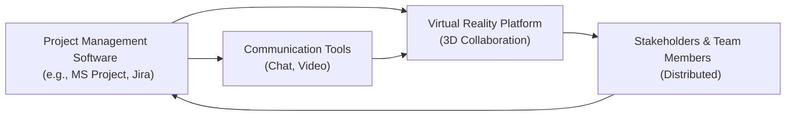
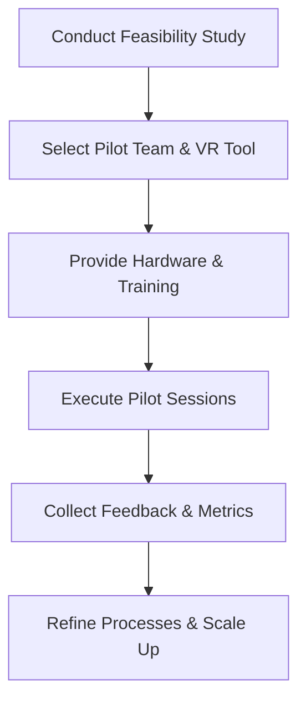

## 34.2 Remote Collaboration Tools and Virtual Reality

Project teams today are increasingly dispersed across geographies, time zones, and cultural boundaries. This reality demands advanced collaboration methods that go far beyond standard email exchanges or voice calls. While digital tools such as video conferencing, chat platforms, and shared workspaces have allowed teams to communicate effectively, the evolution of remote collaboration now focuses on fostering immersive experiences that replicate—and often enhance—the nuances of in-person interaction. Virtual Reality (VR), once regarded as a novel technology for gaming and entertainment, has rapidly entered the mainstream of project management to deliver immersive meetings, brainstorming sessions, team-building experiences, and client demonstrations. This chapter explores the current landscape of remote collaboration tools, highlights emerging VR capabilities for project management, and provides strategies for successful adoption.

## The Shifting Landscape of Remote Collaboration

### The Rise of Virtual Teams
With organizations embracing flexible work arrangements and tapping into global talent pools, virtual teams are not only common but integral to modern project success. From start-ups to multinational corporations, teams operate remotely and often asynchronously, requiring robust and user-friendly collaboration platforms. Chapter 8 (“Team Performance Domain”) and Chapter 28 (“Aligning Projects with Organizational Strategy”) underscore the necessity of cohesive teamwork aligned with broader organizational goals. Remote collaboration tools aim to fill gaps in communication and mitigate misalignment by creating transparency, structure, and shared understanding across distributed environments.

### Evolution of Collaboration Tools
In the early days, remote collaboration relied on phone calls and emails. As technology matured, secure digital transformation brought internet-powered tools like instant messaging, cloud storage, web-based project management dashboards, and video conferencing. More recent developments include:
• Integrated project management suites that combine chat, video conferencing, file sharing, and task allocation (e.g., Microsoft Teams, Slack, Trello, ClickUp).  
• Real-time co-authoring and document collaboration with version control (e.g., Google Workspace, Microsoft 365).  
• Advanced digital whiteboards enabling brainstorming and agile ceremonies (e.g., Miro, MURAL).  
• Augmented Reality (AR) and Virtual Reality (VR) platforms that deliver immersive shared spaces.  

These platforms have reduced reliance on purely physical office settings, accelerating a paradigm shift toward “digital-first” project management. However, while text, audio, and video conferencing remain staples, VR opportunities have begun to close the gap between face-to-face engagement and remote dynamics, adding new layers of immersion, presence, and empathy.

## Virtual Reality in Project Management

### How VR Enhances Collaboration
Virtual Reality technology allows participants to inhabit simulated 3D environments via headsets or specialized equipment. In a VR-driven meeting—or “virtual workspace” scenario—team members can share a sense of being physically together, even though they remain geographically scattered. This is often achieved by:

• Avatars Representing Participants  
Individuals in VR environments are typically represented by customizable avatars, enabling expressive body language, hand gestures, or facial cues that enrich communication beyond 2D video.  

• Spatial Awareness and Proximity  
VR platforms allow participants to virtually “walk” around shared spaces, approach colleagues, and form subgroups in a manner resembling in-person meeting breaks or “water cooler” interactions.  

• Interactive Whiteboarding  
Rather than passively sharing a screen, VR whiteboards let distributed teams plot Gantt charts, sketch architecture diagrams, or map user stories together in three-dimensional space.  

• Persistent Virtual Rooms  
Project teams can maintain an ongoing VR workspace where documents, notes, prototypes, or digital assets remain available for review and iteration at any time.  

By embracing VR, project managers can achieve higher engagement levels, encourage creative problem-solving, and strengthen interpersonal relationships that are often difficult to foster through conventional platforms.

### Use Cases and Benefits
• Kickoff and Vision Alignment: Early in the project lifecycle, VR can provide a memorable kickoff session, energizing stakeholders and building rapport. This approach resonates with themes in Chapter 15 (“Integration Management”), where alignment across goals, scope, and deliverables is critical.  
• Prototyping and Demonstrations: Teams can showcase product designs, architectural models, or engineering prototypes in 3D. This helps stakeholders visualize outcomes, uncover hidden constraints, and offer real-time feedback—even if they are located on different continents.  
• Team Engagement and Morale: VR-based team-building activities—virtual escape rooms or collaborative puzzles—forge stronger interpersonal bonds and break monotony. See Chapter 8 (“Team Performance Domain”) and Chapter 33 (“Advanced Leadership and Team Development”) for deeper insights on maintaining high-performance teams.  
• Training and Onboarding: Virtual “training rooms” tailored to a project’s domain reduce ramp-up times, especially when specialized equipment or processes are involved.  

### Selecting the Right VR Platform
Project managers must consider technical requirements, cost, user experience, and compatibility with existing collaboration ecosystems. Key assessment criteria may include:
• Hardware Requirements: Specialized headsets (e.g., Meta Quest, HTC Vive) or simpler mobile/desktop experiences.  
• Scalability and User Licenses: Maximum number of users in a virtual session and concurrent usage cost.  
• Security and Compliance: Data encryption, access controls, and adherence to industry-specific regulations (discussed in Chapter 31: “Advanced Compliance and Regulatory Considerations”).  
• Integration with Existing Tools: Seamless content sharing from project management software, version control systems, or chat platforms.  

Below is a simplified diagram illustrating how VR fits within the broader ecosystem of project management tools and processes:

In this diagram, the Virtual Reality platform is not standalone; it communicates bidirectionally with both standard project management software (for data, tasks, or progress metrics) and communication tools (providing real-time updates, chat transcripts, or meeting logs). Meanwhile, team members and stakeholders directly engage with each component to drive project success.

## Integrating VR into Traditional and Agile Frameworks

### Predictive and Hybrid Approaches
In traditional (predictive) project environments, VR may be incorporated during key phases—e.g., scope validation, stakeholder communication, or milestone reviews—to foster deeper alignment among the project team and sponsor. Because risk-averse, plan-driven approaches typically rely on measured progress checks, VR adds a layer of visual verification and encourages timely stakeholder feedback.

When employing hybrid frameworks—where certain aspects are predictive while others are iterative—managers can selectively implement VR in agile sprints or increments. For instance, weekly sprint reviews might occur in a virtual demo room showcasing incremental product growth or user stories. This reduces rework by allowing remote product owners and subject matter experts to provide immediate feedback.

### Agile Projects
In agile settings that rely on rapid feedback loops, VR-based standups and retrospectives can encourage creative collaboration. Particularly in globally distributed Scrum teams, VR can minimize the “distance factor” by enabling richer daily interactions, “virtual coffee breaks,” or pair-programming sessions in an immersive environment. Refer to Chapters 24–27 (Agile Foundations, Frameworks, Key Events, and Hybrid Approaches) for in-depth discussions on agile ceremonies and how they can be adapted for VR.

## Overcoming Challenges and Risks

### Usability and User Adoption
Early VR experiences can be daunting for new users, especially when hardware and software are unfamiliar. As with any new project tool, comprehensive onboarding tutorials, user training, and ongoing user support are critical. A phased rollout—starting with smaller teams committed to championing VR—can limit disruptions and build momentum.

### Bandwidth and Technical Limitations
VR’s high data consumption demands robust network infrastructure and reliable internet connectivity. Project managers should ensure that team members, especially in emerging markets or remote regions, have adequate bandwidth. Additionally, hardware constraints—such as the type of VR headsets—may require additional expense. The organization must weigh these capital investments against expected collaboration gains.

### Data Privacy and Security
“Virtual presence” tools often capture a wide array of personal data, from voice to facial tracking or even biometric signals (in advanced systems). Because VR platforms may record sessions for playback, managers must ensure compliance with confidentiality, data privacy regulations (e.g., GDPR, region-specific laws), and organizational policies. Chapter 31 (“Advanced Compliance and Regulatory Considerations”) highlights how oversight bodies might place constraints on the permitted uses of VR content.

### Cost Considerations
Despite falling prices of VR hardware, substantial upfront investments may be needed to procure headsets, licenses, and subscription fees for enterprise-oriented VR platforms. For smaller organizations or not-for-profit projects, project managers could explore cost-sharing with partner companies, pilot program subsidies, or simpler, lower-cost 3D collaboration tools (e.g., web-based VR solutions run on standard computers). The decision to adopt VR should be grounded in a clear cost-benefit analysis (see Chapter 19: “Cost Management”).

## Best Practices for Implementation

1. Start with a Pilot: Create a small pilot group to learn, define guidelines, and demonstrate success criteria.  
2. Define Collaboration Goals: Clarify why VR is needed. Is the goal to enhance stakeholder engagement, improve design reviews, or expedite alignment in agile sprints?  
3. Overcommunicate Guidelines: Provide checklists and training videos. Encourage strong etiquette—e.g., muting microphones when not speaking, respecting personal space in VR, and mastering basic navigation controls.  
4. Align with Organizational Culture: Refer back to Chapters 8 (“Team Performance Domain”) and 21 (“Resource Management”)—introducing VR successfully often depends on the existing cultural acceptance of novel technology.  
5. Measure Impact: Track metrics such as meeting attendance, collaboration frequency, stakeholder satisfaction, and project performance. If VR usage does not measurably improve outcomes, reconsider or adapt your approach.  

Below is a mermaid diagram depicting a recommended workflow for introducing VR in a project environment:

In this diagram, the workflow starts with evaluating whether VR is technically and financially feasible. A pilot team is selected to test the tool in controlled conditions, gather feedback, and measure performance improvements. Based on these insights, organizations refine their processes and prepare for wider deployment, if warranted.

## Real-World Example: Architectural Firm Adopting VR for Global Projects

Consider an internationally renowned architectural firm with offices in North America, Europe, and Asia. Traditionally, the firm coordinated design proposals through static 2D renders and conference calls. This approach caused frequent misinterpretations and rework when proposing designs to clients in different countries. By implementing a VR-based infrastructure:

• Each design iteration was uploaded into a shared virtual space.  
• Clients and cross-continental architects joined immersive “walkthroughs,” reviewing the layout from multiple vantage points.  
• Real-time feedback was recorded through voice notes and 3D markups directly on the VR model.  

Within the first quarter, the firm reported a 40% reduction in revision cycles for conceptual designs, improved client satisfaction, and faster deal closures. The VR demonstrations also became a marketing differentiator, attracting new business opportunities. This case illustrates VR’s potential to streamline complex deliverables, mitigate misunderstandings, and increase stakeholder engagement.

## Looking Ahead: The Future of Immersive Collaboration

As VR technology becomes more accessible and hardware form factors continue to shrink, immersive remote collaboration will evolve into broader “Extended Reality” (XR) ecosystems. Future developments may include:

• Advanced Haptic Feedback: Gloves or suits to transmit a tactile sense of touch.  
• AI-Driven Avatars: Intelligent real-time translation, facial expression matching, or even AI-facilitated note-taking during VR meetings.  
• Mixed Reality (MR) Environments: Combination of VR objects overlaid onto physical environments, bridging the gap between digital and real-world realms.  

These trends promise to not only replicate on-site experiences but surpass them in areas of convenience, creativity, inclusivity, and real-time data integration. Chapter 34.1 (“AI and Machine Learning”) and Chapter 34.3 (“Data Analytics and Real-Time Dashboards”) also touch on how other emerging technologies synergize with VR to create powerful, integrated project management solutions.

## References for Further Exploration
• “Guide to Real-Time Virtual Collaboration” – PMIstandards+  
• “Construction VR for Architectural Design,” Journal of Building Technology  
• “The Global Economic Benefits of VR in the Workplace,” Industry White Paper  
• “Virtual, Augmented and Mixed Reality in Project Management,” Online Course (Various Platforms)  

For more advanced resources on remote collaboration and VR, see Chapter 42: “Extended Bibliography and Recommended Readings.”

--------------------------------------------------------------------------------

## Test Your Knowledge: Remote Collaboration & VR Mastery



### Which of the following best describes a key advantage of Virtual Reality in project collaboration?  
- [ ] VR reduces project scope significantly by eliminating all in-person meetings.  
- [x] VR creates a sense of shared space and presence that enhances teamwork despite physical distances.  
- [ ] VR primarily focuses on automating project documentation.  
- [ ] VR guarantees immediate project success without additional investments.  

> **Explanation:** VR’s immersive qualities make remote or distributed teams feel like they share a common workspace, promoting deeper collaboration and more efficient communication.

### Which of these factors is most critical when selecting a VR collaboration platform?  
- [x] Security, integration capabilities, and cost structures  
- [ ] The total number of emojis available in the system  
- [ ] The ability to deploy it only on older hardware  
- [ ] Strictly avoiding any updates or patches to the platform  

> **Explanation:** When choosing a VR platform, project managers should consider whether it supports secure data handling, integrates well with existing tools, and aligns with the project’s budget constraints.

### How can VR be leveraged in agile sprints to maximize stakeholder feedback?  
- [ ] By postponing all feedback sessions until the next project phase  
- [ ] By replacing all backlog refinement sessions with AI-based avatars  
- [x] By conducting virtual sprint reviews to showcase increments in immersive 3D  
- [ ] By eliminating stand-up meetings and focusing solely on automated dashboards  

> **Explanation:** In agile cycles, VR-based sprint reviews help remote stakeholders visualize product increments, encouraging immediate feedback and reducing misinterpretations.

### Which of the following is a potential drawback of VR adoption?  
- [x] High bandwidth requirements and potential hardware costs  
- [ ] Guaranteed conflict resolution across all cultural boundaries  
- [ ] Removal of the need for project planning  
- [ ] Elimination of all face-to-face interactions  

> **Explanation:** While VR boosts engagement, it often demands faster internet speeds and additional funds to acquire the necessary headsets and platform licenses, posing barriers for some teams.

### What is the primary purpose of persistent VR workspaces in a project environment?  
- [x] To provide a centralized location where shared digital assets remain continuously accessible  
- [ ] To limit user interaction to a single meeting per week  
- [x] To replicate physical office cubicles for purely aesthetic reasons  
- [ ] To ensure the project sponsor cannot access work-in-progress deliverables  

> **Explanation:** Persistent VR rooms offer a stable virtual environment where ongoing artifacts, notes, and discussions are stored for continual reference, thereby improving knowledge retention between sessions.

### Which of these best practices ensures a smoother rollout of VR collaboration tools?  
- [ ] Launching VR programs without pilot tests to reveal hidden flaws  
- [x] Training a small pilot group first and then scaling up based on feedback  
- [ ] Directly implementing VR across the whole organization with no documentation  
- [ ] Prioritizing advanced AR solutions over simpler VR tools  

> **Explanation:** A pilot approach helps identify technical limitations, gather real-life user feedback, and refine processes before broader deployment.

### A global engineering consultancy uses VR for design reviews. What is the key benefit they might experience?  
- [x] Reduced time spent interpreting complex 2D drawings  
- [ ] Inability to obtain any real-time stakeholder input  
- [x] Increased confusion when discussing design changes  
- [ ] A complete replacement of project scheduling tools  

> **Explanation:** By visualizing 3D models in real-time, VR drastically reduces ambiguity and speeds up the feedback cycle, leading to faster approvals and fewer rework cycles.

### Which of the following underscores VR’s role in team-building activities?  
- [ ] Discouraging trust-building exercises in favor of solitary work  
- [ ] Replacing daily stand-up meetings completely  
- [x] Hosting immersive “escape rooms” or problem-solving tasks  
- [ ] Eliminating all forms of face-to-face ice breakers  

> **Explanation:** VR-based simulations and collaborative tasks enhance camaraderie by immersing team members in fun, interactive challenges, improving morale and synergy.

### In a predictive project plan, when might VR environments be most beneficial?  
- [x] During key milestone reviews and stakeholder alignment sessions  
- [ ] Only in the final phase, after all design decisions are made  
- [ ] For everyday individual tasks like drafting emails  
- [ ] As a replacement for all Gantt charts  

> **Explanation:** VR excels at providing stakeholders a realistic preview of deliverables, making it ideal at significant checkpoints—such as scope confirmation, milestone reviews, and major decision gates.

### True or False: VR can eliminate all compliance-related risks in international projects.  
- [x] True  
- [ ] False  

> **Explanation:** This is a trick question; the statement is false. VR cannot remove compliance obligations; it must adhere to data privacy and legal standards. Project managers must handle security and documentation properly, as discussed in Chapter 31 on regulatory considerations.



--------------------------------------------------------------------------------

## PMP Mastery: 1500+ Hard Mock Exams with Full Explanations 

Looking to crush the PMP exam with confidence? Dive deep into 6 rigorous mock exams totaling 1500+ advanced-level questions, each accompanied by clear, step-by-step explanations. Hone your test-taking strategies, master complex topics, and build the resilience you need on exam day. Perfect for serious PMs aiming beyond fundamentals.  

Enroll now:  
[PMP Mastery: 1500+ Hard Mock Exams with Exceptional Clarity & Full Explanations](https://www.udemy.com/course/pmp-2025/?referralCode=CF83A54BC86BE27F9AFE)

_Disclaimer: This course is not endorsed by or affiliated with the PMI examination authority. All content is provided purely for educational and preparatory purposes._
