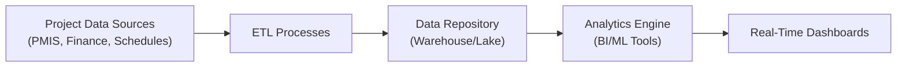

## 34.3 Data Analytics and Real-Time Dashboards

In an era increasingly driven by digital transformation, project teams have more data at their fingertips than ever. Mature organizations are harnessing that data to accelerate decision-making, enhance visibility, and proactively manage project risks. This section explores how advanced data analytics and real-time dashboards can deliver immediate, accurate, and action-oriented insights for project managers and stakeholders. We will dive into the types of analytics employed in project environments, the architecture of real-time dashboards, methodologies to integrate data from multiple sources, and how to leverage predictive models to stay ahead of issues and opportunities.

Data analytics goes beyond static reporting. Using modern tools, project information—such as performance metrics, resource utilization, risk levels, and more—can be swiftly analyzed and packaged into dashboards that update minute-to-minute. This dynamic approach empowers managers to make faster, evidence-based decisions, helping them efficiently allocate resources, predict market or stakeholder changes, and craft strategies to maintain alignment with organizational objectives (as discussed in Chapter 28: Aligning Projects with Organizational Strategy). By combining real-time dashboards with advanced predictive algorithms, project professionals can stay agile in a field where the only constant is change.

---

### The Role of Data Analytics in Modern Project Management

Data analytics encompasses the systematic use of statistical, mathematical, and computational techniques to examine large volumes of data. In a project management context, analytics ranges from tracking the simplest earned value calculations to building sophisticated predictive models that draw from multiple data points, including stakeholder sentiment, resource usage curves, and historical project performance (see Chapter 13: Measurement Performance Domain). This progression toward deeper insight typically follows a hierarchical model:

• Descriptive analytics: What happened?  
• Diagnostic analytics: Why did it happen?  
• Predictive analytics: What is likely to happen next?  
• Prescriptive analytics: What should we do about it?

Most real-time dashboards begin at the descriptive analytics level, serving as a visual summary of project metrics—e.g., cost performance index (CPI), schedule adherence, or resource allocation. As project management offices (PMOs) mature, dashboards can incorporate diagnostic or predictive layers, showing not just the current status but also the underlying trends and potential risk scenarios (see Chapter 14: Uncertainty Performance Domain and Chapter 22: Risk and Uncertainty Management (Revisited)). With the right data, advanced machine learning algorithms can even provide prescriptive guidance, like recommending resource reassignments to avoid upcoming bottlenecks.

---

### Integrating Data for Real-Time Insights

Real-time dashboards hinge on the ability to collect, clean, integrate, and display data from various systems and sources in near-instantaneous fashion. These sources may include:

• Project Management Information Systems (PMIS)  
• Issue and Risk Logs (refer to Chapter 22)  
• Stakeholder Registers (see Chapter 7 and Chapter 16)  
• Financial Systems (for costs, budgets, and actuals)  
• Resource Management Tools  
• Scheduling Software (e.g., Microsoft Project, Jira, Primavera)  
• Collaboration Platforms (e.g., Slack, Microsoft Teams)  

The technical infrastructure typically involves data extraction, transformation, and loading (ETL) processes that funnel information to a central repository. That repository may be a data warehouse or a more agile data lake. From there, a business intelligence (BI) or analytics layer (e.g., Power BI, Tableau, Qlik, or custom solutions) processes and visualizes the data. By automating these processes, teams can maintain dashboards that accurately reflect the project’s real-time status.

Below is a simplified diagram illustrating a common data analytics pipeline for real-time dashboards:

1. A["Project Data Sources (PMIS, Finance, Schedules)"] – Represents the various systems storing project data.  
2. B["ETL Processes"] – Automated or scheduled scripts that cleanse, standardize, and move data into a structured environment.  
3. C["Data Repository (Warehouse/Lake)"] – The central storage for integrated, historical, and real-time data.  
4. D["Analytics Engine (BI/ML Tools)"] – Tools that process data to generate metrics, insights, or predictions.  
5. E["Real-Time Dashboards"] – Interactive reports accessible to stakeholders for immediate project status updates.

---

### Types of Analytics Techniques for Project Management

Although much of project data analytics begins descriptively, advanced organizations adopt more sophisticated techniques as they add resources, talent, and technology:

• Descriptive Analytics: Reporting historical or current project data (e.g., Earned Value (EV), spending trends, team velocity in agile, resource load).  
• Diagnostic Analytics: Investigating the root cause of certain events (e.g., analyzing why scope changes soared in the last two sprints).  
• Predictive Analytics: Using time-series forecasting, regression models, or machine learning to anticipate future performance (e.g., forecasting cost variance and schedule delays).  
• Prescriptive Analytics: Offering guidance or recommended actions (e.g., recommending an adjustment of tasks in a sprint backlog to fix upcoming resource conflicts).

Many robust dashboards integrate at least some predictive or diagnostic functionality. For instance, a velocity chart might not only display how many story points your agile team completed last sprint but also predict the total story points they are likely to complete in the next sprint, factoring in past trends and available capacity.

---

### Real-Time Dashboard Design

A real-time dashboard is a visual interface that compiles critical metrics and KPIs into a single, often interactive, view. Its primary goal is to communicate project health, progress, and potential risks in a format that project teams, sponsors, and executives can quickly and accurately interpret. Whether your project life cycle is predictive, agile, or hybrid, an effective dashboard typically includes:

• Key Performance Indicators (KPIs): Values that reflect project health, such as cost performance index (CPI), schedule performance index (SPI), or iteration burn-down velocity.  
• Graphical Elements: Charts, graphs, and color-coded status indicators that make insights instantly visible.  
• Minimal Clutter: Strategic use of whitespace, short text labels, and logical grouping of metrics to prevent cognitive overload.  
• Drill-Down Capability: The option to click through a high-level metric to view detailed data, such as root cause analysis or specific tasks that might be behind schedule.  
• Real-Time and Historical Views: A combination of real-time snapshots and historical trend lines that help stakeholders compare the current state to past milestones.  

Project managers must also consider the unique preferences and needs of different stakeholders. While senior management might prefer a high-level bar chart of cost trends, functional leads or scrum masters often need more detailed breakdowns of tasks or sprint backlog items (refer to Chapter 25: Agile Frameworks and Methodologies for agile-specific requirements).

---

### Implementation Considerations and Best Practices

1. Define Clear Objectives: Align dashboard goals with the organization’s project management maturity and the needs of key stakeholders (see Chapter 7: Stakeholder Performance Domain). Decide which metrics truly matter, such as cost variance, resource utilization, or backlog health.  

2. Ensure Data Quality: A dashboard is only as reliable as the underlying data. Implement robust data governance, including data cleaning and validation protocols.  

3. Automate ETL and Integration: Automate data feeds, so teams don’t waste effort on repeated manual data pulls. Tools like Microsoft Power Automate, AWS Glue, or Azure Data Factory can streamline the integration process.  

4. Make Use of Agile Methods: Consider iterative dashboard improvements. Release a minimal viable product (MVP) dashboard quickly, then refine as stakeholder feedback emerges—akin to agile sprints (discussed in Chapter 24: Agile Foundations and the Agile Practice Guide).  

5. Incorporate Predictive and Prescriptive Analytics Gradually: Start with descriptive analytics. Once the foundational data pipeline is robust, layer on predictive models. Tools such as Python’s scikit-learn, R, or built-in AI features in leading BI platforms can come into play.  

6. Prioritize Security and Access Control: Determine who in the organization needs full access versus read-only dashboards. Enforce strict permissions, especially for sensitive financial or personnel data.  

7. Test, Iterate, and Evolve: Monitor dashboard usage patterns. If certain graphs remain unused, remove or improve them. If confusion arises with labeling or color coding, adjust for clarity.  

8. Maintain a Feedback Loop: Encourage the leadership team, functional managers, and project members to share feedback on the dashboard’s relevance and usability. Continuous improvement applies not just to the project deliverable but also to the tools used to manage it.  

---

### Predictive Insights Through Advanced Analytics

Real-time dashboards are powerful, but the real magic often happens when teams embed statistical models and machine learning algorithms to forecast future project conditions. Predictive insights can reveal:

• Emerging risks (e.g., resource contention, schedule slippage, cost overruns)  
• Probabilities of milestone completion within a given timeframe  
• Trends in stakeholder sentiment (from social media or internal communication platforms)  
• Opportunities to optimize resource usage or reduce waste  

A data-rich predictive model may draw from operational logs, historical trends, and even external factors (like currency exchange rates or shipping times) to generate probability distributions. For instance, you might apply a Monte Carlo simulation to run thousands of possible scenario outcomes on cost or schedule. In KaTeX notation:

\\( S_i = R_i + P_i \\)

Where \\( S_i \\) is a scenario result for iteration i, \\( R_i \\) is the random resource availability, and \\( P_i \\) is the planned activity duration. By aggregating results across multiple simulations, the project team gains a better understanding of the range of potential outcomes, enabling them to select strategies that minimize risk or expedite delivery (refer to Chapter 14: Uncertainty Performance Domain and Chapter 22: Risk and Uncertainty Management (Revisited)).

---

### Case Study Example: Dashboard Transformation in a Hybrid Project

A mid-size software development company was running a hybrid project: front-end development followed a Scrum approach with two-week sprints, while back-end infrastructure upgrades followed a predictive waterfall model. Previously, the project manager spent hours reconciling timesheets, scope documents, and sprint backlogs to compile weekly status reports.

After implementing a real-time, integrated data analytics solution:

• The team created a single data repository that centralized both sprint analytics (user stories completed, velocity) and predictive metrics (milestone completion rates, budget burn rate).  
• A dynamic dashboard updated usage data, story point progress, and backlog changes in near-real time.  
• Management easily toggled between a high-level portfolio view—combining multiple projects and programs (see Chapter 35: Portfolio and Program Management Intersections)—and an in-depth project-level view focusing specifically on upcoming tasks, deadlines, and resource allocation.  
• Risk triggers were built into the system so that if velocity dropped below a set threshold or if cost usage spiked, an automatic alert was pushed to the project manager.  

The result was less time spent on status compilation, more time devoted to coaching the team and resolving issues, and significantly improved schedule adherence. The real-time insight also permitted managers to quickly realign resources, preventing schedule conflicts between the waterfall and agile teams.

---

### Common Pitfalls and Strategies to Overcome Them

• Data Overload: Including too many metrics or visual elements can overwhelm users. Focus on the most impactful KPIs.  
• Poor Data Quality: When data completeness or accuracy is suspect, stakeholders lose trust in the dashboard’s reliability. Automate validations and incorporate data-quality checks.  
• Lack of Stakeholder Training: Even the most advanced dashboards fail if users don’t know how to interpret or navigate them. Provide training and ongoing support, especially for new tools or features.  
• Resistance to Change: Some individuals may prefer traditional reporting methods. Involve them early, show quick wins, and demonstrate how real-time data leads to more informed decisions.  
• Security and Compliance Gaps: Sensitive data (financial forecasts, personal data, regulated info) demands careful access controls, encryption, and compliance alignment—particularly in high-stakes industries such as healthcare or finance.

---

### Managing Communication via Dashboards

Rather than emailing lengthy spreadsheets, many project managers now share secure dashboard links with stakeholders. In complex initiatives (see Chapter 32: Complex Adaptive Systems and Systems Thinking), dashboards ensure alignment by offering consistent, transparent views of the project. Some organizations even embed dashboards into existing collaboration tools (like Microsoft Teams channels), ensuring that real-time metrics blend seamlessly into daily communications and preventing the fragmentation of project data across multiple platforms.

---

### Future Trends in Data Analytics and Dashboards

Project management analytics is quickly evolving with breakthroughs like artificial intelligence (AI), machine learning (ML), and natural language processing (NLP):

• AI-Driven Insights: Tools that automatically suggest schedule optimizations, resource reassignments, or risk mitigation strategies.  
• Chatbot Integration: Project dashboards enhanced by chatbots. A user can simply type queries like “What is our current CPI for Project X?” and get an instant graphical response.  
• Automated Anomaly Detection: Alerting project managers not just to standard threshold breaches but also to unusual patterns in performance or cost data.  
• Advanced Visualization: Infographics, virtual reality, or augmented reality-based dashboards for immersive project data exploration (see Chapter 34.2: Remote Collaboration Tools and Virtual Reality).  

Staying ahead of these trends positions project managers and organizations to better adapt to new technologies and leverage data for sustained competitive advantage.

---

### References for Further Exploration

• Bernard Marr – Data Strategy: How to Profit from a World of Big Data, Analytics and the Internet of Things  
• PMI – The Standard for Risk Management in Portfolios, Programs, and Projects  
• Harvard Business Review – Articles on Data Analytics and Decision Making  
• Udemy, Coursera, edX – Courses on Data Analytics and Business Intelligence, including advanced Power BI and Tableau courses  
• Kaggle.com – Practice data sets and competitions for those interested in building predictive models  

---

## Scale Your Project Insights: Data Analytics & Real-Time Dashboards Quiz



### A project team wants to display near-instant project updates, including cost, schedule, and resource usage, on a single screen. Which solution best addresses this need?

- [ ] Static spreadsheet reports
- [ ] Weekly emailed status updates
- [ ] Gantt charts exported to PDF
- [x] Real-time, integrated dashboards

> **Explanation:** Real-time dashboards, connected to project data sources, offer near-instant updates that unify cost, schedule, and resource metrics in one screen.

### Which type of analytics attempts to provide recommended actions based on data predictions?

- [ ] Descriptive analytics
- [ ] Diagnostic analytics
- [ ] Predictive analytics
- [x] Prescriptive analytics

> **Explanation:** Prescriptive analytics not only predicts future events but also offers actionable recommendations based on those predictions.

### What is one key advantage of automating the ETL (Extract, Transform, Load) process?

- [ ] It eliminates all data governance needs.
- [ ] It allows dashboards to be static.
- [x] It ensures regular, consistent data updates.
- [ ] It bypasses approval workflows automatically.

> **Explanation:** Automated ETL processes ensure real-time or scheduled loads that are consistent and reliable, enabling dashboards to reflect the latest project data.

### A predictive analytic model that uses thousands of simulations to forecast the likelihood of certain project outcomes is known as:

- [x] Monte Carlo simulation
- [ ] Kurtosis analysis
- [ ] Pareto analysis
- [ ] Ishikawa method

> **Explanation:** Monte Carlo simulations run multiple randomized scenarios to calculate probabilities and ranges of outcomes, making them ideal for forecasting cost or schedule results.

### When designing a real-time project dashboard, focusing on minimal clutter means:

- [x] Displaying only the most critical KPIs and graphs
- [ ] Using small font sizes and no colors
- [x] Keeping visuals straightforward and intuitive
- [ ] Removing all data labels

> **Explanation:** Effective dashboards highlight the most vital metrics in an easily digestible format, maintaining clarity with minimal or well-organized visual elements.

### Which project data point would typically be featured in a real-time dashboard?

- [x] Cost Performance Index (CPI)
- [ ] A 5-year strategic plan
- [ ] Outdated weekly status logs from last year
- [ ] Irrelevant social media trends

> **Explanation:** Cost Performance Index (CPI) is a key metric used in Earned Value Management. It provides insight into the cost efficiency of a project—exactly the type of metric a real-time dashboard should display.

### Which is a common pitfall when deploying real-time dashboards?

- [ ] Stakeholder enthusiasm
- [x] Data overload and unclear visualization
- [ ] Automated data feeds
- [x] Lack of advanced analytics

> **Explanation:** One major pitfall is overwhelming stakeholders with too many metrics or poorly organized visuals. Another is failing to mature from descriptive to predictive or prescriptive analytics where appropriate.

### What is a recommended best practice for continuous dashboard improvements?

- [x] Iterative updates based on stakeholder feedback
- [ ] Building the entire solution in one final release
- [ ] Abandoning dashboards if user uptake is low
- [ ] Hiding complex metrics behind static text

> **Explanation:** Gathering feedback from users and updating dashboards incrementally ensures long-term relevance and stakeholder satisfaction.

### At which point does real-time data become especially critical in a project lifecycle?

- [x] When the project environment is highly dynamic or uncertain
- [ ] After all deliverables are closed
- [ ] Only during the initial planning phase
- [ ] In post-implementation review

> **Explanation:** Real-time data is most valuable when the status of tasks, risks, and resources can shift rapidly, as it permits immediate course corrections and decision-making.

### Real-time dashboards are valuable in agile environments because:

- [x] They provide ongoing transparency over sprint progress
- [ ] They remove the need for daily stand-up meetings
- [ ] They replace the need for iterative planning
- [ ] They require fewer user stories

> **Explanation:** Agile relies on transparency and adapts quickly to change. Real-time dashboards enhance transparency by showing ongoing data—e.g., burn-down charts or velocity—that teams and stakeholders can reference any time.



---

## PMP Mastery: 1500+ Hard Mock Exams with Full Explanations 

Looking to crush the PMP exam with confidence? Dive deep into 6 rigorous mock exams totaling 1500+ advanced-level questions, each accompanied by clear, step-by-step explanations. Hone your test-taking strategies, master complex topics, and build the resilience you need on exam day. Perfect for serious PMs aiming beyond fundamentals.

Enroll now:  
[PMP Mastery: 1500+ Hard Mock Exams with Exceptional Clarity & Full Explanations](https://www.udemy.com/course/pmp-2025/?referralCode=CF83A54BC86BE27F9AFE)

_Disclaimer: This course is not endorsed by or affiliated with the PMI examination authority. All content is provided purely for educational and preparatory purposes._


