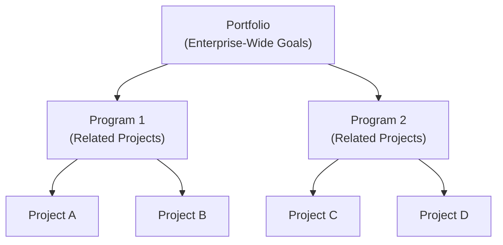

## 35.1 Relationship between Projects, Programs, and Portfolios

In the realm of project management, three foundational concepts—Projects, Programs, and Portfolios—serve as the backbone for achieving organizational goals. Understanding these concepts not only helps you perform more effectively as a project manager but also clarifies how deliverables tie into larger strategic initiatives. This section explores the pivotal relationships among these three levels, offering real-world examples, best practices, and considerations for your PMP® Exam and daily practice. By linking Projects, Programs, and Portfolios to the broader business environment, organizations can optimize resource allocation, risk management, and value realization.

### Fundamental Definitions

At their core, Projects, Programs, and Portfolios differ in scope, complexity, strategic intent, and interdependencies:

- A project is a temporary endeavor undertaken to create a unique product, service, or result. Projects are focused on delivering specific outputs with defined start and end points.  
- A program is a group of related projects (and sometimes additional subprograms or program activities) managed in a coordinated way to realize benefits not attainable by managing each project individually.  
- A portfolio is a collection of projects, programs, subportfolios, and operations managed as a group to achieve strategic objectives.

These distinctions are crucial in understanding how organizations align their initiatives to overarching business strategies. While a project manager concentrates on the scope, time, cost, and quality of a single project, a program manager coordinates multiple projects and resources that share a common goal. Meanwhile, a portfolio manager focuses on prioritization and resource optimization among numerous programs and projects, linking them to long-term organizational vision, mission, and strategy.

### Projects: Focus on Deliverables

Projects deliver tangible outputs or outcomes. They can be short-term (days or weeks) or span multiple years, depending on complexity. In Chapter 4 (“Project Management Fundamentals”), we discussed project characteristics such as uniqueness, constraints, and progressive elaboration. A single project typically has:

- A defined scope and set of objectives.  
- A schedule that outlines milestones and deliverables.  
- A budget that spans labor, materials, and overhead costs.  
- Identified stakeholders who influence or are impacted by the project’s outcome.

By definition, projects have finite lifespans; they conclude once objectives are met (or once the project is terminated). However, their outputs might feed into a higher-level program or portfolio if the organization has multiple initiatives aimed at expansive goals.

### Programs: Coordinated Benefit Realization

Where projects center on specific results, programs focus on aggregated benefits. If multiple related projects share a common theme—enhancing customer experience, improving process efficiency, or upgrading technology infrastructure—an organization may structure them into a single program. The program manager’s role is to ensure synergy and effective interdependency management among these projects.

Some characteristics of a program:

- Facilitates unified governance and oversight for a set of related projects.  
- Seeks outcomes or benefits unattainable if projects were managed independently.  
- Coordinates project activities to optimize resource sharing and reduce redundancy.  
- Aligns with longer-term strategies but is still bound by time; a program concludes once it meets its defined benefits or strategic objectives.

An example: A company wants to modernize its entire customer engagement system. They launch a program that includes multiple projects: implementing a new CRM platform, integrating advanced analytics, training staff, and overhauling customer-facing mobile applications. Managed separately, these projects could clash over budgets, timelines, or technical architecture. Under a single program, they can share resources (such as design teams, IT infrastructure, or vendor management), address risks more holistically, and drive consistent change management across the organization.

### Portfolios: Strategic Alignment, Resource Optimization

Portfolios exist at the highest strategic tier. They are designed to align every major initiative—whether a standalone project or a program—with the organization’s mission, vision, and financial objectives. Unlike a program, a portfolio can contain unrelated projects or programs; the key criterion is that each initiative competes or cooperates for resources to meet strategic goals and overall risk tolerance.

Typical portfolio functions include:

- Selecting and prioritizing projects or programs based on strategic value, ROI, or other decision criteria.  
- Balancing resource allocation across multiple initiatives with different risk profiles and time horizons.  
- Adjusting investments in programs or projects to maximize value delivery and respond to market shifts.  
- Providing executive oversight, including risk appetite, to ensure alignment with organizational strategy.

For instance, a multinational pharmaceutical company might have one portfolio encompassing new drug development programs, another dedicated to manufacturing improvements, and yet another focusing on marketing initiatives. Each portfolio consists of multiple programs or standalone projects that contribute to the company’s market expansion or cost-saving goals. Top executives review and re-prioritize these portfolios regularly based on regulatory developments, competitive environment, and financial performance.

### Visual Representation of Hierarchy

A simplified diagram often helps illustrate how portfolios, programs, and projects interrelate. Below is a Mermaid.js flowchart showing a hierarchical view:

In this flowchart:  
• The “Portfolio” node (A) represents the organization’s holistic set of initiatives.  
• Program 1 (B) and Program 2 (C) each encompass multiple projects.  
• Project A and Project B (D, E) are interrelated under Program 1. Likewise, Project C and Project D (F, G) are part of Program 2.  

This structure ensures that all projects—whether packaged into programs or managed directly under the portfolio—align with organizational strategy.

### Leveraging Synergies and Managing Dependencies

One of the biggest values in linking Projects, Programs, and Portfolios is managing dependencies effectively. Within a program, dependencies often arise from shared resources, overlapping deliverables, or sequential tasks. For example, a marketing automation project may need data from the CRM modernization project within the same program. If these two projects were not coordinated under a program layer, they could conflict over budgets, timelines, or software compatibility.

At the portfolio level, management addresses broader trade-offs: which programs or standalone projects gain priority in budgeting cycles, which strategic goals are most urgent, and how to allocate limited skilled labor. Organizations that excel in portfolio management often invest in specialized leadership roles (Portfolio Managers, PMO Directors) to maintain a structured pipeline of initiatives. This ensures that high-value endeavors are actively supported and less strategic ones are shelved, postponed, or terminated to free up funds and talent for higher-impact possibilities.

### Real-World Scenario

Consider a global retail conglomerate aiming to expand into e-commerce, optimize supply chains, and enhance customer satisfaction. It creates a “Digital Transformation Portfolio,” which comprises:  

• A “Customer Experience Program,” containing projects such as a new e-commerce platform, a revamped mobile app, and a customer feedback analytics tool.  
• A “Supply Chain Modernization Program,” with projects on warehouse automation, robotics integration, and real-time shipment tracking.  
• Multiple smaller projects focusing on internal social media platforms and staff training, which are not necessarily related to the bigger programs.  

Portfolio managers periodically evaluate performance, weigh the benefits, and reallocate budgets or resources among these programs and projects. If the e-commerce platform sees rapid growth, more funding might shift to that region, while underperforming projects could be deprioritized or merged.

### Resource Management and Organizational Alignment

Resources in a project context refer to budget, time, people, technology, and sometimes intangible assets like intellectual property or brand reputation. Programs and portfolios extend this concept by focusing on enterprise-wide resource optimization. Instead of allowing every project to confidentially negotiate for resources, the program or portfolio approach centralizes and rationalizes these decisions against strategic objectives.  

Additionally, as discussed in Chapter 28 (“Aligning Projects with Organizational Strategy”) and Chapter 29 (“Benefits Realization Management”), the synergy across multiple initiatives is more transparent and intentional. When objectives at each level align, the organization stands to gain:

- Accelerated time-to-market and improved customer satisfaction.  
- Cost savings through unified procurements and economies of scale.  
- Balanced risk exposure by diversifying across different initiatives (some high risk, some lower risk).  
- Elevated employee morale through consistent and transparent decision-making.

### Tools and Techniques

Organizations leverage various methodologies and frameworks to manage Projects, Programs, and Portfolios cohesively:

• Project Management Tools: Gantt charts, Scrum/Kanban boards, RACI (Responsible, Accountable, Consulted, Informed) matrices, etc.  
• Program Roadmaps: High-level timelines showing key dependencies, benefits milestones, and resource needs.  
• Portfolio Management Software: Tools like Planview, Clarity PPM, or Microsoft Project Server that offer dashboards for executives to track project and program performance, reallocate resources, and forecast future demands.  
• Governance Structures: Steering committees, PMOs, or Center of Excellence teams that define guidelines, document lessons learned, and standardize practices across the business.

### Common Pitfalls

1. Overlapping or Unclear Scope  
   - Projects within a program might inadvertently duplicate each other’s work. A robust scope definition (see Chapter 17: “Scope and Requirements Management”) and continuous communication mitigate overlap.

2. Poor Communication Between Levels  
   - Without regular updates between project teams, program managers, and portfolio steering committees, disconnects on objectives or constraints can emerge. Consistent feedback loops and real-time reporting are essential.

3. Resource Bottlenecks  
   - A highly specialized team member may be key to multiple projects in different programs. Without portfolio-level resource planning, these pinch points can derail schedules.

4. Misalignment with Strategy  
   - Even well-run projects can fail to deliver value if they do not align with strategic priorities. Portfolio governance structures ensure that initiatives remain relevant to the organization’s long-term vision.

5. Insufficient Executive Sponsorship  
   - Large programs and portfolios require leadership support. If the executive sponsor is disengaged or changes direction frequently, stable progress becomes difficult.

### Aligning with PMI’s Perspective

PMI emphasizes that Projects, Programs, and Portfolios are integral parts of organizational project management (OPM). This holistic approach ensures that project outcomes yield tangible benefits (program management) and feed into the organization’s strategic vision (portfolio management). Exam questions often test your ability to distinguish among these levels and to recognize which processes or leadership roles apply where. For more details on roles, stakeholder engagement, and program/portfolio governance, refer to:

- Chapter 6: “The PMP® Exam Domains, Tasks, and Enablers,” especially regarding how tasks differ among People, Process, and Business Environment.  
- Chapter 28: “Aligning Projects with Organizational Strategy” for deeper insights into bridging project actions to high-level goals.  
- Chapter 29: “Benefits Realization Management” to see how programs (and even large-scale projects) track benefits that resonate with the portfolio’s value proposition.

### Best Practices for Seamless Execution

- Define Clear Charters at All Levels: Each project, program, and portfolio should have a clear charter specifying scope, responsibilities, governance structures, and success metrics.  
- Maintain Transparent Communication: Establish integrated communication plans (see Chapter 16: “Stakeholder and Communications Management”) ensuring project statuses and escalations flow efficiently upward to program and portfolio managers.  
- Align Resource Allocation with Strategy: On a monthly or quarterly basis, review each portfolio item’s alignment to the organization’s goals; pivot resources as needed.  
- Encourage Continuous Improvement: Organizations that learn from each completed project or program can use those insights to refine portfolio priorities and strategies, fostering a loop of continuous, data-driven improvement.

### Conclusion

The relationship between Projects, Programs, and Portfolios forms a dynamic network: Projects drive tangible outputs; Programs coordinate interrelated projects to realize greater benefits; and Portfolios optimize investments across the entire spectrum of initiatives to fulfill strategic aspirations. Recognizing these distinctions—and applying them thoughtfully—enables project management practitioners to navigate complex organizations and deliver value that resonates from the tactical level through the executive suite. By appreciating these hierarchical structures, you will be well-prepared to integrate theoretical knowledge (as epitomized in the PMBOK® Guide and the PMP® Exam Content Outline) with real-world scenarios in any project environment.

---

## Quiz: Projects, Programs, and Portfolios Alignment



### Which statement best describes a project?

- [ ] It is an ongoing set of tasks without a defined end date.  
- [x] It is a temporary endeavor undertaken to create a unique product, service, or result.  
- [ ] It is a group of related projects managed together for benefits realization.  
- [ ] It is a collection of unrelated initiatives aligned to strategic objectives.  

> **Explanation:** Projects have a defined start and end, focusing on a specific, unique deliverable.

### What is the primary focus of program management?

- [ ] Delivering a single, well-defined product.  
- [ ] Taking operational ownership of all corporate initiatives.  
- [x] Coordinating related projects to realize benefits not achievable individually.  
- [ ] Overseeing an entire portfolio of unrelated initiatives.  

> **Explanation:** Program management optimizes the interdependencies among related projects, delivering compounded benefits.

### Which of the following is true about a portfolio?

- [ ] It comprises only one program.  
- [ ] It includes only non-overlapping projects.  
- [x] It can contain multiple programs and standalone projects, aligned to strategic objectives.  
- [ ] It serves only to manage similar projects in a specific department.  

> **Explanation:** Portfolios encompass a broad set of programs and projects, focusing on strategic alignment and optimal resource allocation.

### How do projects, programs, and portfolios typically differ in scope?

- [x] Projects are narrower, programs coordinate multiple projects, and portfolios span the full strategic horizon.  
- [ ] Projects are the largest, programs are second in size, and portfolios are smallest.  
- [ ] Portfolios are more tactical than programs and projects.  
- [ ] Programs exist outside the organizational governance structures.  

> **Explanation:** Projects address specific outputs, programs aggregate those outputs for greater benefit, and portfolios align them with enterprise strategy.

### Which of the following scenarios exemplifies a program?

- [x] Several related projects aimed at implementing a new enterprise-wide IT system.  
- [ ] A single project to upgrade a specific HR software module.  
- [x] Multiple projects to integrate different departments onto a unified platform.  
- [ ] A collection of entirely unrelated initiatives managed by one sponsor.  

> **Explanation:** A program typically involves multiple related projects that share common objectives, deliverables, or resources.

### In a portfolio context, what is the primary purpose of prioritization?

- [ ] To determine which project gets completed first based on employee preference.  
- [ ] To ensure each project or program has identical budgets.  
- [x] To align organizational resources with the highest-value initiatives that meet strategic goals.  
- [ ] To remove unsuccessful projects from the program execution phase.  

> **Explanation:** Portfolio prioritization ensures resources go to initiatives carrying the highest strategic or financial value.

### Which describes the relationship between a project manager and a program manager?

- [x] A project manager focuses on specific project outputs, while a program manager oversees multiple related projects to maximize collective benefits.  
- [ ] The project manager makes all decisions for the entire portfolio.  
- [x] The program manager has no influence on resource allocation across the program.  
- [ ] They perform identical roles but at different seniority levels.  

> **Explanation:** Project managers operate at the individual project level, while program managers coordinate inter-project dependencies, benefits, and strategic alignment within a program.

### A project within a program is delayed. How might a program manager respond?

- [x] Adjust resource allocation to realign the delayed project schedule.  
- [ ] Allow the project to continue without modification.  
- [ ] Abandon the entire program to avoid further costs.  
- [ ] Escalate the delay to the portfolio manager for immediate cancellation.  

> **Explanation:** A program manager coordinates resources and schedules across projects to mitigate delays and maintain benefit realization.

### What advantage does a portfolio management approach bring to an organization?

- [x] It provides a centralized view and strategic alignment of all projects and programs.  
- [ ] It eliminates the need for project and program managers.  
- [ ] It focuses only on day-to-day operations.  
- [ ] It replaces executive governance structures.  

> **Explanation:** Portfolio management ensures each initiative is scrutinized for strategic fit, optimizing use of organizational resources.

### True or False: Portfolio management may include both programs and standalone projects that are unrelated but share overall organizational resources.

- [x] True  
- [ ] False  

> **Explanation:** Portfolios can comprise unrelated or loosely related programs and projects that collectively compete for and utilize enterprise resources, all to fulfill strategic goals.



---

## PMP Mastery: 1500+ Hard Mock Exams with Full Explanations 

Looking to crush the PMP exam with confidence? Dive deep into 6 rigorous mock exams totaling 1500+ advanced-level questions, each accompanied by clear, step-by-step explanations. Hone your test-taking strategies, master complex topics, and build the resilience you need on exam day. Perfect for serious PMs aiming beyond fundamentals.

Enroll now:  
[PMP Mastery: 1500+ Hard Mock Exams with Exceptional Clarity & Full Explanations](https://www.udemy.com/course/pmp-2025/?referralCode=CF83A54BC86BE27F9AFE)

_Disclaimer: This course is not endorsed by or affiliated with the PMI examination authority. All content is provided purely for educational and preparatory purposes._
