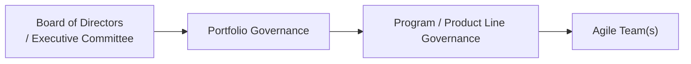

## 35.2 Governance Models and Enterprise Agility

Modern organizations seek to remain competitive in rapidly shifting markets by adopting agile methodologies. Yet, they also need established controls to meet strategic objectives, mitigate risks, and ensure compliance. This confluence of autonomy and accountability is called “enterprise agility”—a state where an organization can pivot quickly to seize opportunities or handle disruptions while still aligning all initiatives with broader objectives. Achieving this balance requires effective governance models that orchestrate how decisions are made, how resources are allocated, and how success is measured across many teams.

In this section, we will explore core governance structures, leadership, and oversight mechanisms that enable agile responsiveness. We will discuss how a well-defined governance framework supports and accelerates enterprise agility, highlight practical approaches to implementing governance across multiple teams and programs, and illustrate common pitfalls and best practices along the way.

### Defining Governance in an Agile Context

Governance entails the overarching set of policies, structures, and processes an organization adopts to ensure accountability, fairness, and transparency in managing finite resources. Often associated with bureaucracy and rigidity, governance can incorporate flexible mechanisms that support:

• Strategic alignment: Ensuring that every project or initiative clearly links to the organization’s vision, mission, and objectives.  
• Transparency and control: Establishing guidelines for reporting, decision-making authority, and risk management without stifling innovation.  
• Organizational responsiveness: Enacting frameworks that can adapt quickly to new information or changes in market conditions.  

In an agile context, governance aims to balance autonomy at the team level with necessary oversight at the portfolio or program level.

### Key Elements of Governance Models

Effective governance models typically focus on the following elements:

• Decision-making authority: Clarifying who has the power to approve resources, make scope changes, or select vendors.  
• Escalation pathways: Outlining when and how issues or changes that exceed team authority should be escalated to higher management.  
• Monitoring and reporting structures: Establishing methods to track progress, benefits, and risks, while maintaining agility.  
• Performance accountability: Defining how success will be measured at various levels, from sprint velocity at the team level to strategic return on investment (ROI) at the portfolio level.  
• Risk management approach: Ensuring that risk identification, analysis, and responses are integrated throughout the organization.  

When properly designed and implemented, these governance dimensions allow multiple agile teams to maintain creativity and speed—and still align with high-level strategic objectives.

### The Evolution to Enterprise Agility

Before diving into specific governance models, it is important to understand how organizations evolve toward enterprise agility:

• Phase 1 – Pilot Agile Teams: Early adoption often starts with smaller pilot teams, focusing on short development cycles, incremental product deliveries, and frequent stakeholder feedback.  
• Phase 2 – Scaling Practices: Successful pilots lead to adoption across multiple teams, often with attempts to integrate standard practices such as Scrum or Kanban into the broader organizational environment.  
• Phase 3 – Organizational Shift: Coordination challenges at scale drive the need for governance frameworks that unify practices, priorities, and tools across departments and programs.  
• Phase 4 – Fully Agile Enterprise: Governance becomes a balancing act—structured enough to provide oversight and consistency, but flexible enough to remain nimble.

### Balancing Autonomy and Oversight

Enterprise agility demands that teams can make decisions quickly without waiting for top-down mandates. However, it also requires guardrails to align disparate teams and keep everyone on track for strategic objectives. Striking this balance involves:

• Distributed decision-making: Empowering teams to make local decisions within predefined boundaries (e.g., approval thresholds or risk levels).  
• Transparent reporting: Information must flow transparently so teams, managers, and stakeholders have real-time visibility into progress, challenges, and outcomes.  
• Data-driven governance: Leveraging metrics such as burn-down charts, Earned Value metrics, or Net Promoter Scores to proactively measure progress and results.  

### Governance Layers in Practice

Organizations typically implement governance at multiple layers. These layers can be illustrated in the diagram below:

- A["Board of Directors  / Executive Committee"]: Sets the enterprise’s strategic direction, mission, and high-level priorities. They define the success criteria and risk tolerance.  
- B["Portfolio Governance"]: Ensures alignment between strategic objectives and the various programs or projects under the portfolio. Portfolio governance typically monitors resource allocation, ensures consistent standards, and tracks overall performance.  
- C["Program / Product Line Governance"]: Coordinates multiple interrelated projects or agile teams working toward a shared goal. Oversees major decisions, manages cross-team dependencies, and handles issues or risks that exceed the scope of individual teams.  
- D["Agile Team(s)"]: Operates with autonomy on a daily basis, using iterative cycles (Sprints, Kanban flow) to deliver increments of value. Teams rely on self-organization but escalate decisions when authority limitations are reached or cross-team collaboration is needed.

### Governance Models Across Agile, Traditional, and Hybrid

In real-world settings, organizations seldom operate purely in agile or waterfall modes. Instead, you will often find a blend—some initiatives use fully agile Scrum, others follow a traditional stage-gate process, and still others adopt an agile-hybrid approach. Governance must accommodate these diverse delivery methods.

• Stage-Gate Governance: Used in more traditional settings, each project phase undergoes a review before proceeding to the next (gate). This model excels in regulated industries or large projects where predictability is paramount. However, it can slow down teams in a fast-moving environment.  
• Agile Governance: In agile frameworks, governance relies on frequent, lightweight checkpoints (e.g., reviews, retrospectives) to ensure alignment and quality. Decision-making authority is often delegated to product owners, who balance stakeholder needs.  
• Hybrid Governance: Combines stage-gate with iterative development. Teams deliver increments within controlled phases, offering frequent stakeholder feedback and adaptation opportunities, while still maintaining some high-level checkpoints.

Each model has its pros and cons. Selecting a model hinges on organizational culture, risk appetite, regulatory requirements, and strategic objectives.

### Enterprise Agility Through Lean Governance

“Lean governance” is a concept emerging from the agile community, advocating a minimal bureaucratic footprint without sacrificing the governance purpose. It aims to reduce overhead in approvals and documentation by:

• Defining “just enough” documentation for teams to proceed confidently.  
• Minimizing the number of required sign-offs before teams can adapt project scopes or experiments.  
• Implementing rolling-wave planning, so that decisions are made based on current data, not outdated assumptions.  
• Using ongoing feedback loops, rather than large, infrequent review boards.  

Lean governance recognizes that excessive processes and slow approvals stifle innovation. Simultaneously, no governance at all can lead to chaos, duplications, and misaligned goals.

### Mechanisms to Enable Organizational Responsiveness

Organizations require mechanisms that support responsiveness, tolerance for change, and continuous learning. Some popular methods include:

• Frequent Steering Committee Reviews: Rather than large quarterly meetings, agile steering committees meet more frequently (biweekly or monthly) to address critical decisions and pivot quickly.  
• Agile Release Trains (ARTs): In Scaled Agile Framework® (SAFe®), ARTs are teams of agile teams that collaborate around a common sprint cadence, aligning on shared objectives and synchronization points.  
• Product Roadmapping and Dynamic Budgeting: High-level roadmaps outline the strategic direction while budgets remain flexible, allowing reallocation as priorities shift.  
• Disciplined Experimentation: Encourage pilot programs and controlled experiments where teams test new ideas, collect data, and evaluate potential expansions that align with global strategy.  

### Handling Oversight Across Many Teams

For organizations managing dozens or even hundreds of agile teams, governance should provide clear guidelines on:

• Standardization vs. Flexibility: Which practices, tools, or metrics are mandated organizationally, and which can vary by team?  
• Common Scrum Ceremonies and Artifacts: Some companies standardize sprint lengths, daily stand-up structures, and backlog refinement practices to simplify governance and collaboration.  
• Cross-Functional Chapters or Guilds: Communities of practice (e.g., DevOps chapter, UX guild, Data Analytics forum) set common practices and ensure knowledge sharing across the enterprise.  
• Continuous Improvement Infrastructure: Retrospectives, lessons-learned repositories, and knowledge-sharing platforms keep teams aligned on best practices and emergent improvements.

### Building a Culture of Agile Governance

Governance is as much cultural as it is structural. Even the best governance model can fail if the enterprise mindset is skewed toward rigid hierarchies. To foster an environment where oversight and agility coexist:

• Reinforce trust: Leadership should act as facilitators, not gatekeepers. Encourage teams to raise issues early and often.  
• Emphasize transparency: Make metrics, roadmaps, and decisions easily accessible to all stakeholders.  
• Empower bottom-up innovation: Provide safe spaces for teams to experiment and fail fast, with a clear process for scaling successful initiatives.  
• Reward adaptiveness: Recognize teams that successfully pivot and deliver value amid change rather than only those that adhere strictly to a preset plan.

### Case Study Example: Global Manufacturing Company

Imagine a global manufacturing company with R&D centers located in several countries. Each center runs multiple agile teams focusing on different components of a new product line. Governance becomes crucial to coordinate:

• Consistent engineering standards: While teams may have autonomy in day-to-day development, certain design principles and safety standards are non-negotiable.  
• Intellectual property protection: Various teams produce patents or proprietary designs that must be tracked through the company’s legal and compliance processes.  
• Tightly integrated supply chain: Even agile teams need to respect lead times and vendor contract constraints.  

To maintain agility, the company defines a multi-tier governance approach:  
• A global portfolio board meets monthly to assess strategic alignment and reassign budgets if new market data emerges.  
• A program-level steering committee composed of lead engineers, product owners, and finance meets biweekly to address cross-team dependencies.  
• Each scrum team holds daily stand-ups and sprint reviews, inviting senior stakeholders to gather feedback and share new developments.  

In this scenario, governance is not about preventing changes but ensuring the enterprise orchestrates them seamlessly and in line with corporate goals.

### Common Pitfalls and Potential Challenges

• Overly Rigid Governance: Excessive approvals and documentation hamper the speed necessary for adaptation.  
• Inconsistent Application: If governance is unclear or inconsistently enforced, confusion and frustration develop among the teams.  
• Lack of Executive Sponsorship: Without robust support from executives and middle management, agile governance practices will struggle to take root.  
• Resistance to Transparency: Stakeholders may fear exposing bad news or missed targets, undermining the benefits of open communication.  

### Best Practices for Success

• Start with Principles, Not Policies: Clearly define governance principles—like “We value data-driven decisions” or “We empower teams to innovate within strategic boundaries.” Let processes evolve from these guidelines.  
• Tailor Governance to Complexity: High-risk or high-value initiatives naturally require more oversight, while smaller or lower-risk projects can operate with leaner governance.  
• Focus on Continuous Improvement: Regularly evaluate governance effectiveness and adjust processes to eliminate bureaucracy and mitigate risks.  
• Provide Training and Coaching: Educate stakeholders on how governance functions, their roles within it, and how to maximize autonomy while remaining compliant.  

### Further Reading and References

• PMI. (2021). A Guide to the Project Management Body of Knowledge (PMBOK® Guide) – Seventh Edition.  
• PMI. (2017). Agile Practice Guide.  
• Larman, C., & Vodde, B. (2016). Large-Scale Scrum (LeSS): More with LeSS. Addison-Wesley.  
• Scaled Agile, Inc. (2021). SAFe® 5.0 Framework.  
• Kotter, J. (2014). Accelerate: Building Strategic Agility for a Faster-Moving World. Harvard Business Review Press.  
• Reinertsen, D. G. (2009). The Principles of Product Development Flow: Second Generation Lean Product Development. Celeritas Publishing.

---------------------------------------------------------------------------------------------

## Test Your Knowledge: Governance and Enterprise Agility



### Which statement best describes lean governance in an agile enterprise?

- [ ] A model that removes all oversight structures to maximize autonomy.  
- [x] A minimal, adaptive set of processes and policies that ensures alignment while preserving agility.  
- [ ] A rigid, stage-gate approach with numerous checkpoints at each phase.  
- [ ] A fixed governance model that discourages ongoing changes to processes.  

> **Explanation:** Lean governance aims to reduce overhead and process complexity without sacrificing effective controls, enabling teams to innovate while retaining organizational coherence.

### What is one advantage of establishing more frequent steering committee meetings?

- [x] They allow faster decision-making and course correction when circumstances change.  
- [ ] They eliminate the need for any documentation.  
- [ ] They shift authority away from project teams entirely.  
- [ ] They remove the importance of risk management.  

> **Explanation:** Frequent check-ins help surface issues sooner, maintain alignment, and provide opportunities to pivot strategically when needed.

### In the layers of governance diagram, which group typically has ultimate authority over strategic priorities?

- [ ] The agile teams.  
- [ ] Program or product line governance committees.  
- [x] Board of Directors / Executive Committee.  
- [ ] Stakeholders external to the organization.  

> **Explanation:** The Board of Directors or Executive Committee sets the overarching enterprise mission and strategic goals, guiding how portfolios, programs, and teams operate.

### What is a typical outcome of inconsistently enforced governance?

- [ ] Teams flourish due to reduced oversight.  
- [ ] All teams adopt a uniform set of agile practices.  
- [ ] Decision escalations are streamlined.  
- [x] Confusion and frustration arise due to unclear or conflicting requirements.  

> **Explanation:** Inconsistent governance leaves teams unsure about processes and escalation paths, often causing delays, duplication of efforts, or conflicting decisions.

### Which practice is essential for agile teams to adapt quickly and escalate issues beyond their authority?

- [x] Transparent reporting and clearly defined escalation pathways.  
- [ ] Relying solely on weekly stand-ups within the team.  
- [ ] Mandating rigid sign-off processes at every sprint review.  
- [x] Heavily relying on external consultants for daily approvals.  

> **Explanation:** Teams need transparency and an established process for escalating critical decisions; they must know which issues they can autonomously address and which ones require higher-level input.

### What is a key benefit of agile release trains (ARTs) within the Scaled Agile Framework (SAFe®)?

- [ ] They eliminate the need for portfolio governance altogether.  
- [ ] They rely solely on waterfall methods to ensure compliance.  
- [x] They synchronize multiple agile teams around a common cadence and vision.  
- [ ] They prevent the formation of communities of practice.  

> **Explanation:** ARTs provide a structured approach for multiple agile teams to collaborate effectively, aligning on shared priorities, synchronization points, and iteration cadences for predictable, value-driven delivery.

### Why do larger or more complex projects often incorporate additional governance layers?

- [x] They have higher risk profiles and require more coordination, oversight, and resource management.  
- [ ] They always operate more efficiently than smaller projects.  
- [x] They automatically come with less stakeholder visibility.  
- [ ] They typically have no risk management concerns.  

> **Explanation:** Larger undertakings demand more robust oversight to mitigate risks, manage cross-dependencies, and ensure alignment with strategic objectives.

### Which approach best exemplifies a hybrid governance model?

- [ ] Exclusively waterfall, with strict stage-gates and no iterative cycles.  
- [ ] Entirely Scrum-based, with no large-phase checkpoints.  
- [x] A combination of stage-gate reviews at high-level milestones and iterative sprints at the work level.  
- [ ] Daily sign-offs from a steering committee without any sprints or phases.  

> **Explanation:** Hybrid governance integrates controlled, periodic reviews to ensure alignment while allowing iterative development cycles for rapid feedback and change incorporation.

### What role do cross-functional “chapters” or “guilds” typically play in enterprise agility?

- [ ] They centralize power and decision-making exclusively in the hands of a single leader.  
- [x] They enable specialized knowledge sharing and establish standard practices across different agile teams.  
- [ ] They reduce transparency by creating secretive silos.  
- [ ] They remove the need for retrospectives or continuous improvement.  

> **Explanation:** Chapters or guilds bring together professionals with shared expertise (e.g., DevOps, quality assurance) across multiple teams to define standards, share best practices, and foster continuous learning.

### True or False: Excessive governance can stifle innovation by slowing down decision-making and restricting team autonomy.

- [x] True  
- [ ] False  

> **Explanation:** Overly prescriptive governance hampers the speed and creativity of agile teams. Balancing necessary oversight with the freedom to experiment is crucial for enterprise agility.



---------------------------------------------------------------------------------------------

## PMP Mastery: 1500+ Hard Mock Exams with Full Explanations 

Looking to crush the PMP exam with confidence? Dive deep into 6 rigorous mock exams totaling 1500+ advanced-level questions, each accompanied by clear, step-by-step explanations. Hone your test-taking strategies, master complex topics, and build the resilience you need on exam day. Perfect for serious PMs aiming beyond fundamentals.

Enroll now:  
[PMP Mastery: 1500+ Hard Mock Exams with Exceptional Clarity & Full Explanations](https://www.udemy.com/course/pmp-2025/?referralCode=CF83A54BC86BE27F9AFE)

_Disclaimer: This course is not endorsed by or affiliated with the PMI examination authority. All content is provided purely for educational and preparatory purposes._
