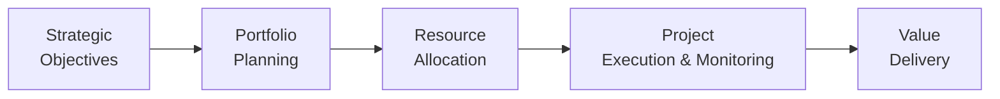
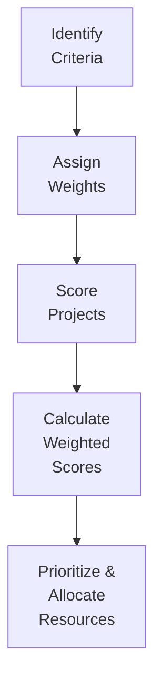

## 35.3 Strategic Resource Allocation and Prioritization

In modern projectized organizations, leaders face a constant challenge: deciding where—and how—to allocate finite resources to bring maximum value. As markets shift and competition intensifies, it becomes critical to evaluate and prioritize projects according to strategic goals, ensuring that funding, human capital, and material assets support initiatives most likely to deliver tangible benefits. This section explores how to navigate resource demands, emphasizing frameworks, tools, and real-world strategies that enhance organizational value and long-term success.

### The Importance of Strategic Resource Allocation

Strategic resource allocation and prioritization are cornerstones of effective portfolio management. They allow organizations to:

• Align critical resources with high-impact projects that support overarching business goals.  
• Prevent overextension, optimizing the use of human, financial, and material resources.  
• Facilitate more efficient project selection and scheduling techniques.  
• Balance risk vs. reward, ensuring a sustainable, diversified project mix.  

When portfolio managers weigh competing demands, they should do so holistically, considering not only financial metrics (e.g., NPV, ROI) but also qualitative factors (e.g., stakeholder satisfaction, brand image, regulatory requirements). This holistic approach has become central to modern project management, especially since the PMBOK® Guide Seventh Edition emphasizes value delivery and outcomes.

### Foundational Concepts

Understanding strategic resource allocation requires familiarity with several key concepts:

• Portfolio, Program, and Project Alignment:  
  – A portfolio represents a collection of programs, projects, and operations managed as a group to achieve strategic objectives.  
  – A program comprises interrelated projects managed together for synergistic benefit.  
  – Each project within a portfolio competes for resources. Therefore, each project’s potential impact and alignment with strategic objectives must be clear.  

• Resource Constraints:  
  – Financial Constraints: Limited budgets and funding must be budgeted across multiple initiatives.  
  – Capacity Constraints: Skilled labor, machines, facilities, or specialized equipment availability.  
  – Time Constraints: Project deadlines, resource availability windows, and time-to-market considerations.

• Value Maximization:  
  – The main goal is not merely to initiate as many projects as possible but rather to choose the optimal mix of projects that deliver the greatest overall value to stakeholders.  

### Approaches to Prioritization and Allocation

Several methods can be employed—each with different advantages and complexities. Among the most common approaches are:

• Weighted Scoring Models  
• MoSCoW (Must, Should, Could, Won’t) Prioritization  
• Benefit/Cost (B/C) and ROI Analysis  
• Multi-Criteria Decision Analysis (MCDA)  
• Balanced Scorecards  

Although each method has unique features, the guiding principle is the same: systematically evaluate project proposals or ongoing initiatives based on defined and agreed-upon metrics, then allocate resources where they provide the most strategic advantage.

### The Strategic Resource Allocation Process

Resource allocation should not be an isolated, one-time activity. Instead, it must align with the continuous evolution of organizational strategy and market environment. A process-based view helps maintain consistency and rigor:

**Diagram Explanation:**  
• “Strategic Objectives”: Define the vision, mission, and high-level organizational objectives.  
• “Portfolio Planning”: Translate objectives into criteria for project selection and prioritization.  
• “Resource Allocation”: Assign people, budgets, and assets based on strategic significance, urgency, and potential return.  
• “Project Execution & Monitoring”: Implement, manage, and oversee projects and programs, ensuring alignment with strategic goals.  
• “Value Delivery”: Evaluate outcomes to ensure the portfolio is achieving the intended benefits.

Within this continuous loop, feedback from project execution, lessons learned, and shifting market conditions can inform adjustments in resource allocation, ensuring the portfolio remains value-driven.

### Methods for Weighing Competing Demands

Competing demands often arise when multiple projects require the same limited resources (e.g., a specialized software developer or a piece of expensive equipment). To assess these scenarios:

#### 1. Weighted Scoring Technique

The Weighted Scoring Technique provides a quantitative mechanism to rank projects. Managers assign weights to decision criteria (e.g., strategic alignment, financial returns, risk level, social impact) and then score each project against these criteria. The final ranking is calculated by multiplying each score by its weight and summing up the results.

A common formula:


\text{Weighted Score}_j = \sum_{i=1}^{n} \bigl(\text{Score}_{ji} \times \text{Weight}_i\bigr)


Where:  
• j denotes the project number.  
• i denotes the criterion.  
• Scoreji is the performance of project j against criterion i (e.g., on a scale of 1–5).  
• Weighti is the relative importance of criterion i (commonly expressed as a fraction such that \\(\sum Weight_i = 1\\)).

**Diagram Explanation:**  
• Identify Criteria: Determine the key factors that drive project value (e.g., ROI, strategic fit).  
• Assign Weights: Allocate importance to each factor (0–1).  
• Score Projects: Rate how well each project meets the factors.  
• Calculate Weighted Scores: Multiply scores by weights and sum.  
• Prioritize & Allocate Resources: Direct resources to the highest-scoring projects.

#### 2. MoSCoW Method

Popular in agile and software development contexts, MoSCoW stands for Must, Should, Could, and Won’t. This approach classifies project tasks, features, or entire projects according to their criticality:

• Must: Essential initiatives with no room for compromise.  
• Should: High-value objectives but can be deprioritized if needed.  
• Could: Nice-to-have goals that can be delivered if resources permit.  
• Won’t: Items not planned for the current cycle or budget horizon.

MoSCoW aids in balancing short-term operational imperatives (Must) with long-term strategic desires (Should, Could), especially under time or cost constraints.

#### 3. Benefit/Cost and ROI Analysis

Financial methodologies remain a cornerstone of project prioritization. Common profit-based metrics:

• Net Present Value (NPV): Discounts future cash flows to the present, indicating potential profitability over time.  
• Internal Rate of Return (IRR): The discount rate at which the net present value of all cash flows equals zero.  
• Return on Investment (ROI): Measures net gain (or loss) from an investment relative to its cost, typically expressed as a percentage.  
• Payback Period: The time required for an investment to repay its initial outlay.  

Projects demonstrating higher returns, shorter payback, or aligning more aggressively with strategic goals often receive resource precedence.

#### 4. Multi-Criteria Decision Analysis (MCDA)

MCDA extends beyond purely financial metrics. It incorporates strategic fit, risk appetite, stakeholder expectations, and intangible gains (e.g., brand image, carbon footprint reduction). Decision-makers gather multiple dimensions of project performance, transforming them into a single integrated assessment. This systematic, data-driven approach helps mitigate bias.

### Balancing Flexibility and Control

Allocating resources strategically demands an equilibrium between robust governance and adaptability. Projects evolve, requirements change, and new opportunities emerge. Incorporate feedback loops for continuous improvement, ensuring the organization remains agile while adhering to standards such as:

• Formal Decision Gates: Periodic reviews to validate continued alignment with strategic goals.  
• Rolling Wave Planning: Gradually increase detail in resource schedules as more information becomes available.  
• Dynamic Resource Pools: Cross-functional teams, specialized skill sets, or rotating personnel can be shared across priority initiatives, refining utilization as demands shift.

### Resource Leveling and Capacity Management

Most organizations handle multiple projects simultaneously. Conflicts arise when the same resource—perhaps a specialized data scientist or a piece of heavy machinery—is required on overlapping schedules. Two common strategies address oversubscription:

• Resource Leveling: Adjust task start/finish dates to resolve resource conflicts without exceeding pre-defined resource limits.  
• Resource Smoothing: Ensure resources do not exceed capacity limits while adhering to critical project constraints (such as fixed end dates).

Both methods aim to strike a balance between meeting deadlines and optimizing resource utilization. When combined with robust prioritization frameworks, resource leveling and smoothing can ensure that mission-critical tasks receive the right resources at the right time, without unnecessary idle time or costly overtime.

### Practical Examples and Case Studies

#### Case Study: Global Electronics Manufacturer

A global electronics manufacturer was running 25 concurrent initiatives, ranging from product launches to software system overhauls. Each project sponsor claimed urgency. By developing a weighted scoring matrix with criteria such as strategic alignment, market potential, profitability, technical feasibility, and brand impact, the company discovered that half of the initiatives contributed only marginally to its primary goals. The executive committee reallocated advanced R&D teams and marketing budgets to five strategic projects that improved both short-term market share and long-term brand value.

#### Case Study: Local Government Agency

A local government struggled with deciding whether to invest in transportation infrastructure or community social programs. Both had pressing needs, but budgets were constrained due to declining revenue. Utilizing a Benefit/Cost approach supplemented by a Multi-Criteria Decision Analysis that included public health, accessibility, and environmental considerations, the agency found that a balanced investment in integrated bus transit systems yielded more overall benefits than immediately expanding the freeway. Thanks to a transparent, quantitative process, community stakeholders felt more confident that resources were being used responsibly and strategically.

### Best Practices

• Establish Clear Criteria: Define metrics and scoring rubrics upfront. Avoid shifting goalposts mid-cycle.  
• Engage Stakeholders Early: Buy-in from key stakeholders, such as executives and department leads, reduces friction.  
• Maintain Transparency: Communicate how and why allocation decisions are made. Demonstrate that high-priority projects align directly with strategic goals.  
• Iterate and Refine: Portfolio priorities evolve, so set regular re-evaluation cycles. Adapt resource assignments to emerging insights.  
• Avoid Analysis Paralysis: While data is crucial, overanalysis can stall decisions. Strike a balance between rigor and action.

### Common Pitfalls

• Underestimating Risks: Focusing purely on positive returns without properly accounting for threats can harm overall outcomes.  
• Neglecting Organizational Culture: Poor alignment between resource decisions and organizational values may lead to low morale or high turnover.  
• Inadequate Communication: Without ongoing updates, functional managers may resist or ignore resource reassignments.  
• Overcommitment to Legacy Projects: Projects with historical momentum could hoard critical resources beyond their strategic utility.  
• Lack of Continuous Feedback: One-time allocation decisions can quickly become obsolete in fast-changing markets.

### Conclusion

In today’s dynamic marketplace, organizations must continually adapt their portfolios to remain competitive. Strategic resource allocation and prioritization—informed by quantitative scoring models, multi-criteria analyses, and ongoing stakeholder engagement—helps leadership teams invest wisely. By committing funds, talent, and materials to the highest-value endeavors, organizations can more effectively achieve strategic aims, mitigate risk, and strengthen their market standing. 

Approaches such as Weighted Scoring, MoSCoW prioritization, cost-benefit analyses, and MCDA all serve to transform limited resources into sustainable competitive advantages. With thoughtful planning, governance, and a mindset of continuous improvement, teams can confidently navigate competing demands and position themselves for meaningful value creation across the entire portfolio.

## Test Your Knowledge of Strategic Resource Allocation



### Which of the following statements best defines the ultimate goal of strategic resource allocation?

- [ ] To fund as many high-return projects as possible
- [ ] To distribute manpower equally across every project
- [x] To invest limited resources in the most value-generating initiatives
- [ ] To eliminate all project risks

> **Explanation:** Strategic resource allocation focuses on directing limited resources to the projects that will yield the greatest overall organizational benefit, rather than trying to fund every project or eliminate risk entirely.

### Which statement best describes the MoSCoW technique?

- [ ] A process of assigning budget contingencies to each project
- [x] A method classifying initiatives into Must, Should, Could, and Won’t categories
- [ ] A capacity planning tool for defining resource constraints
- [ ] A communication framework exclusively for agile ceremonies

> **Explanation:** MoSCoW stands for Must, Should, Could, and Won’t and is used to prioritize features or projects based on their criticality and feasibility.

### In a Weighted Scoring Model, what role do “weights” play?

- [ ] They signify the deadlines for each project
- [ ] They assign resource limitations for each department
- [x] They determine the relative importance of each decision criterion
- [ ] They represent the probability of a project’s success

> **Explanation:** “Weights” define how important each criterion is in the overall scoring equation, multiplying your score by its assigned importance factor.

### Which of the following is a hallmark of Resource Leveling?

- [ ] Increasing project scope to accommodate extra budget
- [ ] Compressing tasks without adjusting resource utilization
- [ ] Automatically lowering project priority based on net present value
- [x] Adjusting task start and finish dates to resolve resource conflicts

> **Explanation:** Resource leveling modifies the schedule to address resource over-allocation, often shifting start or end dates to ensure resource usage does not exceed capacity.

### Which statement best describes the main advantage of Benefit/Cost analysis?

- [ ] It forces a project to rely solely on intangible benefits
- [x] It provides a straightforward financial ratio to compare competing investments
- [ ] It separates resource allocation rules from organizational strategy
- [ ] It requires the creation of multiple Weighted Scoring matrices

> **Explanation:** Benefit/Cost analysis (and ROI-related measures) offer an easy-to-understand financial metric, often expressed as a ratio, that helps compare the anticipated benefits relative to costs.

### Which is a common pitfall in strategic resource allocation?

- [ ] Conducting regular periodic reviews
- [ ] Assigning sophisticated analyses to high-value projects
- [x] Focusing only on financial metrics and ignoring intangible factors
- [ ] Using multi-criteria decision analysis

> **Explanation:** Over-reliance on purely financial metrics can cause organizations to ignore qualitative benefits or strategic alignment, leading to suboptimal decisions.

### In Multi-Criteria Decision Analysis (MCDA), what primary issue does combining multiple dimensions into one integrated assessment help overcome?

- [x] Narrow decision-making based on a single criterion
- [ ] Excessively detailed project budgets
- [ ] Over-extended timelines across different projects
- [ ] Simplifying intangible benefits into short bullet points only

> **Explanation:** MCDA helps decision-makers avoid focusing on only one factor (like cost or ROI) and instead evaluate projects more holistically, considering a range of financial and non-financial criteria.

### When would rolling wave planning most likely be used in resource allocation?

- [x] When there is incomplete information during early project stages but more detail emerges over time
- [ ] When the organization’s budget is fixed from the very beginning
- [ ] When the project scope remains unchanged after inception
- [ ] When resources are unlimited, and schedule constraints are minimal

> **Explanation:** Rolling wave planning tackles uncertainty by updating plans incrementally as more information becomes available, enhancing resource allocation decisions in complex or evolving projects.

### Which of the following techniques blends agile prioritization with resource optimization?

- [ ] Using only eXtreme Programming (XP) to assign tasks
- [ ] Assigning resources solely based on IRR
- [ ] Applying Earned Value Management to all agile sprints
- [x] MoSCoW analysis combined with capacity management to address constraints

> **Explanation:** MoSCoW helps prioritize agile deliverables, while capacity management addresses resource constraints. Together, they ensure the highest-priority items are allocated sufficient resources.

### A Balanced Scorecard approach primarily ensures:

- [x] A comprehensive perspective by including financial, customer, internal, and innovation dimensions
- [ ] An exclusive focus on ROI calculations
- [ ] That all projects follow a single methodology (waterfall or agile)
- [ ] That the payback period is minimized

> **Explanation:** Balanced Scorecard frameworks emphasize multiple performance dimensions beyond just finance, thus offering a broad strategic lens for resource decisions.



## PMP Mastery: 1500+ Hard Mock Exams with Full Explanations 

Looking to crush the PMP exam with confidence? Dive deep into 6 rigorous mock exams totaling 1500+ advanced-level questions, each accompanied by clear, step-by-step explanations. Hone your test-taking strategies, master complex topics, and build the resilience you need on exam day. Perfect for serious PMs aiming beyond fundamentals.

Enroll now:  
[PMP Mastery: 1500+ Hard Mock Exams with Exceptional Clarity & Full Explanations](https://www.udemy.com/course/pmp-2025/?referralCode=CF83A54BC86BE27F9AFE)

_Disclaimer: This course is not endorsed by or affiliated with the PMI examination authority. All content is provided purely for educational and preparatory purposes._
