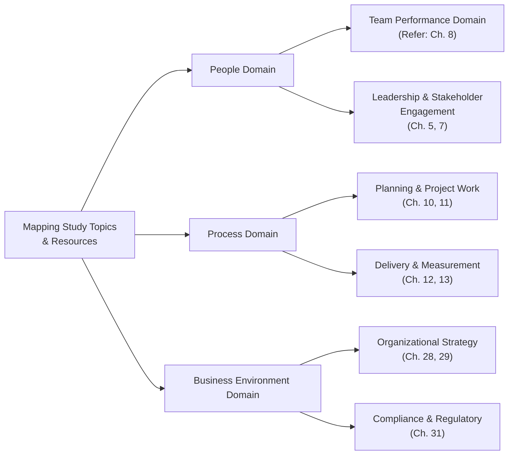

## 36.1 Mapping Study Topics to Exam Domains

A crucial step in preparing for the PMP® exam is ensuring that every facet of your study plan aligns with the official exam domains: People, Process, and Business Environment. The challenge many learners face is deciding which topics belong to which domain, how much time to allocate, and how to incorporate agile, hybrid, and traditional methodologies in a balanced manner. This chapter will guide you through a structured approach to mapping your study topics to the PMP® Exam Content Outline (ECO), so you can focus on what matters most and avoid any blind spots or overlaps in your preparation.

By using a systematic mapping method, you can confidently track your progress, reinforce the concepts you’ve already mastered, and concentrate on weaker areas. This chapter delves into the techniques, visuals, and examples you need to create a comprehensive roadmap that will carry you from Day 1 of your study plan to exam day with clarity and confidence.

### Why Mapping Matters
The PMP® exam requires a broad spectrum of project management knowledge, spanning from stakeholder communication to risk management, leadership, strategy, compliance, quality assurance, agile, and beyond. Since each question is classified under one of three performance areas—People, Process, or Business Environment—aligning your study plan with these domains ensures:

• Balanced coverage: Avoid overemphasis on certain areas at the expense of others.  
• Recall optimization: Reinforce memory by studying topics according to their domain-specific context.  
• Efficient resource use: Allocate your time wisely to meet the weighting of each domain.  
• Adaptability: Quickly pivot if you discover gaps in your knowledge.  

### Exam Domains and Their Weightings
Before diving into specifics, remember the approximate weightings:

• People Domain: ~42%  
• Process Domain: ~50%  
• Business Environment Domain: ~8%  

These percentages signify how questions are generally distributed, but they can vary slightly. Still, they guide you on how much emphasis each domain deserves in your study plan.

### Aligning PMBOK® Guide Knowledge Areas with PMP® Exam Domains
Even though PMBOK® Guide (Seventh Edition) focuses on principles and performance domains rather than the knowledge areas of previous editions, many study materials and organizational frameworks still reference “integration management,” “scope management,” etc. Similarly, the exam references the overall tasks within the ECO rather than the older Knowledge Area breakdown. Below is a conceptual mapping to help you see how these older knowledge area topics can integrate into the new exam domains:

| PMBOK® Guide Knowledge Area / Topic     | People Domain Alignment                           | Process Domain Alignment                                            | Business Environment Alignment                    |
|-----------------------------------------|---------------------------------------------------|---------------------------------------------------------------------|---------------------------------------------------|
| Integration Management                  | - Stakeholder leadership - Team management    | - Change control - Work performance data                         | - Organizational alignment - Strategic benefits|
| Scope & Schedule Management             | - Collaborative planning - Role assignments   | - Scope baseline - Work breakdown structure (WBS) - Scheduling| - Sponsor alignment - Operational oversight    |
| Cost & Quality Management               | - Team collaboration - Continuous improvement | - Budgeting - Cost control - Quality standards and audits     | - Regulatory compliance - Product acceptance   |
| Resource Management                     | - Team-building - Conflict resolution         | - Resource allocation - Performance appraisals                   | - Outsourcing strategies - Global environment  |
| Communications & Stakeholder Engagement | - Stakeholder Engagement - Motivation         | - Information distribution - Feedback loops                      | - Corporate policies - Cultural considerations |
| Risk & Procurement Management           | - Risk responses involving people                | - Risk analysis - Procurement strategy - Contracts management | - Contract law - External market conditions    |

This table is not exhaustive, but it shows how various traditional knowledge areas can be “remapped” into the People, Process, and Business Environment exam domains.

### Three-Step Mapping Framework

1. Identify Your Core Resources  
   Review your study materials and decide if you’ll approach them by the PMBOK® Guide’s performance domains, knowledge areas, or the exam domains. Consider additional resources like the Agile Practice Guide or relevant sections in PMIstandards+ if you are emphasizing agile and hybrid approaches.

2. Assign Topics to Exam Domains  
   Sort each concept into its most relevant domain. Some topics are broader and can appear in multiple domains (e.g., risk management can be both People and Process-oriented if dealing with human-related risks, plus Business Environment if the risk impacts regulatory compliance).

3. Build a Customized Study Plan  
   Allocate study sessions according to domain weightings, your comfort level with each domain, and your target exam date. Focus more heavily on areas you find most challenging and ensure cross-domain integration of agile, hybrid, and traditional topics.

Below is a simple conceptual diagram outlining how your various study topics and chapters from this guide (or any other resource) can connect to the three exam domains.  

Each node in this diagram illustrates potential connections to different chapters or aspects of project management knowledge. Your ultimate goal is to map each of your resources—lecture notes, study guides, sample questions—to the respective exam domain.

### Cross-Referencing with the PMI Talent Triangle
In addition to the exam domains, remember that PMI emphasizes the Talent Triangle: Technical Project Management, Leadership, and Strategic and Business Management. While not a direct 1:1 correlation with the exam domains, it serves as a complementary lens:

• Technical Project Management: Aligns heavily with the Process Domain (e.g., scope, schedule, risk).  
• Leadership: Aligns heavily with the People Domain (e.g., team motivation, conflict resolution).  
• Strategic & Business Management: Aligns heavily with the Business Environment Domain (e.g., project alignment with organizational goals).

### Integrating Agile, Hybrid, and Traditional Approaches
The PMP® exam now includes a significant number of questions on agile and hybrid approaches. Here’s how you might split these approaches across exam domains:

• People Domain: Focus on servant leadership principles, adaptability, and empowerment in agile teams.  
• Process Domain: Explore backlog refinement, sprint planning, iterative delivery, and daily stand-up ritual.  
• Business Environment Domain: Understand the strategic fit of agile within organizational contexts, policy constraints, and contract negotiations in a rapidly changing marketplace.

### Practical Example: A Real-World Project
Imagine you’re managing a new software implementation across multiple departments. Here’s how real-world topics map out:

• People Domain:  
  – Conflict arises between two department heads over resource allocation. You address this via collaborative negotiation and conflict resolution techniques.  
  – You focus on building an empowered cross-functional team for rapid iteration and feedback.  

• Process Domain:  
  – You develop a comprehensive schedule for incremental releases, using both Gantt charts and Scrum boards to track progress.  
  – You perform Earned Value Analysis (EVA) to evaluate cost performance, utilizing standard formulas (e.g., CV, SV).  

• Business Environment Domain:  
  – You ensure the project compliance with enterprise data security regulations.  
  – You align your project success metrics (KPIs) with the organization’s strategic goal of reducing operational costs by 10%.  

### Recommended Tools and Visual Aids
• Domain Checklist: A simple checklist with People, Process, and Business Environment columns. List each PMBOK® Guide principle, knowledge area, or performance domain you plan to study, marking the corresponding exam domain(s).  
• RACI Matrix: While typically a resource management tool, you can adapt it to track accountability for each domain across your study group.  
• Mind Maps: Visualize how different topics from the PMBOK® Guide and Agile Practice Guide link to one another under the main exam domains.

### Common Pitfalls
• Overlooking Soft Skills: The People Domain often receives less attention because it can appear “intuitive.” In reality, topics like conflict resolution, emotional intelligence, and team leadership are critical. Many exam questions revolve around situational scenarios that require emotional and leadership acuity.  
• Underestimating Business Environment: Even though it’s only about 8% of the exam, ignoring Business Environment topics could be detrimental. Compliance, benefits realization, and strategic alignment are often integrated into situational questions.  
• Focusing Exclusively on Predictive Methods: The PMP® exam has integrated agile and hybrid approaches deeply. Ensure that your mapping includes agile topics, such as Sprint Reviews, Retrospectives, and backlog refinement, to handle these questions confidently.  

### Case Study: Healthcare Implementation Project
To illustrate an in-depth scenario, consider a healthcare system upgrading its patient records software:

• People Domain: You organize training sessions for nurses, doctors, and administrative staff. You mediate between different department leads regarding day-shift vs. night-shift rollout. Action items: facilitate stakeholder engagement sessions, conduct frequent check-ins.  
• Process Domain: Coordinate with an IT vendor to ensure the new software integrates seamlessly with existing hardware. Draft a project schedule that accounts for pilot testing, training waves, and final go-live. Use suitable risk management tools to anticipate data migration risks.  
• Business Environment Domain: Comply with healthcare privacy regulations such as HIPAA. Align the software’s new capabilities with an overarching objective to improve patient satisfaction scores by 20%.  

Mapping each part of the project to the relevant exam domain clarifies your responsibilities and ensures no aspect is overlooked during preparation. The same principle applies when you’re learning: clearly define which areas of your textbooks, lecture notes, or practice exams fall under People, Process, or Business Environment.

### Creating Your Personalized Study Chart
Build a modular plan that itemizes each major topic, references the relevant chapters in this book, and indicates the exam domain alignment:

| Study Topic                                      | Reference Chapter(s)                           | PMP® Exam Domain(s)      | Target Completion Date  |
|--------------------------------------------------|------------------------------------------------|--------------------------|-------------------------|
| Risk Identification & Analysis                   | Ch. 22, Ch. 14 (Uncertainty Domain)           | Process (mostly), People | 2 weeks from start      |
| Formation of Self-Organizing Agile Teams         | Ch. 8 (Team Performance), Ch. 24, Ch. 25       | People (mostly)          | 3 weeks from start      |
| Governance & Executive Stakeholder Management    | Ch. 7 (Stakeholder), Ch. 28 (Strategy)         | People, Business Env.    | 3.5 weeks from start    |
| Earned Value Management (EVM) Formulas           | Ch. 13 (Measurement), Ch. 37 (Formulas)        | Process (mostly)         | 5 weeks from start      |
| Benefits Realization Tracking                    | Ch. 29 (Benefits Realization)                  | Business Env., Process   | 6 weeks from start      |

This chart keeps your study clear and purposeful. You will know exactly where to focus your attention and how each topic helps you master its corresponding exam domain.

### Tips for Ongoing Improvement
• Practice Quizzes by Domain: Set up or find quizzes that explicitly tag questions to People, Process, or Business Environment. This helps you gauge your strengths and weaknesses in each domain.  
• Track Progress Bi-Weekly: Revisit your plan and check off completed topics. Reassign priorities based on your quiz performance or new insights.  
• Seek Feedback from a Study Group or Mentor: Peers may notice if you’re missing a topic area or spending too little time on a specific domain.  

### References
• Project Management Institute (2021). A Guide to the Project Management Body of Knowledge (PMBOK® Guide)—Seventh Edition and The Standard for Project Management.  
• Project Management Institute (2017). Agile Practice Guide.  
• PMIstandards+ (For ongoing updates and emerging practices).  
• RMC Learning Solutions (Publisher of popular PMP Exam preparation materials).  

## Ready to Map Your Way to PMP® Success? Test Your Knowledge



### Which of the following is the greatest benefit of mapping study topics to the People, Process, and Business Environment domains?
- [x] Ensures balanced exam coverage and identifies knowledge gaps.
- [ ] Guarantees a passing score on the PMP® exam.
- [ ] Replaces the need for formal study resources or simulators.
- [ ] Matches your study plan to the PMBOK® Guide Sixth Edition structure only.

> **Explanation:** Mapping your study topics to the exam domains helps you focus on the specific mindsets and skill sets required in each area, preventing you from missing critical topics and enabling better exam preparedness.

### What is one major mistake when mapping exam topics to the domains?
- [ ] Overemphasizing the People Domain by studying too many soft skills.
- [ ] Mixing agility principles into the planning process topic.
- [x] Ignoring Business Environment topics because it covers a smaller percentage of the exam.
- [ ] Studying Communication under the People Domain.

> **Explanation:** Many candidates overlook the Business Environment topics due to their lower exam weight, but these questions can be pivotal if you’re on the borderline between pass and fail.  

### How can a well-structured RACI matrix be adapted in PMP® exam preparation?
- [x] To delegate study tasks within a group and ensure balanced domain coverage.
- [ ] To eliminate the need for daily standups.
- [ ] To formulate cost baselines for your study.
- [ ] To integrate your study plan into the formal scope statement.

> **Explanation:** RACI matrices aren’t limited to project resource assignments; they can be adapted to any effort needing clarity, such as who is studying which domain topics in a group setting.

### Which of the following best describes leveraging the PMI Talent Triangle in your PMP® exam study plan?
- [ ] Skipping all technical topics and focusing on the “Leadership” segment of the Talent Triangle.
- [x] Aligning technical knowledge with Process Domain, leadership with People Domain, and strategic considerations with the Business Environment Domain.
- [ ] Matching each knowledge area exclusively with “Leadership.”
- [ ] Working only on business strategy since it’s the least studied area among candidates.

> **Explanation:** The PMI Talent Triangle (Technical, Leadership, Strategic & Business) roughly maps onto the three exam domains, helping you verify balanced coverage.

### When integrating agile topics into your study mapping, which approach is most effective?
- [x] Studying agile events and artifacts under both People and Process domains, with strategic alignment in Business Environment.
- [ ] Treating agile the same as waterfall and ignoring the nuances.
- [x] Linking servant leadership and team empowerment to the People Domain.
- [ ] Focusing solely on the agile frameworks of Scrum and Kanban.

> **Explanation:** Agile topics can span multiple domains. Agile leadership styles (People Domain), iterative processes (Process Domain), and strategic alignment for agile adoption (Business Environment Domain) must all be addressed.

### A project manager needs to ensure compliance with new data protection laws. Which exam domain most closely aligns with this responsibility?
- [x] Business Environment Domain.
- [ ] People Domain.
- [ ] Process Domain.
- [ ] Management Domain only.

> **Explanation:** Compliance and regulatory items primarily fall under the Business Environment Domain, reflecting the project’s alignment with external and organizational factors.

### Which of the following is a best practice for mapping topics to domains?
- [x] Conduct periodic self-assessments by domain to identify weak spots.
- [ ] Start studying only when you feel ready for practice exams.
- [x] Use a chart or spreadsheet to visualize how topics map to each domain.
- [ ] Ignore newly emerging areas like AI in project management.

> **Explanation:** Creating a visible road map and self-assessments helps you stay focused on domain-specific improvements. This ensures no domain is overlooked.

### Suppose you find you’re weak in stakeholder conflict resolution. Where should you focus your study time?
- [x] The People Domain to address stakeholder engagement and leadership.
- [ ] The Process Domain to adjust scope.
- [ ] The Business Environment Domain for strategic synergy.
- [ ] Procurement Management practices only.

> **Explanation:** Conflict resolution, stakeholder engagement, and leadership are typically nestled under the People Domain. Strengthening these soft skills is crucial for exam success.

### What’s a caution to keep in mind regarding scope and schedule when mapping them to the exam domains?
- [x] They are typically classified under the Process Domain, but they have strong ties to People and Business Environment in certain contexts.
- [ ] They only matter in agile projects.
- [ ] They should strictly be classified under People Domain.
- [ ] They are not significant for the PMP® exam.

> **Explanation:** Topics like scope and schedule primarily align with the Process Domain, but they also emerge in People scenarios (resource conflicts) and Business Environment contexts (organizational constraints).

### The PMI Talent Triangle concept primarily relates to the three exam domains in which way?
- [x] Technical skills generally align with Process, leadership skills with People, and strategic skills with Business Environment.
- [ ] They are completely unrelated to the exam domains.
- [ ] Talent Triangle covers both pre- and post-project tasks only.
- [ ] Talent Triangle only aids Agile coaches.

> **Explanation:** The Talent Triangle’s three components—Technical, Leadership, and Strategic & Business—blend closely with the People, Process, and Business Environment domains, respectively, ensuring a comprehensive approach.



## PMP Mastery: 1500+ Hard Mock Exams with Full Explanations 

Looking to crush the PMP exam with confidence? Dive deep into 6 rigorous mock exams totaling 1500+ advanced-level questions, each accompanied by clear, step-by-step explanations. Hone your test-taking strategies, master complex topics, and build the resilience you need on exam day. Perfect for serious PMs aiming beyond fundamentals.  

Enroll now:  
[PMP Mastery: 1500+ Hard Mock Exams with Exceptional Clarity & Full Explanations](https://www.udemy.com/course/pmp-2025/?referralCode=CF83A54BC86BE27F9AFE)

_Disclaimer: This course is not endorsed by or affiliated with the PMI examination authority. All content is provided purely for educational and preparatory purposes._
