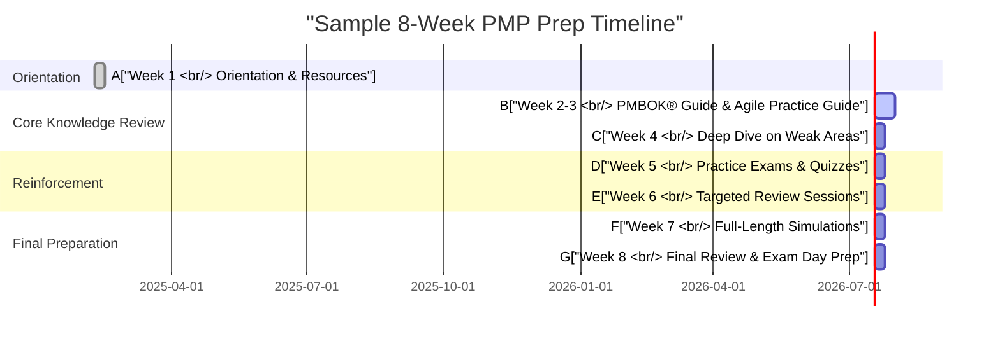

## 36.2 Establishing a Realistic Timeline

Achieving a strong, methodical study timeline is a cornerstone of success for any PMP® exam candidate. While the specific time required varies from one person to another, constructing a realistic schedule that accommodates personal, professional, and academic commitments is essential. When you create a plan that sets achievable milestones and reflects known constraints, you significantly increase the likelihood of thorough learning, reduced stress, and genuine mastery of project management concepts.

In this section, we outline strategies to develop a robust study schedule, explore milestone-based progress tracking, and introduce tools and techniques to help you stay focused. We also discuss ways to adjust your study pace when life inevitably throws curveballs. By laying down a well-structured approach and understanding how to evolve your timeline effectively, you can tackle the PMP® exam confidently and efficiently.

## The Importance of a Realistic Timeline

A realistic study timeline:

• Reduces stress and burnout, helping you remain motivated.  
• Enables consistent review and retention of large quantities of material.  
• Aligns your personal or professional schedule with regular study milestones.  
• Allows for flexibility if unforeseen events arise, such as family emergencies or work travel.  

When time is tight or personal obligations demand your attention, a reliable road map serves as an anchor that you can adapt while still keeping your eyes on the ultimate goal: PMP® exam success.

## Key Considerations for Timeline Planning

Before you build your schedule, consider the following:

• Personal Obligations: Family commitments, health matters, vacations, and non-work engagements.  
• Professional Demands: Overtime, business trips, complex project deliverables, and potential job transitions.  
• Your Starting Knowledge: Familiarity with the PMBOK® Guide, Agile Practice Guide, and related resources.  
• Learning Pace: Study habits, reading speed, and your ability to absorb and retain new information.  
• Exam Requirements: Ensure you account for the mandatory application process and eligibility verification from PMI.  

By keeping these factors in mind, you will be better positioned to craft a timeline that is specific, detailed, and, most importantly, achievable.

## Breaking Down the Exam Content

The PMP® exam covers three primary domains (People, Process, and Business Environment) as outlined in Chapter 6 of this book. You must demonstrate competency across a broad spectrum of project management knowledge, including traditional (predictive) practices and agile/hybrid approaches. Additionally, the PMBOK® Guide (Seventh Edition) is organized around project management principles and performance domains. These building blocks are addressed in-depth in earlier parts of this companion guide (see Chapters 4, 5, 6, and 7–14).

To create an effective timeline, first identify what you must learn or strengthen. Then, estimate how much time you need per topic. For instance, if you are already adept at risk management (refer to Chapter 22), you may allocate fewer hours to that section, while devoting more time to areas where you need improvement, such as Earned Value Management (Chapter 13 and Chapter 19).

## Establishing Milestones

Milestones act as checkpoints that measure your progress along the study journey. For PMP® exam prep, key milestones might include:

• Reviewing the PMBOK® Guide (Seventh Edition) thoroughly at least once.  
• Completing the Agile Practice Guide and relevant agile/hybrid sections in your chosen study resources.  
• Achieving designated scores on practice exams or mock tests.  
• Engaging in a final review of formulas and concepts (see Chapter 37 for key formulas).  

Each milestone should have clear interim goals. For instance, “Complete reading Chapter 10 on Planning Performance Domain within two weeks” is more actionable than “Start planning study.” By specifying both the action and the target deadline, you create a concrete objective that can be monitored and measured.

## Building a Weekly or Monthly Study Plan

When plotting your timeline, it’s common to break it into weeks or months. A general approach is:

1. Kickoff and Orientation Phase  
   - Familiarize yourself with the exam domains, tasks, environments, and reference materials.  
   - Review the PMP® Exam Content Outline and cross-reference with each knowledge area.  
   - Plan your daily or weekly study hours based on other obligations.

2. Core Knowledge Review Phase  
   - Study the PMBOK® Guide content domain by domain or chapter by chapter.  
   - Integrate agile concepts from the Agile Practice Guide and other resources.  
   - Take short quizzes at the end of each section (this book conveniently provides quizzes in every chapter).  

3. Reinforcement and Practice Phase  
   - Attempt timed practice exams or targeted quizzes.  
   - Identify weak areas and revisit relevant sections.  
   - Schedule milestone reviews to ensure consistent progress.  

4. Final Preparation Phase  
   - Focus on refining your exam-taking skills, such as time management during test simulations.  
   - Revisit complex formulas like those for earned value and probability-impact (Chapter 37).  
   - Review flashcards, mind maps, or the “brain dump” you plan to do on exam day.  

### Sample 8-Week Timeline

Below is an example timeline for a candidate working full-time while studying. This plan is for illustrative purposes. Adapt it to your own pace, factoring in weekend availability and overall workload.

### Sample 12-Week Timeline

If you have more flexibility and prefer spreading out your study, a 12-week plan might be more comfortable. You could build similar sections—Orientation, Core Knowledge Review, Reinforcement, Final Preparation—but each stage could be two or three weeks in duration. This longer schedule allows for deeper engagement with practice exams or additional reading of advanced concepts (for instance, see Chapters 32 and 33 on complex adaptive systems and advanced leadership).

## Adjusting for Personal Constraints

No two learners have identical circumstances. Work might intensify unpredictably, or you could face sudden life events. Here are ways to adapt:

• Buffer Weeks: Schedule a “buffer” or “catch-up” week periodically to handle emergencies. This time can also be used to review content or tackle extra practice problems if things go smoothly.  
• Modular Study Blocks: Instead of tying yourself to a strict daily routine, allocate modular blocks of time—90-minute sessions over lunch breaks, after dinner, or early mornings. If a block is missed, reschedule it within the same week.  
• Focused Sprints: In agile parlance (discussed in Chapter 25), set short “sprints” of study for high-focus periods. For instance, plan two weeks of more intense study if you know you’ll have lighter work responsibilities.  

If your timeline starts slipping, conduct a brief retrospective to identify why you missed targets. Was the schedule unrealistic? Were there unavoidable job or family issues? Understanding the root cause allows you to pivot effectively rather than push forward blindly.

## Tools and Techniques for Effective Scheduling

Effective scheduling goes beyond marking a calendar. Consider integrating:

• Digital Calendars: Tools like Google Calendar or Microsoft Outlook for scheduling recurring study blocks, including reminders for milestones.  
• Project Management Software: Software like Trello, Asana, or MS Project can help create boards or Gantt charts, letting you track progress visually (relate this to your knowledge of scope, scheduling, and resource management from Chapters 17, 18, and 21).  
• Time-Boxing Techniques: Apply the same time-boxing principle used in agile frameworks (Chapter 26) to your study sessions. Decide how many hours or sessions to spend on each topic and stick to it.  
• Pomodoro Timers: Break study sessions into 25-minute intervals (Pomodoros) with 5-minute breaks. This approach promotes focus and reduces fatigue.  

## Monitoring Progress and Making Adjustments

Continuously check your progress against your original plan. Ask:

1. Are you consistently meeting weekly or bi-weekly goals?  
2. Which domains (People, Process, Business Environment) are you struggling with?  
3. How are your practice exam scores trending?  

If you observe diminishing returns in one domain, pivot your study time. Chapter 10 (Planning Performance Domain) emphasizes iterative planning in real-world projects; treat your PMP® study in the same iterative manner. The aim is to stay flexible so that your schedule evolves with your needs while still moving you closer to your overarching milestone targets.

## Case Study: Balancing Family and Full-Time Employment

Consider Sofia, a project manager in a mid-sized IT firm with two young children at home:

• Sofia decided on a 10-week study plan, aiming for a final exam date just before Q4.  
• She established Milestone 1: “Complete PMBOK® Guide sections on Stakeholder and Team Performance Domains by Week 3.”  
• During Week 2, her children fell ill, derailing her schedule. She used a buffer day and split her usual two-hour blocks into smaller, 45-minute segments to manage extra family responsibilities.  
• She ended Week 3 slightly behind but leveraged her planned “catch-up” day in Week 4 to consolidate the missed reading.  
• By continuing to adapt her schedule, she entered the final month of study nearly on track, using extra weekend time to complete additional practice exams.  

Sofia’s experience underscores the importance of flexibility and minor schedule readjustments. Small changes—like smaller study blocks, buffer days, or weekend reviews—enabled her to maintain momentum rather than give up or risk last-minute cramming.

## Common Pitfalls and How to Avoid Them

• Overestimating Free Time: Many candidates assume they can dedicate more hours than is realistic. Track your actual time usage for a week to understand your real capacity.  
• Unrealistic Milestones: Setting milestones that are too close together can cause a sense of failure if they’re missed. Space them out, factoring in your learning pace and potential emergencies.  
• Lack of Progress Tracking: Merely creating a timeline isn’t enough. You need to mark completed tasks and assess whether you’re truly absorbing the material.  
• Ignoring Practice Exams: Some candidates front-load reading but neglect full-length practice exams until the last minute. Practice tests are invaluable for diagnosing knowledge gaps early.  

## Best Practices for Sustaining Momentum

• Reward System: Celebrate small victories. Completed a challenging knowledge area? Treat yourself, share progress with friends, or take a well-deserved break.  
• Accountability Partner: Study with a colleague or join a study group. Communicating goals can build external motivation and keep you accountable.  
• Reflective Journaling: End each week by noting topics learned, questions that remain unanswered, and areas that need more study time.  
• Effective Resource Use: Beyond reading the PMBOK® Guide, leverage this supplemental guide (especially the performance domains in Chapters 7–14) for real-world tips.  

## Staying Motivated and Maintaining Balance

The path to PMP® certification is often a marathon rather than a sprint. Maintaining a healthy lifestyle—regular exercise, sufficient sleep, balanced meals—can keep your mind clear and energy levels steady. If you find your motivation dwindling, revisit the reasons why you are pursuing this certification. Is it for career advancement, higher earning potential, or personal growth?

Focus on incremental achievement: it is easier to manage small tasks each day than to tackle an overwhelming workload all at once. If you follow the iterative and adaptive approaches described in agile methodologies (Chapters 24, 25, 26), you’ll see how breaking big tasks into smaller ones promotes continuous improvement.

## References for Further Exploration

• Project Management Institute. A Guide to the Project Management Body of Knowledge (PMBOK® Guide) Seventh Edition.  
• Agile Practice Guide. Project Management Institute.  
• Kerzner, H., Project Management: A Systems Approach to Planning, Scheduling, and Controlling.  
• Highsmith, J., Agile Project Management: Creating Innovative Products.  
• Rita Mulcahy, PMP Exam Prep: Rita’s Course in a Book for Passing the PMP® Exam.  

These resources provide deeper insights into project time management, advanced scheduling, and approaches to balancing agile and traditional methods. You’ll find a wealth of strategies to further refine your timeline and adapt as your exam date draws near.

With a carefully structured timeline that’s realistic yet adaptable, you’re setting yourself on a path to success. Your plan is your best ally, keeping you motivated and accountable so you can master the vast body of knowledge required and turn exam preparation into a manageable, step-by-step journey.

## Test Your Timeline Mastery – PMP® Preparation Quiz



### Which of the following is the most important factor to consider when creating a PMP® study timeline?

- [ ] Potential salary increase post-certification
- [ ] The amount of sleep you are used to
- [x] Personal and professional obligations that could limit study time
- [ ] The confidence level you have in your reading speed

> **Explanation:** While all factors may contribute, the most critical aspect is accurately understanding your personal and professional constraints to create a realistic plan.

### When should you schedule “buffer weeks” in your study plan?

- [x] Periodically throughout the plan to address emergencies or extra reviews
- [ ] Only at the end of the study schedule in case there is leftover content
- [ ] Right before the exam date to cram all last details
- [ ] Immediately after the PMP® exam application is approved

> **Explanation:** Including buffer weeks periodically helps accommodate unexpected events or additional review requirements without derailing the entire schedule.

### Which technique is often employed in Agile frameworks and can be adapted for PMP® study sessions to maintain focus?

- [ ] Earned Value Management
- [x] Time-boxing
- [ ] Rolling wave planning
- [ ] Risk matrixing

> **Explanation:** Time-boxing is a method used in Agile to allocate a fixed period for specific tasks—an approach that can be highly effective in maintaining focus during study sessions.

### What is a common pitfall when establishing milestones?

- [x] Setting them too close together
- [ ] Celebrating achievements after each milestone
- [ ] Tracking each milestone diligently
- [ ] Ensuring milestones align with PMP® domains

> **Explanation:** Milestones that are too close together can be unrealistic and lead to unnecessary pressure or a sense of failure if they are missed.

### What is the primary advantage of using a Gantt chart for your PMP® study plan?

- [ ] It ensures your application is approved.
- [x] It provides a visual timeline to measure progress and allocate tasks over time.
- [ ] It automatically predicts exam topics you will master first.
- [ ] It increases your reading speed.

> **Explanation:** A Gantt chart gives you a visual representation of tasks and deadlines, making it easier to see the flow of your study plan and track completion.

### How can practice exams be best utilized within a study timeline?

- [x] As part of the reinforcement phase to identify weak areas
- [ ] Only in the first week to understand the entire exam content
- [ ] Used solely after you have scheduled your real exam date
- [ ] Avoid them entirely to reduce test anxiety

> **Explanation:** Practice exams are best taken after you have covered a solid amount of content, helping identify knowledge gaps and measure your understanding.

### Which approach could help you adapt your PMP® timeline during unexpected personal or professional obligations?

- [x] Conducting short “sprints” of focused study
- [ ] Cancelling your minimal free time altogether
- [x] Scheduling smaller 45-minute study blocks
- [ ] Resigning from your current job to focus entirely on study

> **Explanation:** Short sprints and smaller study blocks offer flexibility and enable you to continue studying effectively when circumstances demand more attention elsewhere.

### Why might setting a final milestone that aligns with a full-length simulation exam be beneficial?

- [x] It simulates real exam conditions and measures readiness.
- [ ] It guarantees an immediate pass on the PMP® exam.
- [ ] It removes the need for further review after the simulation.
- [ ] It shortens the total study timeline significantly.

> **Explanation:** Full-length simulation exams are invaluable for gauging exam-day performance, refining time management, and instilling confidence.

### How can a candidate maintain motivation throughout a longer study timeline?

- [x] By celebrating small achievements and using accountability partners
- [ ] By skipping all breaks to maintain momentum
- [ ] Ignoring weekly progress metrics to reduce stress
- [ ] Blaming external factors for missed deadlines

> **Explanation:** Celebrating small successes, working with others, and tracking progress are key methods for sustaining motivation.

### True or False: A “one-size-fits-all” timeline is adequate for most PMP® aspirants.

- [x] False
- [ ] True

> **Explanation:** Different personal and professional constraints mean there is no single timeline that fits all learners. A tailored plan is essential for realistic, effective preparation.



## PMP Mastery: 1500+ Hard Mock Exams with Full Explanations 

Looking to crush the PMP exam with confidence? Dive deep into 6 rigorous mock exams totaling 1500+ advanced-level questions, each accompanied by clear, step-by-step explanations. Hone your test-taking strategies, master complex topics, and build the resilience you need on exam day. Perfect for serious PMs aiming beyond fundamentals.  

Enroll now:  
[PMP Mastery: 1500+ Hard Mock Exams with Exceptional Clarity & Full Explanations](https://www.udemy.com/course/pmp-2025/?referralCode=CF83A54BC86BE27F9AFE)

_Disclaimer: This course is not endorsed by or affiliated with the PMI examination authority. All content is provided purely for educational and preparatory purposes._
