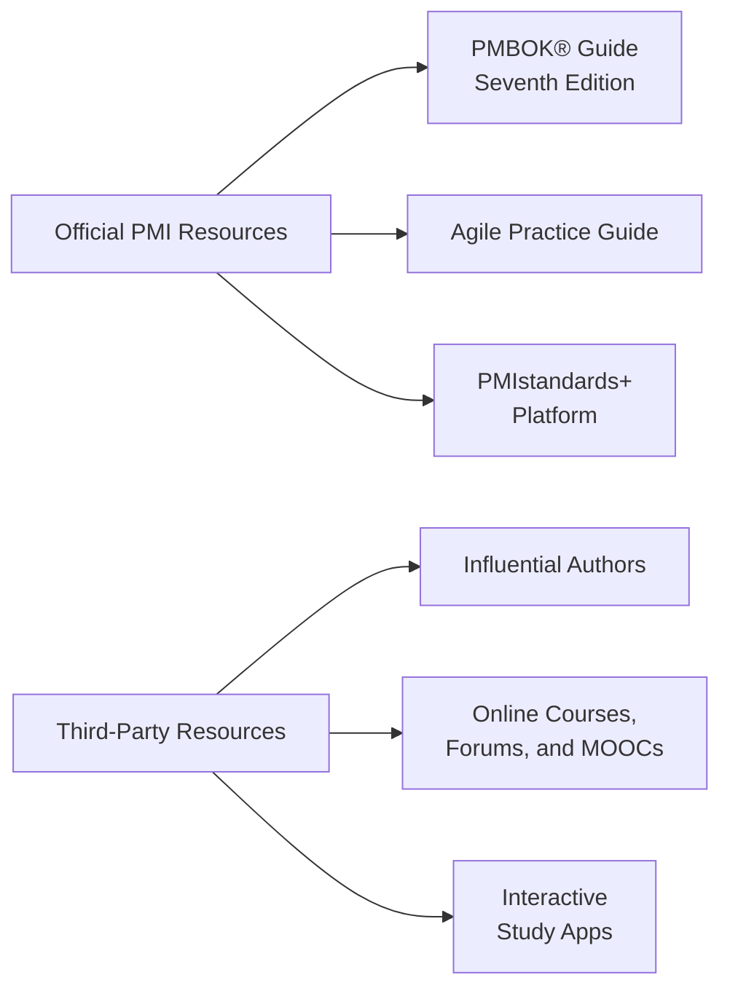

## 36.3 Recommended Resources and Reading Materials

Preparing for the PMP® exam requires a dynamic blend of official standards, subject-matter guides, interactive tools, and community spaces where you can exchange ideas. This section provides a detailed road map of diverse resources—from official PMI publications to specialized periodicals and digital platforms. Our goal is to highlight a thorough mix of academic and practical materials that will deepen your project management acumen, equip you with updated exam insights, and spark ongoing professional development.

This chapter builds upon [Chapter 36: Creating Your Study Plan](#), offering curated references that dovetail perfectly with your study schedule, emphasizing rich, real-world perspectives. The recommendations address various learning styles, budget ranges, and knowledge gaps, thereby ensuring a comprehensive, inclusive approach to preparation. Where possible, we also supply practical examples, diagrams, and tips to help you gauge the suitability of each resource to your unique exam readiness.

---

### Why Strategic Resource Selection Matters

Your exam endeavors are too important to rely on ad-hoc resources. Poorly fitting study materials can lead to gaps in knowledge, confusion about project management vocabulary, or an overemphasis on outdated practices. Conversely, selecting well-structured, reputable materials grows your confidence, sharpens your technical and leadership skills, and offers the varied perspective needed given the PMP® exam’s expanded coverage (including agile, hybrid, and predictive approaches).

Throughout this companion guide, we have examined broad concepts—like PMI’s performance domains, project management processes, and knowledge areas—along with in-depth leadership strategies, agile frameworks, and advanced topics. Supplementing your study with authoritative references helps reinforce these concepts through alternative explanations and additional exercises. Ultimately, robust resources serve both exam success and sustainable career growth.

---

### Official PMI (Project Management Institute) Publications

The core body of knowledge for the PMP® exam originates from official PMI standards and frameworks. These publications form the bedrock of your study, since exam questions frequently reference terminology and structure found in PMI documents. While the PMP® exam is not restricted exclusively to PMI’s printed material, it is strongly guided by these works.

#### PMBOK® Guide – Seventh Edition
The “A Guide to the Project Management Body of Knowledge (PMBOK® Guide) – Seventh Edition” has introduced principle-based project management and performance domains, offering a more holistic and dynamic approach than previous editions. Key changes include:  
- Emphasis on guiding principles rather than prescriptive processes.  
- Integration of agile and hybrid strategies.  
- Greater focus on outcome-based measurement and value delivery.

It is important to reconcile the new structure (principles, performance domains, tailoring) with your existing knowledge from prior editions. This alignment is critical to understanding the PMP® exam's shift from a primarily predictive view to a flexible, situational adaptive approach.

#### Agile Practice Guide
Cosponsored by PMI and Agile Alliance®, the Agile Practice Guide explains agile concepts, approaches, and methods, featuring guidance on tailoring agile for various environments. This resource is invaluable for mastering the 50% or more of PMP® exam questions that require knowledge of agile or hybrid frameworks. Core sections detail:  
- Agile mindsets and leadership styles.  
- Scrum, Kanban, XP, and Lean-Agile principles.  
- Methods for combining predictive and agile approaches in hybrid models.

Highlight agile’s incremental delivery, iterative planning, and continuous feedback loops, as these are essential for success on exam questions exploring iterative processes or agile best practices within a larger product or portfolio strategy.

#### PMIstandards+™
Accessible to PMI members, the PMIstandards+™ digital platform expands upon PMBOK® Guide principles and performance domains, facilitating a highly interactive, searchable resource. You can find:  
- Real-life case studies.  
- Tailoring tips for context-specific situations (e.g., regulatory constraints, intangible deliverables).  
- Tools and templates aligned with PMI frameworks.

By synthesizing theory, case analyses, and robust examples, PMIstandards+™ can be especially helpful for bridging textbook theory with practical application.

---

### Influential Authors and Comprehensive Exam Prep Books

Beyond official PMI documents, several authors have shaped standard PMP® exam prep resources. These guides often distill complex content, include end-of-chapter quizzes for self-assessment, and highlight typical exam pitfalls.

#### Rita Mulcahy’s PMP® Exam Prep
Widely regarded as a staple among PMP® aspirants, Rita Mulcahy’s guide offers a lively writing style that keeps readers persistently engaged. The book clarifies complicated processes, includes extensive practice questions, and provides tips for exam success. Known for its “Process Chart” and “Tricks of the Trade,” it trains you to think like a project manager, precisely the skill you need for the PMP® situational questions.

#### Kim Heldman’s PMP® Study Guide
Kim Heldman’s text covers every process group and knowledge area with clarity and rigor. Her approach suits readers seeking a structured, methodical approach to learning. Comprehensive question banks and step-by-step solutions (particularly around earned value management and advanced risk analysis) offer significant practice in calculation-based queries.

#### Head First PMP by O’Reilly
If you are a visual learner who appreciates cartoon-style illustrations and interactive exercises, “Head First PMP” may resonate perfectly. The guide features mind maps, sketchnote-like diagrams, and real-world anecdotes that simplify complex concepts. While it is often considered an entry-level supplement, the combination of visuals, informal tone, and well-selected practice exercises can complement heavier, more traditional exam prep books.

#### Other Recommended Authors
1. Andrew Ramdayal (TIA): Known for his relaxed teaching style, Andrew’s exam prep materials emphasize the agile portion and are packed with hundreds of practice questions.  
2. Scott Payne (PM Master Prep): Delivers scenario-based learning and “walkthroughs” that help you approach complex exam scenarios and integrate knowledge from multiple domains.  
3. Paul Sanghera: Offers in-depth coverage of project management fundamentals and advanced theories, plus practice exam sets that reflect the structure and difficulty of the real PMP® exam.

---

### Online Learning Platforms, MOOCs, and Digital Courses

A variety of digital learning platforms can reinforce your textbook study. Many students find that short video lessons keep motivation high, while also introducing exam tactics such as time management or selective skipping strategies. Additionally, platforms often provide question banks with performance analytics to track your strengths and weaknesses.

- Coursera & edX: Host university-affiliated courses on project management principles, agile practices, and PMP exam prep labs.  
- Udemy & Skillshare: Contain thousands of user-reviewed courses with varying degrees of depth, focusing on situational questions, formula mastery, or agile methods.  
- PMI’s Online Course Offerings: PMI offers specialized e-learning modules, including some that invite quick refresher sessions or deeper explorations of performance domains.

Hybrid approaches to learning can be especially powerful. For instance, try combining a self-paced MOOC with a weekly virtual study group to foster accountability and clarify difficult concepts (see “Community-Based Learning” below).

---

### Interactive Study Apps and Simulation Tools

Exam simulation tools emulate the PMP® environment, enabling you to practice time management and stress resilience. They often provide immediate feedback, clarifying why each choice is right or wrong.

- PrepCast Simulator: Offers hundreds of scenario-based questions, adjustable difficulty, and an interface that closely aligns with the computer-based PMP® exam testing environment.  
- Rita FastTrack Cloud: Incorporates integrated analytics to identify knowledge gaps and track your improvement.  
- Pocket Prep and Other Mobile Apps: Provide short, on-the-go quizzes that help you stay consistent in your studies, even if you only have a few minutes per day.

When choosing a simulator, seek up-to-date references that align with the new exam domains—People, Process, and Business Environment—and agile/hybrid integration. Always confirm the question banks reflect the 2021 or later exam updates.

---

### Community-Based Learning and Discussion Forums

Connecting with peers can greatly accelerate your exam readiness. Discussion forums and study groups help you cross-pollinate ideas, share success stories, and keep pace with evolving exam requirements.

- PMI Chapters: Local chapters frequently organize workshops, study groups, live Q&A sessions, and networking events to deepen your project management expertise.  
- LinkedIn and Reddit (r/ProjectManagement): Provide large, global communities of project managers who actively share insights, lessons learned, and recommended reading lists.  
- Online Cohorts: Many trainers and bootcamp providers offer Slack or Teams groups for ongoing discussion, break-out sessions, and problem-solving tips.

Just ensure you cross-check any tips you find in online communities with official sources or recognized experts. This guardrail avoids confusion arising from conflicting or outdated advice.

---

### Academic Journals and Research Publications

For those seeking enhanced theoretical knowledge or advanced leadership perspectives, academic journals can expand your horizons beyond PMP® test preparation.

- Project Management Journal (PMI): Publishes peer-reviewed research on methodology, leadership theory, and case studies.  
- International Journal of Project Management (Elsevier): Features empirical papers on managing large, complex, or cross-disciplinary projects.  
- IEEE Engineering Management Review: Offers a technology-focused angle that can be helpful if your projects align with engineering, software, or digital transformations.

Exploring these academic sources can push you to think critically about emerging trends—like machine learning, remote collaboration, or adaptive portfolio management—while reinforcing your capacity to tackle advanced exam questions on complexity and uncertainty.

---

### Specialized Articles and Blogs

Sometimes, you just need a succinct article that zeroes in on a specific topic, such as stakeholder engagement in large-scale data projects or mitigating intangible risks in creative endeavors. Blogs from established PM professionals can be:  
- Quick references for on-the-job challenges.  
- Inspirational and pragmatic guides to building a project management career.  
- Pointers to new technologies or newly introduced project management tools.

A few prolific bloggers include Elizabeth Harrin (GirlsGuidetoPM), Cornelius Fichtner (PM Podcast), and Glen Alleman (Herding Cats). Often, they blend the personal experiences of project managers with the formal standards found in PMBOK® and the Agile Practice Guide.

---

### Visual Overview: Resource Categories

Below is a Mermaid.js diagram illustrating the broad categories of resources we’ve explored. Use it as a quick reference when assembling your personalized study plan.

Each node in this diagram corresponds to a distinct segment of your total study ecosystem. While official sources (A) form the unshakable foundation, third-party resources (E) complement and bring fresh perspectives, especially for situational practice and deeper domain specialization.

---

### Case Study: Blending Multiple Resources for a Solid Preparation

**Scenario**: Nia, a marketing project manager, spent six months preparing for the PMP® exam while juggling a full-time job. She used the “PMBOK® Guide – Seventh Edition” as her theoretical base, dedicating one hour per day to reading core chapters on performance domains. Simultaneously, she enrolled in a part-time agile bootcamp through an online learning platform, specifically focusing on agile events and artifacts. For practice, she used an app-based quiz every morning during her daily commute.

**Outcome**: Nia credits the synergy of authoritative PMI publications with third-party agile courses for solidifying her knowledge. The daily practice quizzes turned out to be crucial for time management techniques during the actual exam. With guidance from a local PMI chapter mentor, she was also able to clarify real-world scenarios that matched tricky mock exam questions. Her approach highlights the importance of weaving official and supplementary resources into a cohesive study plan.

---

### Best Practices and Pitfalls

- **Best Practice**: Start with the PMBOK® Guide – Seventh Edition and Agile Practice Guide to gain a fundamental vocabulary.  
- **Best Practice**: Validate lecture materials, blog posts, or mock tests against the official PMI reference points, ensuring exam alignment.  
- **Pitfall**: Over-dependency on one type of resource (e.g., only question banks or only a single exam prep book) can leave knowledge blind spots.  
- **Pitfall**: Falling for outdated material referencing the sixth edition only, without bridging to the seventh edition’s principle-based perspective and updated exam format.

---

### Additional Reading and Ongoing Learning

Project management is a field of continuous evolution. After passing the PMP® exam, you will encounter new technologies, team structures, and governance models. Here are reference suggestions for ongoing mastery:

- **Disciplined Agile® Tool Kit** by PMI: Offers an adaptive, context-driven approach for scaling agile methodologies.  
- **Lean Startup** by Eric Ries: Particularly valuable if you lead innovation or entrepreneurial projects, complementing agile principles with a startup mentality.  
- **Leadership in the Age of Digital Transformation** by Various Authors: Helps you refine leadership styles in cross-functional, remote, or hybrid environments.  
- **Kaizen and Continuous Improvement**: Strengthens your approach to incremental enhancements in both tasks and team collaboration, tying directly into continuous improvement pillars of the PMBOK® Guide.

---

### References for Further Exploration

1. **PMI Online Store**: https://www.pmi.org/shop  
2. **RMC Learning Solutions – Rita Mulcahy**: https://rmcls.com/  
3. **Kim Heldman’s Study Guide**: Available in major online bookstores.  
4. **Head First PMP (O’Reilly)**: https://www.oreilly.com/library/view/head-first-pmp/  
5. **Coursera Project Management Courses**: https://www.coursera.org/courses?query=project%20management  
6. **PrepCast Simulator**: https://www.project-management-prepcast.com/pmp-exam-simulator  
7. **PMIstandards+™ Platform**: https://standardsplus.pmi.org/  

---

In summary, effective resource creation is integral to a well-rounded, efficient, and confident PMP® exam preparedness journey. By leveraging both official PMI materials and carefully vetted third-party references, you can craft a rich tapestry of knowledge that meets every exam domain’s needs, fosters crucial leadership competencies, and bolsters your ability to adapt to agile or hybrid project dynamics.

---

## Test Your Knowledge: Key Reading Materials and Resources for PMP Success



### Which publication lays the foundational principles and performance domains for the PMP® exam in a principle-based format?

- [ ] PMBOK® Guide – Sixth Edition
- [x] PMBOK® Guide – Seventh Edition
- [ ] PRINCE2 Manual
- [ ] Scrum Guide

> **Explanation:** The PMBOK® Guide – Seventh Edition organizes project management around guiding principles and performance domains, reflecting an evolved, holistic approach that the latest PMP® exam also follows.

### Which guide does PMI and the Agile Alliance® cosponsor to detail flexible development and iterative planning?

- [ ] PRINCE2 Agile
- [ ] The Standard for Enterprise DevOps
- [x] Agile Practice Guide
- [ ] ITIL 4 Foundation

> **Explanation:** The Agile Practice Guide, jointly developed by PMI and the Agile Alliance®, explains agile principles, roles, events, and how to apply them alongside traditional or hybrid lifecycles.

### What is the primary benefit of utilizing question banks and simulation tools during exam preparation?

- [ ] They replace the need to read official publications.
- [x] They provide exam-like practice scenarios and time-management experience.
- [ ] They are strictly required by PMI.
- [ ] They only benefit experienced project managers.

> **Explanation:** Simulation tools and question banks mimic the actual exam’s style and constraints, which improves familiarity with situational questions, pacing, and stress management.

### Which of the following is an advantage of participating in forums and local PMI chapter events?

- [x] Gaining peer insights and practical knowledge-sharing
- [ ] Completely avoiding official study guides
- [ ] Reducing study time to zero
- [ ] Restricting your learning to a single perspective

> **Explanation:** In-person and online communities offer multiple viewpoints, networking, and accountability, enhancing your understanding of how project management theory translates into real-world scenarios.

### Which resource focuses on iterative, incremental development and is widely used to scale agile practices at an enterprise level?

- [ ] PMBOK® Guide – Sixth Edition
- [ ] Head First PMP
- [x] SAFe® Framework
- [ ] IIBA BABOK® Guide

> **Explanation:** The Scaled Agile Framework (SAFe®) is a popular method for implementing agile and lean principles across an entire organization, especially when dealing with large, complex projects or numerous teams.

### When evaluating a third-party PMP® exam prep book, what should you verify first?

- [x] That it covers the updated exam domains (People, Process, Business Environment) and agile/hybrid topics
- [ ] That it exclusively focuses on waterfall practices
- [ ] That it was published before 2010
- [ ] That it only has short summaries and minimal practice questions

> **Explanation:** Because the exam content changed in 2021 to increase focus on agile and hybrid methods, it is essential to ensure your study materials reflect the latest exam domains and format.

### Which author is well-known for a visually oriented PMP® exam guide that uses cartoons, mind maps, and reader-friendly language?

- [ ] Andy Crowe
- [x] Head First PMP by O’Reilly
- [ ] Kim Heldman
- [ ] Cornelius Fichtner

> **Explanation:** Head First PMP uses unique visuals and interactive exercises, facilitating a more relaxed learning style that helps readers grasp complicated concepts through memorable illustrations.

### What caution should you keep in mind when using discussion forums for PMP® exam prep?

- [x] Confirm the credibility of tips and verify alignment with official PMI references
- [ ] Adopt every strategy suggested in forums without questioning
- [ ] Avoid referencing PMBOK® resources
- [ ] Only join paid communities

> **Explanation:** While online communities can be great learning tools, it is critical to cross-check all shared knowledge with legitimate sources or recognized industry experts to avoid adopting incorrect or outdated information.

### According to the text, why is using multiple resource types (official guides, simulation tools, third-party books) beneficial?

- [ ] It confuses most learners and is generally avoided
- [ ] It is a surprising PMI prerequisite
- [ ] It is only for advanced professionals
- [x] It provides a holistic perspective, ensuring knowledge depth and exam readiness

> **Explanation:** A variety of resources can fill knowledge gaps, reinforce conceptual understanding, and expose learners to diverse question styles, resulting in a better-rounded approach to exam preparation.

### True or False: Engaging with academic journals such as “Project Management Journal” can enrich your PMP study by providing deep research insights and case studies.

- [x] True
- [ ] False

> **Explanation:** Academic journals can broaden your theoretical foundation and analytical skills, offering advanced insights into emerging project management research topics that can strengthen your overall expertise.



---

## PMP Mastery: 1500+ Hard Mock Exams with Full Explanations

Looking to crush the PMP exam with confidence? Dive deep into 6 rigorous mock exams totaling 1500+ advanced-level questions, each accompanied by clear, step-by-step explanations. Hone your test-taking strategies, master complex topics, and build the resilience you need on exam day. Perfect for serious PMs aiming beyond fundamentals.

Enroll now:  
[PMP Mastery: 1500+ Hard Mock Exams with Exceptional Clarity & Full Explanations](https://www.udemy.com/course/pmp-2025/?referralCode=CF83A54BC86BE27F9AFE)

_Disclaimer: This course is not endorsed by or affiliated with the PMI examination authority. All content is provided purely for educational and preparatory purposes._
