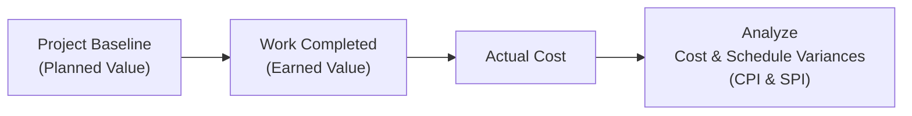

## 37.1 Earned Value Management Formulas

Earned Value Management (EVM) is a cornerstone for project financial and schedule analysis. By integrating scope, schedule, and cost data, EVM enables project managers to assess performance objectively and forecast future trends. Mastering these formulas is critical for both the PMP® exam and real-world project control. In this chapter, you will learn the common EVM formulas, gain clarity through numeric examples, and explore best practices that foster deeper understanding.

### Why Earned Value Management Matters

• EVM provides a data-driven approach to measure progress against plan.  
• It answers vital questions such as:  
  – Are we behind schedule or ahead?  
  – Are we under budget or over budget?  
  – How efficiently are we using our resources?  
• It enables better decision-making by forecasting final costs and timelines more accurately than simple variance approaches.  

Whether your project uses traditional, agile, or hybrid methods, EVM principles can be tailored or adapted to fit. You can incorporate partial or iterative “earned values” in agile projects, and in hybrid environments, you can measure increments of scope in sprints alongside a predictive budget baseline.

---

### Core Elements of Earned Value Management

EVM begins with three basic measures:

• Planned Value (PV) — also known as Budgeted Cost of Work Scheduled (BCWS), represents the amount of budget planned to be spent during a given period (or up to a certain point in the project).  
• Earned Value (EV) — also called Budgeted Cost of Work Performed (BCWP), indicates the portion of the budget actually earned by the completed work.  
• Actual Cost (AC) — also referred to as Actual Cost of Work Performed (ACWP), is the cost incurred for the work performed during a specified time period.

From these foundational measures, we derive critical performance metrics and variances that help guide effective project decisions.

---

### An Illustrated Overview of EVM Concepts

Below is a simple Mermaid flowchart to visualize the fundamental data flows in EVM:

• A → B: The project baseline (Planned Value) guides what portion of the budget is allocated over time.  
• B → C: When work is completed, the “earned value” is established. We then look at Actual Cost to see what was spent.  
• C → D: We compare EV and AC to compute cost/schedule indices and variances, leading to deeper analysis and proactive decision-making.

---

### Key EVM Formulas and Applications

#### Planned Value (PV)
Planned Value is the authorized budget assigned to scheduled work. It answers “How much work *should* be completed by now?”

Typically, PV is distributed over time (e.g., the budget for each reporting period).  
   
Examples:  
• If your budget for the first four weeks of a project is $40,000, and each week is allocated $10,000, the PV week by week is $10,000, $20,000, $30,000, $40,000 cumulatively.  
• If only three weeks have passed, the cumulative planned value should be $30,000.

#### Earned Value (EV)
Earned Value is the measure of work performed in terms of the budget authorized for that work, answering “How much work *has* been completed to date, expressed in budget terms?”

• EV is often calculated by measuring percent complete for each work package or activity and multiplying that percentage by the total budget for each package.  
• EV is cumulative: if multiple tasks are partially complete, sum each portion’s contribution to EV.

#### Actual Cost (AC)
Actual Cost is the realized cost incurred for work performed, answering “How much *has* been spent so far?”

• This includes direct labor, materials, and indirect costs (where applicable).  
• AC is cumulative over the life of the project, though you may break it down by period to measure short-term cost performance.

---

### Variances: Spotting Deviations Early

#### Cost Variance (CV)
Cost Variance indicates to what extent the project is under or over budget.

KaTeX formula:


CV = EV - AC


- A positive CV means you spent less than you earned in value (under budget).  
- A negative CV implies overspending (over budget).

#### Schedule Variance (SV)
Schedule Variance shows the difference between planned progress and actual progress.


SV = EV - PV


- A positive SV indicates the project is ahead of schedule.  
- A negative SV means the project is behind schedule.

---

### Performance Indices: Efficiency at a Glance

#### Cost Performance Index (CPI)
CPI indicates the efficiency of funds usage: how many dollars of earned value your project is getting per dollar spent.


CPI = \frac{EV}{AC}


- CPI > 1.0: The project is spending less than planned for the work achieved (cost efficient).  
- CPI < 1.0: The project is spending more than planned (cost overruns).  
- CPI = 1.0: The project is exactly on cost target.

#### Schedule Performance Index (SPI)
SPI reveals how efficiently the project is delivering on planned schedule performance.


SPI = \frac{EV}{PV}


- SPI > 1.0: Ahead of schedule.  
- SPI < 1.0: Behind schedule.  
- SPI = 1.0: Exactly on schedule.

---

### Forecasting: Predicting Future Performance

#### Budget at Completion (BAC)
BAC is the total planned budget for completing all project work. It is the cornerstone for forecasting future costs.

- Typically derived from the project budget baseline.  
- Once established, you can use BAC in simple EVM forecasting.

#### Estimate at Completion (EAC)
EAC is a forecast of the project’s total cost upon completion, reflecting current performance trends. Multiple formula approaches exist, depending on your assumptions:

1. If the current CPI is expected to remain constant:  
   
   EAC = \frac{BAC}{CPI}
   

2. If you expect current cost deviations to continue, but no major changes in efficiency:  
   
   EAC = AC + (BAC - EV)
   

3. If both cost and schedule performance factors matter substantially (common in struggling projects or those with resource constraints):  
   
   EAC = AC + \frac{(BAC - EV)}{CPI \times SPI}
   

   The factor “\\( \frac{1}{CPI \times SPI} \\)” attempts to account for combined cost and schedule inefficiencies.

#### Estimate to Complete (ETC)
ETC is the expected cost needed to finish all remaining work.


ETC = EAC - AC


- Essentially, “How much more will we have to spend?”  
- This is often revisited and recalculated at different stages.

#### Variance at Completion (VAC)
VAC indicates whether the project is expected to be under or over its original budget at completion.


VAC = BAC - EAC


- A positive VAC means the project may finish under budget.  
- A negative VAC warns of a budget overrun at completion.

---

### To-Complete Performance Index (TCPI)
TCPI is the efficiency level required to complete the project within a given budget (BAC or a new EAC). It answers, “What CPI must we achieve on the remaining work to make the budget or EAC?”

- TCPI to meet the *original* BAC:  
  
  TCPI = \frac{BAC - EV}{BAC - AC}
  

- TCPI to meet the *new* EAC (if BAC is no longer realistic):  
  
  TCPI = \frac{BAC - EV}{EAC - AC}
  

If TCPI is significantly higher than 1.0, it indicates that achieving the target cost might require much tighter cost control or is potentially unfeasible without major corrective actions.

---

### Practical Numeric Example

Let’s consider a simplified scenario:  

• Project Duration: 10 weeks  
• BAC (Total Budget): \$100,000  
• By the end of Week 4:  
  – Planned Value (PV): \$40,000 (i.e., \$10,000 per week for 4 weeks)  
  – Earned Value (EV): \$36,000 (the team completed 36% of total scope)  
  – Actual Cost (AC): \$38,000  

Use the data above to compute cost and schedule metrics:

1. **Cost Variance (CV)**:  
   CV = EV – AC = \$36,000 – \$38,000 = –\$2,000  
   (Negative CV indicates a cost overrun at this point.)

2. **Schedule Variance (SV)**:  
   SV = EV – PV = \$36,000 – \$40,000 = –\$4,000  
   (Negative SV indicates the project is behind schedule.)

3. **Cost Performance Index (CPI)**:  
   CPI = EV / AC = 36,000 / 38,000 ≈ 0.95  
   (Less than 1.0, showing cost inefficiency—spending more than planned for the work accomplished.)

4. **Schedule Performance Index (SPI)**:  
   SPI = EV / PV = 36,000 / 40,000 = 0.90  
   (Less than 1.0, behind schedule.)

5. **Estimate at Completion (EAC)** Assuming the current CPI persists:  
   EAC = BAC / CPI = 100,000 / 0.95 ≈ \$105,263  
   (Forecast to exceed the original budget.)

6. **Estimate to Complete (ETC)**:  
   ETC = EAC – AC = 105,263 – 38,000 ≈ \$67,263  
   (You need about \$67,263 more to finish the project if performance continues at the same efficiency.)

7. **Variance at Completion (VAC)**:  
   VAC = BAC – EAC = 100,000 – 105,263 = –\$5,263  
   (Negative value indicates likely budget overrun.)

---

### Another Project Scenario with Partial Recovery

Imagine that after Week 4, the team decides to implement corrective measures to improve cost efficiency and re-align the schedule. By Week 6, the EVM data changes:

• EV = \$58,000 (work performance improved demonstrably)  
• AC = \$59,000 (spending partially stabilized)  
• PV by Week 6 = \$60,000 (the baseline plan through six weeks)  
• CPI = 58,000 / 59,000 ≈ 0.98  
• SPI = 58,000 / 60,000 ≈ 0.97  

Now with a slightly better CPI, you can recalculate EAC:  
EAC = BAC / CPI = 100,000 / 0.98 ≈ \$102,041  

The project will still trend slightly over budget, but less severely than before. This example highlights how recalculating EVM metrics over time helps track the success of your corrective measures.

---

### Best Practices for EVM Implementation

• **Baseline Carefully**: Effective EVM hinges on a well-defined scope, a realistic schedule, and a solid cost baseline.  
• **Collect Data Consistently**: Update EV, AC, and PV data with a regular cadence. In large programs, monthly updates are common, while shorter sprints may require weekly updates.  
• **Adjust for Partial Work**: In agile or hybrid contexts, tasks may only be “partially done.” Use partial EV calculation methods such as 0/50/100 or a percent complete approach.  
• **Communicate Widely**: Results from EVM can be dramatic. Keep stakeholders informed to avoid surprises, especially when negative trends emerge.  
• **Monitor Trends, Not Just Snapshots**: One-time data might be misleading. Look for patterns in CPI, SPI over weeks or months and compare them to future forecasts.  

---

### Common Pitfalls and How to Avoid Them

• **Unclear Definition of “Done”**: If scope is vague, EV cannot be accurately determined. Always confirm acceptance criteria.  
• **Overcomplicating EVM**: Some teams add too many rules or complexities. Tailor EVM to the project's size and nature.  
• **Neglecting Qualitative Factors**: EVM focuses on cost and schedule but doesn’t directly measure product quality. Combine EVM with quality metrics for a holistic view.  
• **Using EVM as a “Gotcha” Tool**: EVM should guide improvement, not punish teams. Use it to enable proactive, data-driven course corrections.  

---

### Additional References

• “A Guide to the Project Management Body of Knowledge (PMBOK® Guide) – Seventh Edition,” Project Management Institute (PMI®)  
• PMI’s “Practice Standard for Earned Value Management”  
• “Earned Value Project Management,” by Quentin W. Fleming and Joel M. Koppelman  
• Online Courses on EVM, such as specialized classes on Udemy or LinkedIn Learning  

---

## Sharpen Your EVM Expertise with These Practice Questions



### A project’s CV is calculated as:

- [ ] AC – EV
- [x] EV – AC
- [ ] EV – PV
- [ ] PV – AC

> **Explanation:** By definition, Cost Variance (CV) = Earned Value (EV) – Actual Cost (AC).

### Which index measures schedule efficiency?

- [x] SPI
- [ ] CPI
- [ ] CV
- [ ] VAC

> **Explanation:** Schedule Performance Index (SPI) = EV / PV, and it measures how efficiently the project is progressing against the planned schedule.

### Under which condition is EAC = AC + (BAC – EV)?

- [x] When future performance is expected to continue at the budgeted rate
- [ ] When schedule efficiency is expected to remain unchanged
- [ ] When cost efficiency will remain the same as current CPI
- [ ] When original budget is not relevant

> **Explanation:** This formula assumes current variances are temporary, and future work will be executed exactly as planned.

### A CPI value of 1.0 means:

- [ ] The project is ahead of schedule
- [ ] The project is behind schedule
- [x] The project is exactly on budget
- [ ] The project has a favorable Cost Variance

> **Explanation:** A Cost Performance Index (CPI) of 1.0 indicates that the cost of work performed is equal to the planned cost.

### If a project has SPI = 0.85, the project is:

- [ ] On schedule
- [x] Behind schedule
- [ ] Under budget
- [x] Less efficient in schedule performance

> **Explanation:** An SPI less than 1.0 means the project is behind schedule (the rate of completed work is slower than planned), which also indicates lower schedule efficiency.

### Which metric tells you how much budget you have left compared to what you’re predicted to spend at completion?

- [ ] EV
- [ ] CV
- [x] VAC
- [ ] ETC

> **Explanation:** Variance at Completion (VAC) = BAC – EAC. A negative value means you are likely to exceed budget, while a positive number suggests you might complete under budget.

### The To-Complete Performance Index (TCPI) is used to determine:

- [x] The required future cost-efficiency to meet a financial target
- [ ] The remaining scope
- [x] How effectively teams must perform to achieve a revised budget target
- [ ] How likely the team will meet schedule

> **Explanation:** TCPI helps calculate the efficiency needed on the remaining work to meet BAC or EAC.

### If the project’s CPI is below 1.0, but SPI is above 1.0, the situation indicates:

- [x] Over-budget but ahead of schedule
- [ ] Under-budget and behind schedule
- [ ] Under-budget and ahead of schedule
- [ ] Over-budget and behind schedule

> **Explanation:** CPI < 1.0 signifies over-budget performance, while SPI > 1.0 signifies the project is ahead of schedule.

### Which statement is true for a negative Schedule Variance?

- [ ] The project is under budget
- [x] The project is behind schedule
- [ ] The project is ahead of schedule
- [ ] The project is on budget

> **Explanation:** A negative SV = EV – PV < 0 means the Earned Value is below the Planned Value, implying less work completed than planned by that time.

### The formula for Estimate to Complete (ETC) is:

- [x] EAC – AC
- [ ] BAC – EAC
- [ ] BAC – EV
- [ ] EAC – PV

> **Explanation:** ETC calculates the expected cost for remaining work. If EAC is the revised total cost forecast, then ETC = EAC – AC.



---

## PMP Mastery: 1500+ Hard Mock Exams with Full Explanations 

Looking to crush the PMP exam with confidence? Dive deep into 6 rigorous mock exams totaling 1500+ advanced-level questions, each accompanied by clear, step-by-step explanations. Hone your test-taking strategies, master complex topics, and build the resilience you need on exam day. Perfect for serious PMs aiming beyond fundamentals.  

Enroll now:  
[PMP Mastery: 1500+ Hard Mock Exams with Exceptional Clarity & Full Explanations](https://www.udemy.com/course/pmp-2025/?referralCode=CF83A54BC86BE27F9AFE)

_Disclaimer: This course is not endorsed by or affiliated with the PMI examination authority. All content is provided purely for educational and preparatory purposes._
