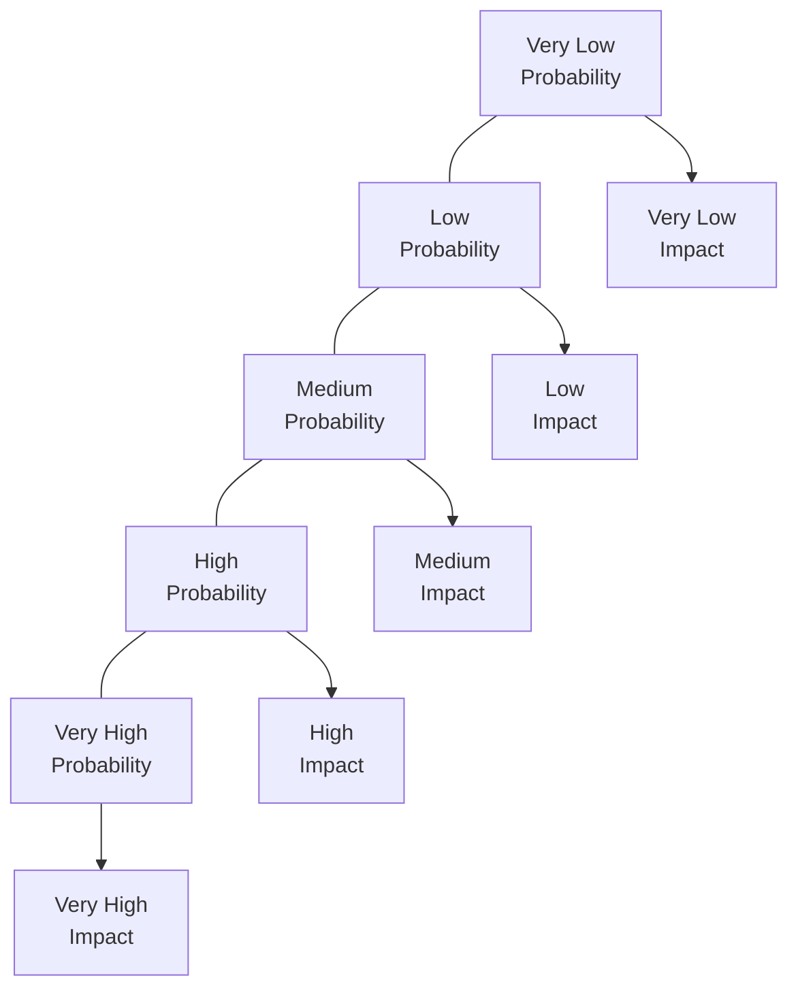
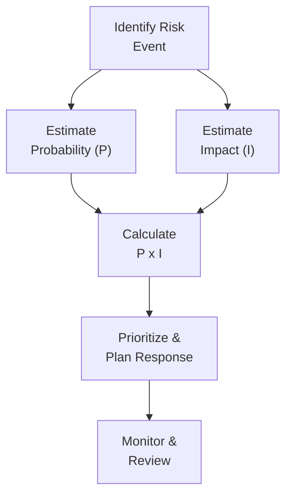

## 37.2 Probability and Impact Calculations for Risks

Effective risk management often hinges on two critical factors: the likelihood (probability) that a risk event will occur, and the magnitude (impact) of that event if it does occur. These two metrics—probability and impact—combine to form the cornerstone of risk quantification, guiding project managers in prioritizing risks, allocating resources, and developing targeted response strategies.

This section explores how to perform quick probability and impact calculations, often under exam pressure. We will discuss how to develop and interpret Probability and Impact Matrices, as well as compute Expected Monetary Value (EMV). We will also highlight best practices, pitfalls, and strategies that can help enhance risk management in both predictive and adaptive project environments.

---

### Why Probability and Impact Calculations Matter

In the context of project risk management, understanding and measuring probability and impact is vital because:

• It provides a systematic way to gauge overall risk exposure.  
• It facilitates comparative ranking of risks, ensuring that the most critical threats receive focused attention first.  
• It supports critical decisions on contingency budget allocations, scheduling buffers, and strategic planning.  
• It promotes clear communication among stakeholders, who can quickly grasp relative risk severity from a standardized measure.

A risk with a high probability and low impact might be treated differently from one with a low probability but severe impact—both may demand generation of response strategies such as mitigation, contingency, or acceptance. Probability and impact calculations serve as a universal language for discussing risks, whether in a project, a portfolio, or an enterprise context.  

---

### Foundations of Probability and Impact

Probability refers to the likelihood that a risk event or condition will occur. Impact is the effect or magnitude of the risk event on one or more project objectives, such as schedule, cost, quality, or scope. For simplicity, many projects classify probability and impact using percentage ranges or ordinal scales (e.g., “Very Low,” “Low,” “Medium,” “High,” “Very High”).

#### Simple Ordinal Scales

• Probability: 10% increments (e.g., 0.1, 0.2, 0.3, 0.4, etc.) or discrete categories.  
• Impact: Defined qualitatively (e.g., “Low” = minimal cost or schedule slippage; “High” = significant cost or schedule overrun).

#### Quantitative Scales

Complex or high-value projects often use detailed cost or schedule impact ranges. For example:

• Probability Range: 0.0 to 1.0.  
• Impact Range: 0 to x amount (e.g., $500,000 for cost impact, 30 days for schedule impact).  

Risk rating = Probability × Impact.

---

### Quick Risk Scoring with a Probability and Impact Matrix

A Probability and Impact Matrix (PIM), also known as a risk matrix, is a grid-based visualization of probability on one axis and impact on the other. Each risk is plotted or assigned a rating based on where it falls in the matrix.

Below is a simplified conceptual diagram of the PIM using Mermaid.js. It illustrates a 5×5 grid, ranging from Very Low to Very High:

While the above diagram is merely illustrative, keep in mind that a PIM usually displays a cohesive grid with color codes (often green, yellow, red) to reflect risk priority levels.

#### Constructing a Probability and Impact Matrix

1. Define Probability Scale: Determine categories or numeric values.  
2. Define Impact Scale: Link each category (small, moderate, or major) to potential project effects. This could be additional cost, schedule delays, or even intangible factors like reputational damage.  
3. Assign Probability: For each identified risk, estimate the likelihood of occurrence.  
4. Assign Impact: Estimate or classify the potential effect if the risk materializes.  
5. Determine Risk Score: Multiply Probability by Impact (P × I).  
6. Prioritize Risks: Compare the numerical values or categories of all identified risks. Those in “red” cells typically gain immediate attention.

##### Customizing the Matrix

Organizations often tailor the scale to match their risk tolerance and project complexity. For instance, in highly regulated industries, even a moderate risk might be escalated due to compliance concerns. The matrix should reflect your organization’s culture, compliance needs, and acceptable risk thresholds.

---

### Expected Monetary Value (EMV) Formula

Expected Monetary Value (EMV) takes risk calculation beyond mere categorization by estimating the likely financial impact of a risk event. EMV for a single risk typically uses the formula:


\text{EMV} = \text{Probability of occurrence} \times \text{Impact (cost)}


In KaTeX:


\text{EMV} = P_i \times I_i


Where \\(P_i\\) is the probability of risk \\(i\\) occurring and \\(I_i\\) is its monetary impact if it does occur.

For multiple risk scenarios, the total EMV is the sum of individual EMVs:


\sum_{i=1}^{n} (P_i \times I_i)


#### EMV Examples

1. If a risk has a 30% probability (0.3) of occurring and its impact on cost is $50,000, then EMV = 0.3 × $50,000 = $15,000.  
2. If a second risk has a 10% (0.1) chance of happening, but the impact is $200,000, then EMV = 0.1 × $200,000 = $20,000.  

In these examples, each risk’s EMV helps you compare which risk poses the higher financial exposure. Interestingly, the second risk is more threatening financially despite having a lower probability.

#### EMV for Opportunities and Threats

While EMV is most commonly associated with risk threats (negative events), it can also be adapted for positive events or opportunities by treating impact as a benefit (e.g., potential cost savings or revenue gain). In this scenario, a negative value might represent a threat, and a positive value can represent an opportunity, so you retain visibility of both ends of the risk spectrum.

---

### From Qualitative to Quantitative

Typical risk management processes begin with qualitative risk analysis, leveraging techniques like the Probability and Impact Matrix to quickly categorize and prioritize risks. This step sets the stage for more in-depth quantitative methods, where advanced calculations—such as EMV, simulation (e.g., Monte Carlo), or sensitivity analysis—provide numerical insights.

1. **Qualitative**: Quick categorization using low, medium, or high labels.  
2. **Quantitative**: Detailed range-based probability distributions and cost/schedule estimates to refine risk response strategies.

---

### Application in Different Project Environments

#### Predictive/Waterfall

In predictive projects, you might integrate EMV calculations directly into the project’s cost baseline. You can allocate contingencies or management reserves based on aggregated risk exposures. The Probability and Impact Matrix is typically updated at set intervals (e.g., during stage gate reviews) or upon major changes in project scope, schedule, or environment.

#### Agile or Hybrid

Agile environments often require dynamic reassessment. Risks can emerge swiftly with evolving scope. Sprint retrospectives and daily standups become valuable channels for re-evaluating probability and impact. Teams may use lightweight version of a Probability and Impact Matrix or other visual tools such as Kanban boards with risk columns. Frequent increments of work allow for quicker adjustments to risk responses or acceptance strategies.

---

### Practical Example and Case Study

Consider a project to develop a new mobile application intended for a large financial institution. The project’s success is heavily dependent on performance, security, and regulatory compliance.

• Identified Risk #1 – “Regulatory Changes”:  
  – Probability: 0.50 (since the financial sector is prone to changing regulations).  
  – Impact: $60,000 to rework code and documentation to remain compliant.  
  – EMV = 0.50 × $60,000 = $30,000.  

• Identified Risk #2 – “Key Vendor Delay”:  
  – Probability: 0.20 (vendor is generally reliable, but supply chains can be erratic).  
  – Impact: $100,000 in potential additional labor costs and partial schedule extension.  
  – EMV = 0.20 × $100,000 = $20,000.  

• Identified Opportunity – “Faster Go-to-Market”:  
  – Probability: 0.15 (if a pilot program is successful, the client may fast-track final release).  
  – Impact: +$50,000 in potential early revenues (or cost savings).  
  – EMV = 0.15 × $50,000 = +$7,500 (opportunity side).

By evaluating EMVs, the team sees that “Regulatory Changes” yields the highest potential loss. They prioritize monitoring updates from the regulatory authority and consider investing in legal counsel or additional compliance checks.

---

### Common Pitfalls and Challenges

1. **Overestimating Precision**: Probability and impact values are often inherently uncertain. Avoid misplaced confidence in exact numerical values.  
2. **Neglecting Secondary Risks**: A risk response can trigger new risks. Revisit your Probability and Impact Matrix or EMV estimates whenever a response plan is activated.  
3. **Focusing Only on Threats**: Opportunities can significantly benefit a project. Integrating them in impact calculations reveals potential advantage.  
4. **Static Analysis**: Risk exposure can shift dramatically as the project evolves, especially in rapidly changing environments. Regular updates to calculations are crucial.  
5. **Lack of Stakeholder Buy-In**: If team members and sponsors do not trust the data used for probability and impact, the entire risk assessment process can lose credibility.

---

### Using Probability and Impact for Rapid Decision Support

One of the reasons Probability and Impact calculations are so valuable in a high-pressure environment—such as the PMP® exam or real-world scenario planning—is that they enable quick, comparative prioritization. Imagine you have a limited budget to address threats. By calculating EMV (or risk scores from a Probability and Impact Matrix), you can easily compare potential exposures:

• Which risks bring the highest expected cost overrun?  
• Which can cause the longest schedule slips on the critical path?  
• Which might cause intangible impacts, such as damaged reputation or stakeholder dissatisfaction?

These quick data points drive targeted mitigation strategies, ensuring your efforts align with the highest-value domain for the project’s success.

---

### Visualizing Probability–Impact Flows

Use a simple flow diagram to illustrate how Probability and Impact calculations feed into your risk response process:

The above diagram highlights that after identifying a risk event, quantifying probability and impact is essential for prioritization. Planning the response then leads to continuous monitoring and review—a cycle aligning with the iterative nature of good risk management.

---

### Quick Tips for the PMP® Exam

• Memorize Key Formulas: You should know the EMV formula by heart.  
• Know When to Use EMV vs. Qualitative Assessments: Some exam questions will require you to identify which type of analysis technique is most appropriate.  
• Practice with the Matrix: Be comfortable reading and interpreting Probability and Impact Matrices.  
• Look for Context Cues: Exam questions often include subtle references to your organization’s risk tolerance, which can shift the classification of “medium” vs. “high.”  
• Manage Time Wisely: Probability and Impact calculations are typically straightforward, so don’t overanalyze. Ensure accuracy but also maintain exam pacing.  

---

### Further Reading and References

• PMI’s “PMBOK® Guide” Seventh Edition – Risk Management Principles.  
• PMI’s “Practice Standard for Project Risk Management.”  
• “Agile Practice Guide” by PMI – Guidance on iterative approaches to risk.  
• “Monte Carlo Simulation and Risk Analysis: A Guide to Project Uncertainty” by John Raftery.  
• [PMIstandards+](https://standardsplus.pmi.org/) – Extended resources and practical applications.  

---

## Test Your Knowledge: Risk Probability and Impact Quiz



### What is the main purpose of using a Probability and Impact Matrix in risk management?
- [ ] To eliminate all risks from the project.
- [ ] To track daily performance metrics.
- [x] To prioritize risks based on their likelihood and potential effect.
- [ ] To communicate only the positive aspects of risks.

> **Explanation:** The Probability and Impact Matrix is a vital qualitative tool for evaluating and prioritizing risks, helping project managers rank both threats and opportunities by their likelihood and potential effect.

### Which formula is most commonly used to calculate Expected Monetary Value (EMV) in project risk management?
- [ ] (Risk Impact) ÷ (Risk Probability)
- [x] (Risk Probability) × (Risk Impact)
- [ ] (Risk Probability) + (Risk Impact)
- [ ] (Risk Impact) - (Risk Probability)

> **Explanation:** EMV = Probability × Impact. It is a straightforward yet powerful method for estimating the financial value of a risk.

### Why is it critical to update probability and impact ratings throughout the project lifecycle?
- [x] Because risk levels can evolve as new information emerges.
- [ ] Because project scope never changes.
- [ ] Because only senior management can make these updates.
- [ ] Because they are fixed once the project charter is approved.

> **Explanation:** Risks are dynamic, especially in fluid environments. Reevaluating probability and impact helps keep the risk register accurate and the response strategies aligned with current realities.

### If a risk event has a probability of 0.25 and an impact of $40,000, what is the EMV?
- [x] $10,000
- [ ] $15,000
- [ ] $20,000
- [ ] $40,000

> **Explanation:** The EMV calculation follows EMV = 0.25 × $40,000 = $10,000.

### A team's Probability and Impact Matrix includes a cell labeled “High Probability, Low Impact.” How should the project manager treat such a risk?
- [x] Monitor it, but consider low-cost responses or acceptance strategies.
- [ ] Completely ignore it because the impact is low.
- [x] Plan to mitigate it due to its high chance of occurring.
- [ ] Escalate it immediately to the sponsor.

> **Explanation:** While the impact is low, the high likelihood necessitates at least minimal monitoring and contingency. Some organizations also accept low-impact risks if the cost of mitigation exceeds the potential impact.

### In agile frameworks, which of the following is a primary reason for reevaluating risk probabilities more frequently?
- [x] The project scope and priorities can shift each sprint or iteration.
- [ ] The overall project scope is fixed at initiation.
- [ ] Risks are only relevant in predictive life cycles.
- [ ] Agile frameworks do not consider risks at all.

> **Explanation:** Agile methods embrace change, so frequent short cycles demand ongoing reassessment of risk probability and impact as new user stories, feedback, or constraints arise.

### What is a potential pitfall of relying solely on ordinal scales (e.g., Low, Medium, High) for probability and impact?
- [x] It may obscure the real monetary value of a risk event.
- [ ] It always provides precise data on risk exposure.
- [x] Stakeholders find it unhelpful for quick estimates.
- [ ] No pitfalls exist; ordinal scales are always ideal.

> **Explanation:** Ordinal scales can be simplistic; they may mask important finer details, including precise financial exposure. More granular or numeric approaches might be needed for critical or high-value projects.

### Which statement best describes using EMV for both threats and opportunities?
- [x] Negative EMVs typically represent threats, while positive EMVs represent opportunities.
- [ ] EMV only applies to threats; opportunities have no monetary value.
- [ ] EMV calculations are invalid if a project has both threats and opportunities.
- [ ] Opportunities must be handled by separate calculations entirely.

> **Explanation:** EMV can capture both negative (threats) and positive (opportunity) factors simply by converting values to negative or positive net impacts, respectively.

### What action should be taken if the EMV for a single high-probability, high-impact risk exceeds the entire project’s planned contingency reserve?
- [x] Escalate to the sponsor or top-level management for strategic decisions.
- [ ] Ignore the calculation; it’s an unlikely scenario.
- [ ] Abandon the entire project immediately.
- [ ] Reduce the project's scope without consulting anyone.

> **Explanation:** If a single risk significantly surpasses available reserves, it indicates the project may be in need of major strategic decisions—possibly adjusting scope, budget, or major project objectives.

### A risk event has a 40% chance of occurring and an impact of $25,000 if it materializes. If the team identifies a mitigation strategy that lowers the impact to $15,000, which is true?
- [x] The new EMV is 0.40 × $15,000.
- [ ] The probability of 40% automatically reduces to 20%.
- [ ] The new EMV is 0.15 × $25,000.
- [ ] The risk is fully eliminated.

> **Explanation:** Mitigation reduces impact, not necessarily probability, thus recalculating EMV with the new lower impact yields 0.40 × $15,000 = $6,000.



---

## PMP Mastery: 1500+ Hard Mock Exams with Full Explanations 

Looking to crush the PMP exam with confidence? Dive deep into 6 rigorous mock exams totaling 1500+ advanced-level questions, each accompanied by clear, step-by-step explanations. Hone your test-taking strategies, master complex topics, and build the resilience you need on exam day. Perfect for serious PMs aiming beyond fundamentals.

Enroll now:  
[PMP Mastery: 1500+ Hard Mock Exams with Exceptional Clarity & Full Explanations](https://www.udemy.com/course/pmp-2025/?referralCode=CF83A54BC86BE27F9AFE)

_Disclaimer: This course is not endorsed by or affiliated with the PMI examination authority. All content is provided purely for educational and preparatory purposes._
