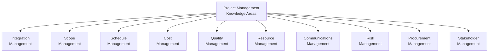
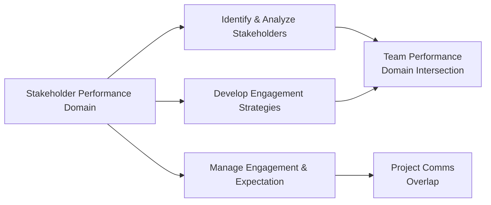

## 38.1 Crafting Visual Overviews of Knowledge Areas

Visual representations—such as mind maps, concept trees, and flow diagrams—are potent tools in simplifying complex knowledge structures and fostering better recall. They are especially powerful in project management, where an extensive array of concepts, processes, performance domains, principles, and tools can overwhelm even the most diligent learner. This section will walk you through the best practices for crafting visual overviews that unite all critical facets of PMP® exam preparation.

These techniques benefit not only exam-takers but also practicing project managers who need to communicate project information to stakeholders. By structuring knowledge areas visually, you can transform dense pages of notes into appealing, easy-to-navigate diagrams that let you pinpoint dependencies and relationships at a glance.

### The Power of Visual Thinking

The human brain is wired to process visual information quickly. When you link words, shapes, and structure into carefully arranged trees or diagrams, you engage a deeper cognitive connection:

• You sharpen your ability to identify relationships among concepts.  
• You improve retention by associating text with visual cues.  
• You reduce the mental load of memorizing lists or paragraphs.  
• You develop a holistic understanding of how each knowledge area reinforces the others.

Visual thinking is particularly valuable if you are reviewing for the PMP® exam or aligning project efforts with your organization’s strategic goals. Whether you turn complex concepts into colorful mind maps or break them down in chart form, the final outcome is enhanced clarity.

### Common Visual Structures

There are several ways to organize project management information visually. Here are the most popular formats:

Mind Maps:  
• Radiate from a central topic, such as “Project Management Knowledge Areas,” with lines spreading outward to subtopics.  
• Allow free-flowing, unstructured thinking in which you can add notes or images near each node.  

Concept Trees:  
• Often hierarchical. You start with a broad concept at the top level (e.g., “PMBOK® Guide Seventh Edition Performance Domains”) and branch downward to break it into subcomponents.  
• Particularly useful for zooming in from the general domain to specific tasks, tools, or techniques.  

Flow Diagrams or Process Flows:  
• Emphasize sequence and dependencies. Ideal for explaining step-by-step procedures like Integrated Change Control or Risk Response Implementation.  
• Highlight how processes transition from one stage to another in both linear (Predictive) and cyclical (Agile) environments.

### Linking Visuals to the PMBOK® Guide and Exam Content

In the PMBOK® Guide Seventh Edition, Knowledge Areas from earlier editions are reframed into Principles and Performance Domains, but they still largely track similar core topics like Integration, Scope, Schedule, Cost, Quality, Resource, Communication, Risk, Procurement, and Stakeholder Engagement. Even if you’re focusing on the updated format, it is helpful to create visual connections between these concepts and other areas outlined in the PMP® Exam Content Outline. For instance:

• See Chapter 15 for a deeper look at Integration Management.  
• Refer to Chapters 17, 18, and 19 for more on Scope, Schedule, and Cost.  
• Look at Chapters 21 and 16 for Resource and Communications Management, including stakeholders.  
• Explore Chapter 22 for advanced risk strategies and Chapter 23 for procurement approaches.

Designing your chart or tree with these references helps you reinforce your reading path, so you know exactly where to turn for more details.

### Tools and Techniques for Designing Visual Overviews

Hand-Drawn Sketches:  
• Some learners retain information best by sketching their own charts. This tactile process ensures active involvement.  
• Use blank sheets or large sticky notes during your review sessions, and color-code each Knowledge Area or Domain.

Digital Mind Mapping Software:  
• Tools like XMind, MindMeister, or Miro allow you to create interactive, multi-layered mind maps.  
• They often support drag-and-drop functionality, letting you reorganize nodes as your understanding evolves.

Mermaid.js for Diagrams:  
• If you work in a text-based environment or a platform that supports Markdown, Mermaid.js can generate diagrams from plain text.  
• The same technique is used in this guide to illustrate flows, concept trees, and more.

### Example: Concept Tree of PMBOK® Knowledge Areas

Below is a simple Mermaid diagram that demonstrates a high-level overview of the (traditional) PMBOK® Knowledge Areas in a hierarchical format. This structure makes it easy to see the “big picture” and how each area branches out. You can easily customize this foundation to add subtopics, important tools, or references to standards.

> Each Knowledge Area (B through K) can be expanded further. For example, “Scope Management” might explode into tasks like “Collect Requirements,” “Define Scope,” “Create WBS,” “Validate Scope,” and “Control Scope.”

### Color-Coding and Symbol Use

Color-coding each node or branch helps you quickly distinguish one Knowledge Area from another. You might assign red for Risk, green for Cost, blue for Scope, etc. Symbols can also convey additional meaning, such as a magnifying glass for Quality-related processes or a handshake icon for Stakeholder Management. These visual cues create intuitive anchors in your memory.

### Integrating Agile, Hybrid, and Predictive Elements

The PMBOK® Guide Seventh Edition encourages tailoring your approach across predictive, iterative, and adaptive methodologies. You can refine your visual overview by:

• Labeling nodes or sub-branches with icons or tags (e.g., “A” for Agile, “P” for Predictive).  
• Including references to relevant chapters—such as Chapter 24 for “Agile Foundations” and Chapter 27 for “Hybrid Approaches”—where you can explore these methods in depth.  
• Incorporating mini-flows that illustrate how a process might differ in Scrum versus a pure Waterfall approach.

### Practical Steps to Build a Visual Overview

Start with an Outline:  
• List all high-level topics (e.g., the 12 PMI Principles or 10 Knowledge Areas from historical PMBOK® frameworks).  
• Place these as top-level nodes in your mind map or branches in your concept tree.

Create Sub-Branches for Each Topic:  
• Under “Scope Management,” you might include “Collect Requirements,” “Define Scope,” “Validate Scope,” etc.  
• For “Risk Management,” break down risk identification, qualitative and quantitative analysis, risk response, and monitoring.

Add Keywords and Formulas:  
• For Cost Management, include Earned Value Management (EVM) formulas that you need to remember (e.g., CV, SV, CPI, SPI, etc.).  
• For Quality Management, jot down key terms like “Quality Assurance” and “Quality Control” or modeling processes (e.g., Pareto Diagrams, Fishbone Diagrams).

Highlight Interdependencies:  
• Show how changes in one area might affect another. For instance, a scope change can alter the project schedule, budget, and risk exposure.

Use Iterative Refinement:  
• Once you create a draft, revisit it after studying each chapter. Add clarifications or rearrange branches for clarity.  
• Over time, your visual overview evolves into a “master reference map” that can serve as your quick revision guide.

### Example in Action: Stakeholder Knowledge Area

Imagine you are studying Stakeholder Management (Chapter 16) in parallel with Team Performance Domain (Chapter 8) and the Stakeholder Performance Domain (Chapter 7). Visualizing these intersections can be tricky. A carefully crafted diagram might look like this:

• The Stakeholder Performance Domain is at the center, branching out to the main tasks (Identify, Develop Strategies, Manage Engagement).  
• Each of those tasks ties into additional domains and knowledge areas (Team Performance Domain, Communications Management, or even Risk Management if you want to incorporate potential stakeholder-related risks).  

This type of integrated map helps you see, at a glance, how Stakeholder tasks are not in isolation but intricately linked to other project domains.

### Real-World Scenario: Using Visual Overviews on a Hybrid Project

Suppose you are leading a hybrid software development project that employs iterative sprints for coding while employing traditional gating for regulatory sign-offs. Here is how a concept tree might illustrate your approach:

1. Central Node: “Hybrid Software Development Project.”  
2. Branch 1: “Agile Sprints” with nodes for sprint planning, daily standups, backlog refinement, and sprint reviews.  
3. Branch 2: “Regulatory Gates” with nodes for design approval, compliance checks, and final user acceptance.  
4. Branch 3: “Risk Overlaps” indicating how the iterative changes might trigger additional risk reviews at each gate.  
5. Branch 4: “Stakeholder Communication” specifying real-time updates for agile teams alongside formal documentation required by compliance committees.

By drawing connections among these branches, your diagram reveals the tension points where agile demands rapid iteration, but regulators require set processes and documents. Understanding these intersections visually fosters a more coordinated approach.

### Common Pitfalls and How to Avoid Them

Overcrowding the Diagram  
• Putting too much information in one diagram can scatter your focus. Strike a balance: create sub-maps when a single map becomes too dense.

Ignoring Updates  
• As you learn new material or the PMBOK® evolves, update your visual aids. Outdated diagrams hamper your ability to see the latest processes accurately.

Relying Solely on One Format  
• A concept tree is great for hierarchical breakdowns, but you might need a process flow diagram to represent sequential tasks. Be flexible and choose the right format for the topic.

Failing to Review  
• Visual overviews are only useful if you revisit them. Don’t just create them once—integrate them into your regular study sessions.

### Best Practices for Effective Visual Overviews

• Start Big, Then Dive Deeper  
  Always begin with top-level principles or domains. Add details gradually, ensuring you don’t lose sight of the overall structure.

• Use White Space and Clear Labels  
  Crowded visuals can be more confusing than helpful. Labels should be clear, concise, and consistently formatted.

• Employ Hierarchy  
  Use indentation, branches, or flow paths to show which concepts are subtopics versus main topics.  

• Collaborate with Peers  
  Sharing mind maps or concept trees with study groups can spark new ideas and catch oversights.  

### Recommended Resources

• “Visual Language for Designers” by Connie Malamed.  
• MindMeister or XMind (Mind Mapping Software).  
• PMIstandards+ for real-time interactive tools and examples aligned with the PMBOK® Guide Seventh Edition.  
• Chapter 38.2 and 38.3 in this book for additional memory aids and advanced brain dump techniques.  

By relentlessly practicing the creation of vibrant, cognitively engaging diagrams, you will not only carve deeper mental pathways for standard project management concepts but also create quick-reference visuals that sharpen your day-to-day practice. Each knowledge area or principle is no longer just lines on a page—it becomes a visual anchor that you can recall and apply swiftly, whether you are answering tough scenario-based exam questions (see Chapter 39 for exam strategies) or tackling real-world organizational challenges.

---

## Elevate Your Understanding of Visual Overviews: PMP Knowledge Areas



### In what way do visual overviews primarily support your PMP® exam preparation?

- [ ] They allow you to bypass comprehensive reading.
- [x] They help in consolidating complex information into memorable structures.
- [ ] They replace the need for detailed study guides entirely.
- [ ] They only focus on Agile practices in the PMBOK® Guide Seventh Edition.

> **Explanation:** Visual overviews convert large amounts of information into memorable structures, making it easier to see relationships, recall facts, and integrate knowledge with less cognitive load.

### Which best describes a mind map?

- [x] A diagram that radiates from a central topic to subtopics using lines or branches.
- [ ] A strict, linear representation of sequential tasks.
- [ ] A spreadsheet listing project deliverables.
- [ ] A standard Gantt chart for scheduling.

> **Explanation:** Mind maps begin with a central idea and expand outward, forming branches that organize related concepts in a visually intuitive way.

### When building a concept tree for the PMBOK® Knowledge Areas, which of the following is most critical?

- [x] Clearly indicating hierarchical relationships between main areas and subtopics.
- [ ] Hiding most details to keep the chart concise.
- [ ] Using only one color to maintain a clean aesthetic.
- [ ] Ignoring references to PMBOK® processes or chapters.

> **Explanation:** A core strength of concept trees is showing hierarchy, which helps the learner see how primary areas branch into more specialized topics.

### How can symbols or icons be used effectively in visual overviews?

- [ ] They should be avoided, as they distract from the text.
- [ ] They must be placed only at the central node of a visual map.
- [ ] They should replace text altogether.
- [x] They can highlight specific types of information (e.g., risk icons, handshake for stakeholders) for quick recognition.

> **Explanation:** Icons and symbols serve as immediate visual cues, allowing learners to categorize and locate important information at a glance.

### Which statement accurately reflects a best practice when refining a project management mind map?

- [x] Revisit and update the mind map after studying each relevant chapter.
- [ ] Finalize the initial draft immediately to avoid confusion.
- [x] Encourage collaboration with peers and mentors to catch oversights.
- [ ] Avoid color-coding to keep the diagram minimalistic.

> **Explanation:** Revisiting and updating your mind map or diagram regularly keeps it aligned with new material and deeper insights. Collaborating with peers ensures you receive feedback that strengthens your visual tool.

### What is the main benefit of color-coding branches in a mind map?

- [x] Easier differentiation of concepts and quicker recall.
- [ ] Compliance with PMBOK® color standards.
- [ ] Making the diagram look aesthetically pleasing, without any memory benefits.
- [ ] It’s a mandatory requirement for the PMP® exam.

> **Explanation:** Color-coding is an effective way to differentiate topics, highlight important elements, and foster quicker recall due to the brain’s affinity for color-based categorization.

### Why might you integrate Agile icons or identifiers within a predictive project management diagram?

- [ ] To confuse learners about the differences between Agile and Predictive.
- [x] To highlight where Agile techniques apply in a hybrid project environment.
- [x] To illustrate potential areas of iteration or feedback loops within a traditional structure.
- [ ] To merge risk management tasks with cost management tasks automatically.

> **Explanation:** Agile icons or markers show how iterative methods might be used alongside predictive approaches, making the diagram suitable for hybrid project scenarios or for clarifying how certain Agile practices intertwine with Waterfall stages.

### What is a primary pitfall when making a visual overview too detailed?

- [x] It becomes overwhelming and causes confusion due to overcrowding.
- [ ] It meets PMI’s requirement for complex diagrams.
- [ ] It guarantees deeper understanding by including every single detail.
- [ ] It automatically qualifies for continuing education credits.

> **Explanation:** While thoroughness matters, diagrams that cram in too many elements risk becoming visually cluttered, defeating the purpose of quick comprehension.

### Which of the following is a recommended starting point for creating a visual map for PMP® knowledge areas?

- [x] Write down top-level topics (like each Knowledge Area or Performance Domain) first.
- [ ] Start by listing every single tool and technique in random order.
- [ ] Skip references to PMBOK® chapters.
- [ ] Place Earned Value formulas at the center, branching out to all other concepts.

> **Explanation:** Building from high-level structures, such as knowledge areas or performance domains, is an efficient way to construct a framework that can be later expanded with details, tools, and formulas as your study progresses.

### Creating visual aids for knowledge areas is:

- [x] True
- [ ] False

> **Explanation:** Visual aids help distill complex information into manageable segments, making your study process more efficient and successful.



---

## PMP Mastery: 1500+ Hard Mock Exams with Full Explanations 

Looking to crush the PMP exam with confidence? Dive deep into 6 rigorous mock exams totaling 1500+ advanced-level questions, each accompanied by clear, step-by-step explanations. Hone your test-taking strategies, master complex topics, and build the resilience you need on exam day. Perfect for serious PMs aiming beyond fundamentals.

Enroll now:  
[PMP Mastery: 1500+ Hard Mock Exams with Exceptional Clarity & Full Explanations](https://www.udemy.com/course/pmp-2025/?referralCode=CF83A54BC86BE27F9AFE)

_Disclaimer: This course is not endorsed by or affiliated with the PMI examination authority. All content is provided purely for educational and preparatory purposes._
