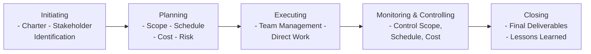
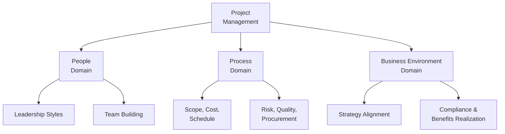

## 38.2 Condensing Key Concepts onto One Page

Distilling the enormous array of project management standards, processes, and principles onto a single page can be a daunting task. However, doing so is a powerful way to reinforce your understanding of the material when you need a quick refresher or last-minute review. This single-page document—often called a “crib sheet,” “cheat sheet,” or “key concept summary”—acts as a concise reference that spotlights the most critical information you need to retain for the PMP® exam and real-world projects.

Whether you are preparing for the People, Process, or Business Environment domains, or looking to recall the 12 PMI® principles (see Chapter 5) in one glance, an effectively organized single-page summary ensures that you won’t spend precious study time hunting through large books or numerous notes. This section provides methods, tips, and best practices for creating such summaries, along with examples and case studies to illustrate how to craft a high-impact, visually appealing, and comprehensive reference tool.

### The Purpose of One-Page Summaries

One-page summaries capture large volumes of data and compress them into a visual layout that immediately triggers recall. Here’s why these concise references are invaluable:

- They highlight key terms, formulas, frameworks, and processes all in one place.  
- They provide a quick refresher before entering the exam or starting a project phase.  
- They reinforce visual memory through color coding, diagrams, or strategic layouts.  
- They boost confidence by showing you exactly how much you’ve mastered.  

Within the broader context of your PMP® study plan (see Chapter 36), a single-page summary is a capstone tool: it does not replace in-depth studying, but rather aids both final review and periodic check-ins.

### Identifying High-Value Information

The first step in creating a single-page reference is to determine which concepts, formulas, or methodologies are most important. In the PMP® context, consider these categories:

• Key Formulas and Calculations  
  - Earned Value Management (EVM) metrics, such as Cost Variance (CV), Schedule Variance (SV), Cost Performance Index (CPI), and Schedule Performance Index (SPI).  
  - Risk Probability × Impact for risk prioritization.  
  - Critical Path calculations for schedule management (see Chapter 18).  

• Essential Frameworks and Flows  
  - The relationship between project stakeholders, governance, and teams (see Chapter 4).  
  - Steps for Integrated Change Control (see Chapter 15).  
  - The flow of a Scrum iteration from planning to retrospective (see Chapter 26).  

• Mnemonics and Acronyms  
  - Ways to remember the 12 PMI® principles (e.g., “SCL-V-STQR-ARC-E” or a custom mnemonic).  
  - PEMBOK knowledge areas from older references (If still relevant to your grasp of fundamentals).  

• Key Artifacts and Documents  
  - Project Charter, Stakeholder Register, Risk Register, and other main documents.  
  - In Agile environments, Product Backlog, Sprint Backlog, and Increment definitions.  

• The “People, Process, Business Environment” Domain Model (see Chapter 6)  
  - Critical tasks and enablers under each domain.  

When deciding what to include, prioritize items that you frequently mix up, or that are highly probable to appear on the exam. Additionally, consider topics where you benefit most from a quick glance, such as risk response strategies or contract types (see Chapter 23).

### Organizing Your One-Page Summary

Structure is crucial. A cluttered single page can overwhelm rather than clarify. Instead, break down the page into distinct sections so that you can quickly locate specific information. Here are some layout suggestions:

• Rows and Columns. Divide the document into a small number of columns (e.g., three columns each for People, Process, and Business Environment domains) or group by knowledge areas (such as Integration, Scope, Schedule, Cost, etc.).  
• Thematic Boxes. Use themed boxes or color-coded frames to separate distinct concepts, like “Risk Management Formulas,” “Procurement Contract Types,” and “Quality Tools.”  
• Flowcharts. Depict the overall progression of a methodology or a process in a small, simplified flowchart.  

Below is an example of a minimalistic one-page layout using a flowchart to represent high-level project phases. This concise arrangement helps you see the big picture at a glance:

Each node could correspond to a color-coded section in your single-page document, emphasizing main tasks and critical outputs.

### Visual Techniques to Enhance Memory Retention

Color coding and strategic use of symbols or fonts can help your brain automatically categorize and store information:

- Highlight formulas in bold, italicize definitions, and use eye-catching icons to denote crucial concepts like risk or quality.  
- Color code each knowledge area (e.g., green for cost, blue for scope, orange for resources).  
- Incorporate bullet points and numbered lists for quick scanning.  

For instance, you might create separate boxes for each PMI® principle and use permanently assigned colors (e.g., principle of Stewardship in blue, principle of Stakeholder Engagement in green) so you can associate that color with the concept in your mental “filing system.”

### Approaches to Condensing Complex Material

1. Summarize by Outputs  
   - For each process (or “performance domain” in the PMBOK® Guide Seventh Edition), list the key output(s) that define its success. For example, the primary output of scope validation is “Accepted Deliverables,” while controlling costs yields “Work Performance Information” and “Cost Forecasts.”  

2. Tabulate Key Differences and Similarities  
   - Placing contrasting items side by side in a table helps highlight how agile vs. predictive differ in roles, ceremonies, and outcomes (see Chapter 27 for hybrid approaches).  

3. Mind Map to Interconnect Topics  
   - Use a central node for “Project Management” and branch out to knowledge areas, then sub-branch to processes, tools, and techniques. You can keep it minimal by focusing on major sub-branches only.  

Here is a small mind map sample showing how you might structure top-level PMP® concepts:

Each of these nodes can expand into short bullet points on your single-page summary, providing just enough detail to prime your memory for deeper recall.

### Case Study: Creating a Tailored One-Page for a Hybrid Project

Imagine you are managing a hybrid project that combines predictive phases for regulatory requirements and agile for software development. You need to keep track of:

- Traditional project documents (e.g., scope baseline, cost baseline, earned value metrics).  
- Agile artifacts (e.g., product backlog, sprint planning outcomes, daily standups).  
- Stakeholder communication preferences (weekly stakeholder steering committee plus daily scrum).  

A single-page summary could combine a table listing all mandatory regulatory milestones, a mini flowchart of agile iteration cycles, and a short bullet list describing your risk response strategies. By referencing this page daily, you can seamlessly switch mindsets between the predictive and agile parts of the project.

### Best Practices

- Keep it visually balanced: too much text in a cramped space results in eye fatigue.  
- Prioritize accuracy: ensure your references for formulas or definitions have been double-checked.  
- Regularly update: your single-page summary should be a living document that evolves as you discover new information or correct misinterpretations.  
- Use consistent terminology: if you label a process or principle in your main notes, match it on the summary to avoid confusion.  

### Common Pitfalls

- Overloading the page: trying to stuff every possible fact or detail can backfire. Focus on essentials.  
- Neglecting structure: random items scattered without logical grouping impede efficient scanning.  
- Missing the bigger picture: your summary should reflect how large concepts connect, not just a list of memorized acronyms.  

### Applying Single-Page Summaries to Real Projects

Beyond the PMP® exam, these succinct references are equally effective in actual work environments. For example, a project manager at a construction firm might keep a small infographic pinned at their desk illustrating the permitting process, critical building codes, and the schedule milestone chart for a particular project. This “at-a-glance” approach ensures that team members have a shared understanding of the project’s roadmap and deliverables.

Similarly, in an IT context, project managers can reference a single page containing acceptance criteria, iteration schedules, and user stories that are must-haves for the upcoming release. This level of clarity helps unify cross-functional teams—like software developers, business analysts, and marketing professionals— under a single vision of project success.

### Practical Tools and Templates

Numerous digital tools can help create visually appealing single-page summaries:

- Graphic design editors (Canva, Visme)  
- Diagramming software (Lucidchart, Draw.io)  
- Nested bulleting within spreadsheets or note-taking apps (OneNote, Evernote)  

Additionally, consider converting your summary into a PDF or high-resolution image so that you can print it or keep it on your mobile device. This portability ensures you can review essential concepts anytime—during commutes, work breaks, or just before an exam.

### Tying It All Together

Single-page references are a catalyst for rapid recall and efficient review, bridging the gap between voluminous textbooks and your need for immediate answers. They are particularly effective when combined with other visualization and memory-aid strategies (see Section 38.1, “Memory Aids, Mind Maps, and Brain Dumps”). Remember:

- Identify the essential content you struggle with or see often on the exam.  
- Organize it into a balanced, visually friendly layout.  
- Use color coding, iconography, or minimal flowcharts.  
- Iterate and refine as your understanding deepens.  

As your study progresses, you’ll discover what is truly “key” to your success on the PMP® exam. Use these single-page summaries to keep you focused, save time, and reinforce critical knowledge—ensuring that when exam day arrives, you have the confidence and clarity to answer complex questions swiftly and accurately.

### Recommended Resources for Further Exploration

• PMBOK® Guide – Seventh Edition (Project Management Institute).  
• Agile Practice Guide (Project Management Institute).  
• “Managing Successful Projects with PRINCE2®” by AXELOS (for comparative insights).  
• Draw.io or Lucidchart for advanced flowchart and mind map creation.  
• Canva or Visme for designing visually appealing crib sheets.  
• Chapter 18 (Schedule Management) and Chapter 19 (Cost Management) for deeper formula references.  

By incorporating concise references into your broader PMP® study regimen, you elevate your capacity to assimilate information and apply it fluidly on exam day. Your single-page summary stands as the perfect, polished distillation of all you’ve learned—ready to serve you when the stakes are high.

---

## Test Your Knowledge: One-Page Summaries & PMP® Essentials



### Which of the following is the primary advantage of a single-page project management summary?
- [x] It allows you to quickly review key information without digging through extensive material.
- [ ] It completely replaces the need for detailed study resources.
- [ ] It only helps in agile contexts, not predictive methods.
- [ ] It is primarily useful for storing stakeholder contact information.

> **Explanation:** A single-page summary provides a condensed view of essential information, saving time and effort when referencing or studying. It is not a replacement for more in-depth sources, but rather a complement.

### When creating a one-page summary, which element should generally be avoided?
- [ ] Color coding
- [ ] Mnemonics
- [x] Excessive text and clutter
- [ ] Visual icons and symbols

> **Explanation:** The key to an effective one-page summary is brevity and clarity. Overcrowding the page with large text blocks and too many details can hinder quick scanning and memory recall.

### In a hybrid project, a condensed single-page summary might include which combination of information?
- [x] A list of regulatory milestones alongside an agile sprint flow.
- [ ] Only the agile artifacts from the last sprints.
- [ ] A fully detailed Work Breakdown Structure with all subtasks.
- [ ] Only Earned Value Management formulas.

> **Explanation:** Hybrid approaches require both predictive elements (regulatory milestones) and agile elements (sprint flows), making it helpful to combine them succinctly in a single page.

### Which of the following best characterizes the structure of a well-organized one-page summary?
- [ ] Completely random notes placed arbitrarily.
- [x] Grouped information by domain, knowledge area, or major themes.
- [ ] Stored as large paragraphs of text with few headings.
- [ ] Accessible only to senior management.

> **Explanation:** Grouping related content by domain, knowledge area, or theme ensures a logical structure that readers can scan quickly.

### Which tool or layout approach is NOT commonly used for creating one-page summaries?
- [ ] Thematic boxes or color-coded frames
- [ ] Flowcharts or diagrams
- [x] Hundred-page word documents shared electronically
- [ ] Mind maps

> **Explanation:** Excessively lengthy documentation defies the purpose of a condensed summary. Tools like flowcharts, thematic boxes, and mind maps are common for one-page references.

### When summarizing risk management on a single page, which content is most appropriate to include?
- [x] Key risk response strategies and high-level Probability × Impact details.
- [ ] Every risk from your risk register.
- [ ] An entire risk breakdown structure with all sub-risks.
- [ ] Weekly logs of all risk meetings, with transcripts.

> **Explanation:** A single-page summary focuses on high-level and critical points, such as major risk strategies or key data for quick reference (e.g., Probability × Impact).

### Why is consistent terminology crucial when building a summary sheet?
- [x] Inconsistent labels can cause confusion when cross-referencing detailed study material.
- [ ] The PMP® exam never requires consistent vocabulary.
- [ ] PMI specifically penalizes usage of synonyms.
- [ ] Regulators will reject your project documentation.

> **Explanation:** Consistency helps link your summary sheet directly to the standard PMI terminology, easing cross-references and avoiding mix-ups.

### Which scenario illustrates a practical use of a one-page summary in real project environments?
- [x] A construction manager pins a flowchart referencing permitting processes and critical codes.
- [ ] A project manager memorizes an entire PMI standard without notes.
- [ ] A stakeholder calculates EVM metrics with no supporting documentation.
- [ ] An HR team only referencing Gantt charts for their detail design.

> **Explanation:** A concise, posted reference helps managers and teams quickly recall procedures and codes essential to the project, demonstrating the tangible benefits of using single-page summaries beyond exam prep.

### A single-page document that focuses on Earned Value Management (EVM) metrics for cost and schedule would likely contain:
- [x] Formulas for CV, SV, CPI, and SPI plus brief definitions.
- [ ] Full budget breakdowns and resource assignments for every task.
- [ ] Meeting minutes from cost review sessions.
- [ ] In-depth descriptions of stakeholder communications.

> **Explanation:** An EVM-focused cheat sheet would primarily feature the critical equations, definitions, and interpretations for fast reference during planning or performance review.

### True or False: One-page summaries are more useful in the final days of PMP® exam preparation than during initial study phases.
- [x] True
- [ ] False

> **Explanation:** While a one-page summary is beneficial throughout your study, it is especially powerful for quick refreshes as you near exam day, ensuring you recall key points in a rapidly accessible format.



---

## PMP Mastery: 1500+ Hard Mock Exams with Full Explanations 

Looking to crush the PMP exam with confidence? Dive deep into 6 rigorous mock exams totaling 1500+ advanced-level questions, each accompanied by clear, step-by-step explanations. Hone your test-taking strategies, master complex topics, and build the resilience you need on exam day. Perfect for serious PMs aiming beyond fundamentals.

Enroll now:  
[PMP Mastery: 1500+ Hard Mock Exams with Exceptional Clarity & Full Explanations](https://www.udemy.com/course/pmp-2025/?referralCode=CF83A54BC86BE27F9AFE)

_Disclaimer: This course is not endorsed by or affiliated with the PMI examination authority. All content is provided purely for educational and preparatory purposes._
