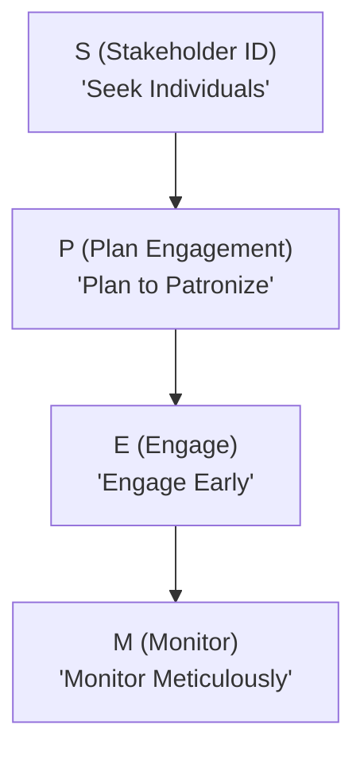
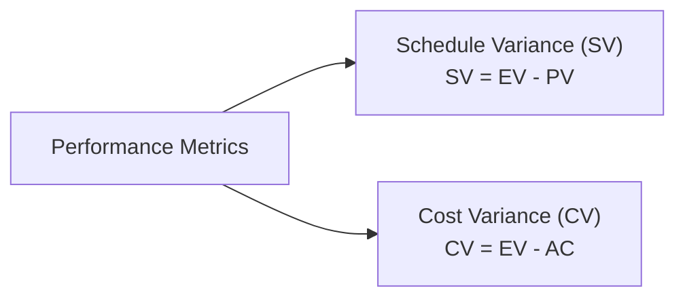

## 38.3 Using Mnemonics and Hierarchical Techniques

In this section, we dive deeply into the art of creating and using mnemonics and hierarchical techniques to improve memory retention—an essential skill in preparing for the PMP® exam. Project Management professionals often face vast amounts of information, from process-related details to definitions of complex concepts. By employing memory aids such as abbreviations, acronyms, and structured logic flows, you can absorb the material more efficiently, recall it under pressure, and build confidence in both exam and real-world environments.

Memory improvement strategies benefit practitioners at all levels—whether you are aspiring to achieve PMP® certification or are a seasoned professional tasked with mentoring others. The methods introduced here not only optimize exam performance but also become valuable assets in managing daily tasks and leading complex projects.

Below, we will outline a variety of mnemonic examples, discuss hierarchical thinking frameworks, demonstrate how to combine them, and include sample diagrams to illustrate how each approach can be structured.

---

### Why Mnemonics and Hierarchical Techniques Matter

Mnemonics and hierarchical techniques are powerful because they:

• Reduce cognitive load by breaking down vast information into manageable segments.  
• Promote quick recall of critical facts and formulas under exam conditions.  
• Foster structured thinking, allowing you to see the “big picture” and dive into key details more effectively.  
• Enhance learning retention for the long run, so knowledge can be applied to real-world challenges.  

You will find that many topics in project management—from risk classifications to cost control formulas—can be quickly recalled and used when underpinned by well-crafted mnemonic devices or hierarchical structures.

---

### Core Principles of Mnemonics

A mnemonic is a memory aid that ties new information to something more familiar or simpler to recall. It could take the form of an acronym, phrase, or rhyme. In project management, mnemonics prove particularly effective when you need to remember sequences, formulas, or technical details.  

Below are several guiding principles:

1. **Simplicity**  
   Ensure that your mnemonic is short and easy to pronounce. The simpler, the better.  

2. **Meaningfulness**  
   Try to create a phrase or word that holds personal or professional significance, making it more memorable.  

3. **Consistency**  
   Use mnemonics consistently across your study materials for each relevant topic.  

4. **Visual and Auditory Triggers**  
   Where possible, pair visuals, sounds, or color-coding with your mnemonic for a multisensory boost to recall.  

5. **Repetition**  
   Regular review is critical. Repeat your mnemonic devices during daily or weekly study intervals.

---

### Common Memory Techniques Used in Project Management

#### Acronyms

Acronyms use the first letter of each term to form a new word. For example, to recall the steps in risk management (as discussed in Chapters 14 and 22), you may use a short word like “IPDA-M” for Identify, Plan, Develop responses, Analyze, and Monitor.  

Another classic example is “S-M-A-R-T” for creating project objectives: Specific, Measurable, Achievable, Relevant, and Time-Bound. This widely adopted acronym is simple, clear, and firmly embedded in day-to-day project language.

#### Acrostics

Acrostics transform each first letter of a series of terms into a phrase. For instance, if you have to remember the sequence of the 12 Project Management Principles from Chapter 5, you could create a sentence where each word starts with the first letter of the principle:

“Some Cats Love Very Special Toys, Quietly Observing And Finally Hiding Enigmatically.”

While whimsical or silly phrases can seem odd, they often stick in your mind more effectively than purely academic references.

#### Rhymes and Tunes

Rhymes, jingles, or short songs can be surprisingly effective. For example, if you struggle to remember the difference between cost variance (CV) and schedule variance (SV) in Earned Value Management (see Chapter 37), setting them to the tune of a familiar melody may help you recall the formulas and the conceptual difference between them (i.e., CV = EV – AC, SV = EV – PV).

#### Chunking

Chunking divides large lists of items into smaller groupings. If you need to remember a list of 12 items, splitting them into three groups of four items each often makes recall less daunting.  

---

### Hierarchical Techniques

Hierarchical techniques organize information in order of importance, logic, or sequence. They often take the shape of structured outlines, flowcharts, or mind maps that start with broader concepts and drill down into details.  

#### Step-by-Step Frameworks

Much of project management revolves around step-based processes, like “Initiate, Plan, Execute, Monitor and Control, and Close” (the common phases in a predictive approach). When you arrange tasks in hierarchical steps, you create a mental “tree” with multiple branches that link back to the main trunk.

#### Trees and Branches

Visualizing your knowledge as a tree can be helpful:

• **Trunk:** Main knowledge area (e.g., Scope Management).  
• **Branches:** Subtopics or processes (e.g., Plan Scope, Validate Scope, Control Scope).  
• **Leaves:** Detailed tasks, inputs, outputs, or techniques (e.g., WBS, Requirements Documentation, Scope Creep prevention).

#### Work Breakdown Structures (WBS) as a Memory Model

Work Breakdown Structures, typically used to decompose project deliverables (see Chapter 18), are also powerful memory aids. By breaking broader tasks into logical components, you can memorize the project’s scope or a complex concept with a “top-down” approach.

---

### Combining Mnemonics and Hierarchical Techniques

The synergy of mnemonics and hierarchical thinking can greatly amplify your study efforts. For example, you might:

1. **Create an acronym** for each phase of a lifecycle.  
2. **Use a flowchart** to place these phases in logical order with sub-steps.  
3. **Attach a mnemonic phrase** to each sub-step, ensuring you connect them mentally as you move from one level of the hierarchy to the next.  

Below is a sample illustration for memorizing the fundamental sequence of stakeholder engagement. We will show a Mermaid flowchart that combines hierarchical steps with mnemonic cues:

Explanation of the diagram:  
• A: Identify and categorize your stakeholders. (“Seek Individuals”)  
• B: Plan how to engage them. (“Plan to Patronize”)  
• C: Engage them through actions, communications, and collaboration. (“Engage Early”)  
• D: Regularly monitor their engagement status. (“Monitor Meticulously”)  

Here, each node in the hierarchy references the stakeholder life cycle **(Identify → Plan → Engage → Monitor)** along with a quick mnemonic phrase to prime your memory.

---

### Practical Examples and Case Studies

#### Example 1: Memorizing Key Formulas

In Chapter 37, we discuss critical formulas for success in the PMP® exam, such as Earned Value Management (EVM). To remember the simple trifecta of planned value (PV), earned value (EV), and actual cost (AC), try something like:

• **P-E-A** → “Plan, Earn, and Actual”  

Then, for schedule variance (SV) and cost variance (CV), note:  
• **SV = EV – PV** → “Earn minus Plan”  
• **CV = EV – AC** → “Earn minus Actual”  

To hint at their difference visually, you could arrange them hierarchically:  

Each branch breaks out a unique formula, and you can attach your mnemonic “Earn minus Plan” or “Earn minus Actual” to remember the difference.

#### Example 2: Organizing Quality Management Tools

Quality Management (Chapter 20) involves multiple tools: cause-and-effect diagrams, flowcharts, check sheets, Pareto diagrams, histograms, control charts, and scatter diagrams. Group these tools hierarchically under categories like “Analytical Tools,” “Data Visualization Tools,” and “Monitoring Tools.” Then apply an acronym, such as **CARES** (Cause-and-effect, Analysis of flow, Recording with check sheets, Examining Pareto, Scatter plots), to ensure that you recall their broad variety.

---

### Best Practices for Long-Term Retention

• **Review and Revise:** Even the best memory technique fades without periodic reinforcement. Schedule routine check-ins and quizzes.  
• **Reflect:** Evaluate which mnemonics genuinely help and which are more confusing. Tailor them to your personal style.  
• **Engage the Senses:** If possible, add color-coding, distinctive fonts, or auditory markers.  
• **Teach Others:** Teaching is an excellent way to confirm you’ve internalized the information. Encourage peers or study groups, and share your mnemonic devices.  

---

### Potential Pitfalls and How to Avoid Them

• **Over-complication:** If a mnemonic becomes too lengthy or complex, it defeats the purpose. Pare it down to essentials.  
• **Misalignment with Actual Concepts:** Beware of memorizing only acronyms without understanding the frameworks behind them. Always connect them to the underlying principles.  
• **Context Loss:** Sometimes acronyms are memorized but the context is forgotten. Pair the abbreviation with an example or short explanation.  
• **One-Size-Fits-All Approach:** Recognize that no single mnemonic works for all learners. Experiment to find techniques that resonate best with you.  

---

### Further Reading and References

• “The PMBOK® Guide – Seventh Edition.” Project Management Institute.  
• “Agile Practice Guide.” Project Management Institute.  
• “Make It Stick: The Science of Successful Learning,” by Peter C. Brown et al.  
• “Brain Rules,” by John Medina—a deeper dive into the biology of memory.  
• Chapters 14, 22, and 37 of this book for additional guidance on risk management, advanced risk identification tools, and key PMP® exam formulas.

---

## Quiz: Strengthen Your Project Management Memory



### Which of the following statements best describes an effective mnemonic?
- [ ] It is always expressed solely as an acronym.  
- [x] It is a memory aid that creates meaningful associations.  
- [ ] It is any diagram or flowchart visually representing a process.  
- [ ] It must include numbers for each item being memorized.  

> **Explanation:** A mnemonic is broadly defined as any memory aid that creates meaningful, memorable associations. Acronyms are just one of many forms it can take.

### What is a key advantage of chunking information into smaller groups?
- [ ] It increases the complexity of recalling the information.  
- [ ] It reduces time spent studying.  
- [x] It helps manage cognitive load by breaking information into manageable parts.  
- [ ] It completely eliminates the need for repetition or review.  

> **Explanation:** Chunking splits large sets of data into smaller, more approachable groups, reducing mental strain and improving recall efficiency.

### Why is it important to pair mnemonics with the underlying project management concepts?
- [ ] To ensure you can write longer acronyms.  
- [x] To provide context so the mnemonic correlates with real understanding.  
- [ ] To score extra points on process diagrams.  
- [ ] To ignore advanced topics and focus solely on memorization.  

> **Explanation:** Mnemonics without conceptual backing risk becoming hollow words. By connecting the mnemonic to the actual concepts, you preserve relevance and deeper comprehension.

### Which best characterizes hierarchical thinking in project management studies?
- [ ] Using a random sequence of topics to prompt creative thinking.  
- [ ] Memorizing only the last step in a process.  
- [x] Organizing information in a structured order, such as outlines or flowcharts.  
- [ ] Focusing only on brainstorming diagrams.  

> **Explanation:** Hierarchical thinking arranges information in an orderly structure—often top-down—helping you see the big picture and how subtopics tie into it.

### In Earned Value Management, “SV = EV – PV” is often recalled as “Earn minus Plan.” Which mnemonic principle does this highlight?
- [x] Acronyms and short phrases for formula recall  
- [ ] Acrostics for complex sequences  
- [x] Simple chunking method  
- [ ] Mind-mapping of intangible data  

> **Explanation:** By turning formula components into a short phrase, practitioners can associate “SV” with “Earned minus Planned.” This merges an acronym concept (EV, PV) with a short phrase that’s easy to memorize.

### What is the primary risk when using overly complex mnemonics?
- [x] They may become harder to remember than the original information.  
- [ ] They automatically ensure deeper understanding.  
- [ ] They are universally useful for all learners.  
- [ ] They easily replace the need for practice questions.  

> **Explanation:** Overly complicated memory devices can undermine their own purpose by introducing an unnecessary layer of complexity.

### Combining diagrams (like flowcharts) with mnemonics can:
- [x] Enhance both structured understanding and quick recall.  
- [ ] Create confusion during standardized exams.  
- [x] Replace all other study methods.  
- [ ] Reduce the ability to identify knowledge gaps.  

> **Explanation:** Pairing visual hierarchies (flowcharts, mind maps) with mnemonics (acronyms, acrostics) fosters an integrated approach, improving comprehension and recall.

### According to best practices, how often should you revisit your mnemonic devices?
- [x] Regularly, as part of a study schedule  
- [ ] Only right before the exam  
- [ ] Only when you have forgotten them  
- [ ] Once at the very end of the project  

> **Explanation:** Frequent review—daily or weekly—ensures that mnemonic devices stay fresh and become embedded in long-term memory.

### What is the greatest benefit of teaching your mnemonic devices to others?
- [x] Reinforcing your own understanding through explanation  
- [ ] Reducing the study time needed for challenging topics  
- [ ] Preventing others from learning different methods  
- [ ] Eliminating the need for further revision  

> **Explanation:** “Learning by teaching” solidifies and clarifies your own knowledge, as instructing peers forces you to articulate and reinforce the memory devices and associated concepts.

### Hierarchical thinking is most effective when:
- [x] True  
- [ ] False  

> **Explanation:** Hierarchical thinking excels when broad topics are classified into manageable subtopics, enabling clarity and better recall, thus supporting learning efficiency.



---

## PMP Mastery: 1500+ Hard Mock Exams with Full Explanations 

Looking to crush the PMP exam with confidence? Dive deep into 6 rigorous mock exams totaling 1500+ advanced-level questions, each accompanied by clear, step-by-step explanations. Hone your test-taking strategies, master complex topics, and build the resilience you need on exam day. Perfect for serious PMs aiming beyond fundamentals.

Enroll now:  
[PMP Mastery: 1500+ Hard Mock Exams with Exceptional Clarity & Full Explanations](https://www.udemy.com/course/pmp-2025/?referralCode=CF83A54BC86BE27F9AFE)

_Disclaimer: This course is not endorsed by or affiliated with the PMI examination authority. All content is provided purely for educational and preparatory purposes._
