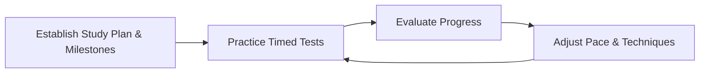

## 39.1 Approaches to Time and Stress Management

Effectively managing your time and combating stress are essential components of a successful credentialing exam experience. The PMP® exam’s broad scope can feel overwhelming, especially when faced with lengthy scenario-based questions and multiple domains that demand thorough understanding (see also Chapter 6: “The PMP® Exam Domains, Tasks, and Enablers”). Proper time management helps ensure you can tackle all questions systematically and confidently. Equally crucial is stress management—keeping yourself mentally prepared, balanced, and focused throughout your study period and on exam day. In this section, we explore proven strategies, practical tips, and real-world examples to help you stay on track and in control.

---

## The Importance of Time and Stress Management in the PMP® Exam

Time is a finite resource. The PMP® exam setup grants you a set number of minutes (currently 230) to answer 180 questions, which averages out to roughly 1.28 minutes per question. This constraint intensifies a candidate’s need for an actionable plan to pace themselves. Without a clear strategy, it’s easy to bog down on difficult questions, drain mental energy, and breed anxiety that further compromises performance.

Stress management is just as vital. Exam preparation involves months of dedicated study, memorizing formulas, becoming fluent in project management principles, and acclimating to the exam environment. This process alone can trigger stress. On exam day, in high-pressure testing scenarios, unchecked stress can manifest as second-guessing, time-wasting behaviors, or even the dreaded exam “mental block.” Balancing both time and stress effectively maximizes your chance of completing the exam confidently, accurately, and with presence of mind.

---

## Building a Foundation for Success

### 1. Aligning with a Study Schedule

Effective time and stress management starts long before exam day. Setting a realistic but rigorous study schedule helps you build the discipline and consistency needed to avoid last-minute cramming—a known stress accelerator. Consider these steps:

• Define Major Study Milestones: Use backward planning from your exam date to divide content into manageable segments. For instance, you might allocate two weeks to “Project Resource Management” (see Chapter 21) and another two weeks for “Cost Management” (see Chapter 19).  
• Integrate Practice Exams: Reserve frequent blocks to tackle timed practice exams or question sets. This not only refines your knowledge but also conditions your mind to manage time constraints.  
• Adopt a Predictable Cadence: Apply techniques like the Pomodoro method—studying for 25-minute bursts followed by 5-minute breaks—to maintain focus without burnout.

### 2. Physical and Mental Well-Being

Physical and mental health form a critical part of your study foundation. Sleep deprivation, poor dietary habits, and neglect of exercise can all exacerbate stress levels:

• Sleep Hygiene: Aim for 7–8 hours of sleep nightly. Studies link adequate sleep to improved memory consolidation, essential when absorbing complex project management concepts.  
• Nutrition: Favor foods that sustain energy and mental clarity (e.g., whole grains, lean proteins, fruits, and vegetables) over sugar-laden snacks that cause energy spikes and crashes.  
• Exercise and Relaxation: Incorporate short walks, stretching, or yoga breaks. Physical movement helps reduce cortisol (the stress hormone) and keeps your mind fresh for ongoing study efforts.

---

## Strategies for Effective Time Management

Time management is the cornerstone for navigating the exam’s multiple-choice questions and scenario-based items efficiently. Below are methods to remain in control of the clock.

### Prioritizing High-Impact Questions

Although each question on the PMP® exam holds similar weight, some questions are less time-consuming. Questions that are shorter or that relate to well-mastered concepts can often be answered swiftly, freeing up time to tackle more complex prompts. Skim the question stem quickly, evaluating complexity. If you sense it’s a topic you’re comfortable with, proceed. If you encounter a question that appears excessively complicated, consider marking it for review and come back to it after you’ve addressed more straightforward items. This dynamic prioritization helps maintain momentum.

### Predefining Time Checkpoints

Consciously segment the total exam time so you know where you stand at various benchmarks. For instance, if the PMP® exam sets 230 minutes, outline your pacing approach:

• Target finishing roughly 60 questions in the first 75 minutes.  
• At the 150-minute mark, aim to have 120 questions done.  
• Reserve the remaining 80 minutes for the final 60 questions and reviewing flagged items.

To make this more explicit, consider a simple formula to estimate average time per question:


t_{avg} = \frac{T_{total}}{Q_{total}}


Where:  
• \\( t_{avg} \\) = Average time allowed per question  
• \\( T_{total} \\) = Total exam time (e.g., 230 minutes)  
• \\( Q_{total} \\) = Total number of questions (e.g., 180)

Hence,


t_{avg} = \frac{230}{180} \approx 1.28 \text{ minutes per question}


By staying aware of this ratio, you can quickly gauge if you’re behind or ahead of schedule.

### The “Two-Pass” Method

A popular strategy among PMP® graduates is the “two-pass” method:  

1. **Pass One**: Swiftly address questions you can answer confidently without agonizing. Mark exceedingly complex questions for later review.  
2. **Pass Two**: Revisit marked questions, use additional time to carefully read options, and apply deeper analysis or formula-based calculations.

This separation helps prevent you from spending too many minutes on a single unfamiliar question. Aim to strictly enforce your time limits on each pass—consistent with the pacing checkpoints set for yourself.

### Managing Breaks

The PMP® exam typically includes scheduled breaks. It’s wise to use these breaks effectively:

• Rest Your Mind: Briefly close your eyes or take a few deep breaths to reset your focus.  
• Hydrate and Stretch: Stand up, walk around, sip water. Physical movement and hydration keep your body energized.  
• Avoid Overthinking: Limit mental replays of previous questions. Dwelling on possible mistakes only elevates stress.

---

## Stress Management Techniques

Exam anxiety often results from uncertainty, fatigue, and the high stakes of certification. However, stress (in moderated amounts) can also sharpen focus and motivation. Below are practical ways to channel stress constructively and maintain mental composure.

### Breathing and Grounding Exercises

Regulating your breathing can have a near-immediate effect on stress levels. Techniques like “box breathing”—inhaling for four counts, holding for four, exhaling for four, and holding again for four—encourage the body’s relaxation response. Similarly, mindfulness or grounding exercises such as briefly focusing on each of your five senses (e.g., feeling the seat, hearing ambient sounds) help center your mind, mitigating racing thoughts.

### Cognitive Restructuring

Often, stress magnifies when you perceive a question as overly difficult or fear the implications of failure. Cognitive restructuring involves recognizing negative self-talk and reframing it into a more balanced perspective. Instead of thinking, “If I fail this question, I’ll fail the test,” remind yourself, “I am prepared, and one tough question does not dictate my overall performance.”

### Visualization and Affirmations

Visualization is a powerful tool for success. Many athletes and public speakers use it for peak performance. Envision yourself:

• Calmly reading the question.  
• Applying your knowledge systematically.  
• Successfully submitting the exam with spare time.  

Pairing visualization with short affirmations (e.g., “I am focused and prepared”) can buffer stress by reinforcing a sense of confidence.

### Physical Tension Release

Stress can present physically, affecting muscles in the neck, shoulders, or jaw. Simple tension-and-release exercises add relief:

1. **Shoulders**: Raise them towards your ears for five seconds, and then release.  
2. **Neck**: Slowly roll your head to stretch each side.  
3. **Hands**: Clench fists tightly for a few seconds, then release and shake out tension.

---

## Practical Exam-Day Scenarios

Let’s examine two typical scenarios to illustrate how time and stress management converge.

### Scenario 1: The Overly Lengthy Question

Imagine encountering a multi-paragraph question involving a complex stakeholder scenario referencing agile sprint deadlines, regulatory compliance, and multiple change requests. It’s easy to be daunted. To manage:

1. **Check the Clock**: If you’ve allocated ~1.28 minutes per question, see if you’re on pace. If behind, mark the question and move on.  
2. **Target Key Details**: If you have adequate time, skim for relevant data, eliminating distractors.  
3. **Tackle if Familiar**: If the question aligns with well-practiced knowledge (e.g., stakeholder management), attempt it. Otherwise, mark for review.

### Scenario 2: Onset of Panic Mid-Exam

Halfway through, you realize you’ve spent more time than intended on complex questions, and your pace is faltering. Stress begins to build. You feel your mind racing with anxiety. Management strategies:

1. **Pause and Breathe**: Two or three slow, deep breaths. Recenter yourself.  
2. **Reframe**: Remind yourself you can still adjust pace effectively.  
3. **Focus on the Next Five**: Instead of mentally scanning all remaining questions, break it down into smaller sets. Tackle five questions, reevaluate time, then proceed.

---

## Using Mind Maps and Quick Brain Dumps

In high-stress environments, it’s easy to forget crucial formulas or frameworks, especially if they’re rarely used in your daily practice (see Chapter 38: “Memory Aids, Mind Maps, and Brain Dumps”). Here’s how those techniques can help:

• **Mind Map Summary**: Construct a mental or written quick-reference of knowledge areas, such as EVM formulas, risk response strategies, and agile ceremonies.  
• **Initial Brain Dump**: Right after the exam starts—and before diving into questions—sometimes you can use scratch paper for key formulas (e.g., Earned Value Management, PERT, risk probability calculations). This can speed up question processing and reduce mental strain.

---

## Visualizing Time Management Flow

Below is a simplified Mermaid diagram illustrating a typical flow of planned time management activities. This cycle can be adapted to your personal preferences, but it emphasizes iterative review and adjustment.

- A: Begin by laying out your study plan with clear milestones.
- B: Integrate regular practice tests under simulated exam conditions.  
- C: After each practice test, assess answer accuracy and timing.  
- D: Adjust your strategy based on insights from the evaluation phase.

This continuous improvement loop parallels the “Plan-Do-Check-Act” cycle discussed across various parts of project management. By constantly refining study and time management approaches, you remain agile and adaptive, mirroring real-world project processes.

---

## Additional Stress-Reduction Tips

### Embrace Support Systems

Connect with classmates, coworkers, or online study groups. Sharing questions and experiences helps normalize challenges and fosters a sense of camaraderie. People who have recently passed the PMP® exam can often provide invaluable tips to streamline your time management approach and reduce exam anxiety.

### Leverage Technology Wisely

Modern project management software or study applications can help you keep track of your study hours, mark progress on various topics, and combine short quizzes with immediate feedback. However, balance is key—avoid turning your phone into a constant distraction. Instead, set designated windows for app-based learning.

### Tailor Techniques to Your Personality

Time management is not one-size-fits-all. While some people thrive using strict schedules and bullet journals, others prefer digital planners or more flexible weekly goals. Experiment to see which approach leads to higher productivity and lower stress without ignoring the exam’s fixed deadlines.

---

## Real-World Case Study: Juggling a Full-Time Job and PMP® Prep

Consider a project coordinator, Sarah, who works 40+ hours a week and commits to earning her PMP® certification within six months. With limited study time, she found difficulty balancing job responsibilities, personal life, and exam prep. Sarah adopted the following strategies:

• **Segmented Weekday Study**: She dedicated 1 hour each weekday morning for practice questions and 2 hours each evening for review. This ensured steady progress without sacrificing consistent sleep.  
• **Weekend Practice Exams**: Sarah reserved Sundays to take full-length timed exams. She tracked how many questions she answered within each hour. Over time, she identified a pattern of overspending time on schedule and cost questions.  
• **Stress-Busting Midday Walks**: During lunch breaks, Sarah took brisk walks to clear her mind, often repeating memory cues for formulas (like EVM) to reinforce her retention.  
• **Periodic Check-Ins**: Every month, she reviewed her progress to adjust her study plan. When she discovered she was behind on stakeholder engagement concepts, Sarah reprioritized her schedule to address those weaknesses.

By exam day, Sarah’s consistent approach to time allocation and stress relief helped her remain calm, finish the exam with 10 minutes to spare, and earn her PMP® certification on the first try.

---

## Summary of Best Practices

• **Establish a Pacing Strategy**: Know your average minutes per question and check in at time checkpoints.  
• **Practice Under Timed Conditions**: Simulate exam pressure often. This allows you to iterate and refine your approach to answering questions.  
• **Cultivate Positive Hardware and Software Habits**: Sleep, nutrition, mind mapping, and digital tools all form a support system.  
• **Adopt Quick Stress-Release Techniques**: Use short breathing exercises, mental reframing, and strategic breaks to curb anxiety before it overwhelms you.  
• **Leverage Brain Dumps and Key Formula Lists**: Save your mental bandwidth for higher-order thinking.  
• **Seek Support and Feedback**: Study partners, mentors, or online communities can provide accountability and external insight.  

When you combine consistent time management methods with deliberate stress-reduction efforts, you give yourself the best possible shot at conquering the PMP® exam with confidence and clarity.

---

## Time and Stress Management Mastery Quiz



### Which of the following best describes why time management is crucial for the PMP® exam?
- [ ] It ensures you memorize the entire PMBOK® Guide.  
- [x] It keeps you from losing control on lengthy or complex questions.  
- [ ] It allows you to skip certain exam sections.  
- [ ] It guarantees perfect responses to all scenario-based questions.  

> **Explanation:** Time management is critical because the PMP® exam includes complex and scenario-based questions that can easily consume more time than allocated. Knowing how to pace yourself helps ensure you don’t run out of time.

### What is the “two-pass” method?
- [x] A strategy in which you quickly answer easy questions first and revisit challenging ones later.  
- [ ] A method to read each question twice before answering.  
- [ ] A technique involving two separate PMP® exams.  
- [ ] A plan to interview two project stakeholders to confirm correctness of agile principles.  

> **Explanation:** The “two-pass” method involves skimming through questions, answering those you’re confident about, and marking complex ones for a detailed review after the first pass.

### When dealing with stressful thoughts during the exam, which approach is most effective?
- [x] Cognitive restructuring to reframe negative self-talk into constructive thinking.  
- [ ] Ignoring the stress entirely in hopes it will fade.  
- [ ] Memorizing every page of the PMBOK® Guide.  
- [ ] Consuming an energy drink before reading each question.  

> **Explanation:** Cognitive restructuring empowers you to identify unproductive thoughts and replace them with positive, realistic perspectives, thus reducing exam anxiety.

### How do short breaks help during the PMP® exam?
- [x] They offer a reset for your mental energy, quell stress, and help improve focus.  
- [ ] They let you swap your exam content with a peer.  
- [ ] They’re primarily intended for checking phone messages.  
- [ ] They automatically deliver the correct answers.  

> **Explanation:** Taking brief, purposeful breaks supports mental clarity, helps reduce physical tension, and curbs anxiety, leading to a more balanced exam performance.

### Which of the following describes the benefit of practicing with timed simulations before exam day?  
- [x] It conditions you to maintain a consistent answering pace under pressure.  
- [ ] It decreases the overall difficulty of exam questions.  
- [x] It helps identify areas where you are overspending time.  
- [ ] It guarantees a 100% pass rate.  

> **Explanation:** Timed mock exams ease exam-day pressure by reinforcing familiarity with pacing and by clarifying which areas demand more efficient time management.

### In time-management planning for the PMP® exam, a healthy target is to:
- [x] Monitor your progress at pre-planned checkpoints to avoid last-minute rushes.  
- [ ] Spend a full 10 minutes on each question without pause.  
- [ ] Always skip the first 5 questions.  
- [ ] Only start answering multiple-choice questions in the second hour.  

> **Explanation:** Setting checkpoints at discreet intervals of your total allotted time ensures that you remain on track and can adjust your pace according to your progress.

### How can physical exercise support your PMP® exam readiness?
- [x] By lowering cortisol levels and promoting sharper mental focus.  
- [ ] By allowing you to skip mental practice sessions.  
- [x] By providing a healthy outlet to channel stress and anxiety.  
- [ ] By immediately boosting your memorization capacity of ITTOs.  

> **Explanation:** Exercise is known to reduce stress hormones like cortisol, improve mood, and help sharpen cognitive function. Including moderate physical activities in your study routine encourages resilience.

### If you find yourself behind schedule halfway through the exam, what should you do first?
- [x] Pause, breathe deeply, and calm yourself to restore clarity.  
- [ ] Submit the exam immediately.  
- [ ] Turn off the exam console and blame technology.  
- [ ] Start answering randomly to catch up on time.  

> **Explanation:** Pausing to breathe and reset helps you manage panic. Once you’re calm, you can adjust your pace with composure and avoid careless mistakes.

### During the exam, you notice a pattern of overly complex stakeholder-related questions. What is the best approach?
- [x] Mark them for review if you can’t answer quickly, ensuring you move on to simpler items first.  
- [ ] Spend all remaining time on the first complex question.  
- [ ] Rely solely on guesswork for any question that references stakeholders.  
- [ ] Skip the stakeholder domain entirely.  

> **Explanation:** Marking overly complex questions and returning to them after completing easily answerable items prevents you from losing a disproportionate amount of time too early in the exam.

### “Box breathing” is:
- [x] A stress-reduction technique involving structured inhalation and exhalation cycles.  
- [ ] A method of storing your exam materials in a carton.  
- [ ] An approach where you break down a question into four separate boxes.  
- [ ] An agile management method for verifying sprint performance.  

> **Explanation:** Box breathing is a quick and effective way to slow heart rate and calm the mind—especially useful during high-pressure moments.



---

## PMP Mastery: 1500+ Hard Mock Exams with Full Explanations 

Looking to crush the PMP exam with confidence? Dive deep into 6 rigorous mock exams totaling 1500+ advanced-level questions, each accompanied by clear, step-by-step explanations. Hone your test-taking strategies, master complex topics, and build the resilience you need on exam day. Perfect for serious PMs aiming beyond fundamentals.

Enroll now:  
[PMP Mastery: 1500+ Hard Mock Exams with Exceptional Clarity & Full Explanations](https://www.udemy.com/course/pmp-2025/?referralCode=CF83A54BC86BE27F9AFE)

_Disclaimer: This course is not endorsed by or affiliated with the PMI examination authority. All content is provided purely for educational and preparatory purposes._
