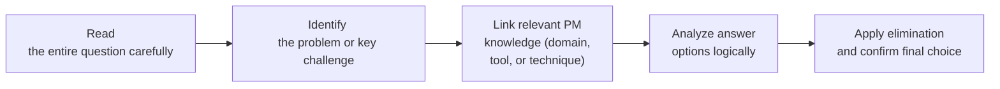

## 39.2 Navigating Situational and Scenario-Based Questions

Situational and scenario-based questions are a hallmark of the PMP® exam. Instead of asking, “Which tool is usually used to develop a risk register?” scenario-based questions explore real-world project challenges and ask you to select the best or next logical step. This approach better assesses how well you can apply knowledge, skills, and judgment under uncertainty.

This section covers common techniques for approaching these complex questions, highlights pitfalls to avoid, and offers practical examples. By the end, you will be adept at dissecting scenarios, triangulating solutions based on PMBOK® Guide principles, and confidently choosing the “most correct” answer.

---

## Importance of Situational and Scenario-Based Questions

Traditional questions focus on testing memorized facts: definitions, formula outcomes, or process names. In contrast, situational and scenario-based questions test your ability to:

• Integrate knowledge across multiple project management domains (People, Process, and Business Environment).  
• Apply critical thinking to real-world problems involving stakeholders, resources, or shifting requirements.  
• Demonstrate practical use of methodologies—predictive, agile, or hybrid—to handle continuous change.  
• Suggest best practices drawn from the PMI® Code of Ethics and Professional Conduct (e.g., honesty, fairness).  

The PMP® exam’s situational format helps ensure that certified Project Management Professionals are not only knowledgeable but also prepared to make sound, ethical, and effective decisions throughout the project life cycle.

---

## Key Elements in Scenario-Based Questions

For scenario-based questions, the context is crucial. Exam questions often contain details about stakeholders, project constraints, team conflicts, or organizational culture. These details convey hints about:

• The project environment: predictive (traditional waterfall), agile, or hybrid.  
• The project phase or domain you are dealing with.  
• Roles and responsibilities you must address (Project Manager, Product Owner, Sponsor, etc.).  
• Ethical dilemmas and corporate mandates (compliance, safety, data privacy).  

It is vital to pinpoint which aspect of project management the question is targeting—this could be stakeholder engagement, risk optimization, or team conflict resolution. Understanding the precise question being asked, filtering out extraneous data, and systematically examining response options are core skills.

---

## General Approach to Analyzing Scenario-Based Questions

Below is a high-level framework for approaching situational PMP® exam questions:

### 1. Read the Entire Question Carefully
• Scan for the project environment (predictive, agile, or hybrid) and major constraints.  
• Note any specific stakeholders mentioned (sponsor, customer, team lead).  
• Watch for keywords like “ethics,” “compliance,” “risk,” “urgent,” or “stakeholder conflict.”  

### 2. Identify the Core Problem or Key Challenge
• Is the question asking for a resolution to a conflict?  
• Do you need to decide on a next best step after receiving a certain type of project change request?  
• Is there a focus on leadership style, or is it purely about technical areas like budgeting or scheduling?  

### 3. Link to Relevant Knowledge
• People Domain: Are there issues involving team motivation, collaboration, conflict resolution?  
• Process Domain: Are you refining schedule estimates, controlling scope, or dealing with risk?  
• Business Environment Domain: Is there a compliance requirement or strategic alignment at stake?  
• Look to the PMBOK® Guide’s performance domains and knowledge areas (e.g., Chapter 14’s strategies on uncertainty).  

### 4. Analyze Answer Options Logically
• Ask, “What would a professional Project Manager do first, according to best practices and PMI’s ethical standards?”  
• Eliminate obviously incorrect or unethical steps.  
• Identify the difference between “best choice” and “good but not best choice.”  

### 5. Apply Elimination and Confirm the Final Choice
• Double-check logic against PMI’s 12 principles (see Chapter 5).  
• If two answers are similar, figure out which is more aligned with project management standards or the precise question asked (like “immediate action” vs. “long-term corrective measures”).  
• Watch for distractors intended to lure you away from the ideal solution.  

---

## Techniques for Eliminating Distractors

Distractors are plausible but incorrect answers that test your ability to distinguish subtle differences. Here are some common distractor characteristics:

1. Overly aggressive: Suggesting that the Project Manager should escalate before attempting to solve it at the team level.  
2. Out of sequence: Proposes a solution that belongs to a much later phase of the project.  
3. Ethically questionable: Encourages ignoring or circumventing compliance or a stakeholder’s concern.  
4. Irrelevant detail: Answers that do not address the actual root cause identified in the scenario.  

### Strategies to Remove Distractors

• Rule out options that ignore the chain of communication and formal processes.  
• Eliminate answers that conflict with PMI’s ethical guidelines.  
• Test each remaining option against the scenario’s constraints—time, scope, risk, or stakeholders.  
• Select the one that best fits the short- and long-term project objectives described in the scenario.  

---

## Best Practices for Scenario-Based Question Mastery

### Start with a High-Level Mindset
Before diving into the details, mentally note the big picture: the project’s objective, who is involved, and the environment (agile vs. predictive).

### Map the Question to a Knowledge Area or Performance Domain
Each scenario question typically focuses on a specific performance domain or knowledge area. For instance, if the question revolves around unexpected new requirements, think about integration management and scope control processes.

### Use Real-World Logic
If you received the problem in an actual project environment, what would you do first? Would you consult the sponsor, or clarify details with the team? Using your professional reasoning helps you find the best answer.

### Check Alignment with PMBOK® Guide Seventh Edition Principles
The 12 principles covered in Chapter 5 provide a moral and practical compass. Emphasize stewardship, collaboration, value delivery, and risk optimization. Answers that embody these principles are less likely to be distractors.

### Lean on Agile Mindset for Adaptive Scenarios
When the question references iterative feedback loops, user stories, or sprint ceremonies, apply agile tactics (e.g., daily stand-ups, time-boxed planning). Rely on servant leadership and team empowerment over command-and-control approaches.  

---

## Common Pitfalls

1. **Overlooking Critical Details**  
   Reading the scenario too quickly may lead to missing time constraints or stakeholder viewpoints. Avoid scanning superficially—many exam questions hinge on a single crucial line or phrase.

2. **Failing to Identify the “Next” or “Best” Action**  
   PMP® exam questions often ask: “What should the Project Manager do NEXT?” or “What is the BEST course of action?” Solutions might be correct but out of order. Know your processes to locate the next logical step.

3. **Ignoring the Human Factor**  
   Many answers are not about advanced calculations; they are about team dynamics. Remember your leadership, conflict resolution, and communication strategies. Especially for the People Domain, the best answer often ties back to ethical or empathetic leadership.

4. **Confusing Tools and Techniques**  
   Sometimes you will see technique-based answers that do not align with the problem type. Ensure that the tool or technique matches the scenario, e.g., a “Monte Carlo analysis” for schedule risk or a “burn-up chart” for agile tracking.

5. **Misapplying Agile and Hybrid Concepts**  
   If the project references customer feedback, iterative product releases, or dynamic scope changes, do not jump to pure waterfall solutions. Tailor your response to the specified approach.

---

## Illustrative Examples

### Example 1: Stakeholder Conflict
Scenario: A key stakeholder is dissatisfied with recent deliverables but refuses to attend scheduled reviews. The deliverables meet scope specifications. The rest of the team wants to proceed without stakeholder input.

Key Question: “What should the Project Manager do NEXT?”

• Potential Pitfall: Escalating to senior management prematurely, ignoring the stakeholder, or continuing without ensuring alignment.  
• Likely Best Answer: Reach out to the stakeholder to understand the root cause of dissatisfaction, adapt communication methods, and ensure the feedback loop is open. If needed, negotiate how and when the stakeholder will be involved.

### Example 2: Scope Creep in an Agile Environment
Scenario: The product owner continuously adds new features during sprint review, and the team is unsure whether these should be included immediately or planned for future sprints.

Key Question: “Which action should the Project Manager take FIRST to maintain project control?”

• Incorrect Approach: Implement the new features right away, ignoring backlog prioritization.  
• Recommended Approach: Update and prioritize the product backlog with the product owner, ensuring the team’s workload remains sustainable and value-driven.  

---

## Case Study: Integrated Scenario

Imagine you are managing a hybrid project in a large organization where a portion of the requirements is fixed, yet some agile prototyping is also needed. The sponsor wants quicker results, while the team is struggling with remote collaboration and multi-time-zone constraints.

Question: “As the Project Manager, which of the following steps should you take NEXT to improve team performance and satisfy the sponsor’s request?”

1. Shorten the iteration length from four weeks to one week, force daily overtime, and promise immediate deliverables.  
2. Examine the remote collaboration tools and propose new ways (e.g., improved backlog grooming, flexible working hours) to accommodate multiple time zones.  
3. Hire more team members in the sponsor’s location and require daily sponsor reviews to ensure constant feedback.  
4. Escalate concerns to the PMO and request a new sponsor who is more understanding of the team’s challenges.

Analysis:

• (1) Forcing daily overtime is unsustainable and likely demoralizes the team.  
• (3) Hiring more people may not address the root cause of time-zone coordination, and daily sponsor reviews may lead to micro-management.  
• (4) Escalating for a new sponsor is drastic and doesn’t solve the core schedule/collaboration issue.  
• (2) Emphasizes practical solutions to collaboration issues (i.e., addressing remote tool usage and flexible hours), retaining agile principles of adaptation and continuous improvement.

Hence, (2) is the correct response—proposing a measured, iterative approach to address time-zone challenges and sponsor expectations.

---

## Tips for Handling Situational Questions Involving Ethics

• Check the PMI Code of Ethics when you suspect an ethical dilemma (e.g., bribery, forced overtime without compensation, discriminatory behavior).  
• Never choose an illegal or unethical solution.  
• Be aware that ignoring or withholding information from key stakeholders is often unethical and prohibited.  

---

## Integrating This Section with Prior Chapters

• Chapter 5 (PMI’s 12 Project Management Principles) – Provides an ethical and leadership framework.  
• Chapter 6 (The PMP® Exam Domains) – Outlines the People, Process, and Business Environment Domains referenced in situational questions.  
• Chapter 8 (Team Performance Domain) – Offers strategies on team collaboration, conflict resolution, and motivation in scenario settings.  
• Chapter 14 (Uncertainty Performance Domain) – Reinforces risk thinking crucial in scenario-based questions.  

---

## Further Exploration

• PMI’s “Code of Ethics and Professional Conduct” – Official guidance on ethically navigating tricky scenarios.  
• PMBOK® Guide (Seventh Edition), especially the performance domains – A structured vantage on tackling situational complexity.  
• Agile Practice Guide – For scenario-based questions referencing iterative methods, scrum events, product backlog, etc.  

---

## Master Situational and Scenario-Based PMP Questions: Quiz



### When analyzing a situational question, what is the FIRST step you should take?

- [x] Read the entire scenario carefully to identify the context and constraints.  
- [ ] Immediately rule out any answer that mentions escalation.  
- [ ] Start by identifying what knowledge area the question is testing.  
- [ ] Look to see if the question relates to the Agile methodology.  

> **Explanation:** While identifying the relevant knowledge area helps, the most important first step is to thoroughly read and understand the scenario. This ensures you capture nuance before jumping to conclusions.

### A question states you are managing a project with a sponsor who frequently changes requirements. You notice dissatisfaction among some stakeholders who feel neglected. Which action should you likely take first?

- [x] Organize a meeting with the sponsor and key stakeholders to clarify priorities and address concerns.  
- [ ] Immediately escalate the issues to a higher authority for resolution.  
- [x] Update the stakeholder register and revise the communication plan for improved engagement.  
- [ ] Inform the team to continue working and ignore sponsor changes until formal approval.  

> **Explanation:** Often the best approach is to engage stakeholders directly by clarifying priorities and revising communication strategies. Escalation can be warranted, but usually after you have tried to address the issues collaboratively.  

### During an exam question, you see two answer choices that both seem correct. How can you best differentiate which one is correct under exam conditions?

- [x] Evaluate which choice aligns more closely with PMI’s code of ethics or recommended processes.  
- [ ] Choose the answer that uses the most vocabulary from the PMBOK® Guide.  
- [ ] Select the answer that addresses bottom-line profit over stakeholder engagement.  
- [ ] Rely solely on your personal experience.  

> **Explanation:** When options appear similar, PMI’s frameworks, guidelines, and code of ethics help identify the best next step. Correct answers usually uphold professional values and good project management practices.

### Which statement about scenario-based questions is TRUE?

- [x] They require integrated knowledge of project management principles and real-world application.  
- [ ] They rarely incorporate risk or uncertainty aspects.  
- [ ] They typically focus on one knowledge area exclusively.  
- [ ] They ask for definitions rather than the best course of action.  

> **Explanation:** Scenario-based questions almost always span multiple knowledge areas. They test practical application that includes risk and uncertainty and focus on determining the best action rather than simple definitions.

### In an agile scenario question, you see that the customer continuously adds features. What is typically the BEST next step?

- [x] Prioritize the new features in the product backlog and plan them into future sprints.  
- [ ] Ask the team to immediately implement the changes.  
- [x] Clarify acceptance criteria and confirm alignment with the key stakeholders.  
- [ ] Escalate to upper management that the customer’s requests are out of scope.  

> **Explanation:** Agile thrives on iterative planning. Adding features should follow a structured backlog approach, ensuring clarity and prioritization. It is usually beneficial to confirm acceptance criteria before any new tasks begin.

### You encounter a scenario-based question about an international project involving regulatory compliance. Which item below is MOST crucial to address first?

- [x] Ensure the project approach abides by legal and compliance requirements of each region.  
- [ ] Create a parallel shadow project plan without compliance overheads to accelerate timeline.  
- [ ] Skip stakeholder consultations to fast-track deliverables.  
- [ ] Only consider compliance if there is a budget surplus.  

> **Explanation:** Compliance is mandatory, and ignoring it risks severe legal and financial repercussions. Effective project management requires alignment with applicable regulations.

### A project scenario indicates a conflict between two senior team members affecting morale. Which of the following is the BEST approach for a Project Manager?

- [x] Facilitate a conflict resolution meeting that encourages mutual understanding and solution brainstorming.  
- [ ] Reassign them to different teams without addressing the conflict.  
- [x] Apply emotional intelligence principles and mediate to ensure respectful communication.  
- [ ] Dismiss the conflict as personal and instruct them to resolve it off-project time.  

> **Explanation:** Addressing conflict head-on is key for team performance. A project manager should employ negotiation and emotional intelligence to find a constructive path forward.

### A scenario-based question highlights that your sponsor wants a formal project management plan, but you are on an agile project. What is the MOST appropriate response?

- [x] Create a lightweight, flexible plan that outlines sprint-level goals and high-level deliverables.  
- [ ] Reject the sponsor’s request, stating agile does not require documented plans.  
- [ ] Shift the entire approach to predictive to match the sponsor’s preference.  
- [ ] Provide an overly detailed plan with all predictive elements, ignoring agile principles.  

> **Explanation:** Even in agile, you can tailor a project management plan to include high-level charter elements and iterative sprint objectives. It is about providing enough structure without sacrificing agility.

### Which technique often helps you eliminate distractors in scenario-based exam questions?

- [x] Comparing each option against PMI’s ethical guidelines and ignoring those that violate them.  
- [ ] Selecting the option with the most advanced or complex methodology.  
- [ ] Always choosing escalation to the sponsor as the next step.  
- [ ] Picking the answer that has the fewest words.  

> **Explanation:** If an option contradicts ethical or best-practice standards, it is not correct. Distractors often push unsound or unethical choices.

### One strategy to analyze scenario-based questions involves reading the last sentence first. True or False?

- [x] True  
- [ ] False  

> **Explanation:** Some exam-takers find it helpful to see what the question is asking for before they read the entire scenario. This can guide them on what details to look for, improving focus during review of the scenario.



---

## PMP Mastery: 1500+ Hard Mock Exams with Full Explanations 

Looking to crush the PMP exam with confidence? Dive deep into 6 rigorous mock exams totaling 1500+ advanced-level questions, each accompanied by clear, step-by-step explanations. Hone your test-taking strategies, master complex topics, and build the resilience you need on exam day. Perfect for serious PMs aiming beyond fundamentals.

Enroll now:  
[PMP Mastery: 1500+ Hard Mock Exams with Exceptional Clarity & Full Explanations](https://www.udemy.com/course/pmp-2025/?referralCode=CF83A54BC86BE27F9AFE)

_Disclaimer: This course is not endorsed by or affiliated with the PMI examination authority. All content is provided purely for educational and preparatory purposes._
