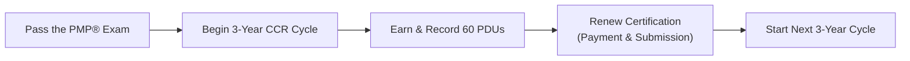

## 39.3 Post-Exam Steps and Continuing Certification

Earning the Project Management Professional (PMP)® credential is a significant milestone in any project manager’s career. The moment you see your “Congratulations, you have passed!” notice, a world of opportunity opens before you. Yet, passing the exam is only the beginning of your journey. This section will guide you through the immediate steps to take after successfully passing the PMP® exam as well as provide an in-depth look at PMI’s Continuing Certification Requirements (CCR) program. Maintaining an active PMP® certification requires ongoing professional development and active engagement with the project management community. By understanding the process up front, you can ensure your hard-earned credential remains valid and influential throughout your career.

---

### Recognizing Your Achievement and Next Steps

#### Confirming Your PMP® Status

Once you pass the PMP® exam, the testing center (or online proctor) will typically provide a printed report of your result. Shortly thereafter, PMI will send you an official email confirming that you have successfully passed. This email will include key details such as:

• Your PMP® Certification Number.  
• Instructions for accessing your Certification Management Account on the PMI website.  
• Information on how to claim your digital badge and certificate.  

Be sure to keep this email for your records and follow the instructions carefully to finalize your certification.

#### Accessing Your Digital Certificate and Badge

PMI issues a digital certificate and offers a digital badge via reputable third-party platforms, allowing you to share your achievement easily on social media and professional networking sites. By showcasing your digital badge on your LinkedIn profile, email signature, or personal website, you can visually substantiate your PMP® expertise while enhancing your professional brand.

#### Updating Your Professional Profiles

You have worked diligently to earn your PMP® credential, so don’t be modest—update your email signature, résumé, and LinkedIn profile:

• Add “PMP®” after your name to signal your newly-earned status.  
• Mention the certification in the “Licenses & Certifications” section of LinkedIn.  
• Share a post announcing your success to your professional network.  

Employers and colleagues often pay close attention to official certifications and endorsements, which can position you favorably for new opportunities.

---

### Understanding PMI’s Continuing Certification Requirements (CCR) Program

Your PMP® certification remains valid for a three-year cycle. To renew your certification at the end of each cycle, you must demonstrate ongoing professional development by earning a specified number of Professional Development Units (PDUs). These PDUs are measured against PMI’s Talent Triangle, ensuring you are continuously expanding and refining your skills in key areas.

PMI’s Talent Triangle has evolved to address the changing demands of the profession. The latest model typically emphasizes three dimensions:

• Ways of Working (Technical Project Management)  
• Power Skills (Leadership)  
• Business Acumen (Strategic and Business Management)  

Although the distribution of PDUs you must earn can change over time, the current requirement for PMP® holders is to accrue 60 PDUs within each three-year certification cycle.

---

### The 3-Year CCR Cycle at a Glance

Below is a high-level illustration of how the three-year CCR cycle flows for most PMP® holders:

1. Pass the exam. Your CCR cycle clock starts ticking immediately.  
2. Accumulate at least 60 PDUs over the next three years.  
3. Submit your renewal application (including applicable fees).  
4. Begin the next 3-year cycle once your certification is renewed.  

Staying mindful of the CCR cycle timeline will help you avoid late fees and any risk of losing your certification status.

---

### Types of Professional Development Units (PDUs)

PDUs are broken into two primary categories: Education and Giving Back. PMI recognizes that both ongoing education and industry engagement are crucial for professional growth.

#### Education PDUs

Education PDUs involve learning opportunities that expand or deepen your project management knowledge. These can include:

• Attending training courses or webinars.  
• Completing online courses through PMI-approved providers.  
• Reading professional books or articles relevant to project management.  
• Watching educational videos from credible sources, such as PMI’s resource library.  
• Participating in industry conferences and workshops.  

PMI usually requires a minimum number of Education PDUs spread across the three components of the Talent Triangle. For instance, you may need to garner at least eight Education PDUs in each dimension (Ways of Working, Power Skills, Business Acumen) to maintain a balanced skill update.

#### Giving Back PDUs

Giving Back PDUs recognize contributions you make to the project management community, such as:

• Volunteering for PMI chapters, committees, or community events.  
• Creating content—writing articles, blog posts, or white papers that advance the field.  
• Presenting at project management events or teaching project management courses.  
• Mentoring or coaching other aspiring professionals.  
• Engaging in professional service roles that significantly support project management.  

“Giving Back” activities enrich the entire profession, while simultaneously helping you to refine leadership skills and expand your network.

---

### How to Earn and Track PDUs

Maintaining a record of your PDUs can be surprisingly simple if you develop the habit early. You can log your PDUs in two main ways:

1. **Through PMI’s Online Portal (CCRS system):**  
   Log in to your account on the PMI.org website, navigate to the “Continuing Certification Requirements” or “Maintain Your Certification” link, and submit your PDU claims. Many education providers will automatically submit PDUs on your behalf if they are PMI Registered Education Providers (R.E.P.s).  
2. **Manually Logging Activities:**  
   For conferences, volunteer work, mentoring, or less formal learning experiences, you can enter the details in the online portal, including dates, activity descriptions, the number of hours engaged, and how the activity contributed to your project management knowledge.

Be sure to provide accurate documentation, as PMI retains the right to audit your PDU claims at any time during or after your certification cycle.

---

### Renewing Your Certification

#### Renewal Application and Fees

Once you hit the 60-PDU threshold or have enough PDUs by the end of your three-year cycle, you will need to:

• Complete the online renewal application at PMI.org.  
• Pay the renewal fee, which may vary for PMI members and non-members.  
• Accept PMI’s Code of Ethics and Professional Conduct.  

Expect an email confirmation once your renewal is processed. At this point, your three-year credential cycle resets, and you continue with your next round of professional growth.

#### Grace Period and Credential Suspense

PMI offers a one-year suspension period should you fail to meet the PDU requirement before your cycle ends. During suspension, you cannot refer to yourself as a PMP® in good standing. However, you may still earn PDUs to regain active status. If you fail to meet the requirements by the end of the suspension period, your certification will expire, and you may need to go through the entire exam process again if you wish to reclaim your PMP® status.

---

### Strategies for Ongoing Professional Growth

#### Aligning PDU Activities with Career Goals

Instead of earning PDUs arbitrarily, consider aligning your professional development activities with your career aspirations. For example, if you aspire to move into an Agile coaching role, target educational opportunities in Agile frameworks, product development, or facilitation skills.

#### Leveraging Local PMI Chapters and Communities of Practice

Your local PMI chapter can be an invaluable resource for acquiring PDUs and networking. Chapters often host monthly events, workshops, and volunteer opportunities. You can learn from seasoned project managers, share success stories or challenges, and collect PDUs in the process. Additionally, many global online communities of practice exist where members share challenges, best practices, templates, and tools.

#### Attending Industry Conferences and Seminars

Major project management conferences—like PMI Global Summit or regional PMI events—often offer an array of educational sessions. These events allow you to earn multiple PDUs in a short time, exposing you to emerging trends in project management, technology, and leadership practices. Many conferences also offer special sessions or discounts for PMI members.

#### Engaging in Mentorship or Coaching

Serving as a mentor can be a powerful way to earn “Giving Back” PDUs while refining your leadership and communication skills. By guiding a junior project manager or a team member, you reinforce your own knowledge of methodology, stakeholder management, conflict resolution, and many other soft and hard skills.

---

### Best Practices for Maintaining Certification Momentum

1. **Plan Your PDUs Early:**  
   Create a PDU roadmap at the start of each certification cycle by estimating the courses, events, or volunteer activities you plan to complete every year. Spacing out your efforts prevents a last-minute scramble at the end of the three-year window.

2. **Diversify Learning Methods:**  
   Cultivate a mix of formal courses, self-study, volunteering, and practical project experiences. This diversity keeps you engaged and supports whole-person development in alignment with PMI’s Talent Triangle.

3. **Document as You Go:**  
   Whenever you attend a training or volunteer, briefly update your PDU log on the PMI website. This practice will reduce administrative burden when renewal time arrives.

4. **Stay Current on PMI Updates:**  
   PMI occasionally updates certification renewal requirements to match industry evolution. Keep an eye on official PMI announcements. Resist the temptation to assume your knowledge of PDU rules is enough; a small requirement shift can significantly impact your renewal plan.

5. **Budgeting for Professional Development:**  
   Include PDU-earning activities in your personal or organizational budget to ensure you have the financial resources available for conferences, courses, or specialty certifications. Some employers subsidize these costs.

---

### Common Pitfalls and How to Avoid Them

• **Procrastination:** Waiting to earn PDUs until the last few months of the cycle can leave you scrambling for suitable events or courses. Start acquiring PDUs soon after passing the exam.  
• **Neglecting the Talent Triangle Balance:** Ensure you allocate PDUs appropriately across the three main categories. Missing the minimum requirement in any area can result in renewal delays.  
• **Underreporting or Overreporting:** Always provide accurate details for your PDU claims. Keep any course completion certificates or volunteer confirmations in case your log is audited.  
• **Sporadic Engagement:** Taking a two-year hiatus from professional development might lead to skill stagnation and hamper career growth. Regular, consistent learning is more effective.  

---

### Case Example: Mentoring to Earn and Give Back PDUs

To illustrate how easily you can contribute to the profession while gaining PDUs, consider the example of “Alex.” Shortly after obtaining the PMP® credential, Alex decided to mentor two colleagues who were preparing for the same exam. They met weekly for three months, reviewing practice exams, clarifying knowledge gaps, and sharing study strategies. As a result:

• Alex recorded the mentoring sessions under “Giving Back” PDUs.  
• The colleagues benefited from real-time support and guidance.  
• The overall project management community improved through better-prepared PSP (Project Support Professionals) who might eventually become PMPs themselves.  

By the end of those three months, Alex had accrued a substantial portion of “Giving Back” PDUs for the certification cycle, while honing leadership and coaching skills.

---

### Further Development and Career Opportunities

Beyond earning PDUs, many PMP® holders broaden their knowledge through additional certifications or advanced degrees. You might explore:

• PMI Agile Certified Practitioner (PMI-ACP)® to formalize your Agile expertise.  
• Disciplined Agile® certifications to gain more specialized guidance on tailoring hybrid methods.  
• Certified ScrumMaster (CSM)® or similar Agile-based credentials from other professional bodies.  
• Leadership and executive education programs focusing on strategic planning or organizational change (see Chapter 30: Organizational Change Management for deeper insights).  

These credentials and continuing education experiences synergize with your PMP® foundation, fostering a robust project management skill set that will stand out in competitive environments.

---

### References for Ongoing Learning

• **PMI.org – Official CCR Handbook:** The primary source on how to earn and record PDUs.  
• **PMI Standards and Publications:** Keep an eye on new editions of PMBOK® Guide or agile standards.  
• **Local PMI Chapters:** Great places to find specialized chapter-led events and resources.  
• **Industry Journals and Conferences:** Publications like PM Network® and events like PMI Global Summit provide valuable insights and PDUs.  

By connecting regularly with PMI’s resources and other professional communities, you are less likely to miss important updates and can proactively shape your career development.

---

### Conclusion

Passing the PMP® exam is an achievement to celebrate, yet it is an entry point to continuous learning, networking, and professional development. Maintaining your PMP® status, through PMI’s CCR program, ensures your knowledge remains relevant and your skills remain sharp. By implementing a methodical approach to logging PDUs, leveraging volunteering opportunities, and aligning your development plan with your career path, you can enjoy a sustainable and enriching journey as a certified project management professional.

Remember that each step you take in continuing certification not only strengthens your career prospects but also contributes to the collective expertise of the global project management community. Through active engagement in PDUs and a willingness to share your skills with others, you become part of a dynamic and growing profession—one that transforms businesses, industries, and lives.

---

## Test Your Knowledge: Post-Exam Action Plan and PMP CCR Quiz



### After passing the PMP® exam, which of the following is an immediate next step?

- [ ] Renewing your certification by earning 60 PDUs
- [x] Accessing your digital badge and updating professional profiles
- [ ] Applying for a new PMI membership
- [ ] Entering a one-year suspension period

> **Explanation:** Right after you pass the exam, PMI will provide a digital badge and certificate. You should also promptly update your LinkedIn profile, résumé, and email signature to showcase your newly earned credential.

### Which of the following is NOT a recommended method for earning “Education” PDUs?

- [ ] Attending a PMI Registered Education Provider (R.E.P.) course
- [ ] Watching instructional webinars on new project management trends
- [ ] Completing self-directed study via industry publications
- [x] Logging volunteer hours as a project management mentor

> **Explanation:** Mentoring is categorized under “Giving Back” PDUs. Education PDUs encompass formal and informal learning methods such as webinars, courses, or reading activities.

### What is the approximate length of each PMP® certification cycle according to PMI’s CCR program?

- [ ] One year
- [x] Three years
- [ ] Five years
- [ ] Six months

> **Explanation:** The PMP® certification is valid for a three-year cycle, after which you must demonstrate 60 PDUs to maintain your credential.

### Which aspect of PMI’s Talent Triangle focuses on leadership and interpersonal skills?

- [ ] Ways of Working
- [x] Power Skills
- [ ] Business Acumen
- [ ] Technical Proficiency

> **Explanation:** The “Power Skills” dimension emphasizes leadership attributes, communication, negotiation, and other interpersonal competencies crucial for effective project management.

### Which statement best describes the role of volunteer activities in the CCR process?

- [x] They qualify for “Giving Back” PDUs and allow you to contribute to the profession
- [ ] They are mandatory and must total 30 PDUs each cycle
- [x] They can help develop leadership skills while benefiting others
- [ ] They cannot be applied more than once toward renewal

> **Explanation:** Volunteer activities fall under “Giving Back” PDUs. Through volunteering, you not only give back to the profession but also refine your leadership and strategic thinking skills.

### What is one reason for logging PDUs continuously rather than waiting until the end of the cycle?

- [x] It helps avoid a last-minute rush to find suitable PDU opportunities
- [ ] It doubles the PDU credits you earn
- [ ] It removes the need to pay the renewal fee
- [ ] It automatically extends your certification beyond three years

> **Explanation:** If you keep track of your PDUs throughout the cycle, you’ll distribute your learning activities more evenly and prevent a stressful scramble near the renewal deadline.

### In which portal do you typically record and track your PDUs?

- [x] PMI’s Continuing Certification Requirements System (CCRS)
- [ ] The official PMBOK® Guide
- [x] PMI’s account dashboard (Maintain Your Certification section)
- [ ] A separate, third-party volunteer platform only

> **Explanation:** You generally log in to your account on the PMI.org website (the CCRS system) to manage your PDU activities, whether they are Education or Giving Back. Some providers can submit PDUs on your behalf, but you can also enter them manually.

### If a PMP® holder fails to meet PDU requirements before the certification expires, what happens during the following 12 months?

- [x] The certification enters a suspension period
- [ ] The certification is permanently revoked
- [ ] The holder must repay all exam fees
- [ ] PMI issues a partial extension without penalty

> **Explanation:** If you have not accrued sufficient PDUs by the end of your three-year cycle, your certification enters a one-year suspension period. During that time, you cannot market yourself as a PMP® in good standing.

### Which of the following is an example of a valid “Giving Back” activity?

- [x] Presenting at a local PMI chapter event on best practices in risk management
- [ ] Completing online courses on Agile topics
- [ ] Watching a series of leadership coaching webinars
- [ ] Attending a project management conference session

> **Explanation:** Presenting or speaking at a PMI-sponsored event is considered “Giving Back,” as it involves sharing knowledge and expertise with the professional community.

### Is it possible to lose your PMP® credential permanently if you do not renew in time?

- [x] True
- [ ] False

> **Explanation:** If you do not earn sufficient PDUs or fail to renew before your suspension period ends, your certification will expire, and you may need to retake the exam to regain your PMP® credential.



---

## PMP Mastery: 1500+ Hard Mock Exams with Full Explanations 

Looking to crush the PMP exam with confidence? Dive deep into 6 rigorous mock exams totaling 1500+ advanced-level questions, each accompanied by clear, step-by-step explanations. Hone your test-taking strategies, master complex topics, and build the resilience you need on exam day. Perfect for serious PMs aiming beyond fundamentals.

Enroll now:  
[PMP Mastery: 1500+ Hard Mock Exams with Exceptional Clarity & Full Explanations](https://www.udemy.com/course/pmp-2025/?referralCode=CF83A54BC86BE27F9AFE)

_Disclaimer: This course is not endorsed by or affiliated with the PMI examination authority. All content is provided purely for educational and preparatory purposes._
