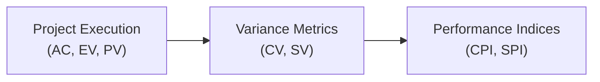

## 40.1 Key Acronyms and Definitions

Project Management draws upon a rich tapestry of specialized terms and acronyms. Many of these acronyms appear repeatedly in the PMBOK® Guide, PMP® Exam Content Outline, Agile Practice Guide, and various project management resources. Mastering them is essential to ensure you can interpret exam questions accurately and communicate effectively on your projects.

In this section, you will find a comprehensive listing of the most critical acronyms and definitions. We will walk through each acronym’s meaning, contextual usage, challenges, and practical tips. Where applicable, you'll find references to other parts of this book for a deeper dive. By familiarizing yourself with these acronyms, you will be better equipped to navigate both the PMP® exam and your everyday project work.

---

### A Quick Note on Structure
• Acronym: The short form commonly used in project management conversations and documentation.  
• Definition: A concise explanation of the term.  
• Practical Usage: How to handle or interpret the concept in real-world projects.  
• Possible Pitfalls: The most common mistakes or misunderstandings regarding the acronym and its meaning.  
• Reference: Where you can learn more (within this book or other recommended sources).

---

## AC (Actual Cost)
• Definition: The total costs actually incurred for work completed on a project during a specific time period.  
• Practical Usage: AC is used in Earned Value Management (EVM) to compare what has been spent against the value of work performed (EV) and the planned budget (PV).  
• Possible Pitfalls: Confusing AC with EV (Earned Value) or conflating AC with the entire project budget. AC refers to money already spent on a given scope of work, not future expenditures.  
• Reference: For related formulas, see Chapter 37: Mastering Key Formulas and Calculations.

---

## BAC (Budget at Completion)
• Definition: The total planned budget authorized for completing the project’s work.  
• Practical Usage: BAC is central to cost management because it represents the sum of all cost estimates over the life of the project. It is also used in EVM metrics (e.g., EAC calculations).  
• Possible Pitfalls: Not updating BAC when scope changes or ignoring the need to re-baseline if significant cost variances occur.  
• Reference: Chapter 19: Cost Management, where budgeting strategies are outlined.

---

## BOE (Basis of Estimate) 
• Definition: The justification, assumptions, and calculations behind any cost or time estimate.  
• Practical Usage: Helpful in explaining to stakeholders how estimates were derived, what assumptions were made, and which data sources were used.  
• Possible Pitfalls: Failing to document or communicate the rationale can lead to misunderstandings and disputes about the validity of estimates.  
• Reference: Chapter 18: Schedule Management and Chapter 19: Cost Management for detailed estimation methods.

---

## CAPEX (Capital Expenditure)
• Definition: Funds used by an organization to acquire or upgrade physical assets such as equipment or property.  
• Practical Usage: Distinguishing between CAPEX and OPEX (Operating Expenditure) is vital in budgeting because of differing tax treatments and accounting considerations.  
• Possible Pitfalls: Mixing CAPEX with OPEX, which can distort project cost reports and lead to inaccurate financial analysis.  
• Reference: Chapter 19: Cost Management for integrating CAPEX and OPEX in project budgets.

---

## CC (Control Chart)
• Definition: A quality management tool used to monitor process variation over time and determine whether a process is stable or in control.  
• Practical Usage: Helps identify trends, shifts, or out-of-control conditions in performance metrics. Often used in projects emphasizing continuous improvement.  
• Possible Pitfalls: Misinterpretation of control limits versus specification limits, leading to incorrect decisions about process capability.  
• Reference: Chapter 20: Quality Management (Section 20.1: Planning Quality: Tools and Processes).

---

## CCB (Change Control Board)
• Definition: A formally constituted group responsible for reviewing, evaluating, approving, delaying, or rejecting changes to the project.  
• Practical Usage: Ensures all changes undergo a consistent, rigorous process to manage scope, schedule, cost, and quality impacts.  
• Possible Pitfalls: Delays caused by inefficient processes or failing to ensure the right stakeholders serve on the CCB.  
• Reference: Chapter 15: Integration Management, specifically Integrated Change Control.

---

## CPI (Cost Performance Index)
• Definition: A ratio measuring cost efficiency on a project: CPI = EV ÷ AC.  
• Practical Usage: A CPI above 1.0 indicates favorable cost performance, while below 1.0 indicates cost overruns.  
• Possible Pitfalls: Focusing solely on the CPI without investigating the root causes behind cost efficiency or inefficiency.  
• Reference: Chapter 13: Measurement Performance Domain for performance metrics.

---

## CR (Change Request)
• Definition: A formal request to expand, reduce, or modify project scope, deliverables, or processes.  
• Practical Usage: All CRs should be documented, logged, and processed according to the project’s change control procedures.  
• Possible Pitfalls: Approving CRs informally or ignoring the potential impact on project constraints.  
• Reference: Chapter 15: Integration Management, particularly around Integrated Change Control.

---

## CV (Cost Variance)
• Definition: A measure of cost performance on a project: CV = EV – AC.  
• Practical Usage: Indicates whether the work performed costs more or less than planned at any point in time.  
• Possible Pitfalls: Confusing positive versus negative variances. A positive CV means the project is under budget (favorable), whereas a negative CV means cost overruns.  
• Reference: Chapter 13: Measurement Performance Domain for variance analysis.

---

## DOD (Definition of Done)
• Definition: A shared understanding of what it means for a piece of work (e.g., user story, product increment) to be considered complete.  
• Practical Usage: In Agile environments, the DOD ensures quality and completeness criteria are met for each increment.  
• Possible Pitfalls: Having a vague or incomplete DOD can lead to unverified acceptance criteria and lower product quality.  
• Reference: Chapter 24: Agile Foundations and the Agile Practice Guide.

---

## EAC (Estimate at Completion)
• Definition: A projection of the total cost of the project upon completion, based on current performance data.  
• Practical Usage: EAC is continuously recalculated when project performance deviates from plan.  
• Possible Pitfalls: Using the wrong EAC formula or ignoring the need to re-estimate EAC when the project environment changes significantly.  
• Reference: Chapter 19: Cost Management and Chapter 37: Mastering Key Formulas and Calculations.

---

## EF (Early Finish)
• Definition: In a project schedule network diagram, EF is the earliest possible time an activity can finish without delaying subsequent activities, given its start and duration.  
• Practical Usage: EF is used in Critical Path Method (CPM) calculations to determine scheduling flexibility.  
• Possible Pitfalls: Confusing EF with early start (ES) or miscalculating EF when there are constraints and dependencies that shift task start times.  
• Reference: Chapter 18: Schedule Management.

---

## EMV (Expected Monetary Value)
• Definition: A risk management technique used in decision-tree analysis to quantify potential outcomes based on probability and impact.  
• Practical Usage: Helps in prioritizing risks and deciding whether to accept or mitigate high-exposure risks by applying probability-weighted monetary values.  
• Possible Pitfalls: Oversimplifying complex risk variables or not updating EMV calculations as project assumptions change.  
• Reference: Chapter 14: Uncertainty Performance Domain and Chapter 22: Risk and Uncertainty Management (Revisited).

---

## EV (Earned Value)
• Definition: The measure of work performed expressed in terms of the budget authorized for that work.  
• Practical Usage: EV is central to Earned Value Management and is compared to planned value (PV) and actual cost (AC) to assess project performance.  
• Possible Pitfalls: Failing to adequately define the baseline or not tracking EV consistently at each reporting period, leading to inaccurate performance metrics.  
• Reference: Chapter 13: Measurement Performance Domain.

---

## EVM (Earned Value Management)
• Definition: A project management technique that integrates scope, schedule, and cost to measure project performance and progress.  
• Practical Usage: EVM provides objective performance data and forecasts by comparing EV, PV, and AC.  
• Possible Pitfalls: Implementing EVM too rigidly in highly adaptive or Agile projects, or not tailoring EVM to the size/complexity of the project.  
• Reference: Chapter 13: Measurement Performance Domain, Chapter 19: Cost Management.

---

## FFP (Firm Fixed Price)
• Definition: A contract type where the buyer pays the seller a set amount regardless of the seller’s costs.  
• Practical Usage: Commonly used when project requirements are well-defined and cost risk is primarily borne by the seller.  
• Possible Pitfalls: Overlooking changes in scope that can make FFP unattractive for sellers, potentially leading to disputes.  
• Reference: Chapter 23: Procurement Management.

---

## IRR (Internal Rate of Return)
• Definition: The discount rate that makes the net present value (NPV) of all cash flows from a particular project equal to zero.  
• Practical Usage: Used in project selection to compare profitability across multiple potential investments. A higher IRR typically indicates a more attractive project.  
• Possible Pitfalls: IRR may be misleading if cash flows are non-conventional or if the project has multiple changes in cash flow sign.  
• Reference: Chapter 28: Aligning Projects with Organizational Strategy for project selection methods.

---

## KPI (Key Performance Indicator)
• Definition: A quantifiable measure used to evaluate the success of an organization, project, or specific activity against objectives.  
• Practical Usage: KPIs help track progress on critical success factors, such as on-time delivery, budget adherence, or quality metrics.  
• Possible Pitfalls: Selecting too many KPIs or focusing on lagging indicators without balancing them with leading indicators.  
• Reference: Chapter 13: Measurement Performance Domain for KPI selection and monitoring.

---

## OPA (Organizational Process Assets)
• Definition: Plans, processes, policies, procedures, and knowledge bases that are specific to, and used by, an organization.  
• Practical Usage: Projects should leverage OPAs to avoid reinventing the wheel; templates, historical data, and lessons learned are common examples.  
• Possible Pitfalls: Not updating OPAs with current lessons learned, which weakens the organization’s collective knowledge.  
• Reference: Chapter 28: Aligning Projects with Organizational Strategy, discussing how OPAs guide project alignment and execution.

---

## OPEX (Operating Expenditure)
• Definition: Ongoing costs for running a product, service, or system, such as salaries, rent, and utilities.  
• Practical Usage: Important to distinguish from CAPEX when planning budgets for projects that have both acquisition costs and maintenance/operational costs.  
• Possible Pitfalls: Underestimating OPEX can lead to budget shortfalls and difficulties in operational handover.  
• Reference: Chapter 19: Cost Management.

---

## PERT (Program Evaluation and Review Technique)
• Definition: A method used to estimate project duration by applying a weighted average of optimistic, pessimistic, and most likely activity duration estimates.  
• Practical Usage: Particularly useful in uncertain or research-oriented projects where activity times are difficult to predict.  
• Possible Pitfalls: Relying solely on PERT without continuous review can lead to overly optimistic schedules if the range of estimates is too narrow.  
• Reference: Chapter 18: Schedule Management (Section 18.4: Controlling the Schedule).

---

## PMI (Project Management Institute)
• Definition: A global nonprofit professional organization for project management offering standards, certifications (including the PMP®), and research.  
• Practical Usage: PMI sets widely recognized guidelines and best practices. It also offers continuing education and professional development opportunities.  
• Possible Pitfalls: Equating PMI with a regulatory body. PMI is a standards and certification organization, not a regulator of the profession.  
• Reference: Official PMI website (www.pmi.org).

---

## PMIS (Project Management Information System)
• Definition: A standardized set of automated and manual tools used for managing project information across various knowledge areas.  
• Practical Usage: PMIS typically includes scheduling software, collaboration platforms, risk registers, dashboards, etc. Helps in integrated project tracking.  
• Possible Pitfalls: Over-reliance on PMIS can create blind spots if the system is not regularly updated or if data inputs are inaccurate.  
• Reference: Chapter 15: Integration Management (Section 15.1: Project Charter and Project Management Plan) and Chapter 41: Reference Charts and Templates.

---

## PMP (Project Management Professional)
• Definition: A globally recognized certification offered by the PMI, signifying mastery of project management best practices and principles.  
• Practical Usage: Demonstrates a command of standardized project management methodologies and commitment to ongoing professional development.  
• Possible Pitfalls: Viewing PMP certification as a one-time milestone rather than an ongoing pursuit of excellence and maintaining PDUs (Professional Development Units).  
• Reference: Chapter 2: PMP® Exam Overview.

---

## PV (Planned Value)
• Definition: The authorized budget assigned to scheduled work.  
• Practical Usage: Compared with EV to determine schedule variance (SV) and with AC for variance analyses in EVM.  
• Possible Pitfalls: Not updating PV when project scope or schedule baselines change, leading to inaccurate progress measurement.  
• Reference: Chapter 13: Measurement Performance Domain, Earned Value Analysis.

---

## RACI (Responsible, Accountable, Consulted, Informed)
• Definition: A responsibility assignment matrix to clarify stakeholder roles in tasks or deliverables.  
• Practical Usage: Ensures accountability and avoids confusion about who owns each project activity, who is consulted for input, and who should be kept informed.  
• Possible Pitfalls: Not maintaining the RACI chart as the project evolves or failing to clarify the difference between “responsible” and “accountable.”  
• Reference: Chapter 7: Stakeholder Performance Domain and Chapter 8: Team Performance Domain.

---

## RAM (Responsibility Assignment Matrix)
• Definition: A grid that shows the project resources assigned to each work package. RACI is one of its common forms.  
• Practical Usage: Helps teams understand their roles, especially in cross-functional or matrixed organizations.  
• Possible Pitfalls: Creating the RAM but not using it regularly to manage accountability or update it when resource allocations change.  
• Reference: Chapter 21: Resource Management.

---

## ROI (Return on Investment)
• Definition: A financial metric used to evaluate the profitability or efficiency of an investment by comparing net gains to the initial investment cost.  
• Practical Usage: Utilities strategic decision-making and project selection, alongside other techniques like NPV and IRR.  
• Possible Pitfalls: Not considering intangible benefits or longer-term costs that may affect the overall ROI.  
• Reference: Chapter 28: Aligning Projects with Organizational Strategy, focusing on project selection methods.

---

## SPI (Schedule Performance Index)
• Definition: A ratio measuring schedule efficiency on a project: SPI = EV ÷ PV.  
• Practical Usage: An SPI above 1.0 indicates that more work has been completed than planned, while below 1.0 indicates a schedule delay.  
• Possible Pitfalls: Over-relying on SPI without engaging in root cause analysis or ignoring that a project can be ahead of schedule but still over budget.  
• Reference: Chapter 13: Measurement Performance Domain for EVM.

---

## SOW (Statement of Work)
• Definition: A narrative description of products, services, or results to be delivered by the project, often used in procurement.  
• Practical Usage: Defines the detailed scope and clarifies requirements for vendors or internal teams, setting the foundation for contracts or agreements.  
• Possible Pitfalls: Writing an ambiguous SOW can lead to scope disputes, underperformance, or misalignment of expectations.  
• Reference: Chapter 23: Procurement Management (Section 23.1: Contract Types and Vendor Selection).

---

## T&M (Time and Materials)
• Definition: A contract type that pays the seller for the cost of direct labor (time) at pre-negotiated rates, plus the cost of materials, plus a fixed fee or markup.  
• Practical Usage: Useful when scope is not well-defined or when agility is essential, as it places risk on the buyer but allows flexibility to adapt scope.  
• Possible Pitfalls: Costs can spiral if the scope expands without strong oversight and if the buyer does not closely monitor work hours and materials.  
• Reference: Chapter 23: Procurement Management.

---

## TCPI (To-Complete Performance Index)
• Definition: A calculation used in EVM to determine the future performance needed to meet a management goal, such as finishing on budget:  
  TCPI = (BAC – EV) ÷ (BAC – AC) or (EAC – EV) ÷ (EAC – AC) (depending on whether you use the original budget or the revised estimate).  
• Practical Usage: Offers insight into whether the project team must substantially improve or can maintain cost performance to meet the target.  
• Possible Pitfalls: Using TCPI without analyzing schedule or scope changes can lead to blind spots. The metric is only one facet of project performance.  
• Reference: Chapter 37: Mastering Key Formulas and Calculations.

---

## WBS (Work Breakdown Structure)
• Definition: A hierarchical decomposition of the total scope of work to be carried out by the project team.  
• Practical Usage: Provides a structured view of how deliverables sub-divide into manageable work packages.  
• Possible Pitfalls: Not detailing a WBS at an appropriate level or mixing up deliverables with tasks in the WBS.  
• Reference: Chapter 17: Scope and Requirements Management.

---

## WIP (Work in Progress)
• Definition: Any tasks, features, or deliverables not yet completed but currently in progress.  
• Practical Usage: In Agile, limiting WIP is essential for reducing multitasking and bottlenecks.  
• Possible Pitfalls: Lack of WIP limits can prompt task-switching, reduce productivity, and mask workflow inefficiencies.  
• Reference: Chapter 25: Agile Frameworks and Methodologies, particularly Kanban practices.

---

## Mermaid Diagram: Earned Value Relationships

Below is a simple flowchart illustrating how core EVM values lead to variance measurements and performance indices:

Use this diagram in conjunction with the acronyms (EV, AC, PV, CV, SV, CPI, SPI) to visualize how the performance data flows. By continuously monitoring these metrics, project managers can diagnose trends early and propose corrections to mitigate risks of cost overruns or schedule slippage.

---

### Best Practices for Managing Acronym Overload

• Maintain a Project Glossary: Include all relevant acronyms and simple definitions in your project management plan. See Chapter 15 for tips on integrating the glossary into your documentation.  
• Align with Stakeholders: Before deploying specialized acronyms, ensure stakeholders have a shared understanding to avoid communication gaps.  
• Update Regularly: As your project evolves, so do the needs for different metrics, contract types, or reporting structures. Keep your acronym glossary in sync with these changes.  
• Leverage Tools: PMIS solutions often have built-in glossaries or quick-reference tools for acronyms. See Chapter 41 for recommended templates.

---

### Common Pitfalls and Proactive Strategies

• Pitfall: Using Acronyms Incorrectly  
  • Strategy: Always confirm the meaning in the project context. For example, “AC” might stand for “Actual Cost” in cost management, but in other contexts it could represent something else entirely.

• Pitfall: Overcomplicating Communication  
  • Strategy: Use acronyms sparingly in high-level stakeholder communications. Ensure you clearly define them the first time they are used.

• Pitfall: Inconsistent Interpretation  
  • Strategy: Provide training or quick reference materials for your team. Revisit the definitions in sprint reviews, status meetings, and lessons-learned sessions.

• Pitfall: Letting the Glossary Become Outdated  
  • Strategy: Tie glossary maintenance to your project change control process. Any new term or project artifact must be reviewed and appended.

---

### Real-World Case: Confusion Over EVM Terms

A large multinational telecom project encountered major budget issues when multiple project locations misunderstood the difference between “AC” and “BAC.” Some stakeholders believed “Actual Cost” was the same as “Budget at Completion,” leading to confusion about how much funding remained. This misunderstanding caused incorrect financial reporting and risked severe cost overruns. Once identified, the PMO instituted brief re-orientations on EVM fundamentals, which clarified all terms and realigned cost tracking. This underscores the criticality of a well-maintained and properly communicated glossary of acronyms within any complex project environment.

---

### Additional References

• PMBOK® Guide (Seventh Edition) – The standard reference for many of these acronyms.  
• Agile Practice Guide – For Agile-focused acronyms such as DOD and WIP.  
• Chapter 37: Mastering Key Formulas and Calculations – In-depth coverage of EVM and risk formulas.  
• Chapter 41: Reference Charts and Templates – Offers practical templates and diagrams you can adapt for your project.

---

## Quiz: Test Your Knowledge of Key Project Management Acronyms



### What does "SPI" stand for in Earned Value Management?

- [ ] Schedule Performance Insight  
- [x] Schedule Performance Index  
- [ ] Scope Performance Indicator  
- [ ] Scope Performance Index  

> **Explanation:** SPI is the Schedule Performance Index, used to measure schedule efficiency by comparing Earned Value (EV) to Planned Value (PV).

### Which of the following best describes "BAC"?

- [ ] The amount invoiced by the seller  
- [x] The total planned budget authorized for the project  
- [ ] A method for forecasting resource usage  
- [ ] A metric for measuring scope completion  

> **Explanation:** BAC (Budget at Completion) is the total authorized budget for the entire scope of the project.

### In a RACI matrix, the letter "A" signifies:

- [ ] Accountable  
- [x] Approver  
- [ ] Assigned  
- [ ] Actionable  

> **Explanation:** Different organizations interpret RACI slightly differently, but the common usage is R = Responsible, A = Accountable, C = Consulted, I = Informed. While some organizations swap “A” and “R,” in the classic model, “A” stands for “Accountable.”

### What is the primary usage of the acronym "DOD" in Agile?

- [x] It represents the Definition of Done, clarifying when a backlog item is complete  
- [ ] It indicates the Division of Duties, used to manage responsibilities  
- [ ] It stands for Developer On Duty, specifying who handles urgent tasks  
- [ ] It refers to Delivery of Deliverables in iteration reviews  

> **Explanation:** DOD (Definition of Done) ensures each user story or backlog item meets agreed quality and completion criteria before being considered complete.

### What is the primary purpose of the CCB (Change Control Board)?

- [x] To review and approve or reject change requests in a formal process  
- [ ] To manage day-to-day tasks  
- [x] To maintain cost control by adjusting budgets  
- [ ] To provide coaching and mentoring to team members  

> **Explanation:** The CCB’s key function is to ensure all requested changes are vetted, approved, or rejected according to the project’s governance and change control plan.

### Which statement about OPA (Organizational Process Assets) is true?

- [x] They include historical project files, templates, and lessons learned  
- [ ] They are strictly limited to financial data and budgets  
- [ ] They are created by the sponsor for each new project  
- [ ] They constitute intangible cultural values only  

> **Explanation:** OPAs are a broad set of organizational resources—document repositories, processes, and guidelines—that influence a project’s success.

### Which metric indicates the rate at which resources are being used compared to the budget?

- [x] CPI (Cost Performance Index)  
- [ ] SPI (Schedule Performance Index)  
- [x] CR (Change Request)  
- [ ] IRR (Internal Rate of Return)  

> **Explanation:** CPI measures how efficiently project resources (funds) are being used; it compares EV to AC.

### If "AC" exceeds "EV," what does that suggest?

- [x] The project is running over budget  
- [ ] The project is under budget  
- [ ] The schedule needs rebaselining  
- [ ] The project scope changed significantly  

> **Explanation:** AC (Actual Cost) exceeding EV (Earned Value) indicates cost overruns, meaning the project is spending more than the value of the work completed.

### What is the best definition of "EAC" (Estimate at Completion)?

- [x] A projection of the final project costs based on current performance  
- [ ] The final invoice amount for procurement contracts  
- [ ] A penalty fee charged by the vendor for late completion  
- [ ] The allowable overhead cost in project billing  

> **Explanation:** EAC is continually revised to reflect new data about cost performance, forecasting the total project cost at completion.

### In "TCPI" calculations, what element is compared against earned value for future performance requirements?

- [x] BAC or EAC depending on the managerial target  
- [ ] Only the original contract cost  
- [ ] Only the agile user story points  
- [ ] IRR for the project  

> **Explanation:** TCPI can use either BAC (original) or EAC (revised) depending on whether the goal is to meet the original budget or the new estimate.  



---

## PMP Mastery: 1500+ Hard Mock Exams with Full Explanations 

Looking to crush the PMP exam with confidence? Dive deep into 6 rigorous mock exams totaling 1500+ advanced-level questions, each accompanied by clear, step-by-step explanations. Hone your test-taking strategies, master complex topics, and build the resilience you need on exam day. Perfect for serious PMs aiming beyond fundamentals.

Enroll now:  
[PMP Mastery: 1500+ Hard Mock Exams with Exceptional Clarity & Full Explanations](https://www.udemy.com/course/pmp-2025/?referralCode=CF83A54BC86BE27F9AFE)

_Disclaimer: This course is not endorsed by or affiliated with the PMI examination authority. All content is provided purely for educational and preparatory purposes._
