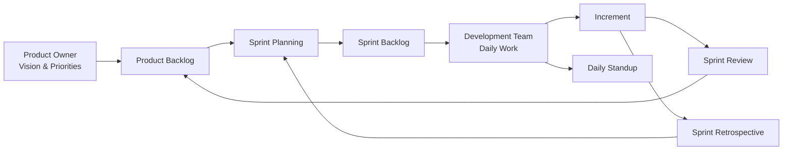

## 40.2 Agile-Specific Terminology

Agile approaches are distinguished by flexibility, frequent feedback loops, and adaptive planning—factors that are increasingly critical in our rapidly changing project environments. Understanding Agile-specific terminology is crucial for PMP® exam success, especially since the exam now integrates agile and hybrid perspectives. This section provides an in-depth look at the fundamental roles, ceremonies, and artifacts you will encounter when studying and applying Agile methods.

Agile—and its most common framework, Scrum—is grounded in the principles of delivering value early, focusing on customer collaboration, and enabling self-organizing teams. As you read through these terms, refer to Chapter 24 (Agile Foundations and the Agile Practice Guide) for background on Agile history and mindset, and Chapter 25 (Agile Frameworks and Methodologies) for a broader comparison of approaches such as Scrum, Kanban, and XP.

Keep in mind that while some terms may vary across Agile frameworks, the concepts remain consistent: empower the team, deliver in small increments, and embrace change.

---

## Core Agile Roles

### Product Owner
The Product Owner (PO) is responsible for maximizing the product’s value by managing and prioritizing the product backlog. This means deciding what features or components should be tackled first and ensuring the product delivers business value. The PO typically:
• Gathers and prioritizes requirements based on business value.  
• Works closely with stakeholders to clarify requirements.  
• Represents customer and end-user interests in daily development decisions.  

Real-World Example: In a software development project for an e-commerce website, the Product Owner might be an internal stakeholder who understands both the technical and market needs. They create and refine user stories, ensuring the team fully grasps what’s needed to improve the online shopping experience.

### Scrum Master
A Scrum Master is a servant leader who advocates for the Scrum process. While not the traditional “project manager,” a Scrum Master removes obstacles, facilitates ceremonies, and ensures that the team adheres to Scrum principles. The primary responsibilities include:
• Coaching the team in Agile values and Scrum events.  
• Shielding the team from external distractions.  
• Monitoring team health and efficiency to help them self-improve.  

Typical Pitfalls: A common pitfall is when Scrum Masters assume a command-and-control style, dictating tasks to the team. This undermines team autonomy and contradicts Scrum’s self-organizing ethos.

### Development Team (or Agile Team)
In Scrum, the Development Team comprises professionals who design, build, and test the product increment. In broader Agile contexts, this is simply “the team.” Key characteristics include:
• Self-organization, deciding how to accomplish goals.  
• Cross-functional capabilities, minimizing silos.  
• Accountability for delivering high-quality increments each iteration.  

Best Practice: Encourage the team to embrace diverse skill sets, ensuring that members can pitch in across different tasks (e.g., coding, testing, UX design) when necessary.

### Agile Coach
In larger organizations or more advanced agile environments, an Agile Coach may be present to guide multiple teams or the entire enterprise in Agile mindset and practices. Responsibilities include:
• Mentoring Scrum Masters, Product Owners, and teams.  
• Providing frameworks for scaling agile (e.g., SAFe®, LeSS).  
• Facilitating organizational buy-in and transformations.  

### Additional Roles in Hybrid Environments
Outside of pure Scrum, certain roles might overlap or be adapted. For instance, some organizations may have separate business analysts, integration specialists, or an “Iteration Manager” in a variant like DSDM or XP. The key is preserving Agile principles of collaboration, continuous improvement, and value-driven prioritization.

---

## Common Agile Ceremonies

Agile ceremonies (or events) provide the structure for planning, alignment, and process improvement. Although specific names and frequencies may differ across frameworks, there are core events frequently encountered on the PMP® exam.

### Sprint Planning
Sprint Planning occurs at the start of each iteration (often called a “sprint” in Scrum). The Product Owner presents the most important items from the product backlog, and the team collaboratively decides how to accomplish them within the sprint. Essential activities include:
• Reviewing the prioritized backlog.  
• Team capacity planning (assessing availability, velocity).  
• Establishing a sprint goal and forming the sprint backlog.  

Pitfall: Overcommitment. Teams often take on more work than they can deliver, resulting in incomplete increments. It’s critical to use historical velocity data or empirical insights to gauge capacity accurately.

### Daily Standup (Daily Scrum)
A quick 15-minute meeting where each team member answers three standard questions:
• What did I complete since the last meeting?  
• What do I plan to complete today?  
• Are there any blockers or impediments?  

Purpose: Ensure transparency among team members, align on daily goals, and identify impediments requiring quick resolution. For distributed teams, consider technology solutions (video conferencing, team messaging) to maintain face-to-face interaction as much as possible.

### Sprint Review
Conducted at the end of a sprint, the team showcases the working increment to stakeholders for feedback. This session helps validate value delivery and discover adaptation needs for the next sprint(s). Activities typically include:
• Demonstration of the product increment.  
• Stakeholder feedback and discussion of upcoming backlog items.  
• Collaborative identification of improvements to product direction.  

Real-World Example: A marketing team might demonstrate new campaign assets or dashboards during a sprint review, gathering stakeholder insights on branding coherence, metrics, or user response. This feedback quickly adapts the marketing strategy for the next iteration.

### Sprint Retrospective
Shortly after the Sprint Review, the team reflects on the sprint’s process and team dynamics to identify opportunities for improvement. Discussion areas often include:
• What went well?  
• What could be improved?  
• Action plans for the next sprint.  

Leverage Tools: Common retrospective techniques include “Start, Stop, Continue,” “Mad, Sad, Glad,” or “5 Whys.” The retrospective fosters continuous improvement and a safe environment for honest discussions.

### Backlog Refinement (Grooming)
Though not an official Scrum event by older definitions, backlog refinement is widely recognized in modern Agile contexts. The Product Owner and team collaborate to:
• Clarify upcoming user stories.  
• Estimate or re-estimate backlog items.  
• Split or merge backlog items that are too large or ambiguous.  

Frequency: Typically once or twice per sprint, ensuring the backlog remains actionable and refined.

---

## Fundamental Agile Artifacts

Artifacts in Agile serve to increase transparency, traceability, and focus. While Scrum identifies a handful of key artifacts, many frameworks share similar components.

### Product Backlog
A prioritized list of desired product features or enhancements, often represented as user stories. It evolves continually, reflecting stakeholders’ changing needs and any new insights the team gains. Key points:
• Maintained solely by the Product Owner, though team collaboration is encouraged.  
• Items are often sized or estimated in story points.  
• Typically visible to all stakeholders for maximum transparency.  

Common Pitfall: Allowing the backlog to become bloated or disorganized. Regular grooming keeps it concise, relevant, and ordered.

### Sprint Backlog
A subset of the product backlog that the team commits to completing within a single sprint. It includes user stories, tasks, or sub-tasks. Goals:
• Provide clarity on what the team plans to deliver in the sprint.  
• Enable micro-level planning for day-to-day tasks.  
• Maintain a direct link between tasks and the sprint goal.  

Agile boards (physical or digital) often visualize the sprint backlog, allowing for tracking work in columns such as “To Do,” “In Progress,” “Done.”

### Increment
The working product functionality that is completed by the end of a sprint and meets the “Definition of Done.” An acceptable increment:
• Must be fully tested and integrated.  
• Aligns with quality standards.  
• Potentially shippable if the organization chooses.  

### User Story
A lightweight format capturing stakeholder requirements in plain language. Common template:  
“As a [user role], I want [feature/goal], so that [benefit].”  
Purpose: Keep requirements easily understandable, focusing on user value. User Stories often have acceptance criteria that define success measures for the feature.

### Acceptance Criteria
A set of measurable conditions that a user story must fulfill to be considered complete. Clear acceptance criteria:
• Remove ambiguity regarding what “Done” means.  
• Help the team test functionality.  
• Provide a mutual understanding between the Product Owner and Development Team.

### Definition of Done (DoD)
A shared agreement within the Agile team describing the set of standards that must be met for an increment to be considered potentially shippable. The DoD might include:
• Code has been peer-reviewed.  
• Automated tests have passed.  
• Documentation or release notes are updated.  

Agile teams often place the DoD in a visible location to reinforce quality standards.

### Burndown / Burnup Charts
Burndown charts visualize the remaining work (e.g., story points) over time, while burnup charts show completed work to date. Both charts:
• Provide a real-time snapshot of progress.  
• Help identify scope creep or velocity fluctuations.  
• Improve predictability for future sprints.

---

## Additional Key Terms

Though not strictly “roles,” “ceremonies,” or “artifacts,” these terms often appear in Agile environments and frequently show up on the PMP® exam.

• Timebox: A fixed duration for a meeting or activity, ensuring focus and efficiency.  
• Velocity: The average amount of work (often measured in story points) a team completes in a sprint. Velocity helps forecast future capacity.  
• Spike: A special type of timeboxed exploration of a specific problem, technology, or unknown requirement.  
• Impediment: Anything blocking the team’s progress—technical, cultural, or process-related. Identifying and removing these obstacles is essential for maintaining fast flow.

---

## Putting It All Together: Visualizing Scrum Workflow

Below is a simplified diagram illustrating how the main Scrum roles, ceremonies, and artifacts connect in an iterative cycle. Each sprint aims to yield a valuable increment of the product.

• Product Owner: Maintains the Product Backlog, ensuring items are prioritized by business value.  
• Sprint Planning: Selects which Product Backlog items move into the Sprint Backlog.  
• Development Team: Carries out day-to-day tasks, attends the Daily Standup, and delivers the Increment.  
• Sprint Review: Showcases the working product to stakeholders for feedback.  
• Sprint Retrospective: Examines team processes and identifies improvement actions for the next sprint.

---

## Practical Insights and Common Pitfalls

• Over-Documentation vs. Insufficient Details: Agile places emphasis on “just enough” documentation. Overly heavy documentation can bog down progress, while insufficient detail can lead to missed requirements or misunderstandings.  
• Resistance to Team Ownership: Traditional project managers may struggle with transitioning control to a self-organizing team. Embrace the spirit of servant leadership to prevent micromanagement.  
• Stakeholder Engagement: Agile success relies on frequent collaboration with stakeholders. Absentee or indecisive stakeholders can derail product development.  
• Rolling Wave Planning: Agile planning is iterative. While you maintain a long-term roadmap, define near-term tasks in detail and keep distant tasks looser, refining them as new information emerges (see Chapter 10: Planning Performance Domain).  

---

## Real-World Case Study: Agile Marketing Team

Consider a marketing department that decides to adopt Scrum for its campaigns. The Product Owner is the marketing director who prioritizes campaigns (Product Backlog) based on which are most urgent and profitable. The Scrum Master is a marketing operations manager who coaches the team on Scrum ceremonies and ensures no outside pressure disrupts sprint execution. The marketing associates (Development Team) use the Sprint Backlog to track tasks such as creating media assets, scheduling social media posts, and coordinating with external partners. Each day, they hold a 15-minute Daily Standup to review progress and identify obstacles (e.g., waiting for vendor feedback). At the end of each sprint, they hold a Sprint Review to show completed assets—e.g., newly designed email templates—and gather stakeholder feedback. A retrospective follows, discussing what worked well (team collaboration) and what could be improved (faster vendor approvals, better resource planning). The team then updates the backlog, refining the next sprint’s tasks to reflect stakeholder input and lessons learned.

This ability to adapt quickly without heavy documentation or prolonged approvals ensures marketing campaigns stay fresh, timely, and closely aligned to evolving business objectives.

---

## Best Practices for Agile Terminology in PMP® Context

• Align Terms to Context: While PMI uses certain standard phrases, be aware of synonyms. For example, “Daily Standup” may appear as “Daily Scrum” or “Daily Sync.”  
• Focus on Value: Remember that many Agile concepts revolve around delivering value quickly and effectively to stakeholders. This means prioritizing user stories by business value, not just by complexity or cost.  
• Emphasize Collaboration: Agile roles, ceremonies, and artifacts are all designed to foster transparent communication and teamwork. Any exam question that hints at mapping traditional authority lines onto agile frameworks typically reveals a misunderstanding.  
• Know the Relevance of Hybrid: The PMP® exam places a strong emphasis on tailoring. You might integrate Agile ceremonies into a predominantly predictive environment. For example, retaining formal stage gates for compliance (predictive) yet conducting daily standups and short iterations (agile).

---

## Additional References

• PMI’s Agile Practice Guide – Provides foundational Agile knowledge aligned with PMI frameworks.  
• Scrum Guides (by Ken Schwaber & Jeff Sutherland) – Authoritative resource for Scrum ceremonies, roles, and artifacts.  
• Chapter 24 of this book for Agile Foundations and the Agile Practice Guide overview.  
• Chapter 25 for a deeper dive into Agile frameworks like Scrum, Kanban, XP, and Large-Scale Agile approaches.

---

## Quiz: Mastering Key Agile Roles, Ceremonies, and Artifacts



### Which role is primarily responsible for maximizing product value and maintaining the product backlog?

- [ ] Scrum Master
- [x] Product Owner
- [ ] Development Team
- [ ] Agile Coach

> **Explanation:** The Product Owner is tasked with optimizing the product’s value by creating and refining the product backlog and prioritizing items according to business needs.

### Which artifact is traditionally used to plan and track the work a team commits to during a single iteration?

- [ ] Product Backlog
- [x] Sprint Backlog
- [ ] Increment
- [ ] Definition of Done

> **Explanation:** The Sprint Backlog is the specific subset of items and tasks the team commits to completing within the iteration or sprint.

### What activity is focused on reviewing the final product increment with stakeholders to gather feedback?

- [ ] Sprint Retrospective
- [ ] Daily Standup
- [ ] Backlog Refinement
- [x] Sprint Review

> **Explanation:** The Sprint Review is dedicated to demonstrating the latest increment to stakeholders and reviewing the product’s direction based on real-time feedback.

### Which concept describes the shared set of standards that determines whether a user story or increment is truly complete?

- [x] Definition of Done
- [ ] Acceptance Criteria
- [ ] Product Backlog
- [ ] Epic

> **Explanation:** The Definition of Done (DoD) outlines the quality and completeness criteria an item must meet before it is considered potentially shippable. Acceptance Criteria is specific to individual user stories, while DoD is generally team-wide.

### Which event aims to improve processes, collaboration, and tooling after each sprint?

- [x] Sprint Retrospective
- [ ] Sprint Review
- [ ] Sprint Planning
- [ ] Daily Standup

> **Explanation:** The Sprint Retrospective focuses on process improvement, team health, and collaboration effectiveness, not on stakeholder feedback on the product.

### What term refers to a brief, daily meeting where team members synchronize activities and identify any blockers?

- [ ] Sprint Planning
- [ ] Sprint Review
- [x] Daily Standup
- [ ] Product Backlog Refinement

> **Explanation:** The Daily Standup (or Daily Scrum) is a short meeting for the team to align on progress, tasks, and impede­ments each day.

### Which artifact splits project endeavors into small, easily understood pieces often defined in the format “As a user, I want this feature, so that I can achieve this benefit”?

- [ ] Increment
- [ ] Definition of Ready
- [x] User Story
- [ ] Release Plan

> **Explanation:** User stories provide a concise way to capture requirements from the user’s perspective, focusing on the value or benefit derived.

### In many agile teams, who is responsible for coaching the organization on agile methodologies, especially if they are scaling across multiple teams?

- [ ] Product Owner
- [ ] Development Team
- [x] Agile Coach
- [ ] Project Manager

> **Explanation:** An Agile Coach typically mentors multiple teams, leaders, and stakeholders in adopting or scaling agile practices. A Scrum Master focuses on a single team, whereas an Agile Coach often works at an organizational level.

### What is a “timebox” in Agile terminology?

- [x] A fixed-duration period for an event or activity
- [ ] A set of tasks to be completed under a specific budget
- [ ] A scaling framework allowing multiple teams to coordinate
- [ ] An artifact capturing past impediments

> **Explanation:** A timebox ensures events like Daily Standups or Sprints have a strict duration, promoting efficiency and preventing overextension.

### The metric that calculates the amount of work a team completes in one sprint (often in story points) is known as:

- [x] Velocity
- [ ] Timebox
- [ ] Defect Rate
- [ ] Productivity Index

> **Explanation:** Velocity is a useful measure helping teams estimate future sprint capacity based on their historical performance.



---

## PMP Mastery: 1500+ Hard Mock Exams with Full Explanations 

Looking to crush the PMP exam with confidence? Dive deep into 6 rigorous mock exams totaling 1500+ advanced-level questions, each accompanied by clear, step-by-step explanations. Hone your test-taking strategies, master complex topics, and build the resilience you need on exam day. Perfect for serious PMs aiming beyond fundamentals.  

Enroll now:  
[PMP Mastery: 1500+ Hard Mock Exams with Exceptional Clarity & Full Explanations](https://www.udemy.com/course/pmp-2025/?referralCode=CF83A54BC86BE27F9AFE)

_Disclaimer: This course is not endorsed by or affiliated with the PMI examination authority. All content is provided purely for educational and preparatory purposes._
