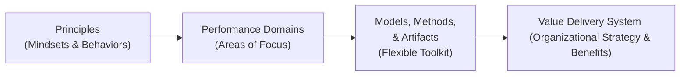

## 40.3 PMBOK® Guide Seventh Edition Terminology

The PMBOK® Guide Seventh Edition marks a significant evolution in the landscape of project management theory and practice. Reflecting the global shift toward flexibility, adaptability, and value-oriented delivery, this edition introduces new terminology and reframes established concepts. While previous editions focused on process groups and knowledge areas, the Seventh Edition centers on principles, performance domains, and an overall system for delivering project value. In this section, we clarify key terms that define the modern language of project management. We also highlight how they interrelate and how they can be applied in practical scenarios to support successful, high-impact project outcomes.

  
### The Purpose of Evolving Terminology

PMI’s move from a prescriptive process-based approach to a principles-based approach stems from the realization that every project environment is unique. The Seventh Edition vocabulary enables professionals to tailor core concepts to specific contexts—be they predictive waterfall projects, dynamic agile settings, or hybrid frameworks. These new terms support project practitioners in moving from rigid compliance to more holistic, value-driven decision-making.

  
### Principles Over Processes

Unlike the Sixth Edition, which prescribed 49 project management processes organized into knowledge areas and process groups, the Seventh Edition highlights 12 Project Management Principles (see Chapter 5 for a deep dive). These principles are fundamental beliefs and guidelines that project managers and teams should embody throughout the project life cycle. While process-based knowledge is still relevant, the core emphasis shifts to the mindset and behaviors that produce value. This approach encourages:

- Flexibility and creativity in managing unique project needs.  
- Collaboration with stakeholders to maximize benefits.  
- Continuous learning and adaptation, rather than rigid adherence to fixed processes.

  
### Key Seventh Edition Terminology

Below are some of the most noteworthy terms and concepts introduced or redefined in the PMBOK® Guide Seventh Edition. Where appropriate, references to other chapters of this book are provided so you can dig deeper into a topic.

  
#### Value Delivery System

A “Value Delivery System” refers to the broad framework through which organizations structure their strategies, portfolios, programs, and projects to deliver products, services, and results that generate tangible or intangible value. Unlike the narrower process-based approach of earlier editions, this concept reminds practitioners that projects are not isolated events. Instead, projects, programs, and portfolios create a system that should continuously deliver value to customers, stakeholders, and the organization.

Example in Practice:  
• In a manufacturing company, the Value Delivery System might encompass the organization’s strategic portfolio (e.g., investing in new production lines), each program’s goals (e.g., automation improvements), and individual projects (e.g., implementing a robotic welding unit). All efforts aim to enhance quality, reduce costs, and generate value for customers and business stakeholders.

  
#### Performance Domains

The PMBOK® Guide Seventh Edition replaces the traditional knowledge areas covered by the Sixth Edition with eight “Project Performance Domains.” These represent high-level areas of focus that are essential for successful project outcomes (see Chapters 7 through 14 of this book for deeper explanations). The domains include:

- Stakeholder  
- Team  
- Development Approach and Life Cycle  
- Planning  
- Project Work  
- Delivery  
- Measurement  
- Uncertainty  

Each domain intersects with others, collectively ensuring a holistic approach to managing a project. Where “Communications Management” was previously a standalone knowledge area, communication is now integrated within multiple domains—especially Stakeholder, Team, and Planning—reflecting its pervasive influence on project success.

  
#### Tailoring

Tailoring is the deliberate act of contextualizing and adapting project management practices, methods, and artifacts to fit the specific needs of a project. Instead of following a strict formula, project managers customize their approaches based on the organization’s environment, stakeholder expectations, risk profile, team skills, and project complexity. Tailoring resonates with many of the Twelve Principles by encouraging the project manager to “think critically” and use “organizational and situational awareness” to adopt or modify best practices as needed.

Example in Practice:  
• In a software development project with frequent requirement changes, the team may tailor an agile framework to allow for extended sprint reviews or daily stakeholder checkpoints. Meanwhile, a government infrastructure project might need more predictive, documentation-heavy processes due to strict compliance and regulatory requirements.

  
#### Models, Methods, and Artifacts

Instead of prescribing a rigid set of processes, the PMBOK® Guide Seventh Edition highlights “Models, Methods, and Artifacts” as a flexible toolkit supporting the Performance Domains.  

- Models: Conceptual frameworks or theoretical constructs (e.g., Tuckman’s Ladder for team development).  
- Methods: Techniques and procedures applied within a model (e.g., root cause analysis for quality control).  
- Artifacts: Tangible outputs and documentation (e.g., project charter, risk register).

By categorizing these tools in this way, practitioners are free to select and adapt effectively, ensuring the right level of governance, oversight, and agility. This approach fosters continuous learning and evolution, in line with the Seventh Edition’s broader concept of creativity and adaptability.

  
#### System for Value Delivery

Often used interchangeably with “Value Delivery System,” a “System for Value Delivery” is essentially how the organization’s strategic goals and day-to-day operations are interwoven to produce sustainable benefits. Projects are the mechanisms that realize these benefits by translating strategy into execution.  

• At the Strategic Level: Organizational leaders set directions and identify initiatives.  
• At the Portfolio Level: Portfolios align initiatives and allocate resources.  
• At the Program Level: Related projects are coordinated for synergies.  
• At the Project Level: Outputs and outcomes are generated, delivering specific facets of value.

This system perspective underscores that a single project’s success depends on how well it fits into the larger ecosystem of organizational objectives and capabilities.

  
#### Principles of Stewardship, Leadership, and Stakeholder Engagement

The Seventh Edition underscores the importance of ethical and effective leadership as a foundation. Terms such as “Stewardship” emphasize responsibly managing resources and focusing on the organization’s holistic wellbeing. Meanwhile, leadership is no longer solely top-down; it emphasizes collaboration, servant leadership, and empathy. Stakeholder Engagement is similarly broadened beyond standard communications to include proactive collaboration and conflict resolution.  

For instance, see Chapter 7 on the Stakeholder Performance Domain, where engagement goes beyond stakeholder identification to fostering relationships that build trust, capture feedback, and enable the project to achieve its intended value.  

  
#### Holistic Thinking and Systems Thinking

The Seventh Edition frequently mentions “Systems Thinking,” where the project manager sees the entire end-to-end context—people, processes, technologies, environmental factors, and the interactions among them. This holistic view is critical for complex projects that:

- Involve interdependent technological components.  
- Span multiple geographic and cultural contexts.  
- Require ongoing feedback loops to manage dynamic stakeholder needs.

One of the 12 Project Management Principles (see Chapter 5) addresses the need for “Systems Thinking,” reinforcing that project actions do not happen in isolation. Instead, project managers and teams must view the bigger picture and anticipate the full range of influences and consequences.

  
#### Outcomes Versus Deliverables

Where earlier editions placed heavy emphasis on project deliverables, the Seventh Edition broadens the perspective to emphasize outcomes and benefits. While deliverables (tangible or intangible products, services, or results) are still relevant, the ultimate measure of success is the value or broader outcome these deliverables generate for stakeholders or the organization.  

Example:  
• In an e-commerce website redesign project, the deliverable is a revamped, user-friendly platform. However, the outcome is increased customer satisfaction and improved conversion rates.  

  
#### Risk, Uncertainty, and Complexity

Risk management remains crucial, but the new terminology highlights the idea of “uncertainty” (see Chapter 14 for more details) as a broader concept that includes both unknown risks and unknown unknowns. “Complexity” refers to elevated levels of interdependency or unpredictability. The Seventh Edition encourages adaptive risk strategies, continuous learning, and emergent thinking.  

  
#### Adaptability and Resilience

These two interlinked terms appear throughout the Seventh Edition:

- Adaptability: The capacity to adjust methodologies, resources, or priorities as changes arise in project scope, stakeholder needs, or external conditions.  
- Resilience: The project’s and team’s ability to recover from setbacks, pivot swiftly, and continue to move forward.

Practitioners are encouraged to cultivate both adaptability and resilience at the individual, team, and organizational levels.  

  
#### Governance and Decision-Making

Project governance in the Seventh Edition context means creating the right structures and policies to guide decision-making. It empowers the project team with clarity on roles, responsibilities, and escalation paths, ensuring alignment with the organization’s strategic goals. Transparency in governance fosters trust and confidence among stakeholders, as decisions are made systematically and ethically.

  
### Visualizing the Transition

The following Mermaid diagram illustrates how the Seventh Edition’s approach focuses first on principles and performance domains, then applies adaptive models, methods, and artifacts to align with the overarching Value Delivery System.

**Diagram Explanation:**  
1. Principles (“A”) form the fundamental mindset guiding any approach to project planning and execution.  
2. The Performance Domains (“B”) represent the aggregated areas where the principles are put into action.  
3. Within those domains, the selection of “Models, Methods, & Artifacts” (“C”) provides an adaptable toolkit fitting the project context.  
4. All these elements collectively stay aligned with the broader “Value Delivery System” (“D”), ensuring every project remains connected to strategic benefits.

  
### Practical Application and Case Study

Consider a large healthcare project aiming to integrate telehealth solutions across multiple clinics. In earlier PMBOK® editions, a project manager might have focused on rigid process-based scheduling, cost controlling, and scope management. However, in the Seventh Edition paradigm:

1. The project manager and team begin by applying the principle of “Stakeholder Engagement,” working closely with clinicians, IT staff, regulatory bodies, insurance companies, and patients to identify the true needs and constraints.  
2. Using “Tailoring,” they select a hybrid approach that combines agile sprints (for software development) with predictive phases (for compliance and procurement).  
3. They focus on the “Delivery” performance domain to ensure each clinic receives the telehealth application modules in a manner consistent with user acceptance, training, and local regulations.  
4. They measure not only technical deliverables—like software modules—but also outcomes, such as patient satisfaction and reduced appointment wait times, aligning with the organization’s Value Delivery System.  

  
### Common Misconceptions

- “All Old Terminology Is Obsolete”: Not true. Terms like “charter,” “critical path,” “work breakdown structure,” and so forth remain relevant; they are simply placed within a broader spectrum of domains, models, and methods.  
- “Agile Is Mandatory”: While the Seventh Edition references agile and hybrid approaches, it does not mandate them. Instead, it encourages context-driven tailoring, which may well include predictive, agile, or hybrid methods.  
- “Principles Replace Processes Entirely”: The new guide does not forbid processes. Rather, it expects project managers to apply processes that align with the principles and performance domains, fulfilling the unique needs of each project environment.

  
### Best Practices and Pitfalls

**Best Practices:**  
- Continuously engage stakeholders to maintain alignment with value-based outcomes.  
- Cultivate adaptability and resilience across teams by encouraging an open, supportive culture.  
- Provide clarity in governance with accessible decision-making frameworks and well-documented escalation paths.

**Potential Pitfalls:**  
- Over-tailoring or failing to define clear processes can introduce confusion.  
- Neglecting leadership and stewardship principles may cause resource misuse or ethical dilemmas.  
- Focusing solely on deliverables without ensuring they lead to meaningful outcomes will reduce perceived value.

  
### Final Thoughts and Further Reading

Embracing the latest PMBOK® Guide Seventh Edition terminology reflects more than a semantic change; it represents a shift toward people-centric, value-driven, and adaptable project management. Terms like “Value Delivery System,” “Performance Domains,” and “Tailoring” reinforce how project professionals can holistically adapt to rapidly changing environments while still anchoring projects to organizational strategy.

For deeper exploration of these topics, consult the following resources:

- PMIstandards+ digital content, which provides additional guidance on real-world application of these principles.  
- The Agile Practice Guide, particularly for teams adopting agile or hybrid approaches.  
- “PMBOK® Guide – Seventh Edition” official publication from PMI for the comprehensive explanation of new frameworks and terms.

You can also revisit:

- Chapter 3 of this book, “Evolution from PMBOK® Guide Sixth to Seventh Edition,” for additional context on terminology shifts.  
- Chapters 7 through 14 for in-depth coverage of each Performance Domain.

  
## Test Your Knowledge: Mastering PMBOK® Seventh Edition Terms



### In the PMBOK® Guide Seventh Edition, what does the term "Tailoring" primarily refer to?

- [x] Adapting project management practices, methods, and artifacts to suit the specific project environment.  
- [ ] Selecting the best vendor for outsourced project tasks.  
- [ ] Outsourcing technical tasks to reduce risk.  
- [ ] Preparing designs for new project wearables.  

> **Explanation:** Tailoring means adjusting and customizing methods, processes, and artifacts to meet the unique needs of the project’s environment, team culture, and stakeholders.

  
### Which statement best describes the new focus of the PMBOK® Guide Seventh Edition?

- [x] It emphasizes principles and performance domains instead of prescriptive process groups and knowledge areas.  
- [ ] It provides a fixed set of processes without flexibility.  
- [x] It includes agile, hybrid, and predictive approaches as part of tailoring.  
- [ ] It forbids traditional project management tools like Gantt charts.  

> **Explanation:** The Seventh Edition highlights a principle-driven, domain-focused framework while acknowledging multiple approaches. Traditional and agile methods are no longer siloed but integrated as part of contextualized project management.

  
### In the Seventh Edition’s approach, which term best encompasses the overarching organizational framework ensuring alignment from strategy to execution?

- [x] Value Delivery System  
- [ ] Organizational Process Assets  
- [x] Tailoring Model  
- [ ] Benefits Realization Framework  

> **Explanation:** The Value Delivery System is the high-level structure that integrates strategy, portfolio, programs, and projects to deliver continuous value to the organization and its stakeholders.

  
### According to the PMBOK® Guide Seventh Edition, how are “Performance Domains” different from the “Knowledge Areas” of earlier editions?

- [x] Performance Domains focus on broader themes and outcomes, whereas Knowledge Areas group specific processes and techniques.  
- [ ] Performance Domains remove stakeholder engagement from project considerations.  
- [ ] Knowledge Areas never addressed scheduling or cost directly.  
- [ ] Performance Domains are optional, while Knowledge Areas were mandatory.  

> **Explanation:** Performance Domains represent holistic areas of focus that drive the project forward, whereas Knowledge Areas were specific groupings of standardized processes.

  
### Which of the following statements about “Systems Thinking” aligns with the PMBOK® Guide Seventh Edition principles?

- [x] Systems Thinking involves recognizing interdependencies and complex interactions within the overall environment.  
- [ ] Systems Thinking eliminates the need for any level of managerial control.  
- [x] Systems Thinking is only relevant in pure agile environments.  
- [ ] Systems Thinking is a formal method to calculate float.  

> **Explanation:** Systems Thinking highlights the importance of seeing the project environment as an interconnected whole, where changes in one area can affect the rest of the system.

  
### What is one key difference in the indicators of success between older PMBOK® Guides and the Seventh Edition?

- [x] The Seventh Edition places greater emphasis on outcomes and long-term value rather than just deliverables.  
- [ ] The Seventh Edition eliminates the concept of project closure.  
- [ ] The Seventh Edition considers scope creep a desirable factor in success.  
- [ ] The Seventh Edition suggests avoiding all cost management tools.  

> **Explanation:** While deliverables remain important, the Seventh Edition underscores the importance of overall outcomes and how they translate into realized value for the organization and stakeholders.

  
### What does “Adaptability” refer to within the context of the PMBOK® Guide Seventh Edition?

- [x] The ability of the project team and organization to pivot processes, resources, or priorities as new information arises.  
- [ ] Strict adherence to a single development methodology.  
- [x] Postponing all project decisions until the last responsible moment.  
- [ ] Completely abolishing governance frameworks.  

> **Explanation:** Adaptability in the Seventh Edition highlights an agile mindset in responding to changes, making real-time adjustments that keep the project aligned with value objectives.

  
### Which concept underscores the idea that principles are more important than rigid linear processes in the Seventh Edition?

- [x] Principles serve as fundamental guidelines that inform all methods and practices.  
- [ ] The concept that performance domains can only be used in waterfall projects.  
- [ ] Replacing every conventional project artifact with an agile ceremony.  
- [ ] Eliminating the project manager role in agile environments.  

> **Explanation:** The shift away from strict process compliance to principle adherence gives project teams the freedom to adapt approaches while remaining aligned with overarching project management philosophies.

  
### In the Seventh Edition, what role does governance play within the Performance Domains?

- [x] Governance establishes structures and policies for decision-making, ensuring projects stay aligned with strategic objectives.  
- [ ] Governance eliminates accountability in agile teams.  
- [ ] Governance is only applied in high-risk projects.  
- [ ] Governance replaces the project sponsor entirely.  

> **Explanation:** Governance assures oversight, accountability, and alignment by defining decision rights and responsibilities, thus tying each project’s efforts back to the broader organizational strategy.

  
### True or False: The PMBOK® Guide Seventh Edition requires abandoning all traditional predictive project management practices.

- [x] True  
- [ ] False  

> **Explanation:** This statement is intentionally misleading; although the Seventh Edition advocates principles and value delivery, it does not mandate abandoning traditional or predictive practices. The correct approach is context-driven (tailoring).



## PMP Mastery: 1500+ Hard Mock Exams with Full Explanations 

Looking to crush the PMP exam with confidence? Dive deep into 6 rigorous mock exams totaling 1500+ advanced-level questions, each accompanied by clear, step-by-step explanations. Hone your test-taking strategies, master complex topics, and build the resilience you need on exam day. Perfect for serious PMs aiming beyond fundamentals.  

Enroll now:  
[PMP Mastery: 1500+ Hard Mock Exams with Exceptional Clarity & Full Explanations](https://www.udemy.com/course/pmp-2025/?referralCode=CF83A54BC86BE27F9AFE)

_Disclaimer: This course is not endorsed by or affiliated with the PMI examination authority. All content is provided purely for educational and preparatory purposes._
