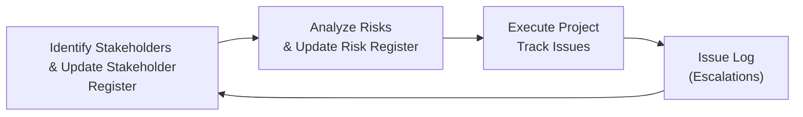
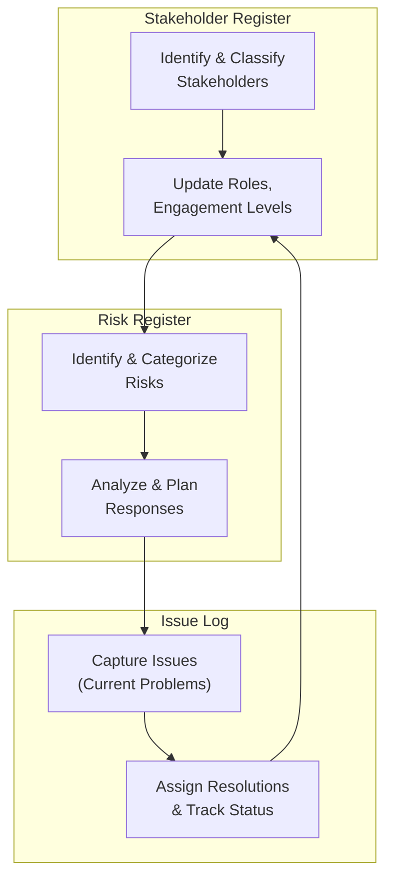

## 41.1 Stakeholder Register, Risk Register, Issue Log Samples

Effective project management relies on consistent, accurate, and up-to-date documentation. Three of the most foundational and interrelated artifacts that guide decision-making and transparency across all project stages are the Stakeholder Register, the Risk Register, and the Issue Log. Each serves a distinct function but also overlaps with the others to inform and refine key activities such as stakeholder engagement (see Chapter 7, “Stakeholder Performance Domain”), risk evaluation (see Chapter 14 & Chapter 22, “Uncertainty Performance Domain” and “Risk and Uncertainty Management (Revisited)”), and issue resolution (covered throughout monitoring and controlling processes).

In this section, we will examine each document’s purpose, typical structure, recommended best practices, and sample formats, including tips for tailoring them to different project life cycles—predictive, agile, or hybrid. We will also provide diagrams illustrating how these registers and logs interface with other project processes, along with examples and real-world scenarios to show how small and large organizations effectively use these artifacts.

---

### Introduction to Key Registers and Logs

• A Stakeholder Register helps project managers systematically identify and categorize individuals, groups, and organizations that have a stake in the project’s outcomes.  
• A Risk Register captures known risks and outlines how to identify, analyze, and respond to them.  
• An Issue Log tracks unforeseen events, problems, or concerns that emerge during project execution and require action or a decision.  

Though often discussed separately, these three documents are closely connected. A crucial stakeholder group (logged in the Stakeholder Register) might escalate a risk or raise an issue that then flows into the Risk Register or Issue Log. Conversely, newly discovered risks or issues might require you to update stakeholder engagement strategies.

Below is an example Mermaid diagram illustrating this interplay:

In the diagram above, new or changing stakeholders can revise your risk perspective or introduce new issues, while newly logged issues could lead to reevaluation of your stakeholder relationships (tightening communication, soliciting feedback, or even reprioritizing their influence and power).

---

### Stakeholder Register

The Stakeholder Register (also referred to as a “Stakeholder Database” or “Stakeholder List” in some organizations) is a vital document that keeps track of every person, department, or company with an interest in—or influence over—project success. It provides a foundational blueprint for managing expectations, facilitating collaboration, and driving effective communication.

#### Purpose and Importance
• Identifies stakeholders who can affect, or be affected by, project outcomes.  
• Details stakeholder attributes such as roles, interests, power/influence levels, and engagement requirements.  
• Streamlines communication by clarifying who needs what type of information, when, and how frequently.

#### Common Data Fields
Depending on your project environment (predictive, agile, or hybrid), the specifics of these fields may vary. However, many organizations include:

• Stakeholder Name or ID  
• Role or Title  
• Contact Information  
• Influence/Interest Assessment (e.g., high, medium, low)  
• Stakeholder Power (ability to make decisions, resource allocations)  
• Stakeholder Attitude/Support Level (supportive, neutral, resistant)  
• Key Expectations and Requirements  
• Engagement Strategy or Approach (communication preferences, frequency)

#### Sample Stakeholder Register Template

| Stakeholder Name | Role/Title         | Influence | Interest | Support Level | Engagement Strategy                | Notes                                        |
|------------------|--------------------|----------|---------|--------------|------------------------------------|----------------------------------------------|
| Jane Doe         | Executive Sponsor  | High     | High    | Supportive   | Weekly check-ins and emails        | Ensure alignment with overall business goals |
| John Smith       | IT Manager         | Medium   | Medium  | Neutral      | Project website updates, sprint demos | Concerned about system integration           |
| Marketing Dept.  | External Vendor    | Low      | Low     | Resistant    | Monthly progress reports           | Language has to be carefully framed          |

This table shows how stakeholders can be defined and evaluated, making it easier to understand how communication and participation should be structured.

#### Best Practices

• Update Continuously: Stakeholder rosters evolve over time. Maintain the register in real time as new individuals or organizations come into play.  
• Tailor for Relevance: Collect only the information you genuinely need. Unnecessary data can clutter records and reduce usability.  
• Involve the Team: Incorporate insights from project team members who frequently interact with specific stakeholders.  
• Document Engagement Strategies: The Stakeholder Register should reference a communication plan or stakeholder engagement plan.  

#### Common Pitfalls

• Overcomplication: Using a register that is too complex can discourage updates. Balance detail with practicality.  
• Lack of Security: Some information, such as stakeholder influence or attitudes, may be sensitive. Ensure confidentiality of the document to avoid unintended conflicts.  
• Neglecting Key Individuals: Over-focusing on powerful or vocal stakeholders at the expense of those with lower authority but high interest can lead to gaps in feedback.  

---

### Risk Register

A Risk Register systematically captures, categorizes, tracks, and manages the uncertainties—both threats and opportunities—that could impact the project’s objectives. While commonly associated with negative events (threats), remember that positive events (opportunities) can also be included.

#### Purpose and Importance
• Serves as a living document for tracking known or foreseeable risks.  
• Outlines risk triggers, root causes, potential impacts, and possible responses.  
• Enhances proactive decision-making and resource allocation by assessing the probability and impact of each risk.  

#### Common Data Fields

• Risk ID or Title  
• Description: A brief statement of the risk  
• Cause & Trigger: A short phrase noting how/why the risk may occur  
• Probability: The likelihood (High, Medium, Low) or a numeric estimate (e.g., 10%, 30%, 75%)  
• Impact: The severity if the risk occurs (High, Medium, Low) or a numeric scale (1–5) for cost, schedule, scope, or quality  
• Risk Score: Probability × Impact (often used in risk ranking)  
• Response Strategy: Accept, Avoid, Mitigate, Transfer, Exploit, Enhance, or Share (for opportunities)  
• Risk Owner: Who is responsible for monitoring and responding to the risk  
• Status: Open, Closed, Deferred

#### Sample Risk Register Template

| Risk ID | Description                            | Probability | Impact | Risk Score | Response Strategy | Risk Owner    | Status  | Notes                                              |
|---------|----------------------------------------|------------|--------|-----------|------------------|---------------|---------|----------------------------------------------------|
| R001    | Core server outage due to hardware mix | 30%        | High   | 0.30 x High* | Mitigate          | IT Manager    | Open    | Plan to purchase backup hardware and test failover |
| R002    | Overly optimistic schedule estimates   | 50%        | Medium | 0.50 x Med* | Avoid            | PMO           | Open    | Conduct progressive elaboration of schedule        |
| R003    | Opportunity: Faster vendor delivery    | 20%        | Medium | 0.20 x Med* | Enhance          | Procurement   | Deferred| Set up early acceptance criteria for components    |

(*Risk Score can be numeric or descriptive, depending on organizational preferences.)

In an agile setting, risk items might be recorded in a simple, prioritized list or on a risk burndown chart (commonly seen in agile frameworks). In predictive or hybrid projects, more formal registers are used.

#### Best Practices

• Categorize Risks: Use a Risk Breakdown Structure (RBS) to group related risks (e.g., technical, external, organizational).  
• Analyze Probability and Impact: Conduct both qualitative (e.g., High/Medium/Low) and quantitative (e.g., Monte Carlo simulation) analyses if resources permit.  
• Assign Ownership: Designate a specific person or team to track each significant risk, regularly checking triggers.  
• Integrate Risk Responses with Plans: Ensure risk mitigation or exploitation strategies are reflected in official project schedules, budgets, or resource allocations.  

#### Common Pitfalls

• Letting the Register Collect Dust: A risk register is only valuable if reviewed regularly and updated as new information comes in.  
• Overestimation or Underestimation: Strive for realistic probability and impact assessments; exaggerated figures undermine credibility, while underestimations imperil the project.  
• Focusing Only on Negative Risks: Opportunities can provide significant competitive advantage or contribute to project success if managed properly.  

---

### Issue Log

Whereas risks represent uncertainties that may occur, issues are current realities—a challenge or problem has already materialized. The Issue Log documents and tracks these occurrences for prompt investigation, escalation, and resolution.

#### Purpose and Importance

• Provides a structured method to handle unplanned events during project execution.  
• Ensures accountability by assigning each issue to a specific owner.  
• Maintains alignment among stakeholders, guaranteeing that actions and decisions are clearly documented and tracked.  

#### Common Data Fields

• Issue ID or Title  
• Description: A concise statement of the problem  
• Date Raised: When and by whom the issue was identified  
• Priority: Urgent, High, Medium, or Low  
• Responsible Party/Owner  
• Action Steps or Resolution Plan  
• Due Date or Target Resolution  
• Status: Open, In Progress, Resolved, or Closed  
• Escalation Level: If the issue cannot be resolved by the assigned team, specify the next escalation route (e.g., sponsor, steering committee)

#### Sample Issue Log Template

| Issue ID | Description                               | Priority | Raised By  | Owner         | Action Steps                         | Due Date   | Status   | Escalation Level | Notes                                        |
|----------|-------------------------------------------|----------|-----------|--------------|--------------------------------------|------------|----------|------------------|----------------------------------------------|
| I001     | Marketing materials delayed by vendor     | High     | Jane Doe  | Vendor Mgr.  | Contact vendor, expedite shipping    | 2025-03-10 | Open     | Project Sponsor  | Delays could impact product launch date      |
| I002     | Scope misinterpretation by development team | Medium   | John Smith| Scrum Master | Clarify user stories, hold workshop  | 2025-02-20 | In Progress | Product Owner    | Potential rework if not resolved quickly     |
| I003     | Stakeholder training environment not ready | High     | QA Lead   | Training Dept| Secure environment, confirm test data| 2025-03-05 | Resolved | PMO             | Identified an environment with backup server |

Issues often require immediate attention. The resolution steps and final outcomes might inform risk considerations (i.e., if an issue’s cause could recur) or stakeholder engagement plans (i.e., the stakeholder who raised the issue might need additional communication).

#### Best Practices

• Document Escalation Procedures: Clarify at what point an issue moves from the project team to higher management.  
• Provide Real-Time Updates: Keep your Issue Log in a location accessible to the project team and relevant stakeholders.  
• Link to Change Management: Sometimes, issues necessitate official change requests if they affect scope, budget, or schedule.  

#### Common Pitfalls

• Mixing Issues with Risks: Avoid confusion by keeping separate logs for things that have happened (issues) and things that might happen (risks).  
• Undefined Prioritization: If every issue is labeled “high priority,” the team will have difficulty knowing where to focus. Use a consistent and objective prioritization system.  
• Lack of Closure: Regularly review whether issues have been fully resolved and update the log accordingly.

---

### Interactions and Consolidation

Although each register or log serves a unique function, they are all connected. For instance, an issue might reveal an undocumented risk or stakeholder interest, triggering updates in any or all of these artifacts. By regularly reviewing each document during your project status meetings, you add an extra layer of rigor to your project governance.

Below is a simplified flow that shows how these three key documents can feed into each other as part of a project’s overall monitoring and controlling activities:

The flow is not strictly linear in a real-world setting; changes made in one area often cycle back to earlier steps, reflecting an iterative approach, especially in agile or hybrid environments.

---

### Practical Examples and Real-World Scenarios

1. Agile Marketing Project:  
   • The Stakeholder Register focuses on the marketing department, external creative agencies, and potential testers.  
   • Risks often revolve around changing consumer trends, making the Risk Register dynamic and frequently updated.  
   • Issues pop up when new campaign material is delayed or fails quality checks; the Issue Log helps the team expedite solutions.

2. Hybrid Software Implementation:  
   • The Stakeholder Register includes end-users, IT administrators, corporate management, and a third-party vendor.  
   • The Risk Register uses both qualitative and quantitative assessments, especially for performance and security vulnerabilities.  
   • The Issue Log captures daily code defects. If a defect is severe, it might get escalated to a risk-level threat for subsequent sprints.

3. Predictive Construction Project:  
   • The Stakeholder Register tracks municipal authorities, community groups, various contractors, and the project sponsor.  
   • Common risks may include weather events, regulatory approval delays, and cost overruns.  
   • Issues often include misalignment with subcontractors, causing immediate schedules to shift or specialized equipment to be redeployed.

---

### Best Practices and Tailoring Tips

• Frequency of Updates: Decide how often you will review and update each document—daily for fast-paced agile teams or weekly/monthly for more stable predictive projects.  
• Format and Tools: Simple spreadsheets may suffice for small projects; more complex or large-scale projects may require specialized project management information systems (PMIS).  
• Version Control: Keep track of version history. Always know who made which update and why.  
• Visibility and Communication: Provide stakeholder-specific summaries when relevant. For example, top management may not need to see every low-level issue.  
• Link to the Organizational Knowledge Base: Over time, pattern recognition of repeated issues or recurring risk triggers can guide enterprise-level process improvements.

---

### References for Further Exploration

• Project Management Institute, “A Guide to the Project Management Body of Knowledge (PMBOK® Guide) – Seventh Edition.”  
• PMIstandards+: Online resource with additional tips and templates for dynamic risk and stakeholder management.  
• Agile Practice Guide, jointly published by PMI and Agile Alliance.  
• Kerzner, Harold. “Project Management Best Practices: Achieving Global Excellence.”  
• T. DeMarco and T. Lister, “Waltzing With Bears: Managing Risk on Software Projects.”  

For more templates and practical guides specifically tailored to your industry, explore online repositories like ProjectManagement.com or specialized forums in your sector.

---

## Stakeholder, Risk, and Issue Register Mastery Quiz



### In a Stakeholder Register, which attribute is most critical for planning communication strategies?

- [ ] Stakeholder name
- [x] Influence and interest levels
- [ ] Stakeholder ID
- [ ] Date of entry

> **Explanation:** While the name and ID help identify who the stakeholder is, understanding their influence and interest levels allows you to tailor your communication approach based on how much power they wield and how invested they are in the project’s outcome.

### Which of the following best describes a key difference between the Risk Register and the Issue Log?

- [x] The Risk Register is about potential events; the Issue Log is about events that have already occurred.
- [ ] The Risk Register focuses on cost elements; the Issue Log focuses on scope.
- [x] The Risk Register includes threats and opportunities; the Issue Log primarily deals with problems.
- [ ] The Risk Register is updated only at the start of the project; the Issue Log is updated only after the project closes.

> **Explanation:** Risks are future-leaning uncertainties (positive or negative), whereas issues have already manifested. The Risk Register can include both threats and opportunities. The Issue Log documents real problems or concerns.

### What is the primary reason to regularly update the Stakeholder Register?

- [x] Stakeholder involvement and influence can change throughout the project.
- [ ] The project manager needs to fill in more columns.
- [ ] The register needs to match the exact format defined in the PMBOK® Guide.
- [ ] Most stakeholders never remain the same.

> **Explanation:** Stakeholder relationships, roles, and influence are dynamic. Without regular updates, the project team may fail to manage new or changing expectations effectively.

### Which of the following is a best practice for maintaining a Risk Register?

- [x] Reviewing and updating it in periodic risk review meetings.
- [ ] Locking it for changes after the planning phase.
- [ ] Mixing issue details and risk entries in the same log.
- [ ] Delegating ownership of all risks to the project sponsor.

> **Explanation:** Risk Registers are living documents that must be updated promptly when new risks emerge or existing risks change. Periodic risk review sessions ensure ongoing relevance.

### How does an Issue Log help with project governance?

- [x] It formally documents problems, assigns ownership, and helps track resolution progress.
- [ ] It automatically eliminates risks from the project scope.
- [x] It replaces the need for a Change Control Board.
- [ ] It provides an informal channel for general complaints.

> **Explanation:** An Issue Log is an essential governance tool. By systematically recording issues, defining owners, and monitoring resolution steps, the project gains transparency and accountability. However, it does not replace formal change control processes.

### Why should a Risk Owner be assigned to each risk in the Risk Register?

- [x] To ensure accountability and that monitoring and response actions are performed.
- [ ] To guarantee that all negative outcomes are prevented.
- [ ] To make sure risk reviews happen only once a year.
- [ ] To minimize the number of total risks in the register.

> **Explanation:** A designated Risk Owner is responsible for tracking that risk and implementing or escalating response actions as conditions evolve. This accountability fosters a more proactive approach.

### Which tool helps categorize and group related risks for improved clarity?

- [x] Risk Breakdown Structure (RBS)
- [ ] Issue Log
- [x] Probability and Impact Matrix
- [ ] Stakeholder Register

> **Explanation:** A Risk Breakdown Structure (RBS) systematically groups risks by category (e.g., technical, organizational, external) to enhance clarity. A Probability and Impact Matrix is used to rank risks, but not group them by nature.

### When documenting issues, why is maintaining a clear escalation procedure important?

- [x] It ensures issues that cannot be resolved at the project level are passed to higher authority or the correct team.
- [ ] It eliminates the need for top management involvement.
- [ ] It allows the project manager to bypass formal processes.
- [ ] It prevents any stakeholder from raising issues without permission.

> **Explanation:** Escalation procedures clarify who must be notified and how decisions will be made if the project team cannot resolve an issue. This avoids bottlenecks and miscommunications.

### Which of these fields is most frequent in both a Risk Register and an Issue Log?

- [x] Owner or Assignee
- [ ] Probability rating
- [ ] Stakeholder engagement approach
- [ ] Communication channels

> **Explanation:** The “Owner/Assignee” field is key to both a Risk Register and an Issue Log, as each entry requires a person or entity responsible for monitoring, mitigating, and eventually resolving the risk or issue.

### True or False: Issues should always remain in the Risk Register until completely resolved.

- [x] True
- [ ] False

> **Explanation:** This is a trick question. While some risk management processes convert realized risks into issues, it is not strictly correct to manage active issues solely within the Risk Register. Issues should be tracked in the Issue Log. However, the realized risk (now an issue) can remain noted or linked in the Risk Register for lessons learned—so that the project team explores how to prevent its recurrence or identify it earlier in future projects.



---

## PMP Mastery: 1500+ Hard Mock Exams with Full Explanations 

Looking to crush the PMP exam with confidence? Dive deep into 6 rigorous mock exams totaling 1500+ advanced-level questions, each accompanied by clear, step-by-step explanations. Hone your test-taking strategies, master complex topics, and build the resilience you need on exam day. Perfect for serious PMs aiming beyond fundamentals.

Enroll now:  
[PMP Mastery: 1500+ Hard Mock Exams with Exceptional Clarity & Full Explanations](https://www.udemy.com/course/pmp-2025/?referralCode=CF83A54BC86BE27F9AFE)

_Disclaimer: This course is not endorsed by or affiliated with the PMI examination authority. All content is provided purely for educational and preparatory purposes._
