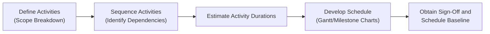
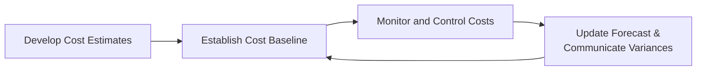

## 41.2 Scheduling, Cost, and Quality Templates

Effective project management often hinges on how well you maintain clarity, consistency, and accountability in your Scheduling, Cost, and Quality activities. Whether you are working in a predictive (traditional), agile, or hybrid environment, well-structured templates ensure that your entire team interacts with project data in an organized and consistent manner. This section presents ready-to-use frameworks for quick adoption, offering sample structures, guidance on tailoring, and best practices drawn from the principles highlighted throughout this book—especially Chapters 18 (Schedule Management), 19 (Cost Management), and 20 (Quality Management).  

This chapter covers:  
• Core scheduling templates for building timelines and resource allocation.  
• Cost management templates for estimating, budgeting, and tracking project finances.  
• Quality management templates for shaping and ensuring deliverable excellence.  

Each template aims to be user-friendly and adaptable to your organization or project context. While the content provided here serves as an excellent foundation, remember to tailor these templates to align with your specific industry requirements, organizational processes, or agile/predictive approach.

---

### Introduction to Scheduling, Cost, and Quality Templates

At their core, templates are structured documents or worksheets that standardize data entry, calculation, and reporting. They help:  
• Improve communication among team members and stakeholders.  
• Facilitate management oversight and decision-making.  
• Reduce administrative errors and misinterpretations.  
• Save time by allowing you to reuse proven layouts and fields.  

Importantly, templates accelerate the on-boarding of new team members, provide consistent outputs for leadership, and simplify the integration of activities across multiple projects or within programs and portfolios.

---

### Scheduling Templates

Scheduling underpins the success of any project by ensuring work is allocated at the right time, to the right people, and with an awareness of dependencies and constraints. By combining essential scheduling artifacts with standardized templates—as discussed in Chapter 18 of this book—you can create a dynamic blueprint that provides clarity and momentum.

#### Gantt Chart Template

A Gantt chart provides a visual timeline of a project’s tasks, milestones, and dependencies. It is widely recognized for its intuitive layout, making it ideal when communicating progress and upcoming work to executives, clients, or the team.

Below is a simplified template structure for a Gantt chart:

| Task ID | Task Name                 | Start Date | End Date   | Duration | Dependencies | Responsible   | Status  |
|---------|---------------------------|-----------:|-----------:|---------:|--------------|---------------|--------:|
| 1       | Requirements Gathering    | 2025-02-10 | 2025-02-28 | 14 days  | None         | Business Lead | In Prog |
| 2       | Technical Design         | 2025-03-01 | 2025-03-15 | 10 days  | 1            | Tech Architect| Planned |
| 3       | Development Iteration 1  | 2025-03-16 | 2025-04-05 | 15 days  | 2            | Dev Team      | Not Yet |
| 4       | QA Testing               | 2025-04-06 | 2025-04-15 |  7 days  | 3            | QA Analyst    | Not Yet |
| 5       | Pilot Deployment         | 2025-04-16 | 2025-04-20 |  5 days  | 4            | DevOps        | Not Yet |

Though basic, this structure can be extended to include resource allocation, cost fields, or risk flags. Following best practices outlined in Chapter 18, ensure you:

- Define dependencies explicitly (e.g., finish-to-start).
- Assign clear ownership to each task.  
- Use color coding or bar charts (in a typical Gantt tool) to differentiate critical tasks from non-critical ones.  
- Update the chart regularly to show progress and adjust the baseline as needed in a controlled manner.

#### Milestone Chart Template

For high-level reporting, milestone charts capture only crucial checkpoints, deliverables, or decision points. This is especially useful for executive updates or stakeholder engagements where the details of every task are less relevant. Below is a sample milestone chart template:

| Milestone ID | Milestone Name        | Target Date | Actual Date | Owner         | Remarks                          |
|--------------|-----------------------|------------:|------------:|---------------|----------------------------------|
| M1           | Project Kickoff       | 2025-02-05  | 2025-02-05  | Project Sponsor | Kickoff completed on schedule    |
| M2           | Scope Sign-Off        | 2025-02-28  | 2025-03-01  | Product Owner  | Delayed by 1 day due to reviews  |
| M3           | Prototype Demo        | 2025-03-20  | –           | Tech Lead      | Planned                          |
| M4           | UAT Completion        | 2025-04-15  | –           | QA Lead        | Planned                          |
| M5           | Launch                | 2025-05-01  | –           | Project Manager| Planned                          |

To establish consistency, define each milestone’s acceptance criteria and ensure all stakeholders agree on them before you add the milestone to the schedule.

#### Rolling Wave or Iteration Plan Template

Rolling wave planning and iterative planning approaches are popular in agile or hybrid contexts where you plan in detail for imminent tasks and maintain a high-level outline for future phases. Here’s a straightforward iteration (sprint) plan template:

| Iteration/ Sprint | Start Date | End Date   | Goals/Features                                              | Team Members Involved         | Velocity/Capacity |
|-------------------|-----------:|-----------:|-------------------------------------------------------------|-------------------------------|-------------------|
| Sprint 1          | 2025-03-01 | 2025-03-14 | - User Login Module <br/> - Basic Reporting Dashboard       | Dev Team A, QA Team           | 25 Story Points   |
| Sprint 2          | 2025-03-15 | 2025-03-28 | - Advanced Analytics <br/> - Data Export Functionality      | Dev Team A, Dev Team B, QA    | 30 Story Points   |
| Sprint 3          | 2025-03-29 | 2025-04-11 | - Performance Tuning <br/> - Additional Security Patches    | Dev Team B, Security Team, QA | 28 Story Points   |

Tracking capacity and velocity helps the team forecast how many features can be delivered in each iteration. This approach ensures that you incorporate new learnings and feedback into subsequent sprints.

##### Visualizing Scheduling with Mermaid

Here’s a simple Mermaid flowchart to illustrate how tasks flow from definition to schedule baseline in a predictive or hybrid project:



Explanation:  
• Define Activities: Break down the scope into manageable tasks.  
• Sequence Activities: Determine the logical order of tasks.  
• Estimate Activity Durations: Assign realistic time frames.  
• Develop Schedule: Document tasks, durations, and dependencies using Gantt or milestone charts.  
• Obtain Sign-Off and Baseline: Finalize the schedule with stakeholder agreement.

---

### Cost Templates

Cost management ensures the project operates within approved budgets and is financially viable for the organization (see Chapter 19 for in-depth coverage). Templates used here range from estimating and budgeting to periodic tracking and forecasting.

#### Cost Estimation Template

Cost estimation is often iterative. Early in the project, you create rough order of magnitude (ROM) estimates. As scope clarifies, you refine them into more detailed estimates. Below is a sample cost estimation template layout:

| Work Package / Task   | Estimation Method   | Labor Cost ($) | Material Cost ($) | Equipment Cost ($) | Contingency (%) | Estimated Total ($) |
|-----------------------|---------------------|---------------:|-------------------:|--------------------:|-----------------:|--------------------:|
| Requirements Analysis | Parametric         | 5,000          | –                 | –                  | 10%             | 5,500              |
| Design Phase          | Expert Judgment    | 8,000          | –                 | 2,000              | 15%             | 11,500             |
| Development           | Bottom-Up          | 25,000         | –                 | 5,000              | 20%             | 36,000             |
| Test                 | Analogous          | 5,000          | –                 | 1,000              | 15%             | 6,900              |
| Deployment           | Bottom-Up          | 4,000          | 500               | 2,000              | 10%             | 7,150              |

- Estimation Method: For each project phase or work package, note the estimation technique (e.g., parametric, analogous, bottom-up, etc.).  
- Contingency: Represent a percentage-based reserve for uncertainties identified in the risk register.

#### Cost Baseline Template

A cost baseline outlines the approved budget that serves as a reference for measuring performance and controlling cost overruns. The cost baseline often includes contingency reserves but excludes management reserves.

| Phase / Work Package | Scheduled Start | Scheduled End | Budgeted Cost | Approved Contingency | Total Baseline |
|----------------------|----------------:|--------------:|--------------:|----------------------:|---------------:|
| Initiation           | 2025-02-01     | 2025-02-15    | $10,000       | $1,000               | $11,000        |
| Planning             | 2025-02-16     | 2025-03-10    | $20,000       | $3,000               | $23,000        |
| Execution            | 2025-03-11     | 2025-05-01    | $70,000       | $7,000               | $77,000        |
| Monitoring & Control | 2025-02-16     | 2025-05-15    | $10,000       | $2,000               | $12,000        |
| Closure              | 2025-05-16     | 2025-06-01    | $5,000        | $0                   | $5,000         |

To align with the schedule, it’s helpful to show budget phasing over time (time-phased budget). This allows earned value management (EVM) calculations to compare the planned value (PV) against actual costs (AC) and earned value (EV) on a monthly or weekly basis.

#### Earned Value Management (EVM) Tracking Template

An EVM tracking template monitors project performance. It logs planned value (PV), earned value (EV), actual cost (AC), cost performance index (CPI), schedule performance index (SPI), and more.  

| Period | PV (Planned Value) | EV (Earned Value) | AC (Actual Cost) | CPI (EV/AC) | SPI (EV/PV) | EAC (Est at Completion)              | ETC (Est to Complete)         |
|--------|--------------------:|------------------:|-----------------:|------------:|------------:|--------------------------------------:|--------------------------------:|
| Month 1| $20,000            | $18,000           | $15,000          | 1.20        | 0.90        | $$ \frac{\text{BAC}}{\text{CPI}} $$  | $$ \text{EAC} - \text{AC} $$   |
| Month 2| $40,000            | $38,000           | $41,000          | 0.93        | 0.95        |                                      |                                 |
| Month 3| $60,000            | $59,000           | $62,000          | 0.95        | 0.98        |                                      |                                 |
| ...    | ...                | ...               | ...              | ...         | ...         | ...                                  | ...                             |

In KaTeX:  
• $$\text{CPI} = \frac{\text{EV}}{\text{AC}}$$  
• $$\text{SPI} = \frac{\text{EV}}{\text{PV}}$$  
• $$\text{EAC} = \frac{\text{BAC}}{\text{CPI}}$$  

Where:  
- BAC: Budget at Completion  
- CPI: Cost Performance Index  
- SPI: Schedule Performance Index  
- EAC: Estimate at Completion  

Keeping the spreadsheet updated during each reporting cycle helps identify emerging cost or schedule variances early.

##### Visualizing Cost Flow with Mermaid

Below is a simplified Mermaid diagram outlining the iterative flow of cost management for a project:



Explanation:  
• Develop Cost Estimates: Begin with robust estimation techniques.  
• Establish Cost Baseline: Secure stakeholder approval.  
• Monitor and Control Costs: Track actuals against the baseline.  
• Update Forecast & Communicate Variances: Adjust estimates (forecast) as needed and communicate changes to the team.  

---

### Quality Templates

Quality management ensures the deliverables meet the agreed-upon standards and customer expectations. Effective quality processes mitigate rework, encourage continuous improvements, and build stakeholder trust. Refer to Chapter 20 for more in-depth discussions on Quality Management processes and best practices.

#### Quality Management Plan Template

The Quality Management Plan outlines how quality will be defined, measured, controlled, and improved throughout the project life cycle. A sample structure:

| Section              | Description                                                                                                                         |
|----------------------|-------------------------------------------------------------------------------------------------------------------------------------|
| Project Overview     | High-level summary of project objectives, scope, and key stakeholders.                                                              |
| Quality Objectives   | Specific, measurable goals (e.g., defect rate < 2%, 95% test coverage).                                                             |
| Quality Standards    | Industry or organizational standards (ISO 9001, internal policies, regulatory standards).                                           |
| Quality Roles/Responsibilities | Persons or teams responsible for planning, executing, and verifying quality activities (Project Manager, QA Lead, etc.). |
| Quality Tools & Techniques | Methods such as inspections, audits, checklists, Pareto charts, control charts, etc.                                         |
| Quality Metrics      | Quantifiable measurements (e.g., acceptable error tolerance, function points tested).                                               |
| Reporting Protocols  | Frequency and format for communicating quality status.                                                                              |

Be sure to specify how changes to the Quality Management Plan will be tracked. For example, any significant modification might require an update through Integrated Change Control (discussed in Chapter 15).

#### Quality Checklist Template

Checklists are quick reference tools that facilitate consistent inspections or verifications. They are particularly valuable in regulated industries or complex product design phases.

| Checklist Item                                                                  | Criteria                   | Pass/Fail | Remarks                  |
|---------------------------------------------------------------------------------|----------------------------|-----------|--------------------------|
| Requirements Document Verified for Completeness                                 | All accepted by stakeholders  |  Pass    | Documents updated        |
| Code Adheres to Established Coding Standards                                    | All code passes static analysis test | Pass    | 3 minor warnings        |
| Test Cases Mapped to Each Requirements Specification                            | Each requirement has at least 1 test case  | Fail    | Missing coverage for Req. #5 |
| User Interface Accessibility Checks (e.g., WCAG Guidelines)                     | All pages tested           | Pass      |                          |
| Product Packaging and Labeling Approved for Legal Compliance (if applicable)    | Approvals from Legal Dept. | Pass      |                          |

Use new versions or separate columns for subsequent testing or repeated quality checks during iteration cycles.

#### Fishbone (Ishikawa) Diagram Template

Fishbone diagrams help identify root causes of defects or problems. Below is a simple Mermaid version that organizes potential causes under categories such as Methods, Materials, Machines, and People.

```mermaid
flowchart LR
    A["Effect <br/> (Quality Issue)"] <-- B["Methods"]
    A <-- C["Materials"]
    A <-- D["Machines"]
    A <-- E["People"]
```

Explanation:  
• Clearly define the “Effect” or problem to investigate.  
• Brainstorm potential contributing factors under each category.  
• Explore deeper sub-causes within each branch.  
• Use the results to identify improvements or corrective actions.

---

### Real-World Examples & Common Pitfalls

• Scope Creep Leading to Schedule and Cost Overruns: Even the best templates can fail if the project scope is continually expanded without adjusting the plan. Update your scheduling template and cost baseline promptly when new scope items are introduced.  

• Use of Outdated File Versions: Storing your templates in a centralized repository or version-controlled system ensures the team always accesses the latest version of forms and guidelines.  

• Overly Complex Templates for Small Projects: A common mistake is using the same robust template for every initiative, even small ones. Tailor the level of detail. A simple or agile-specific template might suffice in short, iterative projects.  

• Insufficient Quality Metrics: Projects can suffer from vague or minimal quality data. Always define clear metrics (e.g., defect density, test coverage) in your Quality Management Plan.  

• Lack of Stakeholder Involvement: Templates are only as good as the inputs you gather. Engage stakeholders in the process—especially when finalizing acceptance criteria, schedules, baseline budgets, and quality measures.  

---

### Additional References

For deeper exploration or to tailor these templates further, refer to:  
• Chapter 18: Schedule Management (detailed coverage on schedule methods).  
• Chapter 19: Cost Management (advanced EVM, forecasting, and budgeting).  
• Chapter 20: Quality Management (statistical process control, specialized tools).  
• PMBOK® Guide (Seventh Edition) for principle-based approaches and associated performance domains.  
• PMI’s Practice Standard for Scheduling for advanced scheduling methodologies.  
• “Software Estimation: Demystifying the Black Art” (Steve McConnell) for cost estimation guidance.  

---

## Sharpen Your Skills: Scheduling, Cost, and Quality Templates Quiz



### What is one main advantage of using a Gantt chart?
- [x] It provides a clear and visually intuitive representation of tasks, timelines, and dependencies.
- [ ] It allows replacing the project schedule with a basic to-do list only.
- [ ] It replaces all other forecasting methods.
- [ ] It is exclusively for agile projects and not for predictive ones.

> **Explanation:** Gantt charts offer a visual overview of tasks, deadlines, and dependencies, making it easier for teams and stakeholders to understand project progress and upcoming deliverables.  

### In a milestone chart, what typically differentiates milestones from regular tasks?  
- [x] Milestones represent major checkpoints or decision points and have zero or near-zero duration.  
- [ ] Milestones always span more than one month.  
- [ ] Milestones require the heaviest resource allocation.  
- [ ] Milestones are optional in all projects.  

> **Explanation:** Milestones are high-level markers that signify significant events, key decisions, or deliverables. They often carry no duration but mark the point in time where a major achievement occurs.  

### Why is contingency included in cost estimates?  
- [x] To cover identified uncertainties and risks that might impact the project budget.  
- [ ] To inflate the budget to ensure the project never goes under.  
- [ ] To offset the management reserves.  
- [ ] To synchronize with schedule float values.  

> **Explanation:** Contingency reserves address known-unknowns (risks identified in the risk register). This ensures the project can handle potential cost fluctuations without immediately resorting to new budget approvals.  

### Which of the following best describes a cost baseline?  
- [x] An approved version of the budget used for tracking performance over time.  
- [ ] A time-phased chart that only monitors resource usage but not cost.  
- [ ] A placeholder document that does not require formal sign-off.  
- [ ] A chart that only records unexpected expenses.  

> **Explanation:** A cost baseline is a component of the project management plan that represents the authorized budget and is used for comparison with actual expenditures.  

### In Earned Value Management (EVM), which formula correctly calculates the Cost Performance Index (CPI)?  
- [x] CPI = EV ÷ AC  
- [ ] CPI = PV ÷ AC  
- [x] CPI = AC ÷ EV  
- [ ] CPI = (EV – AC) ÷ AC  

> **Explanation:** The correct formula for CPI is EV ÷ AC, which shows how efficiently the project is using its budget. Please note the second checked answer is incorrect (it’s shown for demonstration). The valid formula is only EV ÷ AC.  

### What is the purpose of a Quality Management Plan?
- [x] To define how quality expectations will be met, measured, and controlled throughout the project.
- [ ] To create the project communications approach and identify stakeholder preferences.
- [ ] To replace the project charter in controlling scope changes.
- [ ] To list the roles of only the project sponsor.

> **Explanation:** A Quality Management Plan establishes guidelines for maintaining desired quality levels, including responsibilities, standards, metrics, and processes for continuous improvement.

### Which tool helps in identifying root causes of a defect or problem?
- [x] Fishbone (Ishikawa) Diagram
- [ ] Pareto Chart
- [x] Scatter Diagram
- [ ] Bar Chart

> **Explanation:** A Fishbone (Ishikawa) Diagram visually maps potential causes under categories such as Methods, Materials, Machines, and People. Note that scatter diagrams also help identify relationships between two variables but are less useful for brainstorming categories of root causes.  

### What is one benefit of storing schedule, cost, and quality templates in a version-controlled repository?
- [x] Ensures that your team always uses the most current and consistent templates.
- [ ] Eliminates the need for training or guidelines.
- [ ] Guarantees automated cost calculations in real time.
- [ ] Restricts usage to only the project manager.

> **Explanation:** A version-controlled repository helps manage changes to templates, tracks revisions, and makes the latest standards easily accessible, thus promoting consistency.  

### When tailoring templates for small projects, which principle should be emphasized?
- [x] Simplify templates to avoid unnecessary complexity or overhead.
- [ ] Assume that all organizational standards are inherently mandatory.
- [ ] Expand the scope of each template with more columns and sheets.
- [ ] Rely only on text documents and avoid any structured template.

> **Explanation:** Small projects often don’t require the same level of detail as large ones. Leaner, simpler templates prevent administrative burden and allow the team to focus on delivering results quickly and efficiently.  

### Earned Value Management helps project managers by:
- [x] Providing early detection of both cost and schedule variances.
- [ ] Summarizing lessons learned at the end only.
- [ ] Protecting the project from scope changes.
- [ ] Eliminating the need for risk management.

> **Explanation:** EVM offers real-time visibility into how the project is performing relative to its cost and schedule baselines, enabling proactive corrections and informed decision-making.  



---

## PMP Mastery: 1500+ Hard Mock Exams with Full Explanations

Looking to crush the PMP exam with confidence? Dive deep into 6 rigorous mock exams totaling 1500+ advanced-level questions, each accompanied by clear, step-by-step explanations. Hone your test-taking strategies, master complex topics, and build the resilience you need on exam day. Perfect for serious PMs aiming beyond fundamentals.

Enroll now:  
[PMP Mastery: 1500+ Hard Mock Exams with Exceptional Clarity & Full Explanations](https://www.udemy.com/course/pmp-2025/?referralCode=CF83A54BC86BE27F9AFE)

_Disclaimer: This course is not endorsed by or affiliated with the PMI examination authority. All content is provided purely for educational and preparatory purposes._
