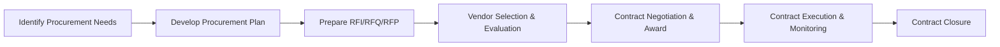

## 41.3 Contract and Procurement Documentation Aids

Effective contract administration and procurement management are cornerstones of successful project delivery. Throughout a project’s life cycle, project managers must navigate vendor agreements, control expenditures, and ensure compliant documentation. This section equips you with robust documentation aids—checklists, templates, and best practices—to guide you through selecting vendors, creating sound contracts, and closing out procurement activities.

By integrating these aids into your daily practice, you will streamline collaboration with suppliers, avoid common pitfalls, and reinforce your organization’s governance standards. These methods align with PMI’s best practices and are designed to complement the PMBOK® Guide (Seventh Edition) and the PMP® Exam Content Outline.  

---

### The Importance of Strong Procurement Documentation

Procurement documentation promotes transparency, mitigates risk, and provides a shared reference for all parties during the project. Regardless of whether your approach is agile, predictive, or hybrid, an ordered, well-structured approach to procurement documentation ensures:

• Clear communication of roles, responsibilities, and requirements.  
• Legal protection in case of disputes.  
• Defined scope, pricing structures, and acceptance criteria for deliverables.  
• Easier change management and risk handling.  

**Key Concept:** Stakeholders and vendors should have full visibility into procurement processes and obligations. This clarity fosters trust and collaboration, driving smooth project execution.

---

### Core Contract and Procurement Documents

Below is a high-level overview of some fundamental documents you often encounter in project procurement. Each plays a specific role in capturing, clarifying, and managing agreements or obligations.

• Statement of Work (SOW) or Terms of Reference (TOR)  
• Request for Information (RFI)  
• Request for Proposal (RFP)  
• Request for Quotation (RFQ)  
• Purchase Orders (POs)  
• Master Service Agreement (MSA)  
• Non-Disclosure Agreement (NDA)  
• Service Level Agreement (SLA)  

While some projects might only require a simple PO, others demand a full suite of documents. Understanding how each fits into your procurement workflow is essential to select and tailor the right combination.

---

### Recommended Outlines and Checklists for Vendor Evaluation

Vendor evaluation is a critical step to ensure you select a partner that meets or exceeds project requirements. Conducting a thorough assessment guards against hidden costs, legal risks, or performance shortfalls during implementation.

#### Vendor Evaluation Checklist

| Evaluation Area        | Description                                                    | Notes/Considerations                         |
|------------------------|----------------------------------------------------------------|----------------------------------------------|
| Technical Expertise    | Does the vendor have the required domain knowledge?           | Examine certifications, code repositories, or product demos. |
| Past Performance       | References, case studies, review of earlier collaborations    | Ask for success metrics aligned with your project.           |
| Financial Stability    | Is the vendor financially viable?                              | Annual reports, credit checks, vendor rating agencies, etc.   |
| Quality Standards      | Does the vendor meet quality frameworks (e.g., ISO 9001)?     | Check audit or compliance documentation.                      |
| Cultural Fit           | Alignment with organizational values and work culture         | Interview key vendor staff and gauge synergy.                |
| Security and Compliance| Data protection, IP rights, compliance with regulations       | NDAs, local/international laws, data privacy measures.        |
| Delivery Capability    | Can they meet timelines and resource needs?                   | Resource allocation plans, test pilots, pilot programs.       |
| Cost and Pricing Model | Transparent, competitive, aligned with budget                 | Request breakdown for labor, materials, overhead, margins.    |
| Risk Profile           | Potential disruptions, dependencies, or geopolitical risks    | Financial, political, or social risk analysis.               |

**Process Guidance:** Always tailor your vendor evaluation checklist to reflect your project’s unique requirements, constraints, and strategic goals. For complex projects, weigh the benefits of a multi-round vendor assessment, including workshops and product demonstrations.

---

### Contract Documentation Outlines

A well-drafted contract spells out the obligations, scope, obligations, and limitations for both parties. This clarity is especially critical under the pressure of tight schedules and budgets. Below is a recommended outline to ensure completeness and legal compliance (in collaboration with qualified legal counsel).

#### Generic Contract Outline

1. **Introduction and Background**  
   • Summary of the project’s purpose.  
   • Identification of parties and their addresses.  
   • Definitions of key terms and abbreviations.

2. **Scope of Work (SOW)**  
   • Detailed tasks, deliverables, and acceptance criteria.  
   • Role and responsibility matrix.  
   • Methods to handle changes or additions to scope.

3. **Project Timeline and Milestones**  
   • Milestone descriptions and due dates.  
   • Payment term triggers (e.g., on milestone completion).  
   • Procedures for schedule extensions or delays.

4. **Pricing and Payment Terms**  
   • Payment schedule, rates, currency.  
   • Additional costs (travel, overhead), if applicable.  
   • Penalties or incentives tied to performance.

5. **Quality and Performance Requirements**  
   • Applicable quality standards and operational metrics.  
   • Service-Level Agreements (SLAs).  
   • Acceptable quality levels and how deficiencies are addressed.

6. **Risk Allocation and Liability**  
   • Roles for governance of project risks.  
   • Insurance and indemnification clauses.  
   • Force majeure conditions.

7. **Change Control Mechanisms**  
   • Formal request, review, and approval processes for scope or cost changes.  
   • Impact assessment for cost, schedule, and resource adjustments.

8. **Intellectual Property (IP) Rights**  
   • Ownership and usage terms for project outputs.  
   • Copyright and confidentiality considerations.

9. **Communication and Reporting Channels**  
   • Agreed methods and frequencies of updates.  
   • Points of contact, escalation matrix.

10. **Termination and Dispute Resolution**  
   • Conditions that trigger early termination.  
   • Mediation or arbitration procedures.  
   • Governing laws and jurisdiction.

11. **Contract Closure Procedures**  
   • Formal acceptance or sign-off criteria.  
   • Archiving of records and signatory requirements.

> **Tip:** Keep contract language accessible yet legally robust. Whenever possible, use plain English (or the dominant project language) to reduce ambiguity.

---

### Contract Types and Documentation Implications

Different contract types—fixed-price, cost-reimbursable, time-and-materials (T&M), or hybrids—affect the level of cost exposure, oversight, and documentation needed.

- **Fixed-Price (FP)**: Contract spells out total deliverables for a lump sum. Documentation revolves around clearly defining scope and acceptance criteria.  
- **Cost-Reimbursable (CR)**: More detailed cost-tracking documents (invoices, time sheets, expense reports) and audits are necessary.  
- **Time-and-Materials (T&M)**: Contracts remain flexible on overall duration and cost. Documentation emphasizes activity logs, labor hours, and incremental deliverables.  
- **Hybrid**: Parts of the project use fixed-price while others adopt T&M or cost-reimbursable. Ensures adequate oversight for each portion using separate or combined documentation frameworks.

---

### The Procurement Life Cycle: A Visual Overview

Understanding the entire procurement life cycle helps you pinpoint where contract documentation fits and how it evolves. Below is a Mermaid diagram representing typical procurement stages:

- **Identify Procurement Needs**: Define which products or services are outsourced.  
- **Develop Procurement Plan**: Decide what documents and contract types align with risk appetite.  
- **Prepare RFI/RFQ/RFP**: Gather market info and request vendor proposals or quotes.  
- **Vendor Selection & Evaluation**: Use checklists, scoring models, and references.  
- **Contract Negotiation & Award**: Finalize terms, sign, and store contracts in a secure repository.  
- **Contract Execution & Monitoring**: Track vendor obligations, milestone payments, quality, and performance.  
- **Contract Closure**: Confirm deliverable acceptance, finalize payments, and archive records.

---

### Closure Tasks and Documentation

Procurement closure is the formal endpoint to all obligations under the contract. Completing this phase diligently reduces the likelihood of lingering disputes or unresolved financial issues.

Below is a recommended closure checklist:

| Closure Task                 | Description                                                      | Key Documents / Artifacts                      |
|-----------------------------|------------------------------------------------------------------|-----------------------------------------------|
| Final Deliverable Acceptance| Ensure contract deliverables meet acceptance criteria.           | Acceptance sign-off, final test certificates  |
| Financial Reconciliation    | Verify invoices, payments, rebates, or adjustments are settled.  | Payment receipts, ledger statements           |
| Lessons Learned             | Capture best practices, improvement areas, and success factors.   | Retrospective or close-out meeting minutes    |
| Contract Archive            | Preserve all contract versions, change orders, and correspondences| Central repository or e-archive               |
| Supplier Feedback           | Provide performance feedback to vendor and gather self-assessment.| Performance review documents, feedback forms  |

A well-documented closure safeguards your organization from post-project claims and fosters stronger relationships with high-performing vendors.

---

### Best Practices for Contract and Procurement Documentation

• **Standardized Templates**: Create a portfolio of templates—NDAs, MSAs, POs—and maintain them in a repository. This ensures consistency and reduces drafting errors.  
• **Traceability**: Link contract deliverables directly to project requirements. Tools such as a Requirements Traceability Matrix (RTM) can help confirm alignment.  
• **Clear Communication**: Define roles and contact points in each document. Enforcing communication protocols reduces confusion and fosters decision-making transparency.  
• **Continuous Monitoring**: Keep contracts updated with addenda or modifications as new risk factors emerge or the project scope evolves.  
• **Involve Legal and Finance**: Collaborate with relevant experts early to ensure contract terms align with local laws, corporate rules, and financial best practices.

---

### Common Pitfalls and Mitigation Strategies

**Pitfall**: Vague Scope in Contract  
• **Mitigation**: Always double-check contract scope sections against the project scope statement and deliverables. Include acceptance criteria in your SOW.

**Pitfall**: Overlooking Intellectual Property Clauses  
• **Mitigation**: If the project involves proprietary technology or data, ensure IP ownership, licensing, and usage rights are explicitly defined in the contract.

**Pitfall**: Undocumented Change Orders  
• **Mitigation**: Implement a formal change control process. Every scope, schedule, or budget shift must be documented, approved, and eventually archived.

**Pitfall**: Poor Vendor Relationship Management  
• **Mitigation**: Ensure regular status meetings, promptly address disputes, and maintain respectful communication channels. Relationship breakdowns often derive from unclear or changing expectations.

---

### Practical Example: Software Implementation Case Study

**Scenario**: A medium-sized financial firm invests in a new software platform to manage customer onboarding.  

1. **Creating RFP**: The project manager (PM) crafts a detailed RFP emphasizing security, compliance with financial regulations, and evidence of successful past implementations.  
2. **Vendor Evaluation**: Three vendors respond. The PM employs a weighted scoring model, factoring cost (20%), performance reliability (30%), domain experience (30%), and local presence (20%).  
3. **Contract Negotiation**: The preferred vendor proposes a time-and-materials approach. To mitigate cost risk, the PM sets a “not-to-exceed” cap, detailed in the contract SOW.  
4. **Execution & Monitoring**: The PM uses milestone-based payments and weekly progress dashboards to track development.  
5. **Closure**: Once final user acceptance testing (UAT) is signed off, the contract closure document is completed, ensuring financial reconciliation and post-mortem analysis.

**Key Lesson**: Customizing a T&M contract with a cost cap and robust SOW can help manage scope creep and build trust in agile environments.

---

### Using Tools and Software Solutions

Numerous software solutions exist to collate and automate procurement documentation:

• **Electronic Signature Platforms**: DocuSign, Adobe Acrobat Sign  
• **Contract Management Systems (CMS)**: Icertis, SAP Ariba, Coupa  
• **Collaboration Tools**: Microsoft Teams, Slack, or Trello boards for real-time vendor communication  
• **Enterprise Resource Planning (ERP)**: Oracle, SAP for integrated procurement, finance, and inventory tracking  

While adopting specialized tools can accelerate procurement cycles, do not overlook fundamental contract management principles. People, processes, and documents remain critical success factors.

---

### Further Exploration

• **PMBOK® Guide – Seventh Edition**: Delve into the Performance Domains and Principles for risk mitigation and stakeholder involvement.  
• **Agile Practice Guide**: For understanding how agile contracts emphasize collaboration and incremental benefit in dynamic environments.  
• **Procurement Management Whitepapers** on PMI.org: In-depth discussions on trends, metrics, and best practices around modern procurement challenges.  
• **Legal and Compliance Training**: Consider short courses focused on contract law and regulatory frameworks in your industry.

---

## Test Your Knowledge on Contract and Procurement Documentation



### Which document typically outlines a project’s deliverables, acceptance criteria, and scope boundaries?

- [x] Statement of Work (SOW)
- [ ] Purchase Order (PO)
- [ ] Non-Disclosure Agreement (NDA)
- [ ] Risk Register

> **Explanation:** The Statement of Work defines deliverables, scope, timelines, and acceptance criteria. POs simply provide authorization for purchase, and an NDA covers confidentiality.

### What is a best practice when evaluating prospective vendors?

- [x] Conducting a multi-round technical and financial assessment
- [ ] Selecting the vendor with the lowest bid without further checks
- [ ] Skipping vendor references to save time
- [ ] Signing a contract before the vendor evaluation is completed

> **Explanation:** Multi-round (or iterative) assessments ensure that the vendor’s technical capabilities and financial stability align with project needs. Evaluations lower the risk of performance or compliance issues.

### Which contract type usually requires the highest level of cost tracking and auditing?

- [ ] Fixed Price
- [x] Cost-Reimbursable
- [ ] Lump Sum
- [ ] Firm-Fixed Price (FFP)

> **Explanation:** Cost-reimbursable agreements obligate the buyer to cover allowable costs plus a fee. Rigorous cost-tracking and auditing are usually essential to avoid overcharging or hidden expenses.

### In the procurement life cycle, which step focuses on negotiating final terms and conditions with the chosen vendor?

- [ ] Vendor Selection & Evaluation
- [x] Contract Negotiation & Award
- [ ] Contract Execution & Monitoring
- [ ] Contract Closure

> **Explanation:** After vendor evaluation, the buyer finalizes terms, pricing, schedules, and obligations during the negotiation and award stage, leading to contract signing.

### Which of the following should be included in the scope section of a contract?

- [x] Detailed tasks and acceptance criteria
- [ ] Payment schedules only
- [x] Role and responsibility matrix
- [ ] Explanation of PMI’s exam requirements

> **Explanation:** A robust contract scope section outlines what is included, acceptance criteria, and roles. Payment schedules typically belong to the payment terms, and PMI’s exam details are not relevant to project scope.

### What is the main purpose of contract closure documentation?

- [x] Formally complete all obligations and address any outstanding issues
- [ ] Prolong the project timeline for extended billing
- [ ] Avoid final vendor payment
- [ ] Replace the Statement of Work

> **Explanation:** Closure documentation ensures all deliverables are accepted, finances are settled, and administrative and legal tasks are final. This fosters clarity and completion.

### Which system is commonly used to unify financial and procurement processes under one platform?

- [x] Enterprise Resource Planning (ERP)
- [ ] Version Control System (VCS)
- [x] Contract Management System (CMS)
- [ ] Customer Relationship Management (CRM)

> **Explanation:** ERP systems integrate finance, inventory, and procurement. Contract Management Systems specifically manage contract lifecycles. Both can be used, typically in tandem, to improve efficiency.

### Which clause ensures that both parties are temporarily excused from performing obligations under extraordinary events like natural disasters?

- [x] Force Majeure
- [ ] Indemnification
- [ ] Non-Disclosure
- [ ] Quality Assurance

> **Explanation:** Force majeure clauses address unforeseeable events that interrupt contract performance. Indemnification pertains to compensating losses, while NDAs relate to confidentiality.

### What approach helps manage changes to the contract scope effectively?

- [x] Formal change control process with impact analysis
- [ ] Verbal discussions without documentation
- [ ] Postponing the discussion until after project closure
- [ ] Allowing the vendor to redefine scope unilaterally

> **Explanation:** A formal change management process that addresses schedule, budget, and resource impacts ensures transparency and alignment. Informal approaches can create confusion or disputes later.

### Contract closure requires acceptance sign-off, full financial settlement, and lessons learned. True or false?

- [x] True
- [ ] False

> **Explanation:** These elements solidify contract closure. Even if there were no major conflicts, documenting acceptance, confirming financial reconciliation, and noting lessons learned ensures a clean administrative finish.



---

## PMP Mastery: 1500+ Hard Mock Exams with Full Explanations 

Looking to crush the PMP exam with confidence? Dive deep into 6 rigorous mock exams totaling 1500+ advanced-level questions, each accompanied by clear, step-by-step explanations. Hone your test-taking strategies, master complex topics, and build the resilience you need on exam day. Perfect for serious PMs aiming beyond fundamentals.

Enroll now:  
[PMP Mastery: 1500+ Hard Mock Exams with Exceptional Clarity & Full Explanations](https://www.udemy.com/course/pmp-2025/?referralCode=CF83A54BC86BE27F9AFE)

_Disclaimer: This course is not endorsed by or affiliated with the PMI examination authority. All content is provided purely for educational and preparatory purposes._
