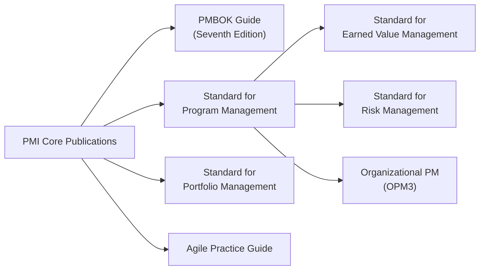

## 42.1 PMI Publications and Standards

Project Management Institute (PMI) publications are foundational references for anyone aspiring to excel in project management. These documents outline globally recognized standards, ethical guidelines, methodologies, and advanced practices that guide practitioners throughout their careers. They also serve as official study references for the Project Management Professional (PMP®) exam and other PMI certification exams. This section explores the most influential PMI publications, illuminating how each supports effective project management and amplifies your knowledge base well beyond the exam context.

### Importance of PMI Publications for PMP® Candidates

PMI’s family of standards and guides provides structure and clarity for managing complexity in modern projects. While the PMP® exam primarily references the content aligned with the PMBOK® Guide (Seventh Edition) and the Exam Content Outline, familiarity with the broader suite of PMI publications can boost your confidence and strengthen your real-world skill sets.

• They clarify roles, responsibilities, and ethical considerations.  
• They unify terminology and standard practices to minimize confusion across industries.  
• They offer benchmarks for performance, risk management, program strategy, portfolio optimization, and more.

This alignment ensures that PMI certifications hold global recognition. By deepening your understanding of these documents, you are better prepared to manage diverse project environments and demonstrate higher professional credibility.

---

### Core PMI Publications and Foundational Standards

PMI publishes a variety of foundational standards that define leading project management principles and techniques. Below are some of the most prominent ones:

#### A Guide to the Project Management Body of Knowledge (PMBOK® Guide), Seventh Edition

The PMBOK® Guide encapsulates PMI’s hallmark principles and performance domains. Shifting from a purely process-based model to principles-based and value-delivery approaches in the Seventh Edition, this guide provides:

• Twelve project management principles that underscore professional values (e.g., stewardship, system thinking, adaptation).  
• Eight performance domains (Stakeholder, Team, Development Approach and Life Cycle, Planning, Project Work, Delivery, Measurement, Uncertainty) for holistic management.  
• Expanded coverage of agile, hybrid, and iterative approaches.  
• Integration with PMIstandards+ for customizable, context-driven practices.

Although the PMP® exam evolves in alignment with updated PMI materials, the PMBOK® Guide remains the most essential reference. Candidates often use it as a baseline for acquiring and reinforcing core project management knowledge.

#### The Standard for Program Management

Program management focuses on coordinating related projects to achieve strategic benefits. This standard presents frameworks for:

• Program life cycles that align multiple projects under unified governance.  
• Benefits realization and interdependency management.  
• Stakeholder engagement across broad organizational boundaries.  
• Sustained value delivery over extended periods.

By understanding the principles of program management, project managers can anticipate strategic shifts, optimize resource allocation, and align project outputs with overarching organizational objectives.

#### The Standard for Portfolio Management

Portfolios group multiple programs, projects, and operational activities to meet strategic aims. The Standard for Portfolio Management helps leaders:

• Prioritize investments, balancing risk and return.  
• Align portfolio components with long-term strategic goals.  
• Govern effectively at the enterprise level, ensuring resources create maximum value.  

Gaining insight into portfolio management fosters a wider strategic perspective. Project managers who recognize their work’s contribution to larger business objectives are better equipped to deliver meaningful outcomes that resonate with senior stakeholders.

#### Agile Practice Guide

Developed collaboratively by PMI and the Agile Alliance, the Agile Practice Guide is a comprehensive reference for agile principles, methods, and tools. It covers:

• The Agile Manifesto and its relevance to modern projects.  
• Major frameworks (Scrum, Kanban, XP) and scaling methods (SAFe®, LeSS, Disciplined Agile®).  
• Guidance for blending agile with predictive project management in hybrid models.  
• Techniques for iterative planning, product backlog management, and adaptive leadership.

For the PMP® exam, familiarity with agile concepts has grown increasingly important. This guide ensures well-rounded awareness and supports the exam’s emphasis on situational, domain-based questions involving agile or hybrid elements.

---

### Practice Standards and Guides

In addition to the core standards, PMI offers specialized practice standards that dive deeper into particular areas of project management. These are vital references for addressing complex topics that might appear in both the PMP® exam and large-scale real-world initiatives.

#### The Standard for Earned Value Management (EVM)

Earned Value Management is a systematic approach that integrates scope, schedule, and cost data:

• Evaluates project performance through metrics like Cost Performance Index (CPI = EV ÷ AC) and Schedule Performance Index (SPI = EV ÷ PV).  
• Enables data-driven forecasts for project completion costs and timelines.  
• Facilitates the identification of variances early, prompting proactive corrective actions.

Exam and practical relevance: EVM is often featured in the PMP® exam calculations. Mastery of these formulas and the critical thinking behind cost and schedule trends is invaluable for controlling complex projects in real life.

#### The Standard for Risk Management

This standard delves into risk management principles and processes:

• Identifying both threats and opportunities.  
• Using qualitative and quantitative techniques (e.g., probability-impact matrix, decision tree analysis) for robust assessment.  
• Developing tailored response strategies.  

Its best practices extend to all levels of project or program complexity. Familiarity with risk management standards fosters resilience, adaptability, and thorough planning—all highly emphasized in PMI’s performance domains.

#### The Standard for Organizational Project Management (OPM3)

OPM3 (Organizational Project Management Maturity Model) outlines an integrated framework for aligning project, program, and portfolio management practices with organizational policy and strategy. The model:

• Assesses maturity across domains—Project, Program, Portfolio, and Organizational Enablers.  
• Recommends improvement paths to boost efficiency, governance, and change management.  

Understanding OPM3 concepts helps project managers appreciate how standardized approaches can evolve into sophisticated enterprise systems, maximizing value across multiple initiatives.

#### Other Specialized Practice Standards

• Practice Standard for Scheduling: Establishes methods for developing and maintaining effective project schedules.  
• Navigating Complexity: A Practice Guide: Offers practical advice for dealing with ambiguous, emergent issues across large, intricate projects.  
• Benefits Realization Management: Aligns project outputs with tangible benefits throughout the life cycle.

---

### PMI’s Code of Ethics and Professional Conduct

Beyond technical guidelines, PMI upholds high standards for professional responsibility. The Code of Ethics and Professional Conduct revolves around four fundamental values:

• Responsibility  
• Respect  
• Fairness  
• Honesty  

PMP® candidates commit to adhering to these ethical standards, ensuring consistent, transparent, and equitable conduct in all project scenarios. Exam questions may address ethical dilemmas, so understanding these guidelines is essential.

---

### Visualizing the Relationships Among PMI Standards

To see how PMI’s core publications and practice standards interconnect, the following Mermaid diagram highlights their alignment under the PMI umbrella:

In this diagram:  
• PMI Core Publications (A) provide overarching frameworks.  
• Sub-standards (B, C, D, E) branch out to address project-specific or domain-specific considerations.  
• Practice Standards (F, G, H) dig deeper into the technical or strategic areas.

---

### Practical Application and Case Examples

PMI standards carry immense relevance beyond passing an exam. Below are a few scenarios:

• A global pharmaceutical company deploying a portfolio of initiatives to accelerate drug discovery could tap into the Standard for Portfolio Management. By prioritizing high-impact research projects, they can channel funding to the most promising initiatives and retire low-value ones early.

• A financial services firm adopting agile transformations at scale might rely on the Agile Practice Guide and OPM3 to systematically implement iterative development cycles and measure organizational readiness.

• A government contractor executing a complex infrastructure program might leverage Earned Value Management (EVM) for cost and schedule control. EVM metrics like CPI and SPI offer objective performance tracking, enabling data-driven re-planning.

• A cross-department initiative that integrates multiple IT systems can utilize program management standards to handle numerous interdependent projects. A well-defined program governance structure enables cohesive resource allocation and risk oversight.

In all these examples, referencing pertinent PMI standards ensures consistency, industry alignment, compliance with best practices, and the ability to defend project decisions to stakeholders.

---

### Common Pitfalls and Strategies for Success

1. Overreliance on One Publication  
   • Pitfall: Some practitioners assume the PMBOK® Guide alone is sufficient for complex environments.  
   • Strategy: Supplement your knowledge with specialized standards, especially if your projects require advanced scheduling, risk management, or agile-scaled solutions.

2. Assuming Pure Predictive or Agile Approaches  
   • Pitfall: Over-adherence to a single approach can stifle the flexibility needed for dynamic projects.  
   • Strategy: Explore hybrid strategies outlined in multiple PMI publications, like the Agile Practice Guide and PMBOK® Guide, Seventh Edition. 

3. Ignoring Ethical Implications  
   • Pitfall: Technical expertise may overshadow ethical considerations, leading to compromised project outcomes and reputational risks.  
   • Strategy: Internalize the Code of Ethics and Professional Conduct. Contemplate ethical ramifications for each decision.

4. Failing to Tailor  
   • Pitfall: Applying standards verbatim without adapting to project context can create unnecessary rigor.  
   • Strategy: Use PMIstandards+ or the PMBOK® Guide’s tailoring and value-delivery focus to ensure appropriate levels of governance and processes.

5. Neglecting Updates and Continuous Learning  
   • Pitfall: With evolving editions, some practitioners cling to outdated practices.  
   • Strategy: Keep abreast of PMI updates, join study groups, and engage in continuous learning to maintain current best practices.

---

### Leveraging PMI’s Digital Resources

PMI has expanded its digital ecosystem, providing resources that enhance both the study experience and on-the-job application:

• PMIstandards+ gives personalized recommendations, case studies, and templates aligned with PMI’s entire library of standards.  
• The Knowledge Shelf on PMI.org provides user-generated articles and lessons learned that can shed light on unusual or niche topics.  
• Webinars, online courses, and local chapter events facilitate professional networking and up-to-date knowledge sharing.

---

### Recommended References for Deeper Exploration

• PMI.org official website, for the latest standards and professional development resources.  
• “A Guide to the Project Management Body of Knowledge (PMBOK® Guide) – Seventh Edition” (ISBN: 978-1628256642).  
• “The Standard for Program Management – Fourth Edition.”  
• “The Standard for Portfolio Management – Fourth Edition.”  
• “The Agile Practice Guide” (co-published with Agile Alliance).  
• “Practice Standard for Earned Value Management.”  
• “Practice Standard for Scheduling.”  
• “Navigating Complexity: A Practice Guide.”  

Integrating these references into your study plan not only prepares you for the PMP® exam but also ensures you can adapt your approach across diverse project landscapes.

---

## Test Your Knowledge: PMI Publications and Standards Quiz



### Which publication focuses on principles-based and value-delivery approaches, particularly in its latest edition?

- [ ] Code of Ethics and Professional Conduct
- [x] PMBOK Guide (Seventh Edition)
- [ ] Standard for Program Management
- [ ] Standard for Portfolio Management

> **Explanation:** The PMBOK Guide (Seventh Edition) revamped its framework to emphasize principles-based, value-focused practices beyond the prior process-centric approach.

### Which PMI standard is most useful for managing initiatives that generate collective benefits across interdependent projects?

- [ ] Standard for Portfolio Management
- [x] Standard for Program Management
- [ ] Standard for Organizational Project Management (OPM3)
- [ ] Agile Practice Guide

> **Explanation:** The Standard for Program Management sets out methodologies for coordinating related projects in pursuit of broader, strategic benefits.

### Which practice standard offers guidelines for integrating scope, schedule, and cost data to assess project performance?

- [ ] Code of Ethics and Professional Conduct
- [ ] Standard for Program Management
- [x] Standard for Earned Value Management
- [ ] Agile Practice Guide

> **Explanation:** The Standard for Earned Value Management details how to measure project health using integrated metrics such as CPI and SPI.

### What is the primary emphasis of PMI’s Code of Ethics and Professional Conduct?

- [x] Maintaining responsibility, respect, fairness, and honesty
- [ ] Executing a project strictly by the PMBOK Guide
- [ ] Cost reduction and schedule optimization
- [ ] Digital transformation and Agile leadership

> **Explanation:** The Code of Ethics and Professional Conduct demands high ethical standards, ensuring responsible, fair, and honest behavior in the project management profession.

### Which standard or guide should you consult for best practices related to scaling agile across an organization?

- [x] Agile Practice Guide
- [ ] PMBOK Guide (Seventh Edition)
- [x] Disciplined Agile® (referenced in the Agile Practice Guide)
- [ ] Standard for Portfolio Management

> **Explanation:** The Agile Practice Guide includes discussions on scaling agile frameworks such as SAFe®, LeSS, and Disciplined Agile®. It complements the PMBOK Guide by introducing adaptive methods at scale.

### Which publication is designed to help organizations assess and enhance their maturity across project, program, and portfolio management?

- [ ] PMBOK Guide (Seventh Edition)
- [x] Organizational PM Maturity Model (OPM3)
- [ ] The Standard for Risk Management
- [ ] Practice Standard for Scheduling

> **Explanation:** OPM3 details maturity models and improvement processes to streamline how portfolios, programs, and projects are governed.

### What is a key benefit of the Standard for Portfolio Management?

- [x] Aligning project investments with organizational strategy
- [ ] Creating continuous improvement loops at the project task level
- [x] Improving decision-making for resource distribution
- [ ] Detailing only the process groups for project management

> **Explanation:** By prioritizing investments and aligning initiatives with enterprise strategies, portfolio management optimizes resource distribution and decision-making for maximum value.

### Which reference would you primarily review for building a risk register and performing risk response planning?

- [ ] Code of Ethics and Professional Conduct
- [ ] Standard for Program Management
- [x] Standard for Risk Management
- [ ] Agile Practice Guide

> **Explanation:** The Standard for Risk Management offers in-depth direction for risk identification, analysis, and response planning.

### Which guide co-developed by PMI addresses iterative and incremental strategies while also bridging predictive and adaptive methodologies?

- [ ] Standard for Earned Value Management
- [ ] PMBOK Guide (Seventh Edition)
- [x] Agile Practice Guide
- [ ] Standard for Program Management

> **Explanation:** The Agile Practice Guide, co-created with the Agile Alliance, specifically focuses on agile methodologies and how they integrate with traditional frameworks.

### A project manager commits to acting fairly, responsibly, and honestly based on PMI’s ethical guidelines. Is this statement true or false?

- [x] True
- [ ] False

> **Explanation:** PMI’s Code of Ethics and Professional Conduct requires certified professionals to uphold these values at all times in their decision-making and stakeholder interactions.



---

## PMP Mastery: 1500+ Hard Mock Exams with Full Explanations 

Looking to crush the PMP exam with confidence? Dive deep into 6 rigorous mock exams totaling 1500+ advanced-level questions, each accompanied by clear, step-by-step explanations. Hone your test-taking strategies, master complex topics, and build the resilience you need on exam day. Perfect for serious PMs aiming beyond fundamentals.

Enroll now:  
[PMP Mastery: 1500+ Hard Mock Exams with Exceptional Clarity & Full Explanations](https://www.udemy.com/course/pmp-2025/?referralCode=CF83A54BC86BE27F9AFE)

_Disclaimer: This course is not endorsed by or affiliated with the PMI examination authority. All content is provided purely for educational and preparatory purposes._
