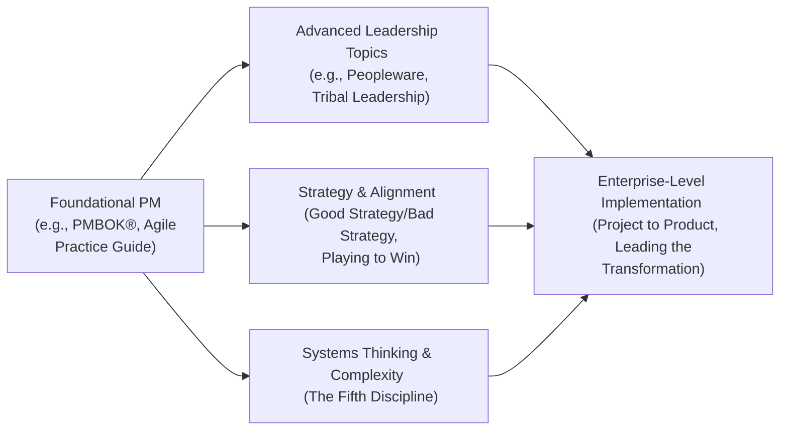

## 42.2 Books and Articles on Advanced Project Management

Reading widely and continuously is one of the best ways to stay on the cutting edge of project management (PM) principles and practices. While much of this book has focused on the PMP® exam and its primary references, advanced PM professionals can benefit immensely from exploring additional sources that dig deeper into leadership, strategic alignment, agile ideation, and beyond.

This section highlights thoroughly curated books and articles that are commonly referenced in graduate-level courses, executive leadership programs, and advanced corporate workshops. These materials go beyond the fundamentals, offering deep dives into enterprise strategy, complex adaptive systems, sophisticated risk management, large-scale agile transformations, and leadership psychology. Our goal is to spark your curiosity, challenge you to think critically, and inspire the next phase of your professional growth.

---

### Why Advanced Readings Matter for the Modern Project Manager

Today’s project environments transcend traditional boundaries. Organizations often seek leaders who can navigate the blurred lines between business strategy (see Chapter 6.3, “Business Environment Domain”), agile responsiveness (see Chapter 24, “Agile Foundations”), and cross-cultural or geopolitical complexity (see Chapter 8.4, “Virtual Teams and Cross-Cultural Collaboration”). The following advanced readings bridge these gaps and enable you to:

• Cultivate strategic thinking skills to align projects, programs, and portfolios with organizational objectives (see Chapter 35, “Portfolio and Program Management Intersections”).  
• Develop leadership styles that foster psychological safety, innovation, and self-organizing teams (see Chapter 33, “Advanced Leadership and Team Development”).  
• Integrate advanced agile frameworks (Scrum, Kanban, SAFe®, LeSS, Disciplined Agile®) with traditional PMBOK® knowledge areas for hybrid solutions (see Chapter 27, “Hybrid Approaches”).  
• Understand and mitigate risk in complex adaptive systems (see Chapter 32, “Complex Adaptive Systems and Systems Thinking”).  

---

### Core Advanced Project Management Books

#### 1) “Project to Product” by Mik Kersten

• Focus: Transforming IT delivery into a streamlined product-based approach, bridging the gap between enterprise business models and agile software development.  
• Why It Matters: Kersten offers a Flow Framework™ to address systemic bottlenecks, an approach that complements the discussions of complexity and systems thinking in Chapter 32. By treating your project pipeline as an adaptive ecosystem, you’ll learn to align project metrics with core business goals.

#### 2) “Agile Estimating and Planning” by Mike Cohn

• Focus: Sophisticated techniques for estimating and planning agile projects, including story points, velocity tracking, and release forecasts.  
• Why It Matters: Chapters 18 (“Schedule Management”) and 19 (“Cost Management”) emphasize balancing time and budget constraints. Cohn’s text gives deeper insights into the interplay of iterative refinement, risk buffers, and the unpredictability inherent in agile environments.

#### 3) “Large-Scale Scrum: More with LeSS” by Craig Larman and Bas Vodde

• Focus: Scaling Scrum principles and practices to organizations with multiple, complex product teams.  
• Why It Matters: Chapter 25 (“Agile Frameworks and Methodologies”) introduces several scaled frameworks. This book dives deeper into orchestrating cross-team synchronization, governance, and coordination while retaining the core simplicity of scrum.

#### 4) “The Fifth Discipline: The Art & Practice of the Learning Organization” by Peter M. Senge

• Focus: Systems thinking, shared vision, mental models, team learning, and personal mastery in organizational development.  
• Why It Matters: Chapter 32 (“Complex Adaptive Systems and Systems Thinking”) encourages systems thinking to navigate complexity. Senge’s book is a cornerstone in understanding how project teams can adapt intelligently to rapidly changing environments and emergent behaviors.

#### 5) “Leading the Transformation: Applying Agile and DevOps Principles at Scale” by Gary Gruver, Tommy Mouser, and Penny Wyatt

• Focus: Moving beyond pilot agile teams to embedded organizational agility through DevOps, continuous integration, and best practices in large enterprises.  
• Why It Matters: This provides a blueprint for large or heavily regulated organizations seeking both the speed of agile (see Chapter 9, “Development Approach and Life Cycle Performance Domain”) and robust compliance or security controls (see Chapter 31, “Advanced Compliance and Regulatory Considerations”).

#### 6) “Peopleware: Productive Projects and Teams” by Tom DeMarco and Tim Lister

• Focus: How organizational culture, workspace environment, and managerial policies impact team productivity.  
• Why It Matters: In Chapter 8 (“Team Performance Domain”), we discuss building high-performing teams. Peopleware elaborates on the sociological and interpersonal aspects—factors like privacy, flow state, and group cohesion—often overshadowed by process or tools.

#### 7) “Tribal Leadership: Leveraging Natural Groups to Build a Thriving Organization” by Dave Logan, John King, and Halee Fischer-Wright

• Focus: The concept of “tribes” in organizations—groups bound by shared values, language, and behaviors—and how leaders can upgrade a group’s “cultural stage.”  
• Why It Matters: Ties in with advanced leadership theories in Chapter 33: it clarifies how to lift a team from competitive internal dynamics to a high-cooperation, vision-driven culture.  

---

### Strategic Leadership and Organizational Alignment

#### 1) “Good Strategy/Bad Strategy” by Richard Rumelt

• Focus: Clarity in strategic thinking, identifying kernels of good strategy, diagnosing organizational challenges, and crafting coherent action plans.  
• Why It Matters: Chapter 28 (“Aligning Projects with Organizational Strategy”) underscores the importance of well-defined strategies. Rumelt’s frameworks help project leaders glimpse the difference between mere ambition and true, actionable strategy.

#### 2) “Playing to Win” by A.G. Lafley and Roger L. Martin

• Focus: Proven leadership tools and frameworks to guide strategic decisions within large and small organizations.  
• Why It Matters: Discusses how to position projects, products, and services in ways that drive competitive advantage—insights that support the business environment domain (see Chapter 6.3) and benefits realization (see Chapter 29).

#### 3) “Blue Ocean Strategy” by W. Chan Kim and Renée Mauborgne

• Focus: Differentiation through value innovation, creating uncontested market space and making competition irrelevant.  
• Why It Matters: Many PMs operate within hyper-competitive markets, pushing them to reinvent product offerings. This aligns with agile frameworks that encourage iterative experimentation (Chapter 24) and continuous improvement (Chapter 20.3).

---

### Advanced Agile, Hybrid, and Lean Readings

#### 1) “Disciplined Agile Toolkit” by Scott Ambler and Mark Lines

• Focus: A wide-ranging set of agile, lean, and DevOps strategies to tailor solutions for your organization.  
• Why It Matters: Chapter 27 (“Hybrid Approaches”) outlines ways to mix predictive and agile methods. The Disciplined Agile Toolkit goes further, providing a meta-framework that helps you adapt based on context, scale, and complexity.

#### 2) “Kanban: Successful Evolutionary Change for Your Technology Business” by David J. Anderson

• Focus: Kanban as a method to manage and improve service delivery workflows, focusing on limiting work-in-progress and continuous flow.  
• Why It Matters: Kanban principles appear in Chapter 25.2. Anderson’s canonical text helps advanced PMs design, visualize, and progressively enhance team throughput and predictability, supporting the Measurement Performance Domain (see Chapter 13).

#### 3) “Scaling Lean & Agile Development: Thinking and Organizational Tools for Large-Scale Scrum” by Craig Larman

• Focus: Complex organizational design in large-scale agile transformations, especially in product development.  
• Why It Matters: Spans agile at scale with real-world case studies that demonstrate systemic changes needed to support iterative, incremental delivery across distributed teams (Chapter 8.4, “Virtual Teams,” and Chapter 27, “Hybrid Approaches”).

---

### Articles for Ongoing Inspiration

Beyond books, articles provide quick yet potent insights into cutting-edge research, emerging best practices, and industry-specific cases.

1) **Harvard Business Review (HBR) Articles on Leadership**  
   - “Level 5 Leadership: The Triumph of Humility and Fierce Resolve” by Jim Collins  
     • Explores how humility in leadership builds enduring success. Useful for reflection on advanced leadership capabilities (Chapter 33).  
   - “The New Product Development Game” by Hirotaka Takeuchi and Ikujiro Nonaka  
     • Seminal piece that inspired Scrum, relevant to iterative project environments (Chapters 25 and 26).

2) **MIT Sloan Management Review**  
   - “Is It Real, Can We Win, Is It Worth Doing?” by George S. Day  
     • A strategic lens for evaluating projects, connecting to feasibility, competitive advantage, and ROI (Chapter 28).  
   - “Embrace Complexity, Drive Innovation” by Rita McGrath  
     • Explores how leaders can set conditions for complex systems to generate innovative solutions (Chapter 32).

3) **PMI White Papers and Articles**  
   - “Benefits Realization Management: A Practice Guide” by PMI  
     • Reinforces Chapter 29’s emphasis on tracking and delivering project benefits throughout the life cycle.  
   - “Pulse of the Profession™” annual reports  
     • Offers global insights on emerging trends in advanced PM, bridging current practices with future outlooks.

4) **IEEE Engineering Management Review**  
   - “Systemic Risk in Complex Project Networks” by Salim Sheikh  
     • Discusses advanced quantitative risk analysis, bridging well with Chapter 14 on uncertainty and risk.  

---

### Case Study Highlights: Bridging Theory and Practice

To illustrate how these resources can be applied in real-world scenarios, consider the following succinct examples:

• **Global Telecommunications Infrastructure Project:** Under pressure to accelerate 5G deployment, a large telecom faced hundreds of interdependent technical and regulatory workflows (see Chapter 31 on compliance). By adopting Larman and Vodde’s scalable Scrum principles and flow-based metrics from David J. Anderson’s Kanban approach, the telecom reduced rework by 30% and streamlined compliance audits.  

• **Healthcare Product Launch:** A medical device startup pivoted to agile sprints for R&D while maintaining a stage-gate model for FDA regulatory checkpoints. Using “Disciplined Agile Toolkit” by Ambler and Lines, the team created a hybrid approach customized to the high-stakes environment.

• **Retail E-Commerce Overhaul:** A retail giant overhauled their legacy platform to handle omnichannel commerce. Drawing on “Project to Product” concepts from Kersten, the PMO established cross-functional product teams that each owned a slice of customer journey, driving a 20% faster release cycle and reducing cart abandonment.

These cases underscore the synergy between advanced readings, proven frameworks, and practical knowledge. No single method or text is a silver bullet. Instead, your continuous reading and reflection—along with experimentation in your organizational context—fuels long-term achievement.

---

### Visualizing Your Advanced PM Reading Roadmap

The journey from fundamental PM skills to advanced mastery often progresses through iterative growth in leadership, strategy, and systems thinking. Below is a simple Mermaid diagram summarizing how these broad categories interrelate with sample references:

In this roadmap, foundational PM knowledge leads into three advanced pillars—leadership, strategic alignment, and systems thinking—before culminating in enterprise-level application. These threads merge to create a holistic, modern PM approach.

---

### Best Practices and Common Pitfalls

• **Practice Reflective Reading:** Don’t just passively absorb. Reflect on how each concept applies to your projects. Ask yourself “How can I adapt this idea for my context?” or “What pitfalls must I watch for when implementing large-scale agile?”  
• **Implement in Iterations:** Attempt bite-sized experiments within your team or department before rolling them out across the organization. Overhauls can be disruptive if not properly supported (see Chapter 30, “Organizational Change Management”).  
• **Beware of Fad Over-adoption:** Advanced frameworks, especially in agile transformations, can falter when organizations implement them superficially. Attack the root cause of your inefficiencies rather than adopting new methods simply because they’re popular.  
• **Champion Organizational Learning:** Encourage lessons learned repositories (see Chapter 11.3 on knowledge transfer). Engage in transparent dialogues about what worked, didn’t work, and how to improve.  
• **Stay Current with Industry Publications:** Fields like AI, machine learning, data analytics, and remote collaboration (see Chapter 34) continue to rapidly evolve. Monitoring journals, blog posts, and research papers ensures you remain relevant.

---

### Where to Go from Here

• **Join Professional Associations & Forums:** Interact with like-minded peers, attend conferences, and discuss newly published articles. The Project Management Institute (PMI), Scrum Alliance, and Lean Kanban University host meetups and events that let you exchange ideas with practitioners.  
• **Consider Specialized Certifications:** If you’re drawn to agile or strategic PM, designations like Disciplined Agile Senior Scrum Master (DASSM) or PMI Agile Certified Practitioner (PMI-ACP) can deepen your expertise.  
• **Focus on Leadership Development (Chapter 33):** Expand soft skills like emotional intelligence, cultural intelligence, and conflict resolution. These intangible capabilities often spell the difference between good and extraordinary project outcomes.  

---

### References and Further Exploration

Below is a quick-reference table summarizing each major book and article alongside its core domain focus:

| Title & Author                  | Domain Focus (Key Chapters)                            | Summary of Contribution                                                                 |
|--------------------------------|--------------------------------------------------------|------------------------------------------------------------------------------------------|
| Project to Product (M. Kersten)| Systems Thinking (32), Enterprise Implementation (35)  | Flow Framework™ for bridging business goals & agile dev                                  |
| Agile Estimating & Planning (M. Cohn) | Schedule (18), Cost (19), Agile (24)           | In-depth look at agile estimations, velocity, and forecasting                            |
| Large-Scale Scrum (C. Larman & B. Vodde) | Agile Scaling (25), Hybrid (27)            | Organization-wide scrum implementation & scaling principles                              |
| The Fifth Discipline (P. Senge)| Complexity (32), Team Building (8), Leadership (33)    | Foundational systems thinking for creating learning organizations                        |
| Leading the Transformation (G. Gruver et al.)| DevOps (34), Hybrid (27)                | Integrates agile & DevOps for enterprise-level continuous delivery                        |
| Peopleware (T. DeMarco & T. Lister)| Team Performance (8), Culture (33)               | Sociology of teams, environment, and productivity                                       |
| Tribal Leadership (D. Logan et al.)| Leadership Behavior (33), Team Culture (8)        | Stage-based understanding of organizational “tribes” and how to uplift them             |
| Good Strategy/Bad Strategy (R. Rumelt)| Strategy Alignment (28), Benefits (29)       | The core elements of successful strategy vs. superficial slogans                         |
| Playing to Win (A.G. Lafley & R. Martin)| Strategy Formulation (28, 29), Business Value (6.3) | Tangible frameworks for strategic choices and winning in the marketplace          |
| Blue Ocean Strategy (Kim & Mauborgne)| Innovation & Markets (28, 29), Agile Tests (26)| Differentiation and uncontested market spaces                                           |
| Disciplined Agile Toolkit (S. Ambler & M. Lines)| Hybrid (27), Agile at Scale            | Customizable approach for various contexts                                              |
| Kanban (D. Anderson)| Flow Management (25), Measurement (13)                           | Visualization, WIP limits, and continuous improvement in service delivery               |
| Scaling Lean & Agile Development (C. Larman)| Agile Scaling (25,27), Complexity (32)   | Deep dive into large-scale product strategy                                             |
| HBR & MIT SMR Articles          | Varies (Leadership, Strategy, Complexity)            | Peer-reviewed insights, frameworks, and case studies for advanced PM                    |
| PMI White Papers, Pulse of the Profession™ | Risk (14), Business Environment (6.3)   | Ongoing research, global PM trends, predictive analytics                                |

Use these references in tandem with your existing PMBOK® and Agile Practice Guide materials. Each resource touches upon different aspects of advanced project management, from refined leadership approaches to complex system integrations, equipping you to handle challenges in a multifaceted environment.

---

## Test Your Knowledge: Advanced Project Management Readings



### Which of the following books primarily focuses on applying systems thinking to organizational learning and adaptability?
- [ ] Peopleware by Tom DeMarco and Tim Lister
- [x] The Fifth Discipline by Peter M. Senge
- [ ] Good Strategy/Bad Strategy by Richard Rumelt
- [ ] Tribal Leadership by Dave Logan et al.

> **Explanation:** "The Fifth Discipline" lays out key disciplines (systems thinking, personal mastery, mental models, shared vision, team learning) for creating a learning organization, making it the go-to source for systems thinking concepts.

### What is the main advantage of David J. Anderson’s Kanban approach?
- [ ] It introduces a new type of stand-up meeting to replace daily scrums.
- [x] It allows teams to visualize their workload and limit work in progress for continuous improvement.
- [ ] It requires all team members to be cross-functional generalists.
- [ ] It eliminates the need for regular retrospectives.

> **Explanation:** Kanban emphasizes visualizing the workflow, setting WIP limits, and evolving processes incrementally, which is critical for continuous flow and ongoing improvement.

### According to Gary Gruver’s “Leading the Transformation,” what is a major enabler of enterprise-level agile success?
- [x] Integrating DevOps principles and continuous delivery practices.
- [ ] Relying on a single waterfall release every two years.
- [ ] Placing all project decision-making into a single executive authority.
- [ ] Creating a single agile pilot team while keeping all other processes the same.

> **Explanation:** Gruver advocates tight integration of agile and DevOps for faster delivery cycles, continuous feedback, and enterprise-wide adoption.

### In “Tribal Leadership,” how do the authors categorize organizational cultures?
- [ ] By project management methodology usage.
- [ ] By risk tolerance levels.
- [x] By distinct cultural stages with different shared language and behavior patterns.
- [ ] By the number of leadership layers within a hierarchy.

> **Explanation:** The essence of “Tribal Leadership” is identifying distinct stages of tribal culture (from adversarial to highly collaborative) and enabling leaders to move groups to higher performance stages.

### In the context of strategic PM references, which publication specifically distinguishes between superficial slogans and a coherent plan of action?
- [ ] The PMI Pulse of the Profession™
- [x] Good Strategy/Bad Strategy by Richard Rumelt
- [ ] Large-Scale Scrum by Larman and Vodde
- [ ] The New Product Development Game by Takeuchi and Nonaka

> **Explanation:** Richard Rumelt's “Good Strategy/Bad Strategy” tackles the pitfalls of vague strategic visions, emphasizing coherent planning and clear execution over empty catchphrases.

### Which is an example of an advanced agile scaling framework discussed in these recommended readings?
- [x] Large-Scale Scrum (LeSS)
- [ ] Stage-Gate Process
- [ ] Formal Waterfall Lifecycle
- [ ] Co-Active Coaching

> **Explanation:** Large-Scale Scrum (LeSS) is a well-known method for scaling agile beyond single teams to complex product development environments.

### Why might project managers consult Peter Senge’s “The Fifth Discipline” when dealing with complex projects?
- [ ] It provides standard contract templates.
- [ ] It outlines a predictive life cycle approach.
- [x] It emphasizes systems thinking and learning loops to handle complexity.
- [ ] It replaces risk management with timeline compression.

> **Explanation:** Senge’s book is a classic in systems thinking, offering methods to see interrelationships rather than linear cause-effect chains, thus vital for complex and adaptive project management contexts.

### Which HBR article is known for influencing the development of Scrum in agile methodology?
- [ ] “Is It Real, Can We Win, Is It Worth Doing?” by George S. Day
- [x] “The New Product Development Game” by Hirotaka Takeuchi and Ikujiro Nonaka
- [ ] “Level 5 Leadership: The Triumph of Humility and Fierce Resolve” by Jim Collins
- [ ] “Embrace Complexity, Drive Innovation” by Rita McGrath

> **Explanation:** “The New Product Development Game” introduced revolutionary concepts of iterative and self-organizing teams, which formed the backbone of what we now know as Scrum.

### What is the primary theme of “Blue Ocean Strategy” by W. Chan Kim and Renée Mauborgne?
- [ ] Fully focusing on cost reduction.
- [ ] Strictly adhering to competitor best practices.
- [ ] Encouraging extended timelines to refine product quality.
- [x] Creating uncontested market space through value innovation.

> **Explanation:** “Blue Ocean Strategy” centers on the idea of ‘value innovation’—breaking free of competitive red oceans into new market opportunities where competition becomes irrelevant.

### Projects that integrate large-scale agile transformations often require:
- [x] Enterprise-level coordination, strong leadership, and adaptation of frameworks (like SAFe® or LeSS).
- [ ] Immediately replacing the current project management office with a new agile PMO.
- [ ] Disregarding compliance methods and strictly using sprints.
- [ ] Eliminating all predictive life cycle approaches.

> **Explanation:** Large-scale agile transformations involve significant coordination among multiple teams, robust leadership to manage organizational change, and thoughtful selection or adaptation of frameworks (such as SAFe®, LeSS, or Disciplined Agile).  



---

## PMP Mastery: 1500+ Hard Mock Exams with Full Explanations 

Looking to crush the PMP exam with confidence? Dive deep into 6 rigorous mock exams totaling 1500+ advanced-level questions, each accompanied by clear, step-by-step explanations. Hone your test-taking strategies, master complex topics, and build the resilience you need on exam day. Perfect for serious PMs aiming beyond fundamentals.

Enroll now:  
[PMP Mastery: 1500+ Hard Mock Exams with Exceptional Clarity & Full Explanations](https://www.udemy.com/course/pmp-2025/?referralCode=CF83A54BC86BE27F9AFE)

_Disclaimer: This course is not endorsed by or affiliated with the PMI examination authority. All content is provided purely for educational and preparatory purposes._
