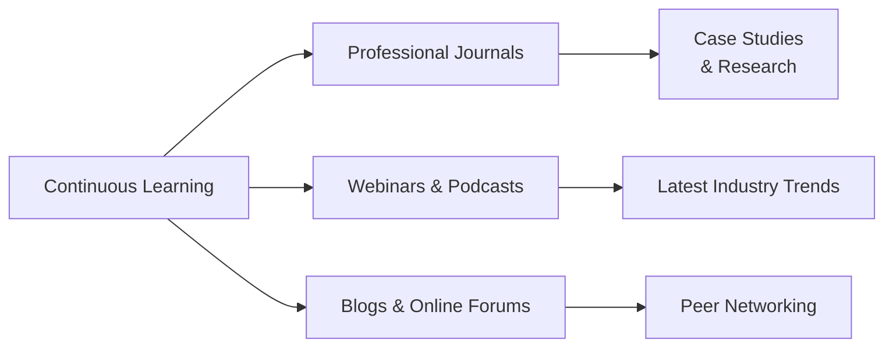

## 42.3 Industry News and Ongoing Learning Resources

Staying informed and continuously developing your knowledge base is one of the most critical dimensions of project management success. While many practitioners focus intently on frameworks, methodologies, and certification preparation, the professional environment evolves rapidly, propelled by technological advances, market shifts, and emerging disciplines. In parallel, agile, hybrid, and other adaptive approaches amplify the importance of up-to-minute insights. This chapter explores the best strategies and resources for leveraging industry news, journals, webinars, podcasts, and blogs to create a sustainable routine of ongoing learning. In harmony with the discussions in Chapter 34: Emerging Technologies in Project Management and Chapter 24: Agile Foundations and the Agile Practice Guide, this section underscores the importance of remaining engaged with current developments so that practitioners can lead projects effectively.

Keeping your project management acumen fresh demands more than passively following headlines. It requires a structured approach: knowing which publications have academic credibility, which podcasts deliver tactical wisdom, and which blogs are known for thought leadership. It also involves active participation—whether that is by discussing recent events with colleagues, engaging in online forums, or leveraging professional networks to share ideas. The scope of resources is expansive, ranging from specialized, domain-targeted periodicals (for example, IT project management) to internationally recognized titles that encompass strategy, leadership, and organizational change.  

Beyond the broader principle of continuous improvement introduced in Chapter 20: Quality Management, acknowledging cutting-edge thought leadership allows you to swiftly adapt to evolving methodologies, regulations, and stakeholder expectations—particularly relevant for domains such as data security, compliance, and global business trends. This knowledge can directly influence your ability to communicate risks (Chapter 14: Uncertainty Performance Domain), tailor project life cycles (Chapter 9: Development Approach and Life Cycle Performance Domain), or harness new leadership styles (Chapter 8: Team Performance Domain).

---

### The Power of Continuous Learning

One of the hallmarks of an effective project manager is a commitment to perpetual learning. By actively seeking new insights, you broaden your strategic thinking and enhance the tools at your disposal for delivering project value. Continuous learning cultivates:

• Up-to-Date Methodologies: Emerging practices in agile, hybrid, and design thinking can improve project velocity and stakeholder engagement.  
• Strategic Perspective: Exposure to new studies and thought leadership can shift the lens through which you interpret organizational strategy, risk, and ROI (see Chapter 28: Aligning Projects with Organizational Strategy).  
• Resilience to Change: Knowledge of market trends and technology fosters agility, enabling you to pivot amid changes in project scope, resource availability, or stakeholder alignment.  

To visualize how ongoing learning weaves into your professional development, consider the following Mermaid diagram:

In this diagram, “Continuous Learning” includes multiple streams that reinforce each other. News from a journal may spark your interest in attending a webinar. A webinar might point you to a specific blog. A blog comment thread might link to new research, producing an upward spiral of expertise.

---

### Professional Journals and Magazines

Professional journals and magazines are instrumental in shaping a project manager’s knowledge and perspective. They often contain peer-reviewed research, interviews with industry experts, real-life case studies, and robust data-driven insights. By reading them:

• You stay informed of best practices and new methodologies.  
• You gain exposure to cross-domain insights, as many journals focus on interdisciplinary applications of project management.  
• You develop the analytical mindset to assess research findings and apply them to your own practice.

Among the leading journals and magazines that can transform your project management approach are:

- Project Management Journal (Published by PMI): Provides peer-reviewed articles, discussing new project management theories, advanced practices, and empirical research.  
- PM Network (Published by PMI): Offers insights into industry trends, success stories, and innovative approaches, often accompanied by data and high-level thought pieces.  
- Harvard Business Review (HBR): Although not project-management exclusive, HBR frequently covers leadership, strategy, and organizational behavior topics essential for project managers aiming to connect operational tasks with broader corporate strategy.  
- MIT Sloan Management Review: Features articles on innovation, technology, and organizational dynamics, making it especially valuable for project managers leading complex, high-tech projects or championing digital transformation.  
- IEEE Engineering Management Review: Highly relevant for technical project managers, combining insights from engineering, IT, and technology strategy with project management best practices.  

The common characteristic among these publications is their reliable editorial process and integration of academic research with industry expertise. Many of the real-world cases or new frameworks you encounter in these pages can serve as the foundation for strategic improvements in your projects. Chapter 15: Integration Management underscores the importance of coordination and synergy—insights gleaned from journals can lead to more refined integration practices within your project teams.

---

### Webinars, Online Conferences, and Workshops

In today’s virtual environment, webinars and online conferences have become the lifeblood of professional development. They connect you with subject-matter experts around the globe and introduce novel ideas, often illustrated with interactive Q&A sessions. Many of these webinars offer Professional Development Units (PDUs), allowing you to maintain your PMP® certification while learning about specialized topics such as:

• Agile transformation in fast-paced industries (see Chapter 25: Agile Frameworks and Methodologies).  
• Risk management innovations, especially relevant to Chapter 22: Risk and Uncertainty Management (Revisited).  
• Implementation case studies where presenters share success stories, failures, and critical lessons learned.

Popular platforms and organizations hosting valuable webinars include:

- Project Management Institute (PMI): Regular webinars and virtual events covering a wide spectrum of project management topics, including leadership, ethics, new practices, and case studies.  
- International Institute of Business Analysis (IIBA): While primarily for business analysts, many events intersect significantly with project management, focusing on requirements, stakeholder engagement, and process improvement.  
- Major consulting firms (e.g., Deloitte, McKinsey, PwC): Offer periodic webinars on strategy, organizational change, technology trends, and other macro-level factors affecting projects.  
- Online learning platforms (e.g., LinkedIn Learning, Coursera): Not only offer formal courses but often feature shorter conference-style or workshop sessions specific to emergent topics in management and leadership.

Whenever you attend such events, make sure to maintain concise notes, highlight actionable strategies, and reflect on how their content can refine your day-to-day project activities. Over time, these webinars become catalysts for more innovative approaches to stakeholder engagement, scope clarity, or resource management (Chapters 7, 17, and 21, respectively).

---

### Podcasts for Continuous Learning

Podcasts offer a convenient, on-demand way to absorb industry news and perspectives, whether you are commuting, exercising, or taking a break. Through interviews with thought leaders and real-life project managers, podcasts provide behind-the-scenes insights and practical tips. Key benefits include:

• Flexibility: You can consume episodes at your own pace and revisit them when needed.  
• Informality and Authenticity: Host-guest dynamics often shed light on how experts troubleshoot real challenges, from scope creep to conflict resolution.  
• Cross-Disciplinary Insights: Many podcasts invite guests from diverse fields (technology, finance, marketing), enriching your perspective on how project management intersects with other domains.

Some widely recognized project management or business leadership podcasts include:

- PMI’s Projectified™: Features industry experts discussing trends, challenges, and success stories across a variety of sectors and project management domains.  
- The Tim Ferriss Show: While not exclusively about project management, it offers episodes on high performance, productivity, and leadership tactics that can be applied directly to managing teams.  
- The Project Management Podcast (by Cornelius Fichtner): Presents tools, techniques, industry interviews, and exam-related tips for PMP® aspirants and practitioners alike.  
- PMO Strategies Podcast: Targets executives and project leaders focusing on portfolio and program management, strategic alignment, and measurable value delivery.

While listening, note moments relevant to your projects—this can range from unique stakeholder management approaches, to real stories about integrating agile while adhering to strict compliance (Chapter 31: Advanced Compliance and Regulatory Considerations).

---

### Blogs and Digital Communities

Beyond formal publications and institutional events, many practitioners and consultants share their experiences through blogs, online magazines, and social networks. These platforms are often more agile, reflecting the latest debates or hot issues at an accelerated pace, and invite comments or open discussions. Leveraging blogs and digital communities can:

• Deliver quick updates on emergent topics (e.g., new PM tools, software integrations, or compliance shifts).  
• Introduce fresh viewpoints on traditional processes, such as scheduling (Chapter 18) and cost management (Chapter 19).  
• Provide interactive, peer-driven feedback when you share your practices or ask clarifying questions.

Key digital platforms include:

- LinkedIn Groups: There are many specialized forums for PMP® exam preparation, agile communities of practice, risk management, and more. Discussions often feature job postings, professional advice, and commentary on recent PM trends.  
- Reddit’s /r/projectmanagement: A grassroots forum for managers of all levels seeking hands-on solutions or sharing experiences.  
- Medium’s Project Management Publications: Features articles from both established experts and new voices, often delivering fresh takes on hybrid approaches, AI in project management, or remote team leadership.  
- Specialized Blogs: Many well-known authors in project management maintain personal blogs or columns. Examples include Elizabeth Harrin’s “Girl’s Guide to Project Management” and Susanne Madsen’s “Project Leadership.”

When integrating insights from these resources, always check sources, credibility, and alignment with known best practices. Blogs can also be a two-way channel—commenting and engaging fosters relationships that can lead to valuable networking opportunities, job leads, or mentorship experiences.

---

### Real-World Example: Adapting to New Regulations Through Continuous Monitoring

Imagine you are a project manager in the financial services sector, facing evolving compliance requirements (Chapter 31). After reading a monthly update from “PM Network,” you discover upcoming changes to data privacy laws that impact third-party procurement. Armed with this knowledge, you quickly adjust risk management plans (Chapter 14) and implement new vendor contract clauses (Chapter 23). Soon afterward, you attend a live webinar where experts discuss how to integrate these requirements into agile sprint reviews. This synergy of timely reading and an interactive forum fosters clear stakeholder communication and helps ensure compliance—a prime example of the value in continuous learning.

---

### Strategies to Make the Most of Industry News

1. Set Reading Goals: Dedicate a regular time slot each week or month for scanning industry news, reading executive summaries, or exploring blog posts.  
2. Use Aggregation Tools: Employ RSS feeds, subscription services, or content aggregation platforms to streamline relevant articles into your inbox—filter out unrelated content effectively.  
3. Curate a Personal Knowledge Repository: Use note-taking software, wiki pages, or a simple spreadsheet to compile and categorize insights from each article, podcast, or webinar. This enhances retrieval when you need to apply those insights later.  
4. Engage Your Team: Share relevant articles or webinar recordings with your project team. Invite discussions on how insights apply to ongoing projects, thereby promoting group learning and reinforcing the People Domain concepts (Chapter 6.1).  
5. Network Proactively: Industry events or digital forums often let you meet new contacts. Nurture these relationships—they can provide future collaboration opportunities, references, or niche expertise.

Applying these strategies successfully requires recognizing your own professional development goals. Whether you aim to sharpen leadership and emotional intelligence skills (Chapter 33: Advanced Leadership and Team Development) or strengthen your ability to manage complex adaptive systems (Chapter 32: Complex Adaptive Systems and Systems Thinking), there is abundant knowledge in the broader project management community waiting to be tapped.

---

### Staying Future-Focused: A Holistic Perspective

Project management sits at the intersection of technology, business strategy, human dynamics, and organizational culture. By tracking emerging trends in all these areas, you amplify your impact. For instance, new data analytics solutions can enhance measurement and forecasting (Chapter 13: Measurement Performance Domain). Meanwhile, shifts in corporate governance might affect how portfolios and programs are prioritized (Chapter 35: Portfolio and Program Management Intersections). The more you plug into these conversations, the better positioned you are to guide projects of increasing complexity and strategic value.

Remember, ongoing learning is not just about technical mastery; it is about cultivating a mindset conducive to continuous adaptation, critical thinking, and open collaboration. When you read about innovative tools for schedule compression (Chapter 18.3) or an experimental approach to cost control (Chapter 19.3), ask yourself how these might be tailored to your specific settings. Challenge your assumptions, test new ideas in a controlled environment, and stay curious—these behaviors lie at the core of professional excellence.

---

### Recommended Resources

Below is a curated list of resources to jumpstart your pursuit of continuous learning:

• Project Management Institute (PMI) Resource Hub: https://www.pmi.org/learning  
• IEEE Xplore Digital Library: https://ieeexplore.ieee.org/  
• Harvard Business Review: https://hbr.org/  
• MIT Sloan Management Review: https://sloanreview.mit.edu/  
• PMI Events and Webinars: https://www.pmi.org/events  
• Medium’s “Project Management” Tag: https://medium.com/tag/project-management  
• The Project Management Podcast: https://www.project-management-podcast.com/  

Expanding your knowledge base through these links or by discovering additional sources keeps you in continual “learning mode,” ensuring that you remain adaptable, innovative, and well-informed in your project leadership journey.

---

## Expand Your Knowledge with Project Management Resource Insights



### Which of the following best describes a benefit of reading peer-reviewed project management journals?
- [ ] They are typically focused only on agile methodologies.  
- [x] They offer rigorously evaluated, credible research and case studies.  
- [ ] They are easier to read than informal blogs.  
- [ ] They rarely update their content with new industry trends.  

> **Explanation:** Peer-reviewed journals go through a thorough editorial and review process, ensuring reliability and academic rigor. This makes them a cornerstone for credible research and proven methodologies.

### What is one advantage of attending live project management webinars?
- [x] Interactive Q&A sessions provide direct access to subject-matter experts.  
- [ ] They eliminate the need for official PDUs to maintain certification.  
- [ ] They only cover broad business topics rather than PM specifics.  
- [ ] They are all recorded sessions with no audience involvement.  

> **Explanation:** Live webinars often feature interactive Q&A segments, allowing you to engage with presenters. This real-time dialogue can clarify complex concepts and offer deeper insights.

### Which statement is true about podcasts in the context of continuous learning?
- [x] They allow flexible learning and often feature real-life project dialogues.  
- [ ] They require consistent internet connectivity for synchronous viewing.  
- [ ] They focus only on certification exam tips and not on practical applications.  
- [ ] They are primarily designed for academic research.  

> **Explanation:** Podcasts can be consumed on-demand, fitting busy schedules and often showcasing valuable, experience-based discussions that illuminate practical project solutions.

### In what way do blogs and online forums contribute to ongoing professional development?
- [ ] They only feature content created by academic doctoral researchers.  
- [ ] They are typically behind paywalls and inaccessible to most practitioners.  
- [x] They provide dynamic, real-time discussions and peer-driven feedback.  
- [ ] They rarely update or address new technologies.  

> **Explanation:** Blogs and forums excel at delivering timely and interactive content. The open-dialogue format promotes peer feedback and rapid updates on emerging topics.

### How can reading about global trends in publications like Harvard Business Review or MIT Sloan Management Review bolster your project outcomes?
- [x] By aligning your project’s tactical decisions with broader strategic or technological insights.  
- [ ] By focusing solely on executing manual project tasks.  
- [ ] By offering only finance-oriented reports unrelated to project success.  
- [ ] By restricting access to advanced tools and techniques.  

> **Explanation:** Such publications give insight into executive-level thinking, strategy, and innovative technologies—factors that can refine your project’s strategic alignment and elevate delivery outcomes.

### Which is a recommended approach after attending a webinar on agile risk management?
- [ ] Forget to take notes and rely solely on memory.  
- [x] Apply salient points directly to your risk register and share them with the team.  
- [ ] Avoid comparing webinar content with existing organizational practices.  
- [ ] Retain information only until the next project closes.  

> **Explanation:** A structured approach to implementing new knowledge—particularly by updating relevant documents and policies—ensures that insights gained translate into real project improvements.

### Why is it beneficial to maintain a personal “knowledge repository” of industry updates and learnings?
- [x] It allows quick lookup of past insights and helps apply them effectively in future scenarios.  
- [ ] It discourages team collaboration and isolates the project manager’s understanding.  
- [x] It fosters organizational disorganization by scattering data across platforms.  
- [ ] It ensures information is permanently withheld from stakeholders.  

> **Explanation:** A personal knowledge repository provides a centralized location for capturing and synthesizing key takeaways, enhancing consistency, and making these findings readily retrievable for ongoing or future projects.

### Which statement accurately characterizes the relationship between continuous learning and compliance requirements?
- [x] Up-to-date knowledge on regulations aids in anticipating and mitigating compliance-related risks.  
- [ ] New regulations are always unrelated to project management and can be ignored.  
- [ ] Compliance changes never affect stakeholder engagement strategies.  
- [ ] Certification holders do not need to track any new legal or regulatory changes.  

> **Explanation:** Monitoring regulatory shifts and integrating them into your project’s risk management approach is paramount to ensuring compliance and stakeholder confidence.

### What is one way that reading a specialized project management blog can benefit your development approach (Chapter 9)?
- [x] It reveals real-world insights on tailoring life cycles for different project environments.  
- [ ] It only provides generic motivational quotes with no applicability.  
- [ ] It exclusively focuses on waterfall project plans with no modern updates.  
- [ ] It disregards feedback loops or iterative processes.  

> **Explanation:** Many PM-focused blogs detail experiences in hybrid, iterative, or agile environments. Their real-world stories can guide you in tailoring life cycle choices based on specific project complexities.

### True or False: Professional networking, including forums and social media groups, is unnecessary for seasoned project managers to continue growing their expertise.
- [x] True  
- [ ] False  

> **Explanation:** This is a trick question—professional networking is vital for every level of experience. Collaboration, idea-sharing, and fresh perspectives are indispensable to continuous professional growth and adaptability.



---

## PMP Mastery: 1500+ Hard Mock Exams with Full Explanations

Looking to crush the PMP exam with confidence? Dive deep into 6 rigorous mock exams totaling 1500+ advanced-level questions, each accompanied by clear, step-by-step explanations. Hone your test-taking strategies, master complex topics, and build the resilience you need on exam day. Perfect for serious PMs aiming beyond fundamentals.

Enroll now:  
[PMP Mastery: 1500+ Hard Mock Exams with Exceptional Clarity & Full Explanations](https://www.udemy.com/course/pmp-2025/?referralCode=CF83A54BC86BE27F9AFE)

_Disclaimer: This course is not endorsed by or affiliated with the PMI examination authority. All content is provided purely for educational and preparatory purposes._
