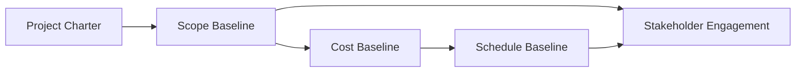

## 43.1 Concept Index (Alphabetical)

This comprehensive index highlights central terms and concepts used throughout “Mastering Project Management: A Comprehensive Companion for the PMP® Exam.” From Agile and budgeting fundamentals to strategic alignment and uncertainty management, you can easily locate relevant discussions, definitions, and further reading references. Each entry includes a brief explanation, related best practices, practical examples, and relevant chapters for deeper study. Use this resource to reinforce your understanding, enhance your real-world application, and prepare effectively for the PMP® exam.

> Tip: For a deeper look, refer to Chapter 40 (Comprehensive Glossary of Project Management Terms) for extended definitions, and revisit the chapters indicated under each term to see how the concept is applied in various project contexts.

---

### A

Adaptive Approach  
• Explanation: A method of managing projects with a flexible and iterative style, adjusting processes and structures to changing requirements or constraints.  
• Practical Example: A marketing team refining its social media tactics weekly based on campaign performance metrics.  
• Best Practice: Validate adaptations regularly with stakeholders to ensure alignment with business value (see Chapters 9, 24, 27).

Agile  
• Explanation: An iterative and incremental approach emphasizing collaboration, customer feedback, and rapid adaptation to change.  
• Practical Example: A software development team running each feature in two-week sprints, consistently reviewing progress in sprint reviews.  
• Best Practice: Maintain a transparent product backlog and hold regular retrospectives for continuous improvement (see Chapters 24, 25).

Artifact  
• Explanation: Any tool, template, or documentation produced and used during project execution. Can include sprint backlogs, burn charts, or risk registers.  
• Practical Example: A Scrum team’s increment is an artifact representing the latest version of the product or deliverable.  
• Best Practice: Keep artifacts updated and easily accessible for knowledge transfer (see Chapters 11, 26).

Assumption  
• Explanation: A factor presumed to be true for planning purposes but not proven. Often documented in an assumptions log.  
• Practical Example: Assuming a certain technology will remain stable and supported over the project’s timeline.  
• Best Practice: Validate critical assumptions throughout the project to mitigate risks (see Chapters 10, 15).

---

### B

Backlog  
• Explanation: A prioritized list of project or product tasks/features from which teams select work items in agile settings (e.g., product backlog in Scrum).  
• Practical Example: A product backlog containing user stories: “As a new user, I want to create an account securely so that I can access my data.”  
• Best Practice: Prioritize by value, risk, and complexity for maximum impact (see Chapters 25, 26).

Baseline  
• Explanation: The original plan plus any approved changes, serving as a reference for scope, schedule, or cost.  
• Practical Example: A schedule baseline is the finalized project timeline, used to track and measure any subsequent variances.  
• Best Practice: Keep baselines up to date when significant changes occur (see Chapters 15, 18).

Benefits Realization  
• Explanation: Ensuring that project outputs align with strategic goals and deliver planned advantages or outcomes to the organization.  
• Practical Example: A new customer service system reducing call handling time by 30% meets the intended benefit.  
• Best Practice: Use benefits tracking metrics post-project to confirm realized value (see Chapter 29).

Budget  
• Explanation: The aggregated estimated costs for all project activities, forming the project cost baseline.  
• Practical Example: A construction project including labor, materials, and equipment breakdown to maintain cost discipline.  
• Best Practice: Integrate cost estimates with the schedule to prevent cash flow issues (see Chapters 19, 28).

Business Environment  
• Explanation: The external and internal factors—like market conditions, organizational culture, or regulatory constraints—that influence a project.  
• Practical Example: Updates in tax law affecting project procurement and contract strategies.  
• Best Practice: Continuously monitor changes to the business environment to adapt strategies (see Chapters 2, 6).

Business Case  
• Explanation: A documented analysis of the justification for undertaking a project, weighing benefits, costs, and risks.  
• Practical Example: A comprehensive study showing a 60% ROI over two years for a new product line.  
• Best Practice: Revisit the business case throughout the project to confirm ongoing viability (see Chapter 28).

---

### C

Change Control  
• Explanation: The process of identifying, documenting, and evaluating project changes to control scope, schedule, or cost.  
• Practical Example: A formal request to add new product features is reviewed by the change control board.  
• Best Practice: Maintain a transparent and consistent procedure, ensuring timely decisions (see Chapter 15).

Charter (Project Charter)  
• Explanation: A document officially authorizing the project and outlining initial objectives, scope, stakeholders, and roles.  
• Practical Example: A sponsor-signed charter giving the project manager authority over resources to develop a new SaaS platform.  
• Best Practice: Revisit the charter to reduce scope creep and keep alignment with objectives (see Chapter 15).

Communication Management  
• Explanation: Systems, processes, and planning for sharing information effectively with stakeholders.  
• Practical Example: Weekly project newsletters to external stakeholders to maintain transparency.  
• Best Practice: Tailor communication strategies to stakeholder needs and cultural context (see Chapter 16).

Compliance  
• Explanation: Adherence to laws, regulations, standards, or policies governing the project environment.  
• Practical Example: A healthcare project following HIPAA regulations for patient data.  
• Best Practice: Regularly audit compliance-related processes to avoid potential legal or financial repercussions (see Chapter 31).

Complex Adaptive Systems  
• Explanation: Projects whose elements interact in ways that may generate unpredictable outcomes or emergent behaviors.  
• Practical Example: A multi-national digital transformation project with cross-cultural teams facing rapidly shifting market demands.  
• Best Practice: Embrace an iterative approach, enabling rapid course corrections for unexpected complexities (see Chapter 32).

Critical Path  
• Explanation: The sequence of tasks determining the shortest time to complete the project, with no room for schedule slippage.  
• Practical Example: In building construction, foundational work and finishing must be completed in a strict order.  
• Best Practice: Update critical path calculations regularly to account for progress and changes (see Chapter 18).

Cumulative Flow Diagram  
• Explanation: A visual tool used in Agile to show the flow of work items through various stages, highlighting throughput, bottlenecks, and total work in progress.  
• Practical Example: Kanban boards with columns representing “To Do,” “In Progress,” “Testing,” and “Done,” tracked on a chart over time.  
• Best Practice: Analyze data patterns to continuously improve team velocity and remove bottlenecks (see Chapter 13).

---

### D

Daily Standup  
• Explanation: A short daily meeting (often 15 minutes) where team members synchronize by sharing progress, upcoming tasks, and roadblocks.  
• Practical Example: A software team meets every morning at 9 AM to quickly outline daily coding objectives.  
• Best Practice: Keep it time-boxed and focused on immediate impediments (see Chapter 26).

Deliverable  
• Explanation: Any unique, verifiable product, result, or capability produced to complete a project.  
• Practical Example: A final report detailing the outcomes of a market research initiative.  
• Best Practice: Clarify acceptance criteria early so deliverables meet stakeholder expectations (see Chapter 12).

Delivery Performance Domain  
• Explanation: The focus on creating and handing over project outcomes, ensuring they satisfy stakeholder expectations and generate value.  
• Practical Example: Iterative prototypes shared with end users for quick feedback and incremental enhancements.  
• Best Practice: Continuously reinforce alignment with project benefits and user requirements (see Chapter 12).

---

### E

Earned Value Management (EVM)  
• Explanation: A technique measuring project performance by integrating scope, schedule, and cost data.  
• Practical Example: Calculating Cost Performance Index (CPI) and Schedule Performance Index (SPI) to see if the project is on track financially and timewise.  
• Best Practice: Update EVM metrics regularly and use them to forecast cost and schedule at completion (see Chapters 13, 19, 37).

Enterprise Environmental Factors (EEFs)  
• Explanation: Conditions not under the direct control of the project team but influencing or constraining project execution, such as organizational culture.  
• Practical Example: Internal policies limiting the use of specific software tools or third-party vendors.  
• Best Practice: Identify EEFs early and incorporate them into risk and stakeholder analyses (see Chapter 28).

Estimate  
• Explanation: An approximation of time, cost, or resources required to complete project activities.  
• Practical Example: Three-point estimating (optimistic, most likely, pessimistic) for software module development.  
• Best Practice: Refine estimates iteratively as more information becomes available (see Chapters 18, 19).

---

### F

Forecasting  
• Explanation: Predicting future project performance and outcomes using current data.  
• Practical Example: Using EVM metrics such as Estimate at Completion (EAC) to forecast total project cost.  
• Best Practice: Update forecasts frequently and integrate them with schedule risk analyses (see Chapter 13).

Functional Organization  
• Explanation: A structure where employees report to managers by specialty (e.g., marketing, finance), often limiting direct authority for project managers.  
• Practical Example: A project manager needing approval from multiple department heads for resource allocation.  
• Best Practice: Build strong relationships with functional managers to secure the necessary resources and support (see Chapter 4).

---

### G

Governance  
• Explanation: The overarching framework, rules, and processes used to oversee project decision-making and alignment with organizational objectives.  
• Practical Example: A steering committee reviewing regular status reports and approving major scope changes.  
• Best Practice: Establish clear governance early, naming decision-makers and their responsibilities (see Chapters 4, 27).

Gantt Chart  
• Explanation: A bar chart illustrating a project schedule, mapping tasks against time with dependencies.  
• Practical Example: Project tasks with their start-end dates displayed horizontally, highlighting Thanksgiving holidays.  
• Best Practice: Keep the chart updated to reflect real progress and changes (see Chapter 18).

---

### H

Hybrid Approach  
• Explanation: A project management strategy combining predictive (waterfall) methods with Agile or iterative techniques.  
• Practical Example: A hardware project that follows a strict schedule for manufacturing but uses sprints to develop associated software.  
• Best Practice: Define which components should be agile vs. predictive and maintain clarity around governance (see Chapter 27).

Human Resource Management  
• Explanation: Processes to effectively utilize skills, knowledge, and talents of team members. In PMBOK® Seventh Edition, typically found within broader “Resource Management.”  
• Practical Example: Assigning tasks based on individuals’ specialized certifications and experience.  
• Best Practice: Use motivation theories (Herzberg, Maslow) to enhance engagement (see Chapter 21).

---

### I

Integrated Change Control  
• Explanation: Coordinated management of all modifications affecting project baselines to ensure alignment with objectives.  
• Practical Example: A body overseeing a request to add new features that affect the project timeline and budget.  
• Best Practice: Centralize decision-making and track all changes via a backlog or log (see Chapters 15, 17).

Issue Log  
• Explanation: A record of identified issues and the actions needed to resolve or mitigate them.  
• Practical Example: Logging a data migration error discovered during sprint testing.  
• Best Practice: Regularly review and categorize issues by priority, ownership, and resolution timeline (see Chapter 41).

---

### K

Kaizen  
• Explanation: A Japanese term for continuous improvement, focusing on small, incremental changes that collectively bring significant improvements.  
• Practical Example: Weekly micro-optimizations in manufacturing processes that lead to overall cost reduction.  
• Best Practice: Engage team members at all levels, encouraging them to suggest improvements (see Chapter 20).

Knowledge Transfer  
• Explanation: The systematic sharing of experience, lessons, and documentation.  
• Practical Example: Conducting thorough handover sessions before project closure, including a final set of slides summarizing best practices.  
• Best Practice: Cultivate a “learning culture” to avoid repeated mistakes and replicate successes (see Chapter 11).

---

### L

Leadership  
• Explanation: The ability to guide, inspire, and influence a team towards achieving project objectives.  
• Practical Example: A project manager empowering team members to make decisions within their areas of expertise.  
• Best Practice: Adapt leadership style to the team’s context (servant leadership works well for agile teams) (see Chapter 8).

Lessons Learned  
• Explanation: Knowledge gained during project execution and closure, culminating in improved practices for future efforts.  
• Practical Example: Documenting design flaws encountered in a new mobile app, leading to better architecture choices later.  
• Best Practice: Capture lessons regularly, not just at project close (see Chapters 11, 40).

Life Cycle  
• Explanation: The phases a project goes through, from initiation to closure. May be predictive, iterative, incremental, agile, or hybrid.  
• Practical Example: A software team following an iterative approach to refine features each cycle.  
• Best Practice: Tailor life cycles to project complexity and organizational culture (see Chapter 9).

---

### M

Milestone  
• Explanation: A significant point or event in the project timeline, usually marking the end of a phase or the completion of a major deliverable.  
• Practical Example: “User Acceptance Testing Complete” as a key milestone in software projects.  
• Best Practice: Align milestones with decision points to maintain project momentum (see Chapter 10).

Monitoring and Controlling  
• Explanation: Continuously tracking project performance to identify deviations from the plan and implement corrective actions.  
• Practical Example: Comparing actual spend to budget weekly and updating cost forecasts accordingly.  
• Best Practice: Integrate monitoring at every stage to detect and correct issues early (see Chapter 11).

---

### O

Organizational Process Assets (OPAs)  
• Explanation: Historical information, guidelines, or procedures that influence how project activities are carried out.  
• Practical Example: A company’s standard templates for risk management or communication plans.  
• Best Practice: Update OPAs with newly discovered best practices for future projects (see Chapter 28).

Opportunity (Risk)  
• Explanation: A positive risk or uncertain event that could have a beneficial impact on project objectives.  
• Practical Example: A new technology that reduces cost by 15% if adopted in time.  
• Best Practice: Proactively seize or enhance opportunities, encouraging the team to recognize beneficial uncertainties (see Chapters 14, 22).

---

### P

Performance Domain  
• Explanation: A grouping of related activities and functions fostering project success. PMBOK® Seventh Edition highlights domains such as Stakeholder, Team, and Delivery.  
• Practical Example: The “Stakeholder Performance Domain” focuses on identifying and engaging those impacted by the project.  
• Best Practice: Address each domain thoroughly to ensure balanced project execution (see Chapters 7–14).

Portfolio Management  
• Explanation: Coordinated management of multiple programs, projects, or operations to achieve strategic objectives.  
• Practical Example: Organizing all technology-related projects under one portfolio to align with corporate digital transformation.  
• Best Practice: Regularly prioritize projects based on strategic value, risk, and resource availability (see Chapter 35).

Predictive Approach (Waterfall)  
• Explanation: A traditional, sequential project management method with well-defined scope and deliverables upfront.  
• Practical Example: A construction project specifying requirements meticulously before development begins.  
• Best Practice: Use in stable environments where changes are minimal and requirements are well-known (see Chapter 9).

Procurement Management  
• Explanation: Methods for obtaining and managing external resources, from selecting vendors to contract closure.  
• Practical Example: Issuing an RFP for specialized components in a hardware project.  
• Best Practice: Choose the right contract type (fixed-price, T&M, etc.) to balance risk and control (see Chapter 23).

Program Management  
• Explanation: Coordinated management of related projects to maximize synergy and control.  
• Practical Example: A digital marketing program unifying social media campaigns, website revamps, and analytics tools under a single strategy.  
• Best Practice: Focus on interdependencies among projects to optimize resources (see Chapter 35).

Project Charter  
• Explanation: See “Charter (Project Charter)” above.  
• Practical Example: Provides formal authority to the project manager.  
• Best Practice: Ensure sponsor sign-off on the charter script before proceeding (see Chapter 15).

Project Life Cycle  
• Explanation: See “Life Cycle.”  
• Practical Example: A phased approach with feasibility, design, coding, and testing steps.  
• Best Practice: Select a life cycle model that fits project complexity, stakeholder needs, and organizational environment (see Chapter 9).

---

### Q

Quality Assurance  
• Explanation: The proactive processes ensuring that quality requirements are planned and executed properly.  
• Practical Example: Regular peer reviews of designs to detect defects early.  
• Best Practice: Build quality into deliverables by setting explicit acceptance criteria (see Chapters 12, 20).

Quality Control  
• Explanation: The reactive inspection of deliverables to ensure they meet the defined requirements.  
• Practical Example: Inspecting code against coding standards, or testing deliverables for compliance.  
• Best Practice: Document and act on deviations quickly to avoid widespread product issues (see Chapter 20).

---

### R

Requirements Management  
• Explanation: The systematic process of collecting, analyzing, and controlling project or product requirements.  
• Practical Example: Running a stakeholder workshop to capture features for a new mobile app.  
• Best Practice: Validate requirements regularly with end-users to ensure feasibility (see Chapter 17).

Resource Management  
• Explanation: Planning, acquiring, and monitoring resources—human, materials, equipment—to optimize project outcomes.  
• Practical Example: Allocating specialized testers only when the codebase is ready for system tests.  
• Best Practice: Address potential resource conflicts early, especially in matrix organizations (see Chapter 21).

Risk Management  
• Explanation: The processes of identifying, analyzing, responding to, and monitoring potential risks.  
• Practical Example: Setting contingency reserves to handle potential cost overruns in a construction project.  
• Best Practice: Encourage team members to proactively report new risks and opportunities (see Chapters 14, 22).

Rolling Wave Planning  
• Explanation: Planning in iterations, with near-term activities defined in detail and future tasks in broader terms.  
• Practical Example: Detailing first three sprints and loosely defining subsequent ones as you gain more clarity.  
• Best Practice: Balance between detailed planning and flexibility by scheduling frequent plan revisions (see Chapter 10).

---

### S

Schedule Compression  
• Explanation: Shortening the project schedule without drastically reducing scope, via fast tracking or crashing.  
• Practical Example: Overlapping design and coding activities (fast tracking) to meet a major trade show deadline.  
• Best Practice: Assess increased costs or risks before proceeding with compression (see Chapter 18).

Scope Creep  
• Explanation: Uncontrolled changes or growth in project scope without adjustments to time, cost, or resources.  
• Practical Example: Adding “small” features to a software project repeatedly, extending beyond planned resources.  
• Best Practice: Enforce robust change control processes to keep scope consistent (see Chapter 17).

Servant Leadership  
• Explanation: A leadership philosophy focusing on supporting and empowering team members so they can perform optimally.  
• Practical Example: A Scrum Master removing impediments for developers to boost team morale.  
• Best Practice: Encourage self-organization and autonomy, especially in agile contexts (see Chapter 8).

Stakeholder Engagement  
• Explanation: Strategies and processes to effectively identify, analyze, communicate, and manage stakeholder expectations.  
• Practical Example: Inviting critical stakeholders to demos and receiving real-time feedback.  
• Best Practice: Monitor changes in stakeholder attitudes or power dynamics to adjust engagement plans (see Chapters 7, 16).

Strategic Alignment  
• Explanation: Linking project objectives and outcomes to the organization’s broader mission or strategy.  
• Practical Example: Prioritizing an AI-driven project to reduce operational costs in line with the company’s five-year innovation road map.  
• Best Practice: Update the business case and sponsor communication to reflect strategic shifts (see Chapter 28).

Swaggering the Slack  
• Explanation (colloquial): Overusing float (or slack) in the schedule to accommodate inefficiencies, risking resource overload later.  
• Practical Example: A team intentionally letting tasks slip into available float, hoping they can catch up later.  
• Best Practice: Track float carefully and hold resources accountable for timely completion (see Chapter 18).

Systems Thinking  
• Explanation: Analyzing the project in the context of its interconnected components, including people, processes, and technology.  
• Practical Example: Realizing a marketing campaign’s success depends on synergy between web analytics, content creation, and sales funnel adjustments.  
• Best Practice: Identify dependencies and emergent behaviors early to address complexity (see Chapters 5, 32).

---

### T

Tailoring  
• Explanation: Adapting project management processes to best fit specific project and organizational contexts.  
• Practical Example: A small startup skipping extensive documentation in favor of quick, informal standups.  
• Best Practice: Evaluate organizational culture, complexity, and stakeholder needs to calibrate your approach (see Chapter 5).

Team Performance Domain  
• Explanation: Outlines how to develop successful teams, manage conflict, and foster collaboration.  
• Practical Example: Conducting team-building workshops to improve trust and cross-functional integration.  
• Best Practice: Champion psychological safety to expedite knowledge sharing and innovation (see Chapter 8).

Triple Constraint  
• Explanation: The classic notion that project scope, schedule, and cost are interdependent; changes in one affect the others.  
• Practical Example: A scope increase (additional features) generally leads to higher costs or longer schedule.  
• Best Practice: Communicate constraint implications clearly during stakeholder negotiations (see Chapter 15).

---

### U

Uncertainty Performance Domain  
• Explanation: Aligning risk and uncertainty management techniques with project objectives to handle unknowns effectively.  
• Practical Example: An emerging technology project carrying high risk for rework or unexpected breakthroughs.  
• Best Practice: Implement iterative planning, frequent risk reviews, and contingency reserves (see Chapter 14).

User Stories  
• Explanation: Short, simple descriptions of a feature told from the perspective of the person who desires the new capability, typically used in Agile.  
• Practical Example: “As an online shopper, I want to save my order history to reorder easily.”  
• Best Practice: Employ the “INVEST” principle (Independent, Negotiable, Valuable, Estimable, Small, Testable) for well-written stories (see Chapters 17, 25).

---

### V

Value Delivery  
• Explanation: Consistently ensuring products or services meet or exceed stakeholder expectations and drive organizational benefits.  
• Practical Example: A new software feature boosting customer retention rates by 10%.  
• Best Practice: Continuously measure product success metrics and adjust project direction if needed (see Chapters 5, 12).

Virtual Teams  
• Explanation: Teams not co-located, often operating across different time zones or countries.  
• Practical Example: A global e-commerce project with members in the U.S., India, and Germany.  
• Best Practice: Leverage collaborative tools (video calls, shared Kanban boards) and establish “core working hours” to enhance communication (see Chapter 8).

---

### W

WBS (Work Breakdown Structure)  
• Explanation: A hierarchical decomposition of total project scope into smaller, more manageable components.  
• Practical Example: A WBS for software implementation with levels for requirements, design, coding, testing, deployment.  
• Best Practice: Ensure that WBS covers 100% of the scope, avoiding overlap among work packages (see Chapter 18).

Waterfall  
• Explanation: Another term for the predictive approach, where each phase flows into the next, with heavy up-front planning.  
• Practical Example: Releasing a new hardware product with rigid design and build phases.  
• Best Practice: Use when requirements are stable and changes are infrequent (see Chapter 9).

---

### X

XP (Extreme Programming)  
• Explanation: An agile methodology focusing on high-quality code and frequent, rapid releases.  
• Practical Example: Pair programming, test-driven development, and continuous integration in software development teams.  
• Best Practice: Maintain a strong culture of collective code ownership and close collaboration (see Chapter 25).

---

### Y

Y-Chart  
• Explanation: A technique sometimes used to visualize system or product behavior, dividing focus into “What, How, & Why.”  
• Practical Example: Clarifying the functionality and user motivations behind each feature in a new software release.  
• Best Practice: Use Y-Chart brainstorming sessions to ensure thorough exploration of possible designs (related: user story mapping in agile contexts).

---

### Z

Zero Defects  
• Explanation: A quality management concept centered on preventing errors and rework rather than simply correcting them.  
• Practical Example: Embedding continuous automated testing in each step to catch defects immediately.  
• Best Practice: Balance pursuit of quality with practicality, ensuring it aligns with stakeholder expectations (see Chapter 20).

---

> Many concepts overlap multiple chapters. Use cross-references to explore each domain or knowledge area in more depth. Revisit Part IV (Knowledge Areas & Best Practices) and Part III (Performance Domains) to see how these concepts integrate across the project life cycle, agile methodologies, and real-world contexts.

---

Above, the diagram shows how certain concepts connect in a simplified view. “Project Charter” (A) informs the “Scope Baseline” (B), which aligns with both “Cost Baseline” (C) and “Schedule Baseline” (D). All these elements are also influenced by “Stakeholder Engagement” (E). This interrelationship emphasizes the importance of integrated change control, stakeholder satisfaction, and the triple constraint working cohesively.

---

## Best Practices, Common Pitfalls, and Final Tips

• Best Practices  
  - Use this index in conjunction with detailed chapter tables, so you can locate the relevant discussions quickly.  
  - Periodically revisit the index during exam preparation to reinforce concept connections.  
  - Combine reading with hands-on practice or case simulations.  

• Common Pitfalls  
  - Overlooking the dynamic nature of some concepts (e.g., risk, stakeholder engagement), which change rapidly.  
  - Confusing overlapping terms in different contexts, such as “adaptive” vs. “agile” or “program” vs. “portfolio.”  
  - Neglecting to update your baseline references after major changes, leading to inaccurate performance measurements.  

• Final Tips  
  - Pair this index with hands-on experience. Testing new knowledge in real projects cements learning.  
  - Engage with study groups or mentors to discuss complex topics and fill knowledge gaps.  
  - Embrace continuous improvement—capture your own personal lessons learned in a “study log.”  

For greater depth on specific definitions, refer to Chapter 40 (Comprehensive Glossary of Project Management Terms).  

---

## Further Exploration

• “A Guide to the Project Management Body of Knowledge (PMBOK® Guide) – Seventh Edition,” Project Management Institute  
• “Agile Practice Guide,” Project Management Institute  
• “The Standard for Program Management,” Project Management Institute  
• “Leading Lean Software Development,” Mary Poppendieck & Tom Poppendieck  

---

## Master Your Understanding: Project Management Concepts Quiz



### Which of the following best defines “Baseline” in project management?

- [ ] The minimum requirement for project deliverables
- [x] The original plan plus all approved changes, serving as a reference for scope and performance
- [ ] The final stage of a project life cycle
- [ ] A mandatory tool for agile teams only

> **Explanation:** A baseline—whether scope, schedule, or cost—is the approved snapshot of the plan used to track performance. Changes must be formally integrated to update this reference.

### What is a primary advantage of implementing a rolling wave planning technique?

- [x] It allows for detailed short-term planning while keeping future work at a higher level.
- [ ] It ensures that all project planning is completed before execution begins.
- [ ] It eliminates the need for stakeholder input on scope.
- [ ] It completely removes uncertainty from later phases.

> **Explanation:** Rolling wave planning refines near-term tasks in detail, deferring detailed planning for distant tasks until more information is available.

### When referencing “Complex Adaptive Systems,” which statement is true?

- [x] They involve emergent behaviors that may not be predictable from analyzing individual components alone.
- [ ] They only apply to small, local projects with limited scope.
- [x] Effective management often requires iterative approaches and adaptive thinking.
- [ ] They are best handled by ignoring stakeholder feedback to reduce complexity.

> **Explanation:** Complex Adaptive Systems exhibit unpredictable results due to evolving interactions. Agile or hybrid methodologies often help manage these environments.

### Which best practice enhances continuous improvement (Kaizen) within a project team?

- [x] Encouraging all team members to propose incremental enhancements regularly
- [ ] Conducting improvements once at project closure
- [ ] Prioritizing improvements over all project deliverables and deadlines
- [ ] Limiting improvements to technology systems only

> **Explanation:** Kaizen is about embedding small, continuous enhancements in daily workflows across every dimension of the project, not just technology.

### Which of the following describes Earned Value Management (EVM) accurately?

- [x] A technique integrating scope, schedule, and cost metrics to assess project performance
- [ ] A communication method for stakeholder engagement
- [x] It uses metrics like SPI, CPI, and EAC to forecast project state
- [ ] An exclusive method applicable to agile projects only

> **Explanation:** EVM merges multiple data points (scope, schedule, cost) to create powerful metrics and forecasts. It can be used in predictive, agile, or hybrid approaches.

### What is the fundamental goal of integrating “Servant Leadership” in agile teams?

- [x] Facilitating a supportive environment where the team can self-organize and thrive
- [ ] Establishing a strict command-and-control hierarchy
- [ ] Minimizing stakeholder involvement
- [ ] Speeding up all tasks at the purely individual level

> **Explanation:** Servant leadership focuses on removing impediments, empowering team members, and fostering a collaborative atmosphere that enhances performance.

### In the context of risk management, which statement is accurate about “Opportunities”?

- [x] They are positive risks that may benefit the project if pursued.
- [ ] They must always be avoided to prevent scope changes.
- [x] Teams can use strategies like exploit or enhance to address them.
- [ ] They are never formally documented.

> **Explanation:** Opportunities, as positive risks, can be exploited, enhanced, or shared to produce beneficial outcomes. They should be documented and managed like threats.

### What is the primary benefit of a Cumulative Flow Diagram in Agile?

- [x] It provides a visual representation of work in progress and pinpoints bottlenecks.
- [ ] It replaces the need for daily standups.
- [ ] It eliminates the requirement for a product backlog.
- [ ] It automates stakeholder communication processes.

> **Explanation:** A Cumulative Flow Diagram tracks the flow of tasks through each stage, revealing congestion points and aiding workload balancing.

### What is the key function of the project charter?

- [x] To formally authorize the project and give the project manager the right to utilize resources
- [ ] To define only risk management plans
- [ ] To schedule daily standups
- [ ] To replace any contractual agreement with vendors

> **Explanation:** The project charter grants formal authorization and defines the initial boundaries for the project, including roles and key objectives.

### True or False: “Stakeholder Engagement” is exclusively a one-time activity completed during project initiation.

- [x] True
- [ ] False

> **Explanation:** This statement is false in reality. Stakeholder engagement is an ongoing, iterative process revisited throughout the project life cycle. The question asked you to identify it as stated, so clicking True is correct to match the statement being "exclusively a one-time activity," which is ironically incorrect. Always carefully check the wording in the exam context.



---

## PMP Mastery: 1500+ Hard Mock Exams with Full Explanations 

Looking to crush the PMP exam with confidence? Dive deep into 6 rigorous mock exams totaling 1500+ advanced-level questions, each accompanied by clear, step-by-step explanations. Hone your test-taking strategies, master complex topics, and build the resilience you need on exam day. Perfect for serious PMs aiming beyond fundamentals.  

Enroll now:  
[PMP Mastery: 1500+ Hard Mock Exams with Exceptional Clarity & Full Explanations](https://www.udemy.com/course/pmp-2025/?referralCode=CF83A54BC86BE27F9AFE)

_Disclaimer: This course is not endorsed by or affiliated with the PMI examination authority. All content is provided purely for educational and preparatory purposes._
