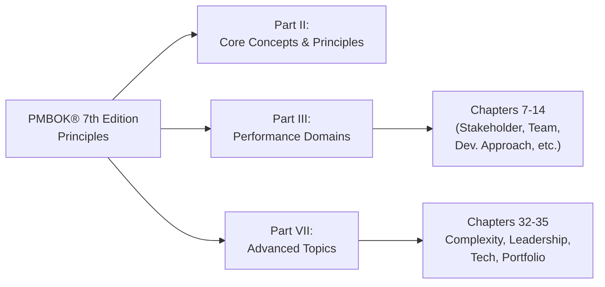

## 43.2 Cross-Reference to PMBOK® Guide Topics

This section provides a comprehensive cross-reference between the chapters of “Mastering Project Management: A Comprehensive Companion for the PMP® Exam” and the PMBOK® Guide (Seventh Edition). By mapping each relevant chapter to the corresponding areas of the PMBOK® Guide, you will have a clear roadmap for connecting the content in this book with PMI’s official standard. This synergy allows you to merge your understanding of principles, performance domains, and approaches—both predictive and agile—ensuring you gain the most value from the PMBOK® Guide’s structure when preparing for the PMP® exam.

Many of the chapters in this book also incorporate knowledge from the PMBOK® Guide Sixth Edition, the Agile Practice Guide, and supplemental standards like PMIstandards+. However, our primary objective here is to help you locate similar or complementary concepts in the PMBOK® Guide Seventh Edition so that your learning process is both efficient and thorough.

---

## Purpose of This Cross-Reference

• Bridge the gap between the PMBOK® Guide Seventh Edition and the chapters of this book.  
• Pinpoint where key principles, performance domains, and methods from PMBOK® 7th appear in this companion text.  
• Facilitate a more focused study regimen: If you are exploring a specific PMBOK® principle or performance domain, you can see immediately which chapters in this book deepen that topic.  
• Highlight why certain chapters in this book might expand upon or diverge from traditional frameworks—offering real-world, advanced insights that extend the PMBOK® Guide’s base content.

---

## PMBOK® Guide Seventh Edition: A Structural Overview

The PMBOK® Guide Seventh Edition spotlights Principles and Performance Domains, a shift from the process-based framework of earlier editions. It groups project management understanding into:

- Twelve project management principles (broad guidelines and mindsets):  
  1. Stewardship.  
  2. Team.  
  3. Stakeholders.  
  4. Value.  
  5. Systems Thinking.  
  6. Leadership.  
  7. Tailoring.  
  8. Quality.  
  9. Complexity.  
  10. Risk.  
  11. Adaptability and Resilience.  
  12. Change Management.  

- Eight performance domains focusing on key areas of project functioning:  
  1. Stakeholder.  
  2. Team.  
  3. Development Approach and Life Cycle.  
  4. Planning.  
  5. Project Work.  
  6. Delivery.  
  7. Measurement.  
  8. Uncertainty.  

These form the backbone of how project managers navigate projects in agile, hybrid, or predictive contexts. The PMBOK® Guide also emphasizes tailoring, ensuring you adapt methods and artifacts to fit the unique environment and constraints of your project.

---

## General Navigation Guidance

In the tables and narrative below, you will find references to chapters within “Mastering Project Management” that parallel or expand upon concepts in PMBOK® 7th Edition. Where relevant, we also note intersections with prior editions (particularly PMBOK® 6th) or other PMI materials like the Agile Practice Guide.

For ease of reference, we will use the following notations:

• Principle references: “(Principle x)” where x is the principle number in PMBOK® 7.  
• Performance domain references: “(Domain X)” where X is one of the eight performance domains.  
• Other PMBOK® elements like models, methods, and artifacts will be indicated as relevant.  

---

## Cross-Reference Highlights by Major Parts of This Book

### Part I: Introduction & Foundations
Chapters 1, 2, and 3 in this book serve as your baseline for the PMP® exam and highlight changes from PMBOK® Sixth to Seventh Edition.  
• Chapter 1: Purpose and Structure of This Supplemental Guide  
  – Connects with PMBOK® 7’s emphasis on principles-based learning vs. strictly process-based approaches.  
  – Mirrors the concept of tailoring (Principle 7).  

• Chapter 2: PMP® Exam Overview  
  – Provides the exam structure, linking to the overall PMBOK® coverage, especially bridging the People, Process, and Business Environment domains from the PMP® Exam Content Outline with the PMBOK® 7 performance domains.  

• Chapter 3: Evolution from PMBOK® Guide Sixth to Seventh Edition  
  – Directly references the shift to performance domains and the 12 project management principles, clarifying how this book’s coverage lines up with the new structure.  
  – Focuses on agile and hybrid expansions, tying into agile references from PMBOK® 7 and the Agile Practice Guide.

### Part II: Core Concepts & Principles
Chapters 4, 5, and 6 focus on fundamental concepts and PMI’s 12 principles.  

• Chapter 4: Project Management Fundamentals  
  – Relates to systems thinking (Principle 5).  
  – Emphasizes project, program, and portfolio distinctions found in PMBOK® 7’s broader context (organizational-level overviews).  

• Chapter 5: PMI’s 12 Project Management Principles (PMBOK® Guide Seventh Edition)  
  – Direct, in-depth coverage of the 12 PMBOK® 7 principles, with practical examples.  
  – Expands on stewardship, collaboration, leadership, and risk optimization, paralleling the formal statements in PMBOK® 7.  

• Chapter 6: The PMP® Exam Domains, Tasks, and Enablers  
  – Overlaps with PMBOK® 7’s performance domains.  
  – Demonstrates how PMI’s exam outline tasks map to these domains, bridging official statements in PMBOK® 7 with the exam’s practical coverage.

### Part III: Performance Domains & PMBOK® Guide Seventh Edition
Chapters 7 through 14 align directly with the PMBOK® 7 performance domains:

• Chapter 7: Stakeholder Performance Domain (Domain 1: Stakeholder)  
  – Direct cross-reference to the first performance domain.  
  – Extends PMBOK® 7 by offering case studies for high-impact stakeholders and conflict resolution.  

• Chapter 8: Team Performance Domain (Domain 2: Team)  
  – Correlates with forming, motivating, and leading project teams.  
  – Embraces “Servant Leadership” (Principle 6: Leadership) and addresses conflict resolution.  

• Chapter 9: Development Approach and Life Cycle Performance Domain (Domain 3: Development Approach and Life Cycle)  
  – Dives into predictive, iterative, incremental, and hybrid models.  
  – Mirrors PMBOK® 7 content on tailoring and deciding the best life cycle type.  

• Chapter 10: Planning Performance Domain (Domain 4: Planning)  
  – Discusses integration, iterative planning, and rolling wave approaches.  
  – Relates to stewardship (Principle 1) by ensuring alignment with organizational strategy.  

• Chapter 11: Project Work Performance Domain (Domain 5: Project Work)  
  – Emphasizes coordinating people, processes, and technology.  
  – Includes communication best practices tied to stakeholder engagement (Principle 3, Collaboration).  

• Chapter 12: Delivery Performance Domain (Domain 6: Delivery)  
  – Correlates to defining deliverables, acceptance criteria, and verifying project outputs.  
  – Covers value-driven delivery (Principle 4).  

• Chapter 13: Measurement Performance Domain (Domain 7: Measurement)  
  – Explores how to set meaningful metrics, track progress, and manage performance.  
  – Ties to principle-based measurements that ensure continuous improvement (Principle 8).  

• Chapter 14: Uncertainty Performance Domain (Domain 8: Uncertainty)  
  – Addresses risk management, both threats and opportunities, and dealing with complexity (Principle 9 and Principle 10).  
  – Focuses on resilience and adaptability (Principle 11).

### Part IV: Knowledge Areas & Best Practices (Traditional & Beyond)
Chapters 15 through 23 revisit knowledge areas like integration, scope, schedule, cost, risk, procurement, etc. While PMBOK® 7th Edition organizes content differently than previous versions, these knowledge areas remain essential. They align with the concept of “Models, Methods, and Artifacts” in PMBOK® 7:

• Chapter 15: Integration Management  
  – References PMBOK® 7’s approach to tailoring and combined processes (integrating deliverables).  
  – Corresponds to “Project Work” and “Delivery” performance domains.  

• Chapter 16: Stakeholder and Communications Management  
  – Reinforces the Stakeholder and Team performance domains, plus collaboration principles (Principle 2).  
  – Aligns with the bridging approach described in PMBOK® 7 for stakeholder engagement.  

• Chapter 17: Scope and Requirements Management  
  – Ties heavily to the Delivery performance domain.  
  – Connects to principle-based thinking around continuously refining and validating scope (Principle 4: Value).  

• Chapter 18: Schedule Management  
  – Maps to Planning (Domain 4) and touches on high-level Project Work (Domain 5) for scheduling tasks.  
  – Reflects the synergy between iterative scheduling methods from agile and the predictive critical path approach.  

• Chapter 19: Cost Management  
  – Supports the Measurement performance domain by applying Earned Value Analysis and budget monitoring.  
  – Encompasses tailoring cost management based on complexity (Principles 5 and 7).  

• Chapter 20: Quality Management  
  – Integrates with “Measurement” (Domain 7) and “Delivery” (Domain 6).  
  – Emphasizes continuous improvement (Principle 8).  

• Chapter 21: Resource Management  
  – Directly influences Team (Domain 2) and Project Work (Domain 5).  
  – Reflects the synergy between organizational structures, leadership, and motivation theories.  

• Chapter 22: Risk and Uncertainty Management (Revisited)  
  – Clearly references the Uncertainty domain.  
  – Applies advanced risk techniques, linking to complexity management (Principle 9) and adaptiveness (Principle 11).  

• Chapter 23: Procurement Management  
  – Aligns with “Project Work” and “Delivery,” referencing partnerships and vendor relationships.  
  – Demonstrates cross-domain synergy, given procurement can impact multiple performance domains.

### Part V: Agile & Hybrid Delivery Approaches
Chapters 24 to 27 tie agile methodologies and hybrid frameworks to PMBOK® 7’s focus on adaptability and resilience:

• Chapter 24: Agile Foundations and the Agile Practice Guide  
  – Cross-links with PMBOK® 7’s emphasis on flexible approaches.  
  – Reinforces Principle 6 (Leadership) through servant leadership in self-organizing teams.  

• Chapter 25: Agile Frameworks and Methodologies  
  – Aligns with the Development Approach and Life Cycle domain (Domain 3).  
  – Emphasizes iterative value delivery, reflecting multiple PMBOK® 7 principles (Value, Adaptability, Complexity).  

• Chapter 26: Key Agile Events and Artifacts  
  – Aligns with Project Work and Delivery, referencing sprints, standups, retrospectives, and increments.  
  – Ties to measurement (Domain 7) via burn charts and velocity metrics.  

• Chapter 27: Hybrid Approaches  
  – Demonstrates tailoring (Principle 7) by blending agile and predictive.  
  – Reflects the new focus in PMBOK® 7 on adaptive frameworks.

### Part VI: Business Environment & Strategy
Chapters 28 through 31 underscore strategic alignment, benefits realization, and compliance:

• Chapter 28: Aligning Projects with Organizational Strategy  
  – Reflects PMBOK® 7’s holistic approach to value (Principle 4).  
  – Connects to business environment and enterprise environmental factors.  

• Chapter 29: Benefits Realization Management  
  – Ties into Delivery (Domain 6) and Measurement (Domain 7).  
  – Connects strongly with ensuring that the project continues to generate value (Principle 4: Value).  

• Chapter 30: Organizational Change Management  
  – Addresses stakeholder and team engagement in the face of change (Principle 12: Change Management).  

• Chapter 31: Advanced Compliance and Regulatory Considerations  
  – Shows how stewardship (Principle 1) is both an ethical and regulatory responsibility.  
  – Bridges the organizational environment with the project’s risk and compliance obligations.

### Part VII: Advanced Topics & Emerging Trends
Chapters 32 to 35 delve into complexities, leadership, technology, and program/portfolio synergy:

• Chapter 32: Complex Adaptive Systems and Systems Thinking  
  – Ties into Systems Thinking (Principle 5) and Complexity (Principle 9).  
  – Shows how emergent behaviors align with agile methods and advanced risk strategies.  

• Chapter 33: Advanced Leadership and Team Development  
  – Maps to Team domain (Domain 2) and includes deeper leadership discussion (Principle 6).  
  – Explores psychological safety, an emerging aspect also referenced in agile frameworks.  

• Chapter 34: Emerging Technologies in Project Management  
  – Connects to Project Work domain (Domain 5) in using AI-powered tools for schedule forecasting or risk analysis.  
  – Showcases adaptability (Principle 11) in applying new technologies.  

• Chapter 35: Portfolio and Program Management Intersections  
  – Bridges strategic organizational alignment from PMBOK® 7 to portfolio-level oversight.  
  – Reinforces the concept of stewardship and value (Principles 1 and 4).

### Part VIII: Exam Preparation & Study Techniques
Chapters 36 to 39 contribute to exam readiness but also reflect PMBOK® 7’s emphasis on continuous learning:

• Chapter 36: Creating Your Study Plan  
  – Encourages tailoring (Principle 7) your study schedule to personal strengths and weaknesses.  
  – Demonstrates iterative improvement and adaptation (Principle 11).  

• Chapter 37: Mastering Key Formulas and Calculations  
  – Links to the Measurement and Planning domains.  
  – References standard PMBOK® methodological formulas and EVM tools.  

• Chapter 38: Memory Aids, Mind Maps, and Brain Dumps  
  – Reflects continuous improvement (Principle 8) in your approach to studying.  

• Chapter 39: Final Preparation and Exam-Day Strategy  
  – Encourages resilience (Principle 11) under exam conditions.  
  – Includes real-time adaptability and effective stakeholder (exam proctor) communication if challenges arise.

### Part IX: Appendices, Glossary, and Index
Chapters 40 to 42 offer references, templates, and a glossary, while Chapter 43 (including this section) provides indexing and cross-referencing:

• Chapter 40: Comprehensive Glossary of Project Management Terms  
  – Supports language alignment with PMBOK® 7.  

• Chapter 41: Reference Charts and Templates  
  – Provides artifacts that link to PMBOK® 7’s “Models, Methods, and Artifacts.”  

• Chapter 42: Extended Bibliography and Recommended Readings  
  – Encourages further exploration into PMBOK® standards and advanced project management resources.

---

## Practical Examples and Case Studies

Below are a few short illustrations showing how chapters in this book directly complement PMBOK® 7 content:

1. Stakeholder Domain (Domain 1) and Chapter 7:  
   • Example: A healthcare company implementing a new patient records system references Chapter 7 to identify main stakeholders (physicians, nurses, administration, and IT). PMBOK® 7 Domain 1 ensures a continuous stakeholder engagement plan is in place, with multiple feedback forums and conflict resolution strategies.  
   • Outcome: Avoiding late-stage requirement changes and ensuring strong adoption by end users.

2. Planning Domain (Domain 4) and Chapter 10:  
   • Scenario: A software team employing rolling wave planning uses Chapter 10’s best practices to break down release schedules, referencing PMBOK® 7 Domain 4 to ensure that new knowledge gained in each sprint leads to immediate plan adjustment.  
   • Benefit: Helps the team respond quickly to changing competition or technology updates.

3. Uncertainty Domain (Domain 8) and Chapter 14:  
   • Scenario: A complex engineering project dealing with unpredictable environmental conditions. By combining advanced risk identification tools from Chapter 14 with PMBOK® 7’s approach in Domain 8, the team sets robust contingency plans for extreme weather events and supply chain disruptions.  
   • Result: Smoother adaptation and less budgetary impact from unforeseen events.

---

## Common Pitfalls and Best Practices

• Pitfall: Treating PMBOK® 7 as if it were solely an agile guide.  
  – Best Practice: Remember that the new edition supports all modalities—predictive, agile, and hybrid. Leverage both this book’s chapters and PMBOK® 7 to tailor the right mix of processes, artifacts, and methods.

• Pitfall: Overlooking the 12 principles by focusing only on the performance domains.  
  – Best Practice: Develop a keen awareness of how each principle underpins the domains. For instance, you cannot effectively manage risk (Domain 8) without also embracing adaptiveness and resilience (Principle 11).

• Pitfall: Failing to connect new knowledge areas (e.g., complexities, advanced leadership, emerging technologies) with the foundational performance domains.  
  – Best Practice: Use cross-reference sections—like this one—to map advanced topics to PMBOK® 7’s existing structure, thus maintaining coherence.

• Pitfall: Mixing up older knowledge area terminologies with the new principle- and domain-based approach.  
  – Best Practice: Recognize that while “Integration Management” or “Scope Management” are still valuable conceptual groupings, PMBOK® 7 focuses more on outcomes and value, so adapt your vocabulary accordingly.

---

## Visual Overview of Key Cross-References

Below is a simple Mermaid diagram illustrating how the PMBOK® 7th Edition’s Principles and Performance Domains (top) align with selected chapters of “Mastering Project Management” (bottom). Note that one chapter may address multiple domains, and vice versa.

Explanation:  
• Node A highlights that PMBOK® 7’s Principles form a foundation for many discussions in Parts II and III.  
• Chapters 7–14 continuously reference the performance domains.  
• Advanced topics in Part VII build on both principles and domains to explore trends like AI, complexity, and enterprise-level governance.

---

## Using This Cross-Reference for Exam Success

1. Start by identifying the PMBOK® 7 principle or performance domain you wish to master.  
2. Check the corresponding chapter references in this book to find deeper explanations, practical tips, and case studies.  
3. Supplement your learning with the knowledge area chapters (Part IV) to reinforce your conceptual understanding with practical methods and artifacts.  
4. Consult agile and hybrid sections if your project or exam scenario leans toward agile/environmental volatility.  
5. Verify your comprehension with the quizzes throughout this book and the full practice exams that correlate with both the PMBOK® Guide content and the PMP® exam blueprint.

---

## Further Study and References

• PMI’s “A Guide to the Project Management Body of Knowledge (PMBOK® Guide) – Seventh Edition” – The official standard from PMI.  
• “Agile Practice Guide” (PMI) – Complements the PMBOK® 7th Edition for adaptive approaches.  
• PMIstandards+ – Online resource for evolving practices and knowledge expansions.  
• For deeper organizational change discussions, see authors like John Kotter (“Leading Change”) or Harvard Business Review articles on complex project leadership.  

---

## Cross-Reference Mastery: Elevate Your PMBOK® 7th Edition Understanding



### Which of the following chapters in this book directly maps to the PMBOK® 7th Edition's Stakeholder Performance Domain?

- [ ] Chapter 5: PMI’s 12 Project Management Principles  
- [ ] Chapter 14: Uncertainty Performance Domain  
- [x] Chapter 7: Stakeholder Performance Domain  
- [ ] Chapter 22: Risk and Uncertainty Management

> **Explanation:** Chapter 7 of this book is explicitly titled “Stakeholder Performance Domain,” which aligns with Domain 1 in PMBOK® 7.  

### Which principle in PMBOK® 7 focuses on adapting processes and tools to a given project environment?

- [ ] Principle 1: Stewardship  
- [ ] Principle 4: Value  
- [ ] Principle 6: Leadership  
- [x] Principle 7: Tailoring

> **Explanation:** Principle 7 in PMBOK® 7 is about “Tailoring,” emphasizing the necessity to adapt tools, methods, and processes to each project’s unique context.  

### The Delivery Performance Domain in PMBOK® 7 is most closely associated with which chapters in this book?

- [x] Chapters 12 (Delivery) and 29 (Benefits Realization Management)  
- [ ] Chapters 8 (Team) and 13 (Measurement)  
- [ ] Chapters 16 (Communications) and 24 (Agile Foundations)  
- [ ] Chapters 23 (Procurement) and 37 (Key Formulas)

> **Explanation:** While multiple chapters relate to various performance domains, Chapter 12 directly addresses the “Delivery” domain, and Chapter 29 discusses ensuring continued value, tying closely to delivering beneficial outcomes.

### Which PMBOK® 7th Edition principle best relates to the concept of proactively embracing organizational and environmental complexities discussed in Chapter 32 of this book?

- [x] Principle 9: Complexity  
- [ ] Principle 1: Stewardship  
- [ ] Principle 3: Stakeholders  
- [ ] Principle 10: Risk

> **Explanation:** Complexity (Principle 9) deals with emergent behaviors and challenging interdependencies—these align directly with the “Complex Adaptive Systems” focus in Chapter 32.  

### Which chapter in this book addresses the PMBOK® Guide principle of promoting continuous improvement and maintaining a focus on quality?

- [x] Chapter 20: Quality Management  
- [ ] Chapter 18: Schedule Management  
- [x] Chapter 5: PMI’s 12 Project Management Principles  
- [ ] Chapter 23: Procurement Management

> **Explanation:** Continuous improvement is emphasized in Chapter 5 under Principle 8 (Quality and Continuous Improvement) and is further detailed in Chapter 20, which dives deeper into quality practices and planning.

### From the PMBOK® 7 perspective, which domain would predominantly cover Earned Value Management (EVM) techniques discussed in Chapter 13 of this book?

- [x] Measurement Performance Domain  
- [ ] Development Approach and Life Cycle Performance Domain  
- [ ] Stakeholder Performance Domain  
- [ ] Uncertainty Performance Domain

> **Explanation:** EVM and other performance metrics fall under the Measurement Performance Domain (Domain 7), clearly covered in Chapter 13 of this book.

### If you wanted to cross-reference agile artifacts like a backlog or Kanban board, which section of PMBOK® 7 is most relevant?

- [x] Development Approach and Life Cycle Performance Domain  
- [ ] Stakeholder Performance Domain  
- [x] Team Performance Domain  
- [ ] Delivery Performance Domain

> **Explanation:** Agile artifacts like backlogs and boards are addressed when tailoring your development approach (Domain 3) and are heavily influenced by team collaboration (Domain 2).

### Which chapter of this book offers the most in-depth alignment with PMBOK® 7’s principle of “Change Management” (Principle 12)?

- [ ] Chapter 27: Hybrid Approaches  
- [x] Chapter 30: Organizational Change Management  
- [ ] Chapter 10: Planning Performance Domain  
- [ ] Chapter 21: Resource Management

> **Explanation:** Principle 12 is about embracing and managing change effectively. Chapter 30 in this book details the techniques and considerations crucial for organizational change.

### Chapter 34 of this book discusses emerging technologies such as AI and data analytics. In what way does this align with PMBOK® 7 content?

- [x] It reflects the need for adaptiveness (Principle 11) in adopting new tools and processes  
- [ ] It primarily replaces the Stakeholder performance domain  
- [ ] It only applies to predictive project environments  
- [ ] It suggests formula-based cost estimating is no longer relevant

> **Explanation:** AI and data analytics illustrate how project managers must remain flexible and adaptable. They do not negate existing domains or methods but enhance them, reflecting Principle 11’s push for resilience and adaptiveness.

### The PMBOK® 7th Edition acknowledges all of the following forms of project life cycles except:

- [x] There is no recognized “purely linear” approach in PMBOK® 7  
- [ ] Predictive  
- [ ] Iterative  
- [ ] Hybrid

> **Explanation:** PMBOK® 7 references predictive, iterative, incremental, agile, and hybrid life cycles. It does not define a “purely linear” life cycle as a distinct classification separate from predictive.



---

## PMP Mastery: 1500+ Hard Mock Exams with Full Explanations 

Looking to crush the PMP exam with confidence? Dive deep into 6 rigorous mock exams totaling 1500+ advanced-level questions, each accompanied by clear, step-by-step explanations. Hone your test-taking strategies, master complex topics, and build the resilience you need on exam day. Perfect for serious PMs aiming beyond fundamentals.

Enroll now:  
[PMP Mastery: 1500+ Hard Mock Exams with Exceptional Clarity & Full Explanations](https://www.udemy.com/course/pmp-2025/?referralCode=CF83A54BC86BE27F9AFE)

_Disclaimer: This course is not endorsed by or affiliated with the PMI examination authority. All content is provided purely for educational and preparatory purposes._
